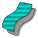
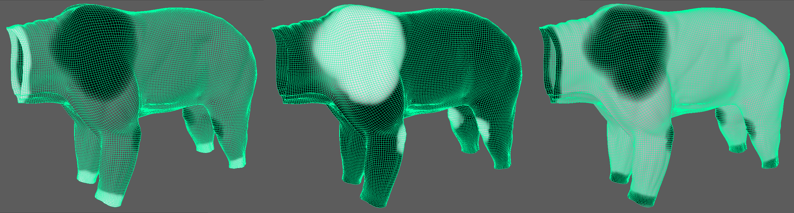
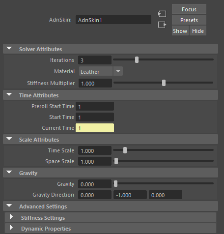
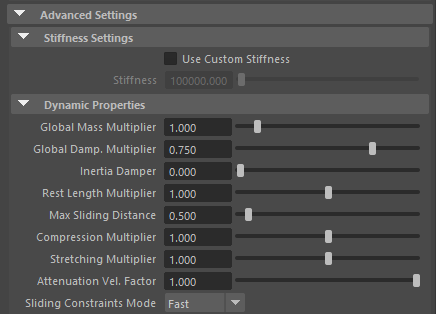
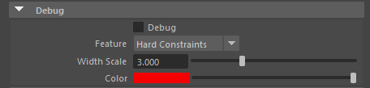
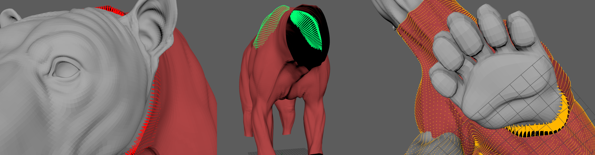

# Introduction

Skin is a Maya deformer for fast, robust and easy-to-configure skin simulation for digital assets. Thanks to the combination of internal and external constraints, the deformer can produce dynamics that allow the skin mesh to realistically react to the deformations of the internal tissues (e.g. muscles, fascia) over time.

The influence these constraints have in the simulated mesh can be freely modified by painting them via the [AdonisFX Paint Tool](tools.md) or by uniformingly regulating their influence via multipliers in the attribute editor. Beyond these constraints, there are many paramenters to regulate the skin's dynamics are available to modify the deformer's behaviour.

## Requirements

To create a Skin deformer within a Maya scene, the following inputs must be provided:

  - <b class="mesh_color"> Reference Mesh (R) </b> to drive the simulation skin (e.g. fascia or combined muscles).
  - <b class="mesh_color"> Skin Mesh (S) </b> which will be the simulated mesh to which the skin deformer will be applied.

## Create Skin

The process to create a Skin deformer must follow this procedure:

1. Select the meshes in the following order:

    <b class="mesh_color">Reference Mesh</b> &#8594 <b class="mesh_color">Skin Mesh</b>

2. Press  in the AdonisFX shelf or Skin in the AdonisFX menu, under the "Create" section.
    - If the shelf button is double-clicked or the option box in the menu is selected a window will be displayed were a custom name and initial attribute values can be set.
3. Skin is ready to simulate with default settings. Check [this page](#attributes) to customize the configuration.

## Paintable Weights

In order to provide more artistic control, some key parameters of the skin solver are exposed as paintable attributes in the deformer. The [AdonisFX Paint Tool](tools.md) must be used to paint those parameters to ensure that the values satisfy the solver requirements.

- <b class="paintable maps">Hard constrain maps</b>: weight to modulate the correction applied to the vertices to keep them at a constant transformation local to the closest point on the reference mesh at initialization. Hard constrains maps will force the geometry points to keep the original position. You may want to have a low value of hard constraints to allow the skin to create wrinkles, slide, etc.

    - *Tip*: Flood the geometry with a very low value 0.1 - 0.2. Give a value of 1.0 to the edges of the skin to guarantee that’s perfectly attached to the target geometry

    - *Tip*: smooth the borders by using the smooth-Flood combination to make sure the simulation doesn’t find hard edges as this could create odd wrinkles. (unless that’s something you are looking for!)

- <b class="paintable maps">Soft Constraints</b>: weight to modulate the correction applied to the vertices to keep them at a constant distance to the closest point on the reference mesh at initialization. An intermediate value of 0.5 on the whole geometry is recommended.

    - *Tip*: Flood the geometry with a very low value 0.1 - 0.2.

- <b class="paintable maps">Slide Constraints</b>: weight to modulate the correction applied to the vertices to keep them at a constant distance to the reference mesh sliding along the reference surface. In the example of a biped or quadruped, it is recommended to set a value of 1.0 on the scapulas, shoulders, elbows and knees and an overall value of 0 on the rest of the body.

    - *Tip*: smooth the borders by using the smooth-Flood combination to make sure the simulation doesn’t find hard edges as this could create odd wrinkles. (unless that’s something you are looking for!)

- <b class="paintable maps">Compression Resistance</b>: force to correct the edge lengths if the current length is smaller than the rest length. A higher value represents higher correction. At value 1 the points in the geometry will try to keep as close as possible to their original position.

    - *Tip*: You may want to leave this map weight to 1 as a starting point and tweak some areas later on as you see the results of the skin simulation. 
    
    - *Tip*: Reducing the value of the weight in some areas will contribute to getting rid of unwanted wrinkles or possible artifacts in the skin.

- <b class="paintable maps">Stretching Resistance</b>: force to correct the edge lengths if the current length is greater than the rest length. A higher value represents higher correction.

    - *Tip*: You may want to leave this map weight to 1 as a starting point and tweak some areas later on as you see the results of the skin simulation. 

    - *Tip*: smooth the borders by using the smooth-Flood combination to make sure the simulation doesn’t find hard edges as this could create odd wrinkles. (unless that’s something you are looking for!)

- <b class="paintable maps">Global Damping </b>: set global damping per vertex in the simulated mesh. The greater the value per vertex the more it will attempt to retain its previous position.

- <b class="paintable maps">Max Sliding Multiplier</b>: determines the size of the sliding area per vertex. It corresponds to the maximum distance to the closest point on the reference mesh computed on initialization. Greater values will allow for greater sliding but will have a greater computational cost.
    
    - *Tip*: Use lower values in areas where sliding isn't necessary. Use higher values in areas where sliding constraints must have better quality.

- <b class="paintable maps">Mass</b>: set individual mass values per vertex in the simulated mesh.

<figure>
   
  <figcaption>Figure 1: Example of painted weights on the skin of a bear character. From left to right: Hard Constraints, Slide Constraints and Soft Constraints.</figcaption>
</figure>

!!! Note
    - *Hard*, *Soft* and *Slide* values are normalized for each vertex. Make sure to paint the values that you want to give priority to at the end in order to avoid the internal normalization override them in further strokes.

# Attributes

[^1]:
  Soft range: higher values can be used.

#### Solver Attributes
- <b class="attributes">Iterations</b>
    - *Type*: Long
    - *Default Value*: 3
    - *Range*: \[1, 10\] [^1]
    - *Description*: Number of iterations that the solver will execute per simulation step. Greater values means greater computational cost.

- <b class="attributes">Material</b>
    - *Type*: Enum
    - *Default Value*: Leather
    - *Options*: Fat, Muscle, Rubber, Tendon, Leather, Wood, Concrete
    - *Description*: Solver stiffness presets per material. The materials are listed from lowest to highest stiffness.

- <b class="attributes">Stiffness Multiplier</b>
    - *Type*: Float
    - *Default Value*: 1.0
    - *Range*: \[0.0, 2.0\] [^1]
    - *Description*: Multiplier factor to scale up or down the material stiffness.

#### Time Attributes
- <b class="attributes">Preroll Start Time</b>
    - *Type*: Time
    - *Default Value*: Current frame
    - *Description*: Sets the frame at which the preroll begins. The preroll ends at Start Time.

- <b class="attributes">Preroll Start Time</b>
    - *Type*: Time
    - *Default Value*: Current frame
    - *Description*: Determines the frame at which the simulation starts.

- <b class="attributes">Current Time</b>
    - *Type*: Time
    - *Default Value*: Current frame
    - *Description*: Current playback frame.

#### Scale Attributes
- <b class="attributes">Time Scale</b>
    - *Type*: Float
    - *Default Value*: 1.0
    - *Range*: \[1e^-3^, 10.0\] [^1]
    - *Description*: Sets the scaling factor applied to the simulation time step.

- <b class="attributes">Space Scale</b>
    - *Type*: Float
    - *Default Value*: 1.0
    - *Range*: \[1e^-3^, 100.0\] [^1]
    - *Description*: Sets the scaling factor applied to the masses and/or the forces.

- <b class="attributes">Space Scale Mode</b>
    - *Type*: Enum
    - *Default Option*: Masses + Forces
    - *Options*: Masses, Forces, Masses + Forces
    - *Description*: Determines if the spatial scaling affects the masses, the forces, or both.

#### Gravity
- <b class="attributes">Gravity</b>
    - *Type*: Float
    - *Default Value*: 1.0
    - *Range*: \[0.0, 100.0\] [^1]
    - *Description*: Sets the magnitude of the gravity acceleration.

- <b class="attributes">Gravity Direction</b>
    - *Type*: Float
    - *Default Value*: (0.0, -1.0, 0.0)
    - *Description*: Sets the direction of the gravity acceleration.

### Advanced Settings

#### Stiffness Settings
- <b class="attributes">Use Custom Stiffness</b>
    - *Type*: Bool
    - *Default Value*: False
    - *Description*: Toggles the use of a custom stiffness value. If enabled, the Material is ignored and the Stiffness parameter is used instead.

- <b class="attributes">Stiffness</b>
    - *Type*: Float
    - *Default Value*: 10^5^
    - *Range*: \[0.0, inf\]
    - *Description*: Sets the custom stiffness value.

#### Dynamic Properties
- <b class="attributes">Global Mass Multiplier</b>
    - *Type*: Float
    - *Default Value*: 1.0
    - *Range*: \[0.0, 10.0\] [^1]
    - *Description*: Sets the scaling factor applied to the mass of every point.

- <b class="attributes">Global Damping</b>
    - *Type*: Float
    - *Default Value*: 0.75
    - *Range*: \[0.0, 2.0\] [^1]
    - *Description*: Toggles the use of the Global Damping Attribute. If enabled, the system will attempt to retrieve the values from the source input at the given attribute name. If the attribute name is not found, then the numeric parameter will be used instead.

- <b class="attributes">Inertia Damper</b>
    - *Type*: Float
    - *Default Value*: 0.0
    - *Range*: \[0.0, 1.0\]
    - *Description*: Sets the linear damping applied to the dynamics of every point.

- <b class="attributes">Rest Length Multiplier</b>
    - *Type*: Float
    - *Default Value*: 1.0
    - *Range*: \[0.0, 2.0\] [^1]
    - *Description*: Sets the scaling factor applied to the edge lengths at rest.

- <b class="attributes">Max Sliding Distance</b>
    - *Type*: Float
    - *Default Value*: 0.5
    - *Range*: \[0.0, 10.0\] [^1]
    - *Description*: Determines the size of the sliding area. It corresponds to the maximum distance to the closest point on the reference mesh computed on initialization. The higher this value is, the higher quality and the lower performance.

- <b class="attributes">Compression Multiplier</b>
    - *Type*: Float
    - *Default Value*: 1.0
    - *Range*: \[0.0, 2.0\] [^1]
    - *Description*: Sets the scaling factor applied to the compression resistance of every point.

- <b class="attributes">Stretching Multiplier</b>
    - *Type*: Float
    - *Default Value*: 1.0
    - *Range*: \[0.0, 2.0\] [^1]
    - *Description*: Sets the scaling factor applied to the stretching resistance of every point.

- <b class="attributes">Attenuation Velocity factor</b>
    - *Type*: Float
    - *Default Value*: 1.0
    - *Range*: \[0.0, 1.0\]
    - *Description*: Sets the weight of the attenuation applied to the whole simulation driven by the Attenuation Matrix.

- <b class="attributes">Sliding constraints mode</b>
    - *Type*: Enum
    - *Default Option*: Fast
    - *Options*: Fast, Quality 
    - *Description*: Defines the mode of execution for the sliding constraints: Quality is more accurate, recommended for final results; Fast provides higher performance, recommended for preview.

#### Additional Properties

- <b class="attributes">Hard Constraints</b>
    - *Type*: Float
    - *Default Value*: 1.0
    - *Range*: \[0.0, 1.0\]
    - *Description*: Weight to modulate the correction applied to the vertices to keep them at a constant transformation, local to the closest point on the reference mesh at initialization.   This attribute is paintable and normalized together with *Slide Constraints* and *Soft Constraints*.

- <b class="attributes">Soft Constraints</b>
    - *Type*: Float
    - *Default Value*: 0.0
    - *Range*: \[0.0, 1.0\]
    - *Description*: Weight to modulate the correction applied to the vertices to keep them at a constant distance to the reference mesh sliding along the reference surface.   This attribute is paintable and normalized together with *Hard Constraints* and *Soft Constraints*.

- <b class="attributes">Sliding Constraints</b>
    - *Type*: Float
    - *Default Value*: 0.0
    - *Range*: \[0.0, 1.0\]
    - *Description*: Weight to modulate the correction applied to the vertices to keep them at a constant distance to the closest point on the reference mesh at initialization.   This attribute is paintable and normalized together with *Slide Constraints* and *Hard Constraints*.

- <b class="attributes">Compression Resistance</b>
    - *Type*: Float
    - *Default Value*: 1.0
    - *Range*: \[0.0, 1.0\]
    - *Description*: Weight to set the force to correct the edge lengths if the current length is smaller than the rest length.

- <b class="attributes">Stretching Resistance</b>
    - *Type*: Float
    - *Default Value*: 1.0
    - *Range*: \[0.0, 1.0\]
    - *Description*: Weight to set the force to correct the edge lengths if the current length is greater than the rest length.

- <b class="attributes">Sliding Distance Multiplier</b>
    - *Type*: Float
    - *Default Value*: 1.0
    - *Range*: \[0.0, 1.0\]
    - *Description*: Determines the size of the sliding area per point. It corresponds to the maximum distance to the closest point on the reference mesh computed on initialization.

- <b class="attributes">Masses</b>
    - *Type*: Float
    - *Default Value*: 1.0
    - *Range*: \[0.0, 1.0\]
    - *Description*: Weight to set per-point mass of the mesh.

## Attribute Editor Template

<figure markdown>
   
  <figcaption>Figure 1: Skin Attribute Editor</figcaption>
</figure>

<figure markdown>
  
  <figcaption>Figure 3: Skin Attribute Editor (Advanced Settings)</figcaption>
</figure>

## Debugger

To better visualize deformer constraints in the Maya viewport there is the option to enable the debugger, found in the dropdown menu labeled "Debug" in the attribute editor. 

<figure markdown>
  
  <figcaption>Figure 4: Skin Attribute Editor (Debug menu)</figcaption>
</figure>

To enable the debugger the "Debug" checkbox must marked. The elements that can be visualized with the debugger in the Skin deformer are:

 - Hard Constraints
 - Soft Constraints
 - Slide Constraints

Enabling the debugger and selecting one of these constraints will draw lines from the influenced vertices in the simulated mesh to their corresponding reference vertices. 

<figure markdown>
  
  <figcaption>Figure 5: Debugger enabled displaying hard constraints, slide constraints and soft constraints with different configurations. </figcaption>
</figure>

The following paramenters can be modified to better customize the appereance of these lines:

 - *Width Scale*: Modifies the width of all lines.
 - *Color*: Selects the line color from a color wheel. Its saturation can be modified using the slider.
