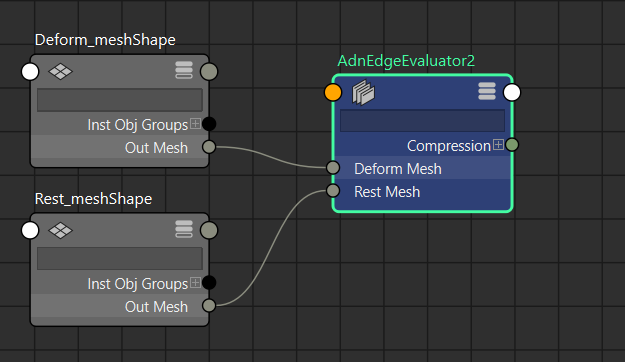
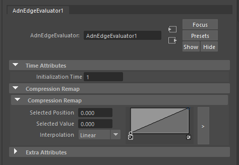
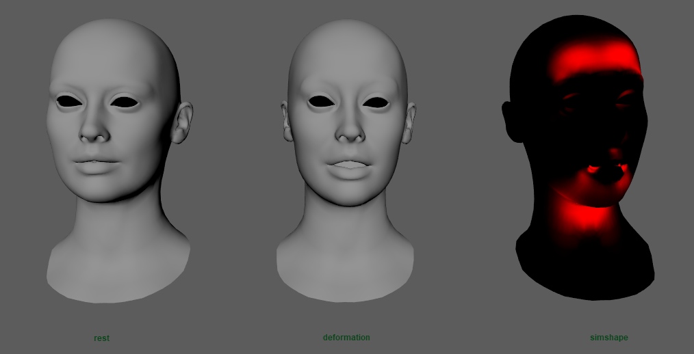

# AdnEdgeEvaluator

The AdnEdgeEvaluator node is a dependency node that computes deformation changes in edges. Based on two input meshes it will output a compression map of the edges.

## Requirements

The Edge Evaluator Node requires the following inputs to be provided:

  - **Rest Mesh (R)**: Mesh with no deformation or animation.
  - **Deform Mesh (D)**: Mesh with deformations in its geometry. These deformations are not generated by the animation of a rig.

> [!NOTE]
> All input geometries must have the same number of vertices and edges.

<figure markdown>
  
  <figcaption><b>Figure 1</b>: Edge Evaluator Graph Editor</figcaption>
</figure>

## Create the Edge Evaluator Node

1. Select the deform mesh, then the rest mesh.
2. Go to the AdonisFX menu > Create Nodes > *Edge Evaluator*.

## Attributes

### Time Attributes
| Name | Type | Default | Animatable | Description |
| :--- | :--- | :------ | :--------- | :---------- |
| **Initialization Time** | Time | *Current frame* | ✗ | Sets the frame at which the data will be initialized. |

### Compression Remap
| Name | Type | Default | Animatable | Description |
| :--- | :--- | :------ | :--------- | :---------- |
| **Compression Remap** | Ramp Attribute |  | ✗ | Curve to remap the output compression map. |

### Attribute Editor Template

<figure markdown>
  
  <figcaption><b>Figure 2</b>: Edge Evaluator Attribute Editor</figcaption>
</figure>

## Advanced

### AdnSimshape Activation using Edge Evaluator node

The evaluator node can be used to drive the [activations of an AdnSimshape](simshape.md#muscle-activations) deformer. It can be done by connecting the output map to the activations plug of AdnSimshape. Adonis provides a menu option to recreate this steps easily.

1. Select the Edge Evaluator Node. Then the Simshape deformer node.
2. Go to the AdonisFX Menu > Edit Simshape > *Connect Activations Plug*.

In order to disconnect the plug, repeat the selection and instead of pressing *Connect Activations Plug* press *Disconnect Activations Plug*.

<figure markdown>
  
  <figcaption><b>Figure 3</b>: AdnSimshape deformer with activations provided by the AdnEdgeEvaluator node (activations debugger enabled)</figcaption>
</figure>
