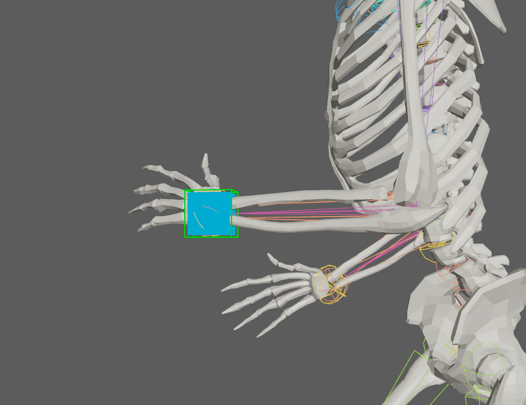
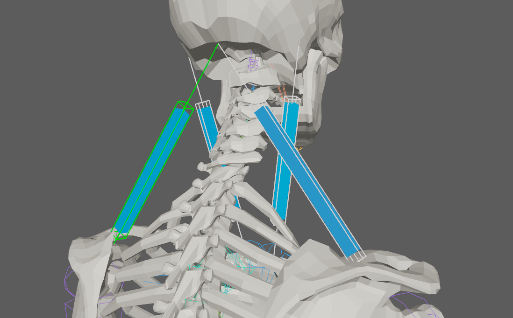
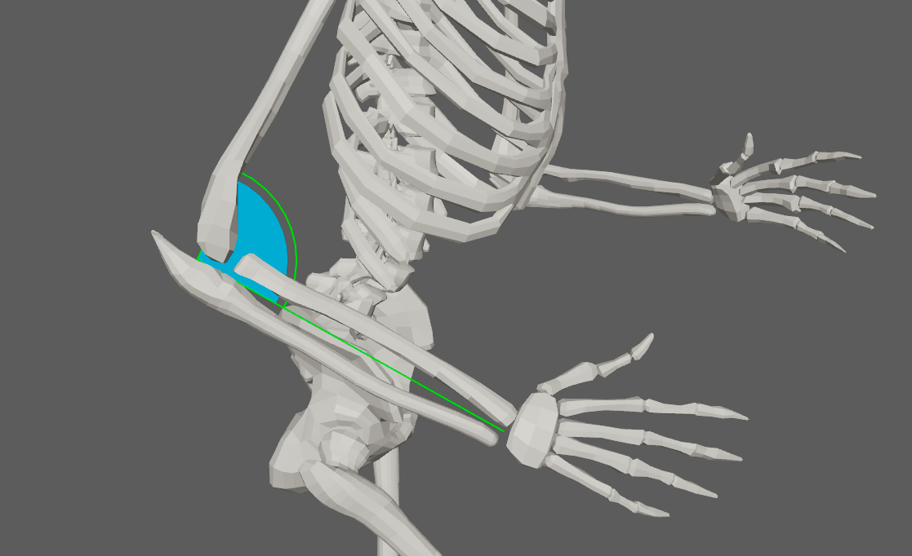
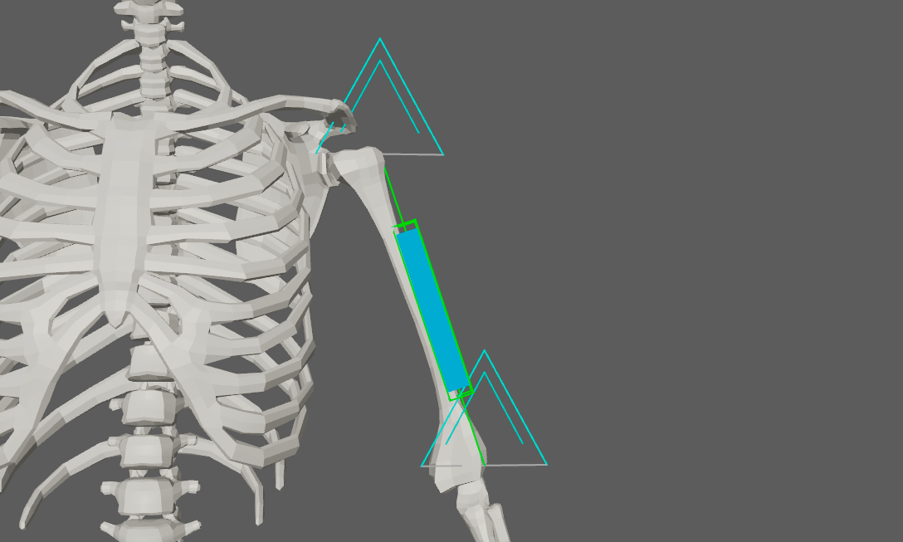

# AdnLocators

AdnLocators in Adonis are visualizers that are meant for visualizing and measuring transform nodes which provide valuable input information for setting up the deformers. They can visualize information representing position, distance, or angle as well as velocities or accelerations represented via coloring when used in combination with AdnSensors.

## AdnLocatorPosition

AdnLocatorPosition is the Adonis locator for visualizing the position of a single transform node. When connected to its corresponding AdnSensorPosition, velocity or acceleration can be visualized via coloring, providing feedback for setting up the deformer.

### Create AdnLocatorPosition

Only one transform will be required to create the AdnLocatorPosition. The creation process is the following:

 1. Select a scene object with a transform node.
 2. Press the  button (click or double-click) in the AdonisFX shelf or press *Position* in the AdonisFX menu, under the *Locators* submenu.
 3. The AdnLocatorPosition is created and ready to be used.

### How to use

An AdnLocatorPosition will only visualize the information of the transform node to which it is applied. To be able to read, process and visualize information like the velocity or acceleration that can be used for setting up a deformer, an [AdnSensorPosition](sensors.md) has to be applied.

<figure markdown>
  {width=60%}
  <figcaption>Figure 1: AdnLocatorPosition used in a human model.</figcaption>
</figure>

## AdnLocatorDistance

AdnLocatorDistance is the Adonis locator for visualizing the distance between two transform nodes. When connected to its corresponding AdnSensorDistance, distance, velocity or acceleration can be visualized via coloring, providing feedback for setting up the deformer.

### Create AdnLocatorDistance

Two transform nodes will be required to create an AdnLocatorDistance representing each extremity. The creation process is the following:

 1. Select two scene objects with transform nodes.
 2. Press the  button (click or double-click) in the AdonisFX shelf or press *Distance* in the AdonisFX menu, under the *Locators* submenu.
 3. The AdnLocatorDistance is created and ready to be used.

### How to use

An AdnLocatorDistance will only visualize the information of the distance between two transform nodes to which it is applied. To be able to read, process and visualize information like the distance magnitude, velocity or acceleration that can be used for setting up a deformer, an [AdnSensorDistance](sensors.md) has to be applied.

<figure markdown>
  {width=60%}
  <figcaption>Figure 2: AdnLocatorDistance used in a human model.</figcaption>
</figure>

## AdnLocatorRotation

AdnLocatorRotation is the Adonis locator for visualizing the angle between three transform nodes. When connected to its corresponding AdnSensorRotation, angle, angular velocity or angular acceleration can be visualized via coloring, providing feedback for setting up the deformer.

### Create AdnLocatorRotation

Three transform nodes will be required to create the AdnLocatorRotation. The creation process is the following:

 1. Select three scene objects with transform nodes. The order in which the objects are selected is relevant, as the created angle will have the following arrangement:
    - First selected object: start point of the angle.
    - Second selected object: middle point of the angle.
    - Third selected object: end point of the angle.
 2. Press the  button (click or double-click) in the AdonisFX shelf or press *Rotation* in the AdonisFX menu, under the *Locators* submenu.
 3. The AdnLocatorRotation is created and ready to be used.

### How to use

An AdnLocatorRotation will only visualize the information of the connections and angle between the three transform nodes. To be able to read, process and visualize information like the angle, angular velocity or angular acceleration that can be used for setting up a deformer, an [AdnSensorRotation](sensors.md) has to be applied.

<figure markdown>
  {width=60%}
  <figcaption>Figure 3: AdnLocatorRotation locator used in a human model.</figcaption>
</figure>

## Attributes

[^1]:  Soft range: higher values can be used.

### AdnLocatorPosition
#### Input
 - **Position**(Float3): Current transform node position.

#### Activation Values
 - **Velocity** (Float): Magnitude of the velocity (remapped) of the transform node.
 - **Acceleration** (Float): Magnitude of the acceleration (remapped) of the transform node.

#### Draw
 - **Scale** (Float, 1.0): Sets the scaling factor applied to the position locator visualizer.
    - Has a range of \[0.0, 10.0\] [^1]
 - **Draw Output** (Enum): Selects the property of the locator to be visualized on the locator visualizer.
    - **Velocity:** color the visualizer of the locator according to the input velocity activation.
    - **Acceleration:** color the visualizer of the locator according to the input acceleration activation.

### AdnLocatorDistance
#### Input
 - **Start Position**(Float3): Start transform node position.
 - **End Position**(Float3): End transform node position.

#### Activation Values
 - **Distance** (Float): Magnitude of the distance (remapped) between the transform nodes.
 - **Velocity** (Float): Magnitude of the velocity (remapped) between the transform nodes.
 - **Acceleration** (Float): Magnitude of the acceleration (remapped) between the transform nodes.

#### Draw
 - **Scale** (Float, 1.0): Sets the scaling factor applied to the distance locator visualizer.
    - Has a range of \[0.0, 10.0\] [^1]
 - **Draw Output** (Enum): Selects the property of the locator to be visualized on the locator visualizer.
    - **Distance:** color the visualizer of the locator according to the input distance activation.
    - **Velocity:** color the visualizer of the locator according to the input velocity activation.
    - **Acceleration:** color the visualizer of the locator according to the input acceleration activation.

### AdnLocatorRotation
#### Input
 - **Start Position**(Float3): Start transform node position.
 - **Mid Position**(Float3): Mid transform node position.
 - **End Position**(Float3): End transform node position.

#### Activation Values
 - **Angle** (Float): Magnitude of the angle (remapped) between the three transform nodes.
 - **Velocity** (Float): Magnitude of the angular velocity (remapped) between the three transform nodes.
 - **Acceleration** (Float): Magnitude of the angular acceleration (remapped) between the three transform nodes.

#### Draw
 - **Scale** (Float, 1.0): Sets the scaling factor applied to the rotation locator visualizer.
    - Has a range of \[0.0, 10.0\] [^1]
 - **Draw Output** (Enum): Selects the property of the locator to be visualized on the locator visualizer.
    - **Angle:** color the visualizer of the locator according to the input angle activation.
    - **Velocity:** color the visualizer of the locator according to the input velocity activation.
    - **Acceleration:** color the visualizer of the locator according to the input acceleration activation.

## AdnLocator

The AdnLocator is an Adonis native alternative to Maya locators. This locator can be used to visualize any kind of scene element with a transform node. For example they can be used to visualize [attachments](muscle.md#attachments) or [segment ends](muscle.md#slide-on-segment-constraint) in muscle deformers.

### Create AdnLocator

To create an AdonisFX Logo locator just click on the  button in the AdonisFX shelf. The locator will be created at the origin of your scene.

<figure markdown>
  {width=60%}
  <figcaption>Figure 4: AdnLocator used for distance constraints.</figcaption>
</figure>
