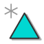

# AdnLocators

A fundamental part of Adonis is the ability to visualize and measure different tranforms so that they can serve as input information for the deformers. This is what adnLocators are meant to be: elements in the scene from which relative information from scene elements (such as position, velocity, angle formed...) can be gathered for later use.

## AdnLocatorPosition

AdnLocatorPosition is the Adonis locator for visualizing the velocity and acceleration of a single transform node.

### Create AdnLocatorPosition

Only one transform will be required to create the AdnLocatorPosition. The process that we must follow to do so is as following:

 1. Select a scene object with a transform node.
 2. Press the  button in the AdonisFX shelf or press *Position* in the AdonisFX menu, under the *Locators* submenu.
 3. The AdnLocatorPosition is created and ready to be used.

### How to use

Adonis locators will only let the user visualize the relative information from the transform nodes to which they are applied. To be able to read this information and apply it to a deformer we will need an [AdnSensor](sensors.md).

In this specific case the required sensor will be an [AdnSensorPosition](sensors.md).

<figure markdown>
  {width=60%}
  <figcaption>Figure 1: Position locator used in a human model.</figcaption>
</figure>

## AdnLocatorDistance

AdnLocatorDistance is the Adonis locator for visualizing the relative distance, velocity and acceleration between two transform nodes.

### Create AdnLocatorDistance

Two transform nodes will be required to create an AdnLocatorDistance, one for each end. The process that we must follow to do so is as following:

 1. Select two scene objects with transform nodes.
 2. Press the  button in the AdonisFX shelf or press *Position* in the AdonisFX menu, under the *Locators* submenu.
 3. The AdnLocatorDistance is created and ready to be used.

### How to use

Adonis locators will only let the user visualize the relative information from the transform nodes to which they are applied. To be able to read this information and apply it to a deformer we will need an [AdnSensor](sensors.md).

In this specific case the required sensor will be an [AdnSensorDistance](sensors.md).

<figure markdown>
  {width=60%}
  <figcaption>Figure 2: Distance locator used in a human model</figcaption>
</figure>

## AdnLocatorRotation

AdnLocatorRotation is the Adonis locator for visualizing the angle, angular velocity and angular acceleration between three transform nodes.

### Create AdnLocatorRotation

Only one transform will e required to create the AdnLocatorRotation. The process that we must follow to do so is as following:

 1. Select three scene objects with transform nodes. The order in which the objects are selected is relevant, as the created angle will have the following arrangement:
    - First selected object: end point of angle.
    - Second selected object: middle point of angle.
    - Third selected object: end pont of angle.
 2. Press the  button in the AdonisFX shelf or press *Rotation* in the AdonisFX menu, under the *Locators* submenu.
 3. The AdnLocatorRotation is created and ready to be used.

### How to use

Adonis locators will only let the user visualize the relative information from the transform nodes to which they are applied. To be able to read this information and apply it to a deformer we will need an [AdnSensor](sensors.md).

In this specific case the required sensor will be an [AdnSensorDistance](sensors.md).

<figure markdown>
  {width=60%}
  <figcaption>Figure 3: Distance locator used in a human model</figcaption>
</figure>

## Attributes

All AdnLocator types share similar attributes, with some specific differences on information displayed. Locator Attributes are all grouped together here but differences will be pointed out.

[^1]:  Soft range: higher values can be used.

#### Input
 - **Position**(float3): Current transform node position.
    - In the case of AdnLocatorDistance, 2 positions will be displayed, one for each transform node. 
    - In the case of AdnLocatorRotation, 3 positions will be displayed, one for each transform node. 

#### Activation values
 - **Distance** (Float): Displays the distance between the two transform nodes.
    - This attribute is only available for AdnLocatorDistance.
 - **Velocity** (Float): Displays the magnitude of the angle formed by the three transform nodes.
    - This attribute is only available for AdnLocatorRotation.
 - **Velocity** (Float): Displays the transform's velocity magnitude.
 - **Acceleration** (Float): Displays the transform's acceleration magnitude.

# Draw
 - **Scale** (Float, 1.0): Sets the scaling factor applied to the locator gizmo.
    - Has a range of \[0.0, 10.0\] [^1]
 - **Space Scale** (Enum): Selects the property of the locator to be visualized on the gizmo.
    - On AdnLocatorPosition the options available are: velocity and acceleration.
    - On AdnLocatorDistance the options available are: distance, velocity and acceleration.
    - On AdnLocatorRotation the options available are: angle, velocity and acceleration.

## AdonisFX Logo locator

The AdonisFX Logo locator is an Adonis native alternative to Maya locators. These can be used as any kind of scene element with a transform node, be it to use to gather locator information or as [attachments](muscle.md#attachments) or [segment ends](muscle.md#slide-on-segment-constraint) in muscle deformers.

To create an AdonisFX Logo locator just click on the  button in the AdonisFX shelf. The locator will be created at the origin point of your scene.

<figure markdown>
  {width=60%}
  <figcaption>Figure 4: AdonisFX Logo locators used for distance constraints.</figcaption>
</figure>
