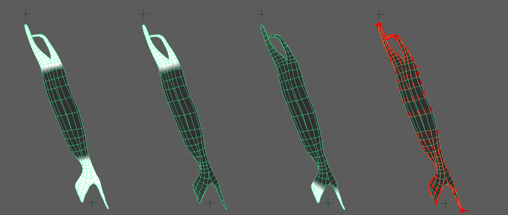
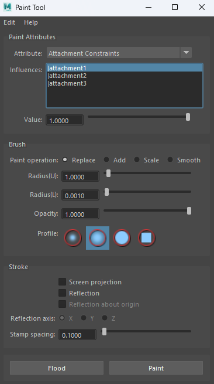
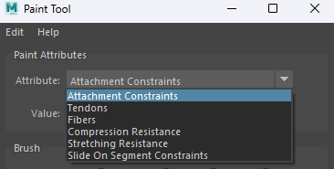
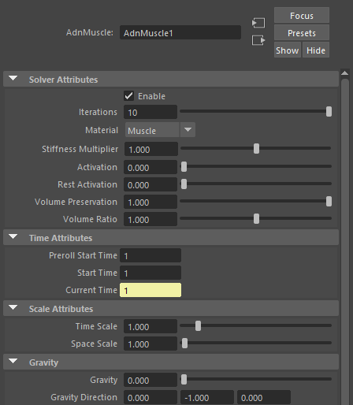
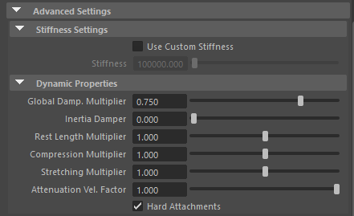
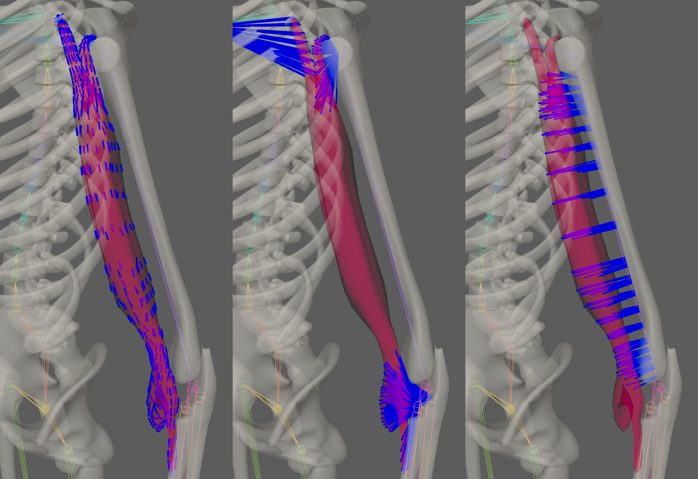
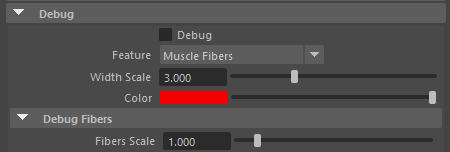

# Introduction to AdnMuscle in Maya

AdnMuscle is a Maya deformer for fast, robust and easy-to-configure volumetric muscle simulation for digital assets. Thanks to the combination of internal (structural) and external (attachments) constraints, this deformer can produce dynamics that allow the mesh to acquire the simulated characteristics of a muscle with realistic volume preservation, fibers activations to modulate the rigidity and attachments properties to external objects to follow the global kinematics of the character.

The influence of these constraints have in the simulated mesh can be freely modified by painting them via the [AdonisFX Paint Tool](tools.md#adonisfx-paint-tool) or by uniformingly regulating their influence via multipliers in the attribute editor. Beyond these constraints, several paramenters to regulate the muscle's dynamics are available to modify the deformer's behaviour as a whole.

# How to Use

The AdnMuscle deformer is of great simplicity so set up and apply to a mesh within a Maya scene. The way this deformer works, a mesh (the simulated mesh) is set within a scene, usually with a series of attachments. Those attachments mark the anchor points for the muscle, prepared to act as tendons, and will set great part of the dynamics of the deformer.

## Requirements

To create a Muscle deformer within a Maya scene, the following inputs must be provided:

  - <b class="mesh_color"> Attachments </b> to which the simulated muscle will be attached to. Any transform node can be used (e.g. bones, locators, meshes, etc). This input is optional and unlimited.
  - <b class="mesh_color"> Muscle Geometry </b> that the muscle deformer will be applied onto.

> [!NOTE]
> - It is not mandatory to select the attachments on creation of the muscle deformer. We can add and remove attachments after creating the deformer, check this [advanced section](#attachments) for further details.

## Create Muscle

1. Select the attachments (if any), then the geometry.
2. Press the {width=40px} button in the AdonisFX shelf or press Muscle in the AdonisFX menu. 
    - If the shelf button is double-clicked or the option box in the menu is selected a window will be displayed were a custom name and initial attribute values can be set.
3. The muscle is ready to simulate with default settings. Check [this section](#attributes) to customize the configuration.

## Paintable Weights

In order to provide more artistic control, some key parameters of the muscle solver are exposed as paintable attributes in the deformer. The [AdonisFX Paint Tool](tools.md#adonisfx-paint-tool) must be used to paint those parameters to ensure that the values satisfy the solver requirements.

- *Tendons*: floating values to indicate the source of the muscle fibers. The solver will use that information to make an estimation of the fiber direction at each vertex. We recommend to set a value of 1.0 wherever the tendinous tissue would be in an anatomically realistic muscle and a value of 0.0 in the rest of the mesh.
- *Attachment Constraints*: weight to indicate the influence of each attachment at each vertex of the muscle.
- *Fibers*: the deformer estimates the fiber directions at each vertex based on the tendon weights. In case that the estimated fibers do not fit well to the desired directions, we can use the paint tool to comb the fibers manually. The fibers can be displayed using the [Draw Fibers](#debug-features) option in the deformer 
- *Compression Resistance*: force to correct the edge lengths if the current length is smaller than the rest length. A higher value represents higher correction.
- *Stretching Resistance*: force to correct the edge lengths if the current length is greater than the rest length. A higher value represents higher correction.
- *Slide on Segment Constraints*: weight to force vertices to displace only in the direction of a user-specified group of segments.

<figure>
   
  <figcaption><b>Figure 1:</b> Example of painted weights on a biceps. From left to right: Tendons weights, Attachment weight for the attachment at the top, Attachment weight for the attachment at the bottom; and Fibers directions at each vertex.</figcaption>
</figure>

> [!NOTE]
> - The attachment weights are normalised at each vertex. This normalisation is applied when a stroke is finished. The use of the AdonisFX painting tool is mandatory for that. The basics of the paint tool are explained in [this section](#adonisfx-paint-tool).
> - We recommend to paint the values for the most influent attractors at the end in order to avoid the internal normalisation override them in further strokes.

### AdonisFX Paint Tool

To configure the paintable attributes in the Muscle deformer, the AdonisFX paint tool must be used. Apart from the standard functionalities that the Maya default paint context provides, this tool also processes the painted weights to guarantee that the requirements of solver are satisfied.

<figure>
   
  <figcaption><b>Figure 2:</b> AdonisFX Paint Tool</figcaption>
</figure>

Do the following to open the tool:

  1. Select the mesh with the Muscle deformer applied to.
  2. Press the paint tool  shelf button or go to AdonisFX menu > Paint Tool.

The selected attribute in the combo box exposed at the top of the UI is the active attribute in the paint context. Now you can use the tool as it was the Artisan's tool from Maya, the behaviour of the different widgets/fields is the same.

<figure markdown>
   
  <figcaption><b>Figure 3:</b> AdonisFX paint tool displaying the paintable attributes of the deformer. </figcaption>
</figure>

Following, we present the key aspects to keep in mind while painting each attribute:

  1. Attachment Constraints
    1. If this attribute type is selected, then a list widget is shown with the names of the attachments connected to the Muscle deformer.
    2. Select the desired attachment you want to paint from the list widget and paint the weight values.
    3. If more than one attachment was added to the system, then the paint tool will normalise the weights automatically after a stroke has been completed.
    4. If any attachment is removed or added to the system, then the paint tool will refresh the list on mouse hover over the UI.
  2. Tendons
    1. We recommend to paint values of 1.0 wherever the tendon tissue is and values of 0.0 in the rest of the mesh. This painting will internally trigger an automatic estimation of fibers directions.
  3. Fibers
    1. To visualise the fibers, enable the [Draw Fibers](#debug-features) attribute in the deformer or go to the Adonis menu > Edit Muscle > Draw Fibers.
    2. From the deformer Attribute Editor, it is also possible to scale the fibers vectors for debugging purposes.
    3. Comb the fibers towards the desired direction.
  4. Stretching and Compression Resistance
    1. Stretching resistance is set to 1.0 by default. With this value, the solver will apply the corrections to the edges needed to keep the lengths at rest. Set values lower than 1.0 to linearly reduce the amount of correction applied by the solver when the edges get stretched.
    2. Compression resistance is set to 1.0 by default. With this value, the solver will apply the corrections to the edges needed to keep the lengths at rest. Set values lower than 1.0 to linearly reduce the amount of correction applied by the solver when the edges get compressed.
  5. Slide On Segments.
    1. If this attribute type is selected, then a list widget is shown with the names of the segments (combination of anchor points) connected to the AdnMuscle deformer.
    2. Select the desired segment you want to paint from the list widget and paint the weight values.
    3. If more than one segment was added to the system, then the paint tool will normalise the weights automatically after a stroke has been completed.
    4. If any anchor/segment is removed or added to the system, then the paint tool will refresh the list on mouse hover over the UI.

# Attributes

[^1]: Soft range: higher values can be used.

#### Solver Attributes
 - **Enable** (Boolean, True): Flag to enable or disable the deformer computation.
 - **Iterations** (Integer, 3): Number of iterations that the solver will execute per simulation step. Greater values mean greater computational cost.
     - Has a range of \[1, 10\] [^1]
 - **Material** (Enumerator, Leather): Solver stiffness presets per material. The materials are listed from lowest to highest stiffness. There are 7 different presets:
    <ul><li>Fat: 10^7^</li><li>Muscle: 5e^3^</li><li>Rubber: 10^6^</li><li>Tendon: 5e^7^</li><li>Leather: 10^8^</li><li>Wood: 6e^9^</li><li>Concrete: 2.5e^10^</li></ul>
 - **Stiffness Multiplier** (Float, 1.0): Multiplier factor to scale up or down the material stiffness.
     - Has a range of \[0.0, 2.0\]
 - **Activation** (Float, 0.0): Current activation of the deformed muscle. The activation modifies the stiffness of the muscle depending on the fibers direction of the muscle.
     - Has a range of \[0.0, 1.0\]
 - **Rest Activation** (Float, 0.0): Value representing the amount of rest activation to apply to the muscle.
     - Has a range of \[0.0, 1.0\]

#### Time Attributes
 - **Preroll Start Time** (Time, *Current frame*): Sets the frame at which the preroll begins. The preroll ends at *Start Time*.
 - **Start Time** (Time, *Current frame*): Determines the frame at which the simulation starts.
 - **Current Time** (Time, *Current frame*): Current playback frame.

#### Scale Attributes
 - **Time Scale** (Float, 1.0): Sets the scaling factor applied to the simulation time step.
    - Has a range of \[0.0, 2.0\] [^1]
 - **Space Scale** (Float, 1.0): Sets the scaling factor applied to the masses and/or the forces.
    - Has a range of \[0.0, 2.0\] [^1]
 - **Space Scale Mode** (Enumerator, "Masses + Forces"): Determines if the spatial scaling affects the masses, the forces, or both.
    - The available options are: Masses, Forces, Masses + Forces.

#### Gravity
 - **Gravity** (Float, 1.0): Sets the magnitude of the gravity acceleration.
 - **Gravity Direction** (Float3, {0.0. -1.0, 0.0} ): Sets the direction of the gravity acceleration.
    - Vectors introduced don't need to be normalized, but they will get normalized internally.

### Advanced Settings

#### Stiffness Settings
 - **Use Custom Stiffness** (Boolean, False): Toggles the use of a custom stiffness value. If enabled, the Material is ignored and the Stiffness parameter is used instead.
    - If we use a custom stiffness, **Material** and **Stiffness Multiplier** will be disabled and **Stiffness** will be used instead.

#### Dynamic Properties
 - **Global Damping** (Float, 0.75): Sets the scaling factor applied to the global damping of every point.
    - Has a range of \[0.0, 1.0\] [^1]
 - **Inertia Damper** (Float, 0.0): Sets the linear damping applied to the dynamics of every point.
    - Has a range of \[0.0, 1.0\] [^1]
 - **Rest Length Multiplier** (Float, 1.0): Sets the scaling factor applied to the edge lengths at rest.
    - Has a range of \[0.0, 2.0\] [^1]
 - **Compression Multiplier** (Float, 1.0): Sets the scaling factor applied to the compression resistance of every point.
    - Has a range of \[0.0, 2.0\] [^1]
 - **Stretching Multiplier** (Float, 1.0): Sets the scaling factor applied to the stretching resistance of every point.
    - Has a range of \[0.0, 2.0\] [^1]
 - **Attenuation Velocity factor** (Float, 1.0): Sets the weight of the attenuation applied to the whole simulation driven by the Attenuation Matrix.
    - Has a range of \[0.0, 10.0\] [^1]
 - **Hard Attachments** (Boolean, True): If enabled, attachment constraints will force the vertices to stick to target transformation completely.

## Attribute Editor Template

<figure markdown>
   
  <figcaption><b>Figure 4:</b> AdnMuscle Attribute Editor</figcaption>
</figure>

<figure markdown>
  
  <figcaption><b>Figure 5:</b> AdnMuscle Attribute Editor (Advanced Settings)</figcaption>
</figure>

# Advanced

## Attachments

Once the AdnMuscle deformer is created, it is possible to add and remove new attachments to the system. 

- **Add attachments**:  
    1. Select the transform nodes (one or more) that you want to assign as attachments to the Muscle.
    2. Select the mesh that has the AdnMuscle deformer applied.
    3. Press the {width=40px} button in the AdonisFX shelf or press "Add Attachments" in the AdonisFX menu from the Edit Muscle submenu.
- **Remove attachments**:
    1. Select one or more transform nodes that are assigned as attachments to the Muscle.
    2. Select the mesh that has the AdnMuscle deformer applied.
    3. Press the {width=40px} button in the AdonisFX shelf or press "Remove Attachments" in the AdonisFX menu from the Edit Muscle submenu. 
    4. Alternatively, if only the mesh with the AdnMuscle deformer is selected, when pressing the {width=40px} button, all attachments will be removed.

## Slide on Segment Constraint

Additionally to all previously mentioned constraints, muscles can have an additional, optional constraint. Here the user may add attachments that will define a segment over which the muscle will slide.

- **Add Segment**:
    1. Select the transform nodes (two or more if this is the first segment you are adding) from which you would wish to make a segment for the muscle to slide on.
    2. Select the mesh that has the AdnMuscle deformer applied.
    3. Press "Add Slide On Segment Constraint" in the AdonisFX menu from the Edit Muscle submenu.
- **Remove Segment**:  
    1. Select one or more transform nodes that are assigned as attachments to the Muscle.
    2. Select the mesh that has the AdnMuscle deformer applied.
    3. press "Remove Slide On Segment Constraint" in the AdonisFX menu from the Edit Muscle submenu. 
    4. Alternatively, if only the mesh with the AdnMuscle deformer is selected, when pressing "Remove Slide On Segment Constraint" in the AdonisFX menu, all attachments will be removed.

## Debugger

In order to better visualize deformer constraints and attributes in the Maya viewport there is the option to enable the debugger, found in the dropdown menu labeled "Debug" in the attribute editor.

To enable the debugger the *Debug* checkbox must be marked. To select the specific feature you would like to visualize, choose it from the list provided in *Features*. 

### Debug features

The features that can be visualized with the debugger in the AdnMuscle deformer are:

 - **Muscle Fibers**: for each vertex, a line will be drawn showing the direction of the muscle fibers.
 - **Attachments Constraints**: for each vertex with an attachment constraint weight greater than 0.0, a line will be drawn from the mesh to its respective attachment.
 - **Sliding on Segment Constraints**: for each vertex with a sliding on segment weight greater than 0.0, a line will be drawn from the mesh to the closest point to its respective segment.

Enabling the debugger and selecting one of these constraints will draw lines from the influenced vertices in the simulated mesh to their corresponding reference vertices.

<figure markdown>
  
  <figcaption><b>Figure 6:</b> AdnMuscle being debugged (from left ro right, "Muscle Fibers", "Attachment Constraints" and "Slide On Segment")</figcaption>
</figure>

### Debugger attributes

The following attributes can be modified to better customize the appereance of these lines:

 - **Width Scale** (Float, 1.0): Modifies the width of all lines.
 - **Color** (Color picker): Selects the line color from a color wheel. Its saturation can be modified using the slider.

Additionally, for the specific case of debugging fibers, one more attribute is available:

 - **Fiber scale value** (Float, 3.0): can be modified to set a custom fiber length.

<figure markdown>
  
  <figcaption><b>Figure 7:</b> AdnMuscle Attribute Editor (Debug menu)</figcaption>
</figure>
