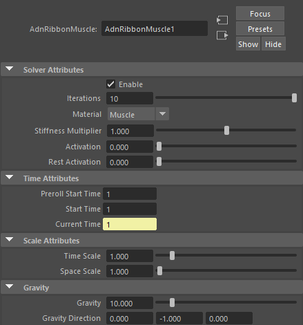
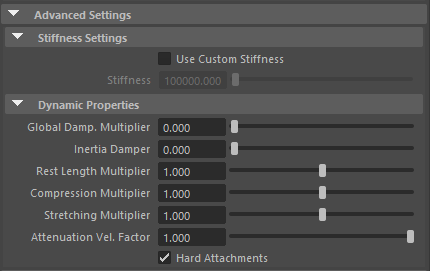

# How To Use

Ribbon Muscle is a Maya deformer for fast, robust and easy-to-configure tissue muscle simulation for digital assets. Thanks to the combination of internal (structural) and external (attachments) constraints, this deformer can produce dynamics that allow the mesh to acquire the simulated characteristics of a ribbon with fibers activations to modulate the rigidity and attachments to external objects to follow the global kinematics of the character.

## Requirements

The Ribbon Muscle deformer requires the following inputs to be provided:

- <b class="mesh_color"> Attachments </b> to which the simulated muscle will be attached to. Any tranform node can be used (e.g. bones, locators, meshes, etc). This input is optional and unlimited.
- <b class="mesh_color"> Muscle Geometry </b> that the ribbon muscle deformer will be applied onto.

> [!NOTE]
> - It is not mandatory to select the attachments on creation of the ribbon muscle deformer. We can add and remove attachments after creating the deformer, check this [advanced section](#how-to-add-and-remove-attachments) for further details.

## Create Ribbon Muscle

1. Select the attachments (if any) and the geometry in the following order:
    ``` mermaid
    graph LR
      A["N Attachments\n"] --> B;
      B["Muscle\n"];
    ```
2. Press the  button in the AdonisFX shelf or press Ribbon Muscle in the AdonisFX menu. 
3. Ribbon muscle is ready to simulate with default settings. Check [this page](#attributes) to customize the configuration.

## Paintable Weights

In order to provide more artistic control, some key parameters of the ribbon muscle solver are exposed as paintable attributes in the deformer. The [AdonisFX Paint Tool](#adonisfx-paint-tool) must be used to paint those parameters to ensure that the values satisfy the solver requirements.

- *Tendons*: floating values to indicate the source of the muscle fibers. The solver will use that information to make an estimation of the fiber direction at each vertex. We recommend to set a value of 1.0 wherever the tendinous tissue would be in an anatomically realistic muscle and a value of 0.0 in the rest of the mesh.
- *Attachment Constraints*: weight to indicate the influence of each attachment at each vertex of the muscle.
- *Fibers*: the deformer estimates the fiber directions at each vertex based on the tendon weights. In case that the estimated fibers do not fit well to the desired directions, we can use the paint tool to comb the fibers manually. The fibers can be displayed using the [Draw Fibers](#debug) option in the deformer.
- *Compression Resistance*: force to correct the edge lengths if the current length is smaller than the rest length. A higher value represents higher correction.
- *Stretching Resistance*: force to correct the edge lengths if the current length is greater than the rest length. A higher value represents higher correction.

<figure>
   
  <figcaption>Figure 1: Example of painted weights on a muscle tissue. From left to right: Tendons weights, Attachment weight for the attachment at the bottom, Attachment weight for the attachment at the top; and Fibers directions at each vertex.</figcaption>
</figure>

> [!NOTE]
> - The attachment weights are normalised at each vertex. This normalisation is applied when a stroke is finished. The use of the AdonisFX painting tool is mandatory for that. The basics of the paint tool are explained in [this section](#adonisfx-paint-tool).
> - We recommend to paint the values for the most influent attractors at the end in order to avoid the internal normalisation override them in further strokes.

### AdonisFX Paint Tool

To configure the paintable attributes in the Ribbon Muscle deformer, the AdonisFX paint tool must be used. Apart from the standard functionalities that the Maya default paint context provides, this tool also processes the painted weights to guarantee that the requirements of solver are satisfied.

<figure>
   
  <figcaption>Figure 2: AdonisFX Paint Tool</figcaption>
</figure>

Do the following to open the tool:
  1. Select the mesh with the Ribbon Muscle deformer applied to.
  2. Press the  shelf button or go to AdonisFX menu > Paint Tool.

The selected attribute in the combo box exposed at the top of the UI is the active attribute in the paint context. Now you can use the tool as it was the Artisan's tool from Maya, the behaviour of the different widgets/fields is the same.

<figure style="margin-left:30%;" markdown> 
   
  <figcaption style="margin-right:30%"> Figure 3: AdonisFX paint tool displaying the paintable attributes of the deformer. </figcaption> 
</figure>

Following, we present the key aspects to keep in mind while painting each attribute:

  1. Attachment Constraints
    1. If this attribute type is selected, then a list widget is shown with the names of the attachments connected to the Ribbon Muscle deformer.
    2. Select the desired attachment you want to paint from the list widget and paint the weight values.
    3. If more than one attachment was added to the system, then the paint tool will normalise the weights automatically after a stroke has been completed.
    4. If any attachment is removed or added to the system, then the paint tool will refresh the list on mouse hover over the UI.
  2. Tendons
    1. We recommend to paint values of 1.0 wherever the tendon tissue is and values of 0.0 in the rest of the mesh. This painting will internally trigger an automatic estimation of fibers directions
  3. Fibers
    1. To visualise the fibers, enable the [Draw Fibers](#debug) attribute in the deformer or go to the Adonis menu > Edit Muscle > Draw Fibers.
    2. From the deformer Attribute Editor, it is also possible to scale the fibers vectors for debugging purposes.
    3. Comb the fibers towards the desired direction.
  4. Stretching and Compression Resistance
    1. Stretching resistance is set to 1.0 by default. With this value, the solver will apply the corrections to the edges needed to keep the lengths at rest. Set values lower than 1.0 to linearly reduce the amount of correction applied by the solver when the edges get stretched.
    2. Compression resistance is set to 1.0 by default. With this value, the solver will apply the corrections to the edges needed to keep the lengths at rest. Set values lower than 1.0 to linearly reduce the amount of correction applied by the solver when the edges get compressed.

# Attributes

[^1]: Soft range: higher values can be used.


#### Solver Attributes
| Attribute            | Type  | Value     | Range/Options     | Description                  |
| :------------        | :---  | :----     | :------------     | :--------------------------- |
| Iterations           | Long  | 3         | \[1, 10\] [^1]    | Number of iterations that the solver will execute per simulation step. |
| Material             | Enum  | Muscle    | <ul><li>Fat</li><li>Muscle</li><li>Rubber</li><li>Tendon</li><li>Leather</li><li>Wood</li><li>Concrete</li></ul> | Solver stiffness. The materials are listed from lowest to highest stiffness. |
| Stiffness Multiplier | Float | 1.0       | \[0.0, 2.0\] [^1] | Multiplier factor to scale up or down the material stiffness. |
| Activation           | Float | 0.0       | \[0.0, 1.0\]      | Current activation of the deformed ribbon muscle. The activation modifies the stiffness of the muscle depending on the fibers direction of the muscle. |
| Rest Activation      | Float | 0.0       | \[0.0, 1.0\]      | Rest activation of the deformed ribbon muscle. The rest activation modifies the stiffness of the muscle depending on the fibers direction of the muscle at rest. |

#### Time Attributes
| Attribute          | Type | Value         |  Range/Options    | Description                  |
| :---------------   | :--- | :----         | :----------       | :--------- |
| Preroll Start Time | Time | Current frame || Frame to start the preroll. |
| Start Time         | Time | Current frame || Frame to end the preroll and start the simulation. |
| Current Time       | Time | Current frame || Current playback frame. |

#### Scale Attributes
| Attribute   | Type  | Value | Range/Options          | Description                  |
| :---------- | :---  | :---- | :------------          | :--------------------------- |
| Time Scale  | Float | 1.0   | \[1e^-3^, 10.0\] [^1]  | Scale to control the time step relative to the Dependency Graph time. |
| Space Scale | Float | 1.0   | \[1e^-3^, 100.0\] [^1] | Scale to control the space relative to the scene units. |

#### Gravity
| Attribute         | Type   | Value            | Range/Options       | Description               |
| :------------     | :---   | :----            | :------------       | :------------------------ |
| Gravity           | Float  | 0.0              | \[0.0, 100.0\] [^1] | Magnitude of the gravity. |
| Gravity Direction | Float3 | (0.0, -1.0, 0.0) |                     | Direction of the gravity. |

### Advanced Settings

#### Stiffness Settings
| Attribute            | Type  | Value    | Range/Options   | Description                  |
| :------------        | :---  | :----    | :------------   | :--------------------------- |
| Use Custom Stiffness | Bool  | False    || Flag that enables the custom stiffness. If we use custom stiffness, **Material** and **Stiffness Multiplier** will be disabled and **Stiffness** will be used instead. |
| Stiffness            | Float | 10^5^    | \[0.0, inf\]    | Custom stiffness value. |

#### Dynamic Properties
| Attribute              | Type  | Value | Range/Options     | Description                  |
| :------------          | :---  | :---- | :------------     | :--------------------------- |
| Global Damping         | Float | 0.0   | \[0.0, 2.0\] [^1] | Global damping introduced to the system. |
| Inertia Damping        | Float | 0.0   | \[0.0, 1.0\]      | Damping affecting only the inertias in the system. |
| Rest Length Multiplier | Float | 1.0   | \[0.0, 2.0\] [^1] | Scaling factor of the edge rest lengths. |
| Stretching Resistance  | Float | 1.0   | \[0.0, 1.0\]      | Force to correct the edge lengths if the current length is greater than the rest length. This attribute is paintable. | 
| Compression Resistance | Float | 1.0   | \[0.0, 1.0\]      | Force to correct the edge lengths if the current length is smaller than the rest length. This attribute is paintable. |
| Hard Attachments       | Bool  | False | \[False, True\]   | If enabled, attachment constraints will force the vertices to stick to target transformation completely. |

#### Debug
| Attribute    | Type  | Value | Range/Options      | Description                  |
| :----------- | :---  | :---- | :------------      | :--------------------------- |
| Draw Fibers  | Bool  | False | \[False, True\]    | Draw the debug fibers in the viewport. |
| Fibers Scale | Float | 1.0   | \[0.0, 10.0\] [^1] | Scale the fibers drawn in the viewport to increase their size. |

## Attribute Editor Template

<figure markdown>
   
  <figcaption>Figure 1: Ribbon Muscle Attribute Editor</figcaption>
</figure>

<figure markdown>
  
  <figcaption>Figure 2: Ribbon Muscle Attribute Editor (Advanced Settings)</figcaption>
</figure>

# Advanced

## Attachments

Once the Ribbon Muscle deformer is created, it is possible to add and remove new attachments to the system. 

- **Add attachments**:  
    1. Select the transform nodes (one or more) that you want to assign as attachments to the Ribbon Muscle.
    2. Select the mesh that has the Ribbon Muscle deformer applied.
    3. Press the  button in the AdonisFX shelf or press Add Attachments in the AdonisFX menu from the Edit Muscle submenu.
- **Remove attachments**:
    1. Select one or more transform nodes that are assigned as attachments to the Ribbon Muscle.
    2. Select the mesh that has the Ribbon Muscle deformer applied.
    3. Press the  button in the AdonisFX shelf or press Remove Attachments in the AdonisFX menu from the Edit Muscle submenu. 
