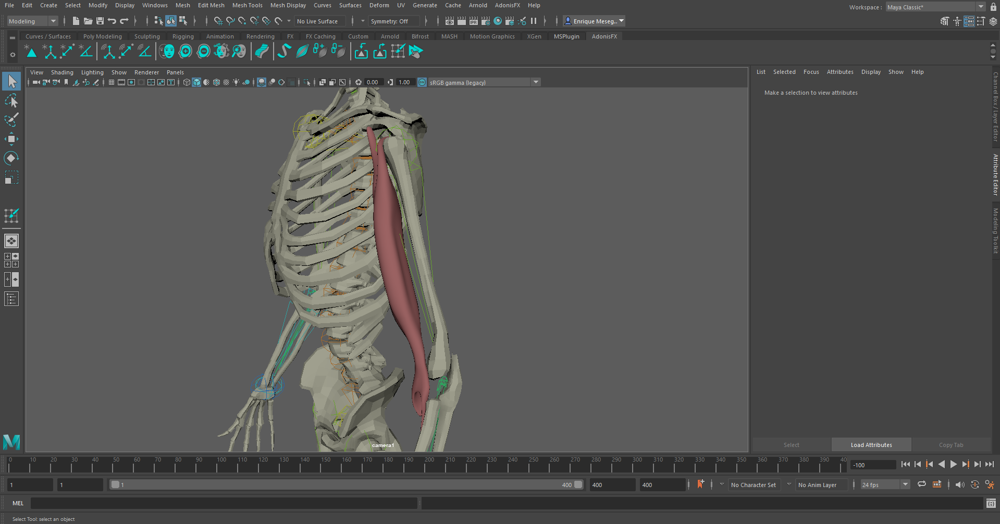
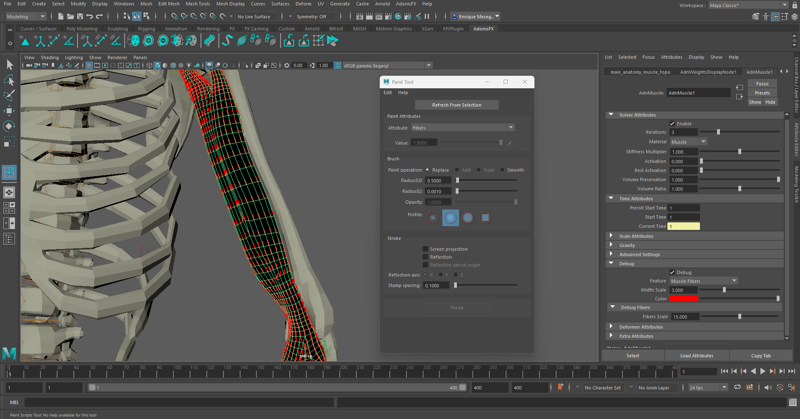
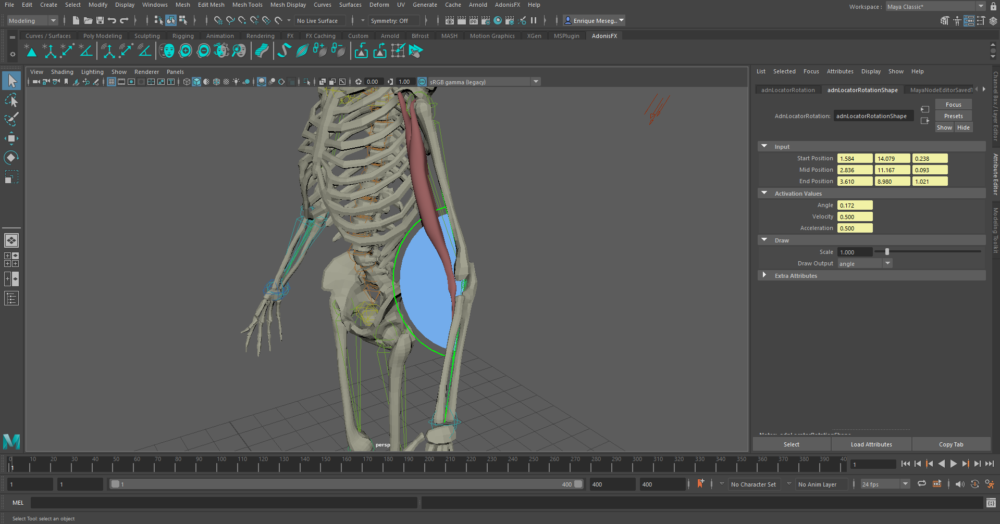
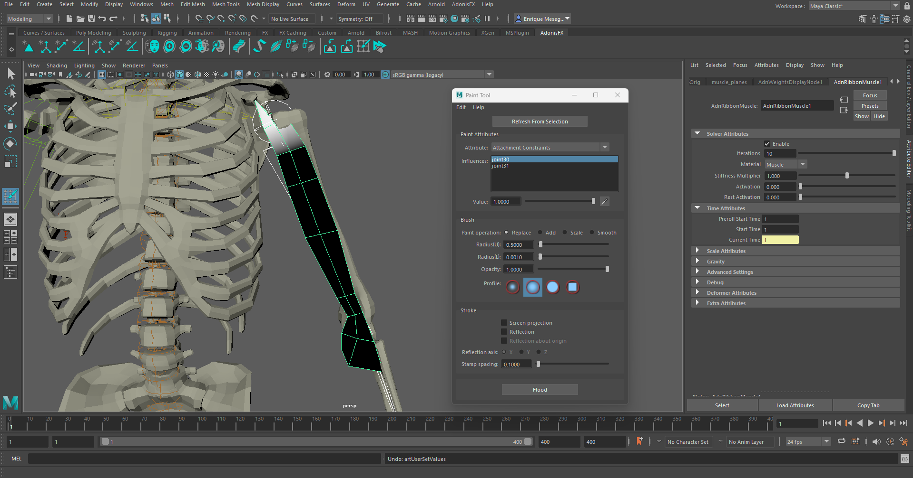

# A Simple Setup

This page is dedicated to explain, step by step, a simple process of creating and setting every Adonis deformer in Maya. The scenarios presented here are intended to provide the minimum required configurations to obtain plausible results.

## AdnSkin Simple Setup

To create a basic scenario using the AdnSkin deformer, start with a scene with the following elements:

  - A target mesh with deformation.
  - A skin mesh (without animation or deformation).

The AdnSkin deformer will get applied to the simulated mesh.

<figure>
   
  <figcaption><b>Figure 1</b>: Basic setup for skin simulations.</figcaption>
</figure>

### 1. Creating the deformer

To create the AdnSkin deformer select the target mesh and then the skin mesh. Then press the {style="width:4%"} shelf button or go to AdonisFX Menu > *Skin*.

To create the AdnSkin deformer with some initial customization, double-click the shelf button or press the option box in the menu item. This will display a pop-up window that will allow to do some initial customization, as well as creating the deformer with a custom name. Once all data has been provided press the *Create* button and the deformer will get created.

<figure>
   
  <figcaption><b>Figure 2</b>: AdnSkin deformer creation scenario.</figcaption>
</figure>

### 2. Painting weights

Once the AdnSkin deformer is properly created it is possible now to paint its weights to correctly setup the deformer properties. To do so, select the simulated mesh and press the {style="width:4%"} shelf button or go to AdonisFX Menu > *Paint Tool*.

Start by painting *Hard Constraints*, which should only be applied to the edges of the simulated skin to be able to properly attach to the reference mesh.  

<figure>
   
  <figcaption><b>Figure 3</b>: Hard Constraints weights paint.</figcaption>
</figure>

Paint *Soft Constraints* by selecting the option from the attribute enumerator. Flood this weight to a low value of 0.2 to have a uniform distribution of soft constraints. This would allow the skin to properly follow the reference mesh while still simulating its own dynamics.

<figure>
   
  <figcaption><b>Figure 4</b>: Soft Constraints weights paint.</figcaption>
</figure>

Finally, select the *Slide Constraints* attribute and paint weights only in those areas where the skin is supposed to slide over the reference mesh. In this case, focus these weights over the scapulas and articulations, as they are the areas of the skin with the most noticeable sliding.

<figure>
   
  <figcaption><b>Figure 5</b>: Slide Constraints weights paint.</figcaption>
</figure>

With this basic paint setup the AdnSkin deformer will already show plausible results, expected of the skin to the reference target mesh. However, the possible parameters and tweaks to display high fidelity dynamics can be seen in the documentation for [AdnSkin](skin.md).

## AdnMuscle Simple Setup

To create a basic scenario using the AdnMuscle deformer, start with a scene with the following elements:

 - An animated rig.
 - A simulated mesh.

In this case the proposed example is to simulate a biceps in an animated full body rig. The AdnMuscle deformer will be applied to the mesh of the biceps.

<figure>
   
  <figcaption><b>Figure 6</b>: Basic setup for biceps simulations.</figcaption>
</figure>

### 1. Creating the deformer

To create the AdnMuscle deformer, select the two joints of the rig that form the arm and the forearm and then the mesh of the muscle. Then, press the {style="width:4%"} shelf button or go to AdonisFX Menu > *Muscle*.

<figure>
   
  <figcaption><b>Figure 7</b>: AdnMuscle deformer creation scenario.</figcaption>
</figure>

To create the AdnMuscle deformer with some initial customization, double-click the shelf button or press the option box in the menu item. This will display a pop-up window that will allow to do some initial customization, as well as creating the deformer with a custom name. Once all data has been provided press the *Create* button and the deformer will get created.

<figure>
   
  <figcaption><b>Figure 8</b>: AdnMuscle custom creation UI.</figcaption>
</figure>

### 2. Painting weights

Once the AdnMuscle deformer is properly created it is possible now to paint its weights to correctly setup the deformer properties. To do so, select the simulated mesh and press the {style="width:4%"} shelf button or go to AdonisFX Menu > *Paint Tool*.

<figure>
   
  <figcaption><b>Figure 9</b>: Attachment influence for joint 1.</figcaption>
</figure>

Start by painting attachment weights, painting the influence for each attachment by selecting the corresponding attachment from the list and painting its desired influence.  

<figure>
   
  <figcaption><b>Figure 10</b>: Attachment influence for joint 2.</figcaption>
</figure>

After that is done, paint the muscle tendon weights, by selecting the *Tendon* attribute from the *Attribute* enumerator and paint over the parts of the muscle that should have tendon tissue.

<figure>
   
  <figcaption><b>Figure 11</b>: Tendon weights for biceps.</figcaption>
</figure>

Once tendons are painted, when selecting the *Fibers* attribute from the *Attribute* enumerator, painted fibers will be displayed, with a default direction set by the painted tendons. It is now possible to freely comb these fibers if it is desired.

To change the fiber size or its color, go to the Attribute Editor, in the debug submenu, and customize the color, width and length of the drawn lines.

<figure>
   
  <figcaption><b>Figure 12</b>: Muscle fibers combing.</figcaption>
</figure>

Pressing play should display the muscle properly attached and with the expected dynamics. However, it still will not respond to external inputs like, for example, flexing an arm which add rigidity to the muscle.

### 3. Connecting AdnSensors

To have the muscle change and responding to external inputs (in this case an arm flex), it is recommended to setup and AdnSensor and connect it to the deformer. 

To do this, first create a rotation locator and sensor to compute the elbow angle. Both elements can be created by selecting the three joints from which to create the rotation locator and sensor (arm, forearm and wrist joints) and directly click on the {style="width:4%"} shelf button or go to AdonisFX Menu > Sensors (on the *Create* group) > *Rotation*. With this, both a locator and its corresponding sensor will get created at the same time.

<figure>
   
  <figcaption><b>Figure 13</b>: Rotation locator and sensor setup in elbow.</figcaption>
</figure>

Now that the sensor is created it has to be connected to the deformer. To do so, make use of the Connection editor, which must be opened from the AdonisFX Menu > Sensors (on the *Edit* group) > *Connection Editor*.

Once the Connection Editor is open, select the locator from the scene and press the *Reload Left* button, then select the simulated mesh and press the *Reload Right* button. Once this is done, on the lists (below the buttons) the selections done on each side with their respective connectable attributes will appear. Connect the *activationAngle* attribute from the locator to the *activation* attribute from the deformer.

<figure>
   
  <figcaption><b>Figure 14</b>: Connection Editor tool.</figcaption>
</figure>

When the elbow is flexed (and therefore the angle from the locator gets smaller) the muscle activation will get higher, simulating a much more realistic scenario.

To tweak additional parameters of the AdnMuscle deformer, the following documentation for [AdnMuscle](muscle.md) can be consulted.

## AdnRibbonMuscle Simple Setup

The process to setup an AdnRibbonMuscle is very similar to the one of setting up and AdnMuscle. It essentially follows the same steps. Start with the following elements:

 - An animated rig.
 - A simulated mesh.

In this case a planar muscle will be simulated corresponding to a biceps, which will yield similar results to the case of the AdnMuscle deformer previously shown.

<figure>
   
  <figcaption><b>Figure 15</b>: Basic setup for planar biceps simulations.</figcaption>
</figure>

### 1. Creating the deformer

Similar to AdnMuscle, create the AdnRibbonMuscle deformer by selecting the attachments (arm and forearm joints) and then the mesh to deform (the biceps muscle) and then pressing the {style="width:4%"} shelf button or go to AdonisFX Menu > *Ribbon Muscle*.

<figure>
   
  <figcaption><b>Figure 16</b>: AdnRibbonMuscle deformer creation scenario.</figcaption>
</figure>

To create the AdnRibbonMuscle deformer with some initial customization, double-click the shelf button or press the option box in the menu item. This will display a pop-up window that will allow to do some initial customization, as well as creating the deformer with a custom name. Once all data has been provided press the *Create* button and the deformer will get created.

<figure>
   
  <figcaption><b>Figure 17</b>: AdnRibbonMuscle custom creation UI.</figcaption>
</figure>

### 2. Painting weights

Once the muscle deformer is properly created it is possible now to paint its weights to correctly setup the deformer properties. To do so, select the simulated mesh and press the {style="width:4%"} shelf button or go to AdonisFX Menu > *Paint Tool*.

Start by painting attachment weights, painting the influence for each attachment by selecting the corresponding attachment from the list and painting its desired influence.  

<figure>
   
  <figcaption><b>Figure 18</b>: Attachment influence for joint 1.</figcaption>
</figure>

<figure>
   
  <figcaption><b>Figure 19</b>: Attachment influence for joint 2.</figcaption>
</figure>

After that is done, paint the muscle tendon weights, by selecting the *Tendon* attribute from the *Attribute* enumerator and painting over the parts of the muscle to represent tendon tissue.

<figure>
   
  <figcaption><b>Figure 20</b>: Tendon weights for planar biceps.</figcaption>
</figure>

Now that tendons are painted, when selecting the *Fibers* attribute from the *Attribute* enumerator, painted fibers will be displayed, with a default direction set by the painted tendons. It is now possible to freely comb these fibers if it is desired.

In case the fiber or its color has to be manipulated, go to the Attribute Editor, in the debug submenu, and customize the color, width and length of the drawn lines.

<figure>
   
  <figcaption><b>Figure 21</b>: Muscle fibers combing.</figcaption>
</figure>

Pressing play should show the muscle properly attached and with the expected dynamics. However, it still will not respond to external inputs like, for example, flexing an arm which add rigidity to the muscle.

### 3. Connecting AdnSensors

The process to connect and AdnSensor to an AdnRibbonMuscle is the exact same to the one followed [for AdnMuscle](#3-connecting-adnsensors).

<figure>
   
  <figcaption><b>Figure 22</b>: Connection Editor tool with AdnRotation sensor connected to AdnRibbonMuscle.</figcaption>
</figure>

To tweak additional parameters of the AdnRibbonMuscle deformer, the following documentation for [AdnRibbonMuscle](ribbon.md) can be consulted.

## AdnSimshape

To create a basic scenario using the AdnSimshape deformer, start with a scene with the following elements:

 - An animated facial mesh (to which to apply the deformer).
 - A rest mesh.
 - A deformation mesh with only the facial animation.

All these meshes must have the same number of vertices and correspond to the same facial model.

<figure>
   
  <figcaption><b>Figure 23</b>: Basic setup for facial simulations.</figcaption>
</figure>

### 1. Creating the deformer

To create the AdnSimshape deformer it is required to select first the rest mesh and then the animated mesh. In this scenario, the animated mesh will be used as the simulated mesh.

Press the {style="width:4%"} shelf button or go to AdonisFX Menu > *Simshape*.

To create the AdnSimshape deformer with some initial customization, double-click the shelf button or press the option box in the menu item. This will display a pop-up window that will allow to do some initial customization, as well as creating the deformer with a custom name. Once all data has been provided press the *Create* button and the deformer will get created.

<figure>
   
  <figcaption><b>Figure 24</b>: AdnSimshape deformer creation scenario.</figcaption>
</figure>

To add the deformation mesh to the deformer first select the deformation mesh, then the simulated mesh (it is the animation mesh), and then go to AdonisFX Menu > Simshape (on the *Edit* group) > Add *Deform Mesh*. A message will notify is that the addition of the rest mesh has been done correctly.

<figure>
   
  <figcaption><b>Figure 25</b>: Addition of deform mesh to AdnSimshape deformer.</figcaption>
</figure>

### 2. Painting weights

In the case of the AdnSimshape use the Maya Paint tool to setup and paint its paintable weight attributes. In this section painting the *Attraction Force* weights will be exposed, as this is the value that dictates how much of each simulated vertex should follow the animation. This value is flooded by default to 1.0, meaning that by default the simulated mesh will follow completely the animation, without displaying dynamics.

In high deformation areas, such as around the mouth or under the eyes, add medium to low values (in this case painting with a value of 0.4).

<figure>
   
  <figcaption><b>Figure 26</b>: Attraction Force weights for medium dynamics areas.</figcaption>
</figure>

Painting lower Attraction Force weights in meatier areas of the face, such as under the neck or in the cheecks to show more dynamics in these regions. In this case a value of 0.15 will be applied.

<figure>
   
  <figcaption><b>Figure 27</b>: Attraction Force weights for high dynamics areas.</figcaption>
</figure>

The lowest values (0.1 in this case) will be applied to the area under the jaw where dynamics will appear the most. 

<figure>
   
  <figcaption><b>Figure 28</b>: Attraction Force weights for highest dynamics areas.</figcaption>
</figure>

After painting similar weights to the ones displayed and pressing playback to check the animation,  realistic dynamics should be simulated in the face. Many more paintable weights to better customize and tweak face dynamics are avaliable and fully explained in the documentation for [AdnSimshape](simshape.md)

### 3. Adding muscle activations

To further have a realistic depiction of facial dynamics, facial muscle activations can be simulated. The AdnSimshape deformer has two methods of handling muscle activations:

 - Adonis Muscle Patches files.
 - Edge Evaluator Node.

For this case the Edge Evaluator Node can be used (information on Adonis Muscle Patches files can be foud in the documentation for [AdnSimshape](simshape#muscle-activations)). To create this node, select the rest mesh, then the deformation mesh, and then go to AdonisFX Menu > Nodes > *Edge Evaluator*.

Once the node is created it will appear in the Node Editor. Connect it to the AdnSimshape deformer. To do this go to AdonisFX Menu > Simshape (on the *Edit* group) > *Connect Activations Plug*. 
<figure>
   
  <figcaption><b>Figure 29</b>: Connecting Edge Evaluator Node to AdnSimshape Deformer.</figcaption>
</figure>

In the attribute editor of the AdnSimshape deformer, under the *Muscles Activation* section, the *Plug Values* will be enabled as a new valid *Activation Mode* option. To better visualize activations, press the {style="width:4%"} shelf button or go to AdonisFX Menu > Simshape (on the *Edit* group) > *Activations Debugger*.
