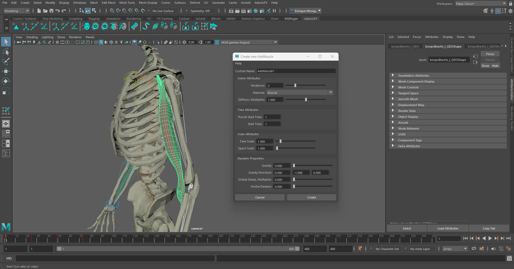
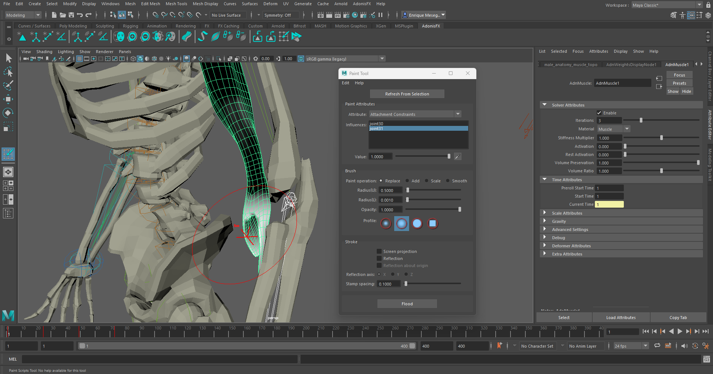
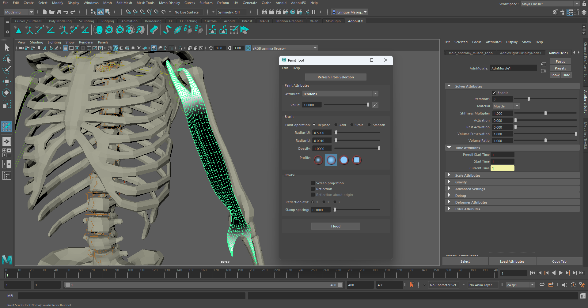
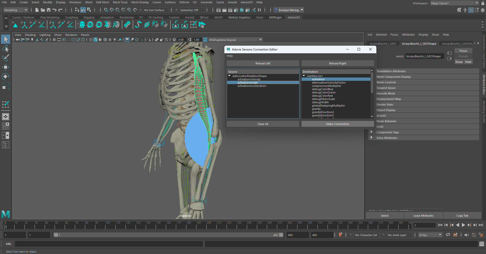
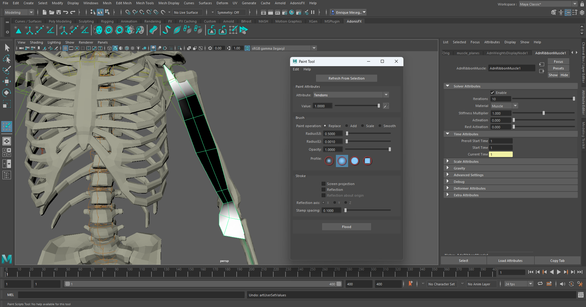
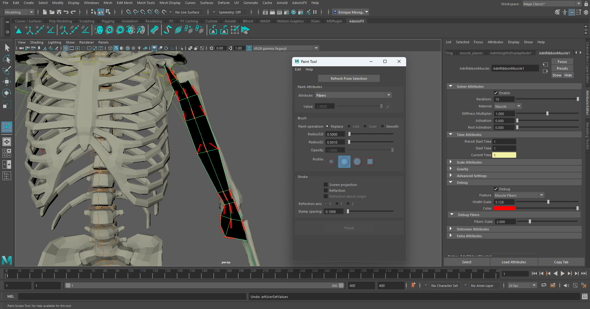
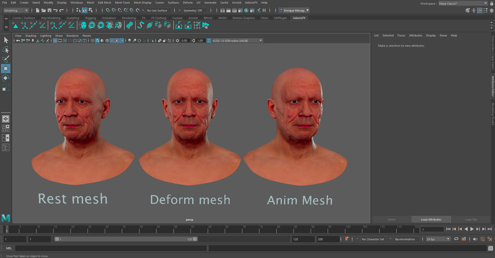
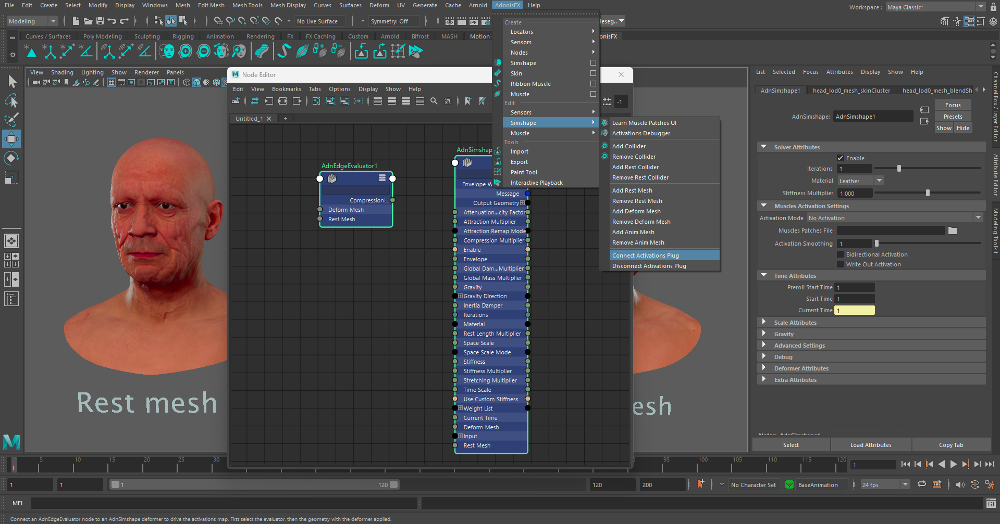

# A Simple Setup

This page is dedicated to explain, step by step, the process of creating and setting every Adonis deformer in Maya. The scenarios set up here will be basic cases with the minimum configuration to start observing expected results in each case.

## AdnSkin simple setup

To create a basic scenario using the AdnSkin deformer we will start with a scene with the following elements:

  - A target mesh with animation.
  - A simulated mesh (without animation).

The AdnSkin deformer will be applied to the simulated mesh.

<figure>
   
  <figcaption>Figure 1: Basic set up for skin simulations.</figcaption>
</figure>

### 1. Creating the deformer

To create the deformer we will select the target mesh and then the skin mesh (simulated mesh). Then we will press the  shelf button or go to *AdonisFX menu > Skin*.

If we want to create the AdnSkin deformer with some initial customization we can double click the shelf button or press the option box in the menu item. This will display a popup window that will allow us to do some initial customization, as well as creating the deformer with a custom name. Once everything is in order press the "Create" button and the deformer will get created.

<figure>
   
  <figcaption>Figure 2: AdnSkin deformer creation scenario.</figcaption>
</figure>

### 2. Painting weights

Now that we have the skin deformer properly created we are now able to apints its weights to correctly set up the deformer properties so it can behave as expected. To do so we must select the simulated mesh and press the  shelf button or go to *AdonisFX menu > Paint Tool*.

We will start by painting **Hard Constraints**, which we will only apply to the edges of the simulated skin, so it properly attaches to the reference mesh.  

<figure>
   
  <figcaption>Figure 3: Hard Constraints weights paint.</figcaption>
</figure>

Once we have that covered will then paint **Soft Constraints**, selecting it from the attribute enumerator. We will flood this weight to a low value of 0.2 to have a uniform distribution of soft constraints, so all the skin will properly follow the reference mesh while still simulating its own dynamics.

<figure>
   
  <figcaption>Figure 4: Soft Constraints weights paint.</figcaption>
</figure>

Finally we will select the **Slide Constraints** attribute and pain weights only in those areas we want the skin to slide over the reference mesh. In this case, we will focus these weights over the scapulas and articulations, as they are the areas of the skin with the most noticeable sliding.

<figure>
   
  <figcaption>Figure 5: Slide Constraints weights paint.</figcaption>
</figure>

With this basic paint setup the AdnSkin deformer will already show a proper behavior, expected of the skin to our reference target mesh. However, the possible parameters and tweaks to display high fidelity dynamics can be seen in the documentation for [AdnSkin](skin.md).

## AdnMuscle simple setup

To create a basic scenario using the AdnMuscle deformer we will start with a scene with the following elements:

 - An animated rig.
 - A simulated mesh.

In this case we will be simulating a biceps in an animated full body rig. The AdnMuscle deformer will be applied to the mesh of the biceps.

<figure>
   
  <figcaption>Figure 6: Basic set up for biceps simulations.</figcaption>
</figure>

### 1. Creating the deformer

To create the deformer we will select the two joints of the rig that form the "arm" and the "forearm" and then the mesh of the muscle. Then we will press the  shelf button or go to *AdonisFX menu > Muscle*.

<figure>
   
  <figcaption>Figure 7: AdnMuscle deformer creation scenario.</figcaption>
</figure>

If we want to create the muscle deformer with some initial customization we can double click the shelf button or press the option box in the menu item. This will display a popup window that will allow us to do some initial customization, as well as creating the deformer with a custom name. Once everything is in order press the "Create" button and the deformer will get created.

<figure>
   
  <figcaption>Figure 8: AdnMuscle custom creation UI.</figcaption>
</figure>

### 2. Painting weights

Now that we have the muscle deformer properly created we are now able to apints its weights to correctly set up the deformer properties so it can behave as expected. To do so we must select the simulated mesh and press the  shelf button or go to *AdonisFX menu > Paint Tool*.

<figure>
   
  <figcaption>Figure 9: Attachment influence for joint 1.</figcaption>
</figure>

We will start by painting attachment weights, painting the influence for each attachment by selecting the corresponding attachment from the list and painting its desired influence.  

<figure>
   
  <figcaption>Figure 10: Attachment influence for joint 2.</figcaption>
</figure>

After that is done we will now paint the muscle tendon weights, by selecting the "Tendon" attribute from the "Attribute" ennumerator and painting over the parts of the muscle that we want to have as tendon tissue.

<figure>
   
  <figcaption>Figure 12: Tendon weights for biceps.</figcaption>
</figure>

Now that we have tendons painted, when selecting the "Fibers" attribute from the "Attribute" ennumerator, we will see painted fibers displayed, with a default direction set by the painted tendons. We are now able to freely comb these fibers if we desire to do so.

In case we want to change the fiber size or its color, we can go to the Attribute Editor, in the debug submenu, and customize the color, width and length of the drawn lines.

<figure>
   
  <figcaption>Figure 13: Muscle fibers combing.</figcaption>
</figure>

If we now hit play we should see the muscle propperly attached and with the expected dynamics. However, it still won't respond to external inputs like, for example, flexing an arm.

### 3. Connecting AdnSensors

To have the muscle change and responding to external inputs (in this case an arm flex), we must need to set up and AdnSensor and connect it to the deformer. 

To do this we will first need to create a locator and a sensor. We will create a rotation locator and sensor to read the elbow angle. We can create both elements by selecting the three joints from which we are going to create the rotation locator and sensor (arm, forearm and wrist joints) and directly click on the  shelf button or go to *AdonisFX menu > Sensors (on the "Create" group) > Rotation*. With this both a locator and its corresponding sensor will get created at the same time.

<figure>
   
  <figcaption>Figure 14: Rotation locator and sensor set up in elbow.</figcaption>
</figure>

Now that we have the sensor created we just have to connect it to the deformer. To do so we will make use of the Connection editor, Which must be opened from the *AdonisFX menu > Sensors (on the "Edit" group) > Connection Editor*.

Once we have the Connection Editor open we must first select the locator from our scene and press the *Reload Left* button, then select the simulated mesh and press the *Reload Right* button. Once this is done we must see on the lists below the buttons the selections we have done on each side with their respective connectable attributes. We will connect the "activationAngle" attribute from the locator to the "activation" attribute from the deformer.

<figure>
   
  <figcaption>Figure 15: Connection Editor tool.</figcaption>
</figure>

Now we will see that when the elbow gets flexed (and therefore the angle from the locator gets smaller) the muscle activation will get higher, simulating a much more realistic scenario.

AdonisFX provides an endless array of customization and tweaking to fine tune the muscle dynamics by making use of these tools and the many additional parameters of the AdnMuscle deformer, that you can consult in the documentation for [AdnMuscle](muscle.md).

## AdnRibbonMuscle simple setup

The process to set up an AdnRibbonMuscle is very similar to the one of setting up and AdnMuscle. It will essentially follow the same steps. We will start with the following elements:

 - An animated rig.
 - A simulated mesh.

In this case we will simulate a planar muscle corresponding to a biceps, which will yield similar results to the case of the AdnMuscle deformer previously shown.

<figure>
   
  <figcaption>Figure 16: Basic set up for planar biceps simulations.</figcaption>
</figure>

### 1. Creating the deformer

Similar to AdnMuscle, we will create the deformer by selecting the attachments (arm and forearm joints) and then the mesh we want to deform (the biceps muscle) and then pressing the  shelf button or go to *AdonisFX menu > Ribbon Muscle*.

<figure>
   
  <figcaption>Figure 17: AdnRibbonMuscle deformer creation scenario.</figcaption>
</figure>

If we want to create the AdnRibbonMuscle deformer with some initial customization we can double click the shelf button or press the option box in the menu item. This will display a popup window that will allow us to do some initial customization, as well as creating the deformer with a custom name. Once everything is in order press the "Create" button and the deformer will get created.

<figure>
   
  <figcaption>Figure 18: AdnRibbonMuscle custom creation UI.</figcaption>
</figure>

### 2. Painting weights

Now that we have the muscle deformer properly created we are now able to apints its weights to correctly set up the deformer properties so it can behave as expected. To do so we must select the simulated mesh and press the  shelf button or go to *AdonisFX menu > Paint Tool*.

We will start by painting attachment weights, painting the influence for each attachment by selecting the corresponding attachment from the list and painting its desired influence.  

<figure>
   
  <figcaption>Figure 20: Attachment influence for joint 1.</figcaption>
</figure>

<figure>
   
  <figcaption>Figure 21: Attachment influence for joint 2.</figcaption>
</figure>

After that is done we will now paint the muscle tendon weights, by selecting the "Tendon" attribute from the "Attribute" ennumerator and painting over the parts of the muscle that we want to have as tendon tissue.

<figure>
   
  <figcaption>Figure 22: Tendon weights for planar biceps.</figcaption>
</figure>

Now that we have tendons painted, when selecting the "Fibers" attribute from the "Attribute" ennumerator, we will see painted fibers displayed, with a default direction set by the painted tendons. We are now able to freely comb these fibers if we desire to do so.

In case we want to change the fiber size or its color, we can go to the Attribute Editor, in the debug submenu, and customize the color, width and length of the drawn lines.

<figure>
   
  <figcaption>Figure 23 : Muscle fibers combing.</figcaption>
</figure>

If we now hit play we should see the muscle propperly attached and with the expected dynamics. However, it still won't respond to external inputs like, for example, flexing an arm.

### 3. Connecting AdnSensors

The process to connect and AdnSensor to an AdnRibbonMuscle is the exact same to the one followed [for AdnMuscle](#3-connecting-adnsensors).

<figure>
   
  <figcaption>Figure 24: Connection Editor tool with AdnRotation sensor connected to AdnRibbonMuscle.</figcaption>
</figure>

## AdnSimshape

To create a basic scenario using the AdnSimshape deformer we will start with a scene with the following elements:

 - An animated facial mesh (to which we will apply the deformer).
 - A rest mesh.
 - A deformation mesh with only the facial animation.

All these meshes must have the same number of vertices and correspond to the same facial model.

<figure>
   
  <figcaption>Figure 25: Basic set up for facial simulations.</figcaption>
</figure>

### 1. Creating the deformer

To create the AdnSimshape deformer we will first need to select first the rest mesh and then the animated mesh. In this scenario we will use our animated mesh as our simulated mesh.

Then we will now press the  shelf button or go to *AdonisFX menu > Simshape*.

If we want to create the AdnSimshape deformer with some initial customization we can double click the shelf button or press the option box in the menu item. This will display a popup window that will allow us to do some initial customization, as well as creating the deformer with a custom name. Once everything is in order press the "Create" button and the deformer will get created.

<figure>
   
  <figcaption>Figure 26: AdnSimshape deformer creation scenario.</figcaption>
</figure>

We will now add the deformation mesh to the deformer. To do this, first select the deformation mesh, then the simulated mesh (remember that this is the animation mesh), and then go to *AdonisFX menu > Simshape (edit group) > Add Deform Mesh*. A message will notify is that the addition of the rest mesh has been done correctly.

<figure>
   
  <figcaption>Figure 27: Addition of deform mesh to AdnSimshape deformer.</figcaption>
</figure>

### 2. Painting weights

In the case of the AdnSimshape we may use the Maya Paint tool to set up and paint its paintable weight attributes. We focus in painting the Attraction Force weights, as this is the value that dictates how much of each simulated vertex should follow the animation. This value is flooded by default to 1, meaning that by default the simulated mesh will follow completely the animation, without displaying dynamics.

In high deformation areas, such as around the mouth or under the eyes we will add medium to low values (in this case painting with a value of 0.4)

<figure>
   
  <figcaption>Figure 28: Attraction Force weights for medium dynamics areas.</figcaption>
</figure>

We will be painting lower Attraction Force weights in meatier areas of the face, such as under the neck or in the cheecks, as we want to show more dinamycs in these regions. In this case we will apply a value of 0.15 here.

<figure>
   
  <figcaption>Figure 29: Attraction Force weights for high dynamics areas.</figcaption>
</figure>

The lowest values (0.1 in this case) will be applied to the area under the jaw, as it is where we want to show the most dynamics. 

<figure>
   
  <figcaption>Figure 30: Attraction Force weights for highest dynamics areas.</figcaption>
</figure>

After painting similar weights to the ones displayed and pressing playback to check the animation we should already see realistic dynamics being simulated in the face. Many more paintable weights to better customize and tweak face dynamics are avaliable and fully explained in the documentation for [AdnSimshape](simshape.md)

### 3. Adding muscle activations

To further have a realistic depiction of facial dynamics we are going to simulate facial muscle activations. The AdnSimshape deformer has two methods of handling muscle activations:

 - Adonis Muscle Patches files.
 - Edge Evaluator Node.

For this case we are going to use the Edge Evaluator Node (Information on Adonis Muscle Patches files can be foun in the documentation for [AdnSimshape](simshape.md#muscle-activations)). To create this node we will select our rest mesh, then our deformation mesh, and then go to *AdonisFX menu > Nodes > Edge Evaluator*.

Once we do this we will see in the node editor that this node has been created. We must now connect it to the AdnSimshape deformer. To do this we must go to *AdonisFX menu > Simshape (edit group) > Connect Activations Plug*. We will see this node now in the Node Editor.

<figure>
   
  <figcaption>Figure 31: Connecting Edge Evaluator Node to AdnSimshape Deformer.</figcaption>
</figure>

We will now see in the attribute editor of the AdnSimshape deformer, under the "Muscles Activation" section that we may select "Plug Values" as an "Activation Mode" option. To better visualize activations, press the  shelf button or go to *AdonisFX menu > Simshape (edit group) > Activations Debugger*.
