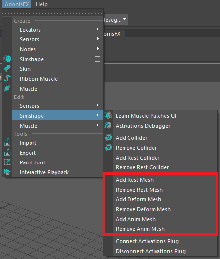
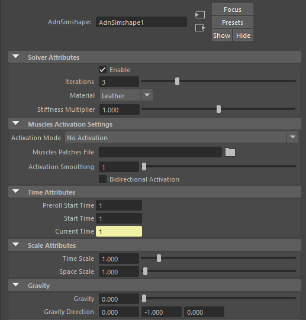
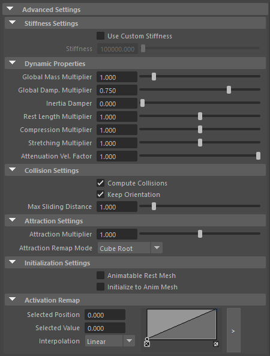
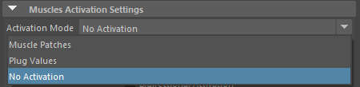
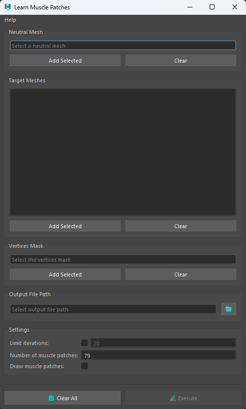
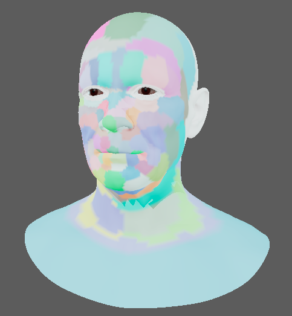
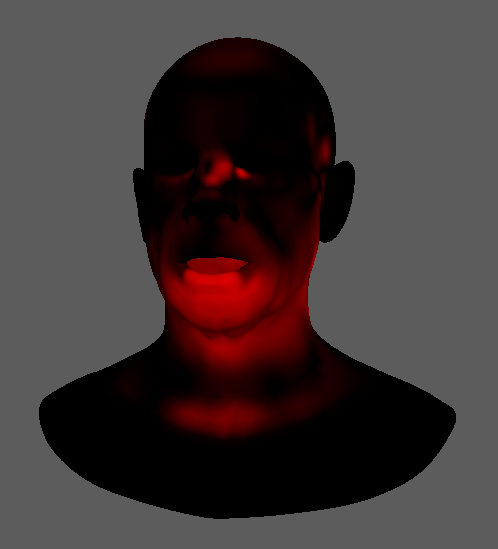
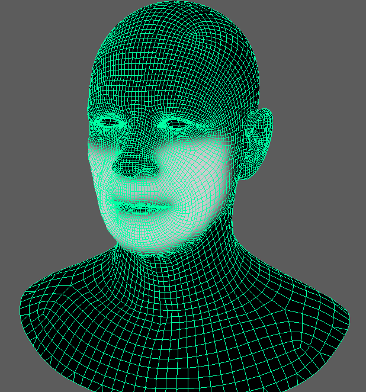
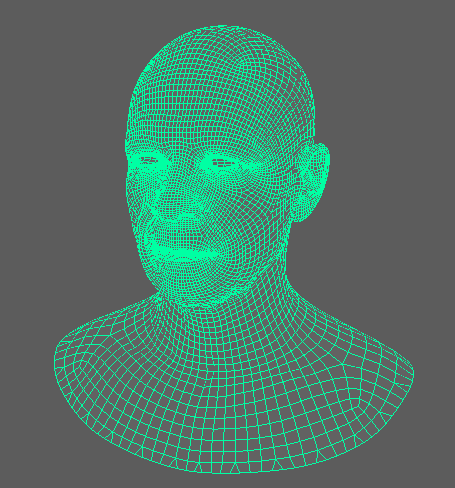
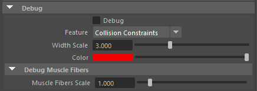

# Introduction to AdnSimshape in Maya

**AdnSimshape** is a Maya deformer to get facial simulation in the animation rig of an asset. Given a facial expression, the deformer is able to compute the activation of the vertices in order to emulate the changes in the rigidity of the skin. As result, the dynamics of the simulated skin mimic the behaviour of internal muscles contracting.

During the simulation, the solver reduces the inertias of the vertices with higher values of activation, while it computes standard simulation in the vertices that are not activated. One of the key features of AdnSimshape is the ability to extract muscle information directly from the neutral geometry and the set of deformed geometries with the facial expressions using Machine Learning techniques.

## Requirements

The AdnSimshape deformer has a series of input meshes to be provided:

  - <b class="mesh_color"> Rest Mesh (R)</b>: mesh with no deformation or animation (optional).
  - <b class="mesh_color"> Deform Mesh (D)</b>: mesh with deformation driven by the facial expressions (optional).
  - <b class="mesh_color"> Animated Mesh (A)</b>: mesh with deformation driven by the facial expressions and animation result of to the binding to the animation rig (optional).
  - <b class="mesh_color"> Simulation Mesh (S)</b>: mesh to apply the deformer onto. This mesh can be the animation mesh or a separate mesh with no deformation nor animation.

> [!NOTE]
> - All input geometries must have the same number of vertices.
> - If <b class="mesh_color">R</b> is not provided, the system will use the initial state of <b class="mesh_color">S</b> as the rest mesh.
> - If <b class="mesh_color">D</b> is not provided, the simulation will not produce activations.
> - If <b class="mesh_color">A</b> is not provided, the system will use the input mesh to the deformer (<b class="mesh_color">S</b>) as animated mesh.

## Create AdnSimshape

When initially creating an AdnSimshape deformer, it is possible to add both a Simulated Mesh and a Rest Mesh, or only add a Simulated Mesh. The required process is as follows:

  1. Select the meshes in the following order: **Rest Mesh** (optional) &#8594 **Simulated mesh**
        
    - Remember that the deformer can be applied to the animation mesh and use it directly as the simulation mesh.

  2. Press the  in the AdonisFX shelf or press Simshape in AdonisFX menu.
  3. A message box will notify you that AdnSimshape has been created properly, meaning that it is ready to simulate with default settings. Check [this page](#attributes) to customize the configuration.

In order to add or remove any of those optional meshes, a set of menu items are exposed in AdonisFX menu > Edit Simshape. In that submenu, we can find the options to manage each mesh type as we present in the Figure 1.

<figure style="width:45%" markdown>
  
  <figcaption>Figure 1: Edit Simshape submenu.</figcaption>
</figure>

To add any of these meshes to AdnSimshape, follow a similar procedure to when first creating the deformer:

  1. Select the meshes in the following order:

    **Additional Mesh** &#8594 **Simulated mesh**
        
  2. Press the corresponding menu element in AdonisFX menu > Edit Simshape.
  3. A message box will notify you that the action has been successful.

To remove any of these meshes from AdnSimshape follow this procedure:

  1. Select only the mesh with AdnSimshape applied.
  2. Press the corresponding menu element in AdonisFX menu > Edit Simshape.
  3. A message box will notify you that the action has been successful.

# Attributes

[^1]: Soft range: higher values can be used.

#### Solver Attributes
 - **Enable** (Boolean, True): Flag to enable or disable the deformer computation.
 - **Iterations** (Integer, 3): Number of iterations that the solver will execute per simulation step. Greater values mean greater computational cost.
     - Has a range of \[1, 10\] [^1]
 - **Material** (Enumerator, Leather): Solver stiffness presets per material. The materials are listed from lowest to highest stiffness. There are 7 different presets:
    <ul><li>Fat: 10^7^</li><li>Muscle: 5e^3^</li><li>Rubber: 10^6^</li><li>Tendon: 5e^7^</li><li>Leather: 10^8^</li><li>Wood: 6e^9^</li><li>Concrete: 2.5e^10^</li></ul>
 - **Stiffness Multiplier** (Float, 1.0): Multiplier factor to scale up or down the material stiffness.
     - Has a range of \[0.0, 2.0\]

#### Muscles Activation Settings
 - **Activation Mode** (Enumerator, No Activation): Mode to drive the muscle activations. There are 3 different modes:
    - *Muscle Patches* (Disabled by default): An Adonis Muscle Patches file (.amp) has to be provided to enable this option.
    - *Plug Values* (Disabled by default): The attribute values ActivationList.Activation should be populated to enable this option. The activation data will be read from the plug values.
    - *No Activation* (Enabled by default): No activation is read.
 - **Muscle Patches File** (String): Path to the Adonis Muscle Patches file (.amp).
 - **Activation Smoothing** (Integer, 1): Number of iterations for the activation smoothing algorithm. The greater the number, the smoother the activations per patch will be.
     - Has a range of \[1, 20\] [^1]
 - **Bidirectional Activation** (Boolean, False): Flag to enable muscle activations in the positive and negative directions of the muscle patches fibers.
 - **Write Out Actiavations** (Boolean, False): Flag to toggle the writing of activations into a point attribute.

#### Time Attributes
 - **Preroll Start Time** (Time, *Current frame*): Sets the frame at which the preroll begins. The preroll ends at *Start Time*.
 - **Start Time** (Time, *Current frame*): Determines the frame at which the simulation starts.
 - **Current Time** (Time, *Current frame*): Current playback frame.

#### Scale Attributes
 - **Time Scale** (Float, 1.0): Sets the scaling factor applied to the simulation time step.
    - Has a range of \[0.0, 2.0\] [^1]
 - **Space Scale** (Float, 1.0): Sets the scaling factor applied to the masses and/or the forces.
    - Has a range of \[0.0, 2.0\] [^1]

#### Gravity
 - **Gravity** (Float, 1.0): Sets the magnitude of the gravity acceleration.
 - **Space Scale** (Float3, {0.0. -1.0, 0.0} ): Sets the scaling factor applied to the masses and/or the forces.
    - Vectors introduced don't need to be normalized, but they will get normalized internally.

### Advanced Settings

#### Stiffness Settings
 - **Use Custom Stiffness** (Boolean, False): Toggles the use of a custom stiffness value. If enabled, the Material is ignored and the Stiffness parameter is used instead.
    - If we use a custom stiffness, **Material** and **Stiffness Multiplier** will be disabled and **Stiffness** will be used instead.
 - **Stiffness** (Float, 10^5^): Sets the custom stiffness value.
    - Its value must be greater than 0.0.

#### Dynamic Properties
 - **Global Mass Multiplier** (Float, 1.0): Sets the scaling factor applied to the mass of every point.
    - Has a range of \[0.0, 10.0\] [^1]
 - **Global Damping** (Float, 0.75): Sets the scaling factor applied to the global damping of every point.
    - Has a range of \[0.0, 1.0\] [^1]
 - **Inertia Damper** (Float, 0.0): Sets the linear damping applied to the dynamics of every point.
    - Has a range of \[0.0, 1.0\] [^1]
 - **Rest Length Multiplier** (Float, 1.0): Sets the scaling factor applied to the edge lengths at rest.
    - Has a range of \[0.0, 2.0\] [^1]
 - **Compression Multiplier** (Float, 1.0): Sets the scaling factor applied to the compression resistance of every point.
    - Has a range of \[0.0, 2.0\] [^1]
 - **Stretching Multiplier** (Float, 1.0): Sets the scaling factor applied to the stretching resistance of every point.
    - Has a range of \[0.0, 2.0\] [^1]
 - **Attenuation Velocity factor** (Float, 1.0): Sets the weight of the attenuation applied to the whole simulation driven by the Attenuation Matrix.
    - Has a range of \[0.0, 10.0\] [^1]

#### Collision Settings
 - **Compute Collisions** (Boolean, True): Flag to enable collisions correction in the deformer. If disabled, the deformer will ignore colliders when deforming the mesh.
 - **Keep Orientation** (Boolean, True): Flag to preserve the initial orientation of the vertices relative to the collider when handling collisions. If disabled, the mesh will suffer no changes if the orientation of the collider varies.
 - **Max Sliding Distance** (Float, 1.0): Maximum distance (in world units) the simulated vertex is allowed to slide relative to the collider.
    - Has a range of \[0.0, 10.0\] [^1]

#### Attraction Settings
 - **Attraction Multiplier** (Float, 1.0): Maximum distance (in world units) the simulated vertex is allowed to slide relative to the collider.
    - Has a range of \[0.0, 10.0\] [^1]
 - **Attraction Remap Mode** (Enumerator, Cube Root): Remap mode used to compute the definitive attraction values. There are 4 different modes that folow different remap methods:
    <ul><li>Linear</li><li>Logarithmic</li><li>Square Root</li><li>Cube Root</li></ul>

#### Initialization Settings
 - **Animatable Rest Mesh** (Boolean, False): Flag that enables reading animated rest mesh data.
 - **Initialize to Anim Mesh** (Boolean, True): Flag to instantiate points at animated mesh instead of rest mesh on initialization.

#### Activation Remap
 - **Activation Remap** (Ramp Attribute): Curve to remap the activation values.

## Paintable Weights

In order to provide more artistic control, some key parameters of the AdnSimshape solver are exposed as paintable attributes in the deformer. The Maya paint tool must be used to paint those parameters to ensure that the values satisfy the solver requirements.

 - **Attract Force**: weight to control the amount of influence of the animated mesh. The higher the value is, the more influence and the less dynamics will appear.
    - It's initialized to a flooded value of 1.0
 - **Collision Threshold Multiplier**: Factor to scale the distance vertex-to-collider at rest. It is used to modulate the minimum distance to the collider allowed for each vertex.
    - It's initialized to a flooded value of 1.0
- **Compression Resistance**: force to correct the edge lengths if the current length is smaller than the rest length. A higher value represents higher correction.
    - It's initialized to a flooded value of 0.0
 - **Global Damping**: set global damping per vertex in the simulated mesh. The greater the value per vertex the more it will attempt to retain its previous position.
    - It's initialized to a flooded value of 1.0
 - **Mass**: set individual mass values per vertex in the simulated mesh.
    - It's initialized to a flooded value of 1.0
 - **Slide Collision Constraints**: Represents for which areas collisions should be computed against the collider.
    - It's initialized to a flooded value of 0.0
    - A value of 0.0 does not apply correction at all, while a value of 1.0 does apply the correction to fix intersections. 
- **Stretching Resistance**: force to correct the edge lengths if the current length is greater than the rest length. A higher value represents higher correction.
    - It's initialized to a flooded value of 1.0

## Attribute Editor Template

<figure markdown>
   
  <figcaption>Figure 1: AdnSimshape Attribute Editor</figcaption>
</figure>

<figure markdown>
  
  <figcaption>Figure 2: AdnSimshape Attribute Editor (Advanced Settings)</figcaption>
</figure>

# Advanced

## Muscle Activations
AdnSimshape can emulate the behaviour of facial muscles by computing the muscle activation directly on the vertices of the skin geometry. The activation of the vertices is an advanced and optional feature that can work in two modes: from **muscle patches data** or from **plug values**.

<figure markdown>
  
  <figcaption>Figure 1: Activation Modes switch exposed in the Attribute Editor</figcaption>
</figure>

!!! abstract "Activations Modes"
    === "Muscle Patches"
        The data in the Adonis Muscle Patches (AMP) file in combination with the deformation status of the Deform Mesh are used to calculate the amount of activation at each vertex. The AMP file is the result of a Machine Learning process and can be generated following [this section](#generate-muscle-patches).

        <h5>Requirements</h5>

        - **Adonis Muscle Patches**.
        - **Deform mesh**.

    === "Plug Values"
        The plug values from the Activation List array attribute are used to drive the level of activation at each vertex.

        > [!NOTE]
        > - The values must be provided in the range 0 to 1, where 0.0 is no activation and 1.0 is maximum activation.
        > - The values outside of the valid range will be clamped.

    === "No Activation"
        Activations are not computed. This option is selected by default.

### Generate Muscle Patches

##### Requirements

  - **Neutral mesh**: rest mesh with a neutral facial expression.
  - **Target meshes**: set of deformed meshes representing facial expresions.
  - The number of vertices in the neutral and the target meshes must match with the number of vertices of the Simulated mesh that will be used for the simulation.

The AMP file is generated from the Learn Muscle Patches tool:

<figure style="float: right; width: 40%; padding-left: 5px;">
   
  <figcaption>Figure 3: Learn Muscle Patches UI</figcaption>
</figure>

1. Open the **Learn Muscle Patches UI**. Using the shelf button  or go to the Edit Simshape submenu from the AdonisFX menu and press **Learn Muscle Patches UI**.
2. Add the neutral mesh.
3. Add the target meshes.
4. Select the vertices on the neutral mesh that will be involved in the training for the muscle patches generation.
5. Browse or specify the destination AMP file.
6. Configure custom settings for the learning algorithm.
7. Press **Execute**.

 
<figure style="width: 25%;" markdown>
  
  <figcaption>Figure 2: Example of muscle patches generated with the Learn Muscle Patches UI</figcaption>
</figure>

Additional custom settings for the learning algorithm:

 - **Limit Iterations** (Boolean, False): If enabled, the "Number of iterations" will be taken into consideration.
 - **Number of Iterations** (Integer, 20): Maximum number of iterations allowed in the training process. The higher this value is, the more accurate the muscle patches estimation will be and the longer the execution will take.
    - This parameter is ignored if "Limit iterations" attribute is disabled. In that case, the training process will run until it achieves the most accurate solution.
    - Has a range of \[1, 1e^6^\]
 - **Number of Muscle Patches** (Integer, 79): Maximum number of muscle patches expected in the results.
    - Has a range of \[1, 1e^6^\]
 - **Draw Muscle Patches** (Boolean, True): If enabled, the vertices of the neutral mesh will be colored according to the muscle patches resulting from the training.

### Debug Activations

AdnSimshape integrates a debug mode to visualize the activations during the simulation. If this mode is enabled, then AdnSimshape will display a map of vertex colors from black to red on the simulation mesh where the black color is mapped to no activation and the red color is mapped to maximum activation.

<figure style="width: 30%" markdown>
  
  <figcaption>Figure 4: Example of AdnSimshape running in Debug mode</figcaption>
</figure>

In order to toggle and untoggle the debug mode, follow these steps:

1. Stop the simulation.
2. Move to pre-roll frame or start frame.
3. Press  or go to the Edit Simshape submenu from the AdonisFX menu and press **Activations Debugger**.

## Colliders

AdnSimshape supports an internal collider that has to be bound to the rig and combined into a single object in order to mimic the internal structures like the skull or the teeth.

### Add Collider

1. Select the collider object.
2. Select the mesh with the AdnSimshape deformer.
3. Press the AdonisFX Shelf > Add Collider Shelf Button  or go to the Edit Simshape submenu from the AdonisFX menu and press **Add Collider**. 

> [!NOTE]
> - Avoid intersections between the collider and the rest/simulated mesh.
> - Colliders with high Level Of Detail will affect the simulation performance.

### Remove Collider

1. Select the collider object.
2. Select the mesh with the AdnSimshape deformer.
3. Press the AdonisFX Shelf > Remove Collider Shelf Button  or go to the Edit Simshape submenu from the AdonisFX menu and press **Remove Collider**.

### Add Rest Collider

The use of rest collider is recommended when the preroll simulation is not computed and the [initialization to the animated mesh](#initialization-settings) is enabled. In order to allow the solver to build consistent collision data in those cases, we should provide both the [rest mesh](#requirements) and the rest collider.

1. Select the rest collider object.
2. Select the mesh with the AdnSimshape deformer.
3. Go to the Edit Simshape submenu from the AdonisFX menu and press **Add Rest Collider**.

> [!NOTE]
> - Avoid intersections between the collider and the rest mesh.
> - Colliders with high Level Of Detail will affect the simulation performance.

### Remove Rest Collider

1. Select the rest collider object.
2. Select the mesh with the AdnSimshape deformer.
3. Go to the Edit Simshape submenu from the AdonisFX menu and press **Remove Rest Collider**.

### Collider Configuration

Apart from [*Compute Collisions*](#collision-settings), [*Keep Orientation*](#collision-settings) and [*Max Sliding Distance*](#collision-settings) parameters, it is possible to tweak the collision computation by painting the following attributes, also explained in more detail in the [*Paintable Weights*](#paintable-weights) section:

 - [**Slide Collision Constraints**](#paintable-weights) to scale the distance vertex-to-collider at rest.
 - [**Collision Threshold Multiplier**](#paintable-weights) to represent which areas' collisions should be computed against the collider.

<figure style="width:45%" markdown> 
   
  <figcaption>Figure 5: Slide Collision Constraints painted values.</figcaption> 
</figure>

<figure style="width:45%;" markdown> 
   
  <figcaption>Figure 6: Collision Threshold Multiplier painted values to 0.2 for the whole mesh.</figcaption> 
</figure>

## Debugger

To better visualize deformer constraints and attributes in the Maya viewport there is the option to enable the debugger, found in the dropdown menu labeled "Debug" in the attribute editor.

To enable the debugger the *Debug* checkbox must be marked.To select the specific feature you would like to visualize, choose it from the list provided in *Features*. 

### Debug features

The features that can be visualized with the debugger in the Skin deformer are:

 - **Collision Constraints**: for each vertex, a line will be drawn from the mesh to the closest point of a collider.
    - The debug lines will only be displayed in case collisions are enabled and colliders have been set up.
 - **Muscle Fibers**: for each vertex, a line will be drawn showing the direction of the muscle fibers.
    - The debug lines will only be displayed in case muscle activations have been enabled with an Adonis Muscle Patches file.

Enabling the debugger and selecting one of these constraints will draw lines from the influenced vertices in the simulated mesh to their corresponding reference vertices. 

### Debugger attributes

The following attributes can be modified to better customize the appereance of these lines:

 - **Width Scale** (Float, 1.0): Modifies the width of all lines.
 - **Color** (Color picker): Selects the line color from a color wheel. Its saturation can be modified using the slider.

Additionally, for the specific case of debugging fibers, one more attribute is available:

 - **Fiber scale value**: can be modified to set a custom fiber length.

<figure markdown>

<figcaption>Figure 4: AdnSimshape Attribute Editor (Debug menu)</figcaption>
</figure>
