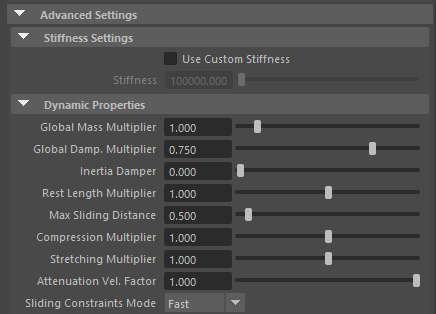

# Introduction to AdnSkin in Maya

AdnSkin is a Maya deformer for fast, robust and easy-to-configure skin simulation for digital assets. Thanks to the combination of internal and external constraints, the deformer can produce dynamics that allow the skin mesh to realistically react to the deformations of the internal tissues (e.g. muscles, fascia) over time.

<!-- DEV NOTE: change paint tool references once tools.md has been merged-->

The influence these constraints have in the simulated mesh can be freely modified by painting them via the [AdonisFX Paint Tool](index.md) or by uniformingly regulating their influence via multipliers in the attribute editor. Beyond these constraints, there are many paramenters to regulate the skin's dynamics are available to modify the deformer's behaviour to a wide array of options.

# How to Use

The Adonis Skin deformer is of great simplicity so set up and apply to a mesh within a Maya scene. The way this deformer works, a reference mesh (usually animated) is set in the scene, over which the skin mesh (simulated mesh) is set with the deformer.

## Requirements

To create an AdnSkin deformer within a Maya scene, the following inputs must be provided:

  - <b class="mesh_color"> Reference Mesh (R)</b>: Mesh to drive the simulation skin (e.g. fascia or combined muscles).
  - <b class="mesh_color"> Skin Mesh (S)</b>: Mesh to be simulated to which the AdnSkin deformer will be applied.

## Create AdnSkin

The process to create an AdnSkin deformer must follow this procedure:

1. Select the reference mesh (if any), then the geometry:
2. Press  in the AdonisFX shelf or Skin in the AdonisFX menu, under the "Create" section.
    - If the shelf button is double-clicked or the option box in the menu is selected a window will be displayed where a custom name and initial attribute values can be set.
3. AdnSkin is ready to simulate with default settings. Check [this page](#attributes) to customize the configuration.

## Paintable Weights

In order to provide more artistic control, some key parameters of the AdnSkin solver are exposed as paintable attributes in the deformer. The [AdonisFX Paint Tool](index.md) must be used to paint those parameters to ensure that the values satisfy the solver requirements.

- <b class="paintable maps">Hard Constraints</b>: Weight to modulate the correction applied to the vertices to keep them at a constant transformation, local to the closest point on the reference mesh at initialization. Hard constraint maps will force the geometry points to keep the original position. A low value of hard constraints may be desired to allow the skin to create wrinkles, sliding, etc.

    - *Tip*: Flood the geometry with a very low value 0.1 - 0.2. Give a value of 1.0 to the edges of the skin to guarantee that’s perfectly attached to the target geometry

    - *Tip*: Smooth the borders by using the smooth-Flood combination to make sure the simulation doesn’t find hard edges as this could create odd wrinkles (unless that’s something you are looking for!).

- <b class="paintable maps">Soft Constraints</b>: Weight to modulate the correction applied to the vertices to keep them at a constant distance to the closest point on the reference mesh at initialization. An intermediate value of 0.5 on the whole geometry is recommended.

    - *Tip*: Flood the geometry with a very low value 0.1 - 0.2.

    - *Tip*: It may be desirable to leave this map weight to 1 as a starting point and tweak some areas later on as the results of the skin simulation are seen.

- <b class="paintable maps">Slide Constraints</b>: Weight to modulate the correction applied to the vertices to keep them at a constant distance to the reference mesh sliding along the reference surface. In the example of a biped or quadruped, it is recommended to set a value of 1.0 on the scapulas, shoulders, elbows and knees and an overall value of 0 on the rest of the body.

    - *Tip*: Smooth the borders by using the smooth-Flood combination to make sure the simulation doesn’t find hard edges as this could create odd wrinkles (unless that’s something you are looking for!).

- <b class="paintable maps">Compression Resistance</b>: Force to correct the edge lengths if the current length is smaller than the rest length. A higher value represents higher correction. At value 1 the points in the geometry will try to keep as close as possible to their original position.

    - *Tip*: It may be desirable to leave this map weight to 1 as a starting point and tweak some areas later on as the results of the skin simulation are seen.
    
    - *Tip*: Reducing the value of the weight in some areas will contribute to getting rid of unwanted wrinkles or possible artifacts in the skin.

- <b class="paintable maps">Stretching Resistance</b>: Force to correct the edge lengths if the current length is greater than the rest length. A higher value represents higher correction.

    - *Tip*: It may be desirable to leave this map weight to 1 as a starting point and tweak some areas later on as the results of the skin simulation are seen.

    - *Tip*: Smooth the borders by using the smooth-Flood combination to make sure the simulation doesn’t find hard edges as this could create odd wrinkles (unless that’s something you are looking for!).

- <b class="paintable maps">Global Damping </b>: Set global damping per vertex in the simulated mesh. The greater the value per vertex the more it will attempt to retain its previous position.

- <b class="paintable maps">Max Sliding Multiplier</b>: Determines the size of the sliding area per vertex. It corresponds to the maximum distance to the closest point on the reference mesh computed on initialization. Greater values will allow for greater sliding but will have a greater computational cost.
    
    - *Tip*: For areas where sliding isn't required paint to 0. Use values closer to 1 in areas where more sliding freedom is desired.

- <b class="paintable maps">Mass</b>: Set individual mass values per vertex in the simulated mesh.

<figure>
   
  <figcaption>Figure 1: Example of painted weights on the skin of a bear character. From left to right: Hard Constraints, Slide Constraints and Soft Constraints.</figcaption>
</figure>

> [!NOTE]
> - *Hard*, *Soft* and *Slide* values are normalized for each vertex. Make sure to paint the values that you want to give priority to at the end in order to avoid the internal normalization override them in further strokes.

# Attributes

[^1]: Soft range: higher values can be used.

#### Solver Attributes
 - **Enable** (Boolean, True): Flag to enable or disable the deformer computation.
 - **Iterations** (Integer, 3): Number of iterations that the solver will execute per simulation step. Greater values mean greater computational cost.
     - Has a range of \[1, 10\] [^1]
 - **Material** (Enumerator, Leather): Solver stiffness presets per material. The materials are listed from lowest to highest stiffness. There are 7 different presets:
    <ul><li>Fat: 10^7^</li><li>Muscle: 5e^3^</li><li>Rubber: 10^6^</li><li>Tendon: 5e^7^</li><li>Leather: 10^8^</li><li>Wood: 6e^9^</li><li>Concrete: 2.5e^10^</li></ul>
 - **Stiffness Multiplier** (Float, 1.0): Multiplier factor to scale up or down the material stiffness.
     - Has a range of \[0.0, 2.0\]

#### Time Attributes
 - **Preroll Start Time** (Time, *Current frame*): Sets the frame at which the preroll begins. The preroll ends at *Start Time*.
 - **Start Time** (Time, *Current frame*): Determines the frame at which the simulation starts.
 - **Current Time** (Time, *Current frame*): Current playback frame.

#### Scale Attributes
 - **Time Scale** (Float, 1.0): Sets the scaling factor applied to the simulation time step.
    - Has a range of \[0.0, 2.0\] [^1]
 - **Space Scale** (Float, 1.0): Sets the scaling factor applied to the masses and/or the forces.
    - Has a range of \[0.0, 2.0\] [^1]
 - **Space Scale Mode** (Enumerator, "Masses + Forces"): Determines if the spatial scaling affects the masses, the forces, or both.
    - The available options are: Masses, Forces, Masses + Forces.

#### Gravity
 - **Gravity** (Float, 1.0): Sets the magnitude of the gravity acceleration.
 - **Gravity Direction** (Float3, {0.0. -1.0, 0.0} ): Sets the direction of the gravity acceleration.
    - Vectors introduced don't need to be normalized, but they will get normalized internally.

### Advanced Settings

#### Stiffness Settings
 - **Use Custom Stiffness** (Boolean, False): Toggles the use of a custom stiffness value.
    - If we use a custom stiffness, Material and Stiffness Multiplier will be disabled and Stiffness will be used instead.
 - **Stiffness** (Float, 10^5^): Sets the custom stiffness value.
    - Its value must be greater than 0.0.

#### Dynamic Properties
 - **Global Mass Multiplier** (Float, 1.0): Sets the scaling factor applied to the mass of every point.
    - Has a range of \[0.0, 10.0\] [^1]
 - **Global Damping** (Float, 0.75): Sets the scaling factor applied to the global damping of every point.
    - Has a range of \[0.0, 1.0\] [^1]
 - **Inertia Damper** (Float, 0.0): Sets the linear damping applied to the dynamics of every point.
    - Has a range of \[0.0, 1.0\] [^1]
 - **Rest Length Multiplier** (Float, 1.0): Sets the scaling factor applied to the edge lengths at rest.
    - Has a range of \[0.0, 2.0\] [^1]
 - **Max Sliding Distance** (Float, 0.5): Determines the size of the sliding area. It corresponds to the maximum distance to the closest point on the reference mesh computed on initialization.
    - The higher this value is, the higher quality and the lower performance.
    - Has a range of \[0.0, 10.0\] [^1]
 - **Compression Multiplier** (Float, 1.0): Sets the scaling factor applied to the compression resistance of every point.
    - Has a range of \[0.0, 2.0\] [^1]
 - **Stretching Multiplier** (Float, 1.0): Sets the scaling factor applied to the stretching resistance of every point.
    - Has a range of \[0.0, 2.0\] [^1]
 - **Attenuation Velocity Factor** (Float, 1.0): Sets the weight of the attenuation applied to the whole simulation driven by the Attenuation Matrix.
    - Has a range of \[0.0, 10.0\] [^1]
 - **Space Scale Mode** (Enumerator, "Masses + Forces"): Defines the mode of execution for the sliding constraints.
    - *Quality* is more accurate, recommended for final results.
    - *Fast* provides higher performance, recommended for preview.

<!-- Removed additional attributes as they were basically paintable weights, previously explained  -->

## Attribute Editor Template

<figure markdown>
   
  <figcaption>Figure 1: AdnSkin Attribute Editor</figcaption>
</figure>

<figure markdown>
  
  <figcaption>Figure 3: AdnSkin Attribute Editor (Advanced Settings)</figcaption>
</figure>

## Debugger

To better visualize deformer constraints and attributes in the Maya viewport there is the option to enable the debugger, found in the dropdown menu labeled "Debug" in the attribute editor.

To enable the debugger the *Debug* checkbox must be marked. To select the specific feature you would like to visualize, choose it from the list provided in *Features*. 

### Debug features

The features that can be visualized with the debugger in the AdnSkin deformer are:

 - **Hard Constraints**: For each vertex, a line will be drawn from the simulated mesh to its corresponding reference point on those vertices where its Hard Constraints weight is greater than 0.0.
 - **Soft Constraints**: For each vertex, a line will be drawn from the simulated mesh to its corresponding reference point on those vertices where its Soft Constraints weight is greater than 0.0.
 - **Slide Constraints**: For each vertex, a line will be drawn from the simulated mesh to its corresponding reference point on those vertices where its Soft Constraints weight is greater than 0.0.

Enabling the debugger and selecting one of these constraints will draw lines from the influenced vertices in the simulated mesh to their corresponding reference vertices. 

<figure markdown>
  
  <figcaption>Figure 5: Debugger enabled displaying hard constraints, slide constraints and soft constraints with different configurations. </figcaption>
</figure>

### Debugger attributes

The following attributes can be modified to better customize the appereance of these lines:

 - **Width Scale** (Float, 3.0): Modifies the width of all lines.
 - **Color** (Color picker): Selects the line color from a color wheel. Its saturation can be modified using the slider.

<figure markdown>
  
  <figcaption>Figure 4: AdnSkin Attribute Editor (Debug menu)</figcaption>
</figure>
