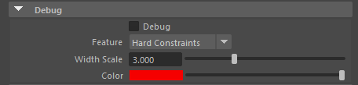

# AdnSkin

AdnSkin is a Maya deformer for fast, robust and easy-to-configure skin simulation for digital assets. Thanks to the combination of internal and external constraints, the deformer can produce dynamics that allow the skin mesh to realistically react to the deformations of internal tissues (e.g. muscles, fascia) over time.

The influence these constraints have on the simulated mesh can be freely modified by painting them via the [AdonisFX Paint Tool](tools.md#adonisfx-paint-tool) or by uniformly regulating their influence via multipliers in the Attribute Editor. Besides the maps and multipliers there are many other parameters to regulate the skin's dynamics and behaviour to a wide array of options.

# How to Use

The AdnSkin deformer is of great simplicity to set up and apply to a mesh within a Maya scene. The way this deformer works is by applying simulation on top of the skin mesh (simulated mesh) which will be directly coupled to its reference mesh (with deformation over time).

## Requirements

To create an AdnSkin deformer within a Maya scene, the following inputs must be provided:

  - **Reference Mesh (R)**: Mesh to drive the simulation skin (e.g. fascia or combined muscles).
  - **Skin Mesh (S)**: Mesh to apply the deformer onto.

  > [!NOTE]
  > All input geometries must have the same number of vertices.

## Create AdnSkin

The process to create an AdnSkin deformer is the following:

1. Select the **Reference Mesh**, then the **Skin Mesh**.
2. Press  in the AdonisFX shelf or *Skin* in the AdonisFX menu, under the *Create* section. If the shelf button is double-clicked or the option box in the menu is selected a window will be displayed where a custom name and initial attribute values can be set.
3. A message box will notify you that AdnSkin has been created properly, meaning that it is ready to simulate with default settings. Check the [attributes section](#attributes) to customize the configuration.

## Paintable Weights

In order to provide more artistic control, some key parameters of the AdnSkin solver are exposed as paintable attributes in the deformer. The [AdonisFX Paint Tool](tools.md#adonisfx-paint-tool) must be used to paint those parameters to ensure that the values satisfy the solver requirements.

- **Tendons**: Floating values to indicate the source of the muscle fibers. The solver will use that information to make an estimation of the fiber direction at each vertex. It is recommended to set a value of 1.0 wherever the tendinous tissue would be in an anatomically realistic muscle and a value of 0.0 in the rest of the mesh.
    - It's initialized to a flooded value of 0.0.
- **Attachment Constraints**: Weight to indicate the influence of each attachment at each vertex of the muscle.
    - It's initialized to a flooded value of 0.0.
- **Fibers**: The deformer estimates the fiber directions at each vertex based on the tendon weights. In case that the estimated fibers do not fit well to the desired directions, the paint tool can be used to comb the fibers manually. The fibers can be displayed using the [Draw Fibers](#debug-features) option in the deformer.
    - It's initialized to a flooded value of (0.0, 0.0, 0.0).
- **Compression Resistance**: Force to correct the edge lengths if the current length is smaller than the rest length. A higher value represents higher correction.
    - It's initialized to a flooded value of 1.0.
- **Stretching Resistance**: Force to correct the edge lengths if the current length is greater than the rest length. A higher value represents higher correction.
    - It's initialized to a flooded value of 1.0.
- **Global Damping**: Set global damping per vertex in the simulated mesh. The greater the value per vertex is the more it will attempt to retain its previous position.
    - It's initialized to a flooded value of 1.0.
- **Slide on Segment Constraints**: Weight to force vertices to displace only in the direction of a user-specified group of segments.
    - It's initialized to a flooded value of 0.0.

<figure>
   
  <figcaption><b>Figure 1</b>: Example of painted weights on the skin of a bear character, labeled as: <b>a)</b> Hard Constraints, <b>b)</b> Slide Constraints, <b>c)</b> Soft Constraints, <b>d)</b> Compression Resistance, <b>e)</b> Stretching Resistance, <b>f)</b> Global Damping Max, <b>g)</b> Sliding Multiplier, <b>h)</b> Mass</figcaption>
</figure>

> [!NOTE]
> *Hard*, *Soft* and *Slide* values are normalized for each vertex. Make sure to paint the values that you want to give priority to at the end in order to avoid the internal normalization override them in further strokes. The basics of the paint tool are explained in [the AdonisFX paint tool section](tools.md#adonisfx-paint-tool).

# Attributes

#### Solver Attributes
| Name | Type | Default | Animatable | Description |
| :--- | :--- | :------ | :--------- | :---------- |
| **Enable**               | Boolean    | True    | ✓ | Flag to enable or disable the deformer computation. |
| **Iterations**           | Integer    | 3       | ✓ | Number of iterations that the solver will execute per simulation step. Greater values mean greater computational cost. Has a range of \[1, 10\]. Upper limit is soft, higher values can be used. |
| **Material**             | Enumerator | Leather | ✓ | Solver stiffness presets per material. The materials are listed from lowest to highest stiffness. There are 7 different presets: Fat: 103, Muscle: 5e3, Rubber: 106, Tendon: 5e7, Leather: 106, Wood: 6e9, Concrete: 2.5e10. |
| **Stiffness Multiplier** | Float      | 1.0     | ✓ | Multiplier factor to scale up or down the material stiffness. Has a range of \[0.0, 2.0\]. Upper limit is soft, higher values can be used. |

#### Time Attributes
| Name | Type | Default | Animatable | Description |
| :--- | :--- | :------ | :--------- | :---------- |
| **Preroll Start Time** | Time | *Current frame* | ✗ | Sets the frame at which the preroll begins. The preroll ends at *Start Time*. |
| **Start Time**         | Time | *Current frame* | ✗ | Determines the frame at which the simulation starts. |
| **Current Time**       | Time | *Current frame* | ✗ | Current playback frame. |

#### Scale Attributes
| Name | Type | Default | Animatable | Description |
| :--- | :--- | :------ | :--------- | :---------- |
| **Time Scale**       | Float      | 1.0             | ✓ | Sets the scaling factor applied to the simulation time step. Has a range of \[0.0, 2.0\]. Upper limit is soft, higher values can be used. |
| **Space Scale**      | Float      | 1.0             | ✓ | Sets the scaling factor applied to the masses and/or the forces. Adonis interprets the scene units in meters. Because of that, to simulate external forces in the right scale, the *Space Scale* may need to be adjusted. For example, to apply *Gravity* with a value of 9.8 m/s^2^, the *Space Scale* should be set to 0.01. Has a range of \[0.0, 2.0\]. Upper limit is soft, higher values can be used. |
| **Space Scale Mode** | Enumerator | Masses + Forces | ✓ | Determines if the spatial scaling affects the masses, the forces, or both. The available options are: <ul><li>Masses: The *Space Scale* only affects masses.</li><li>Forces: The *Space Scale* only affects forces.</li><li>Masses + Forces: The *Space Scale* only affects masses and forces.</li><ul> |

#### Gravity
| Name | Type | Default | Animatable | Description |
| :--- | :--- | :------ | :--------- | :---------- |
| **Gravity**           | Float  | 0.0              | ✓ | Sets the magnitude of the gravity acceleration. Has a range of \[0.0, 100.0\]. Upper limit is soft, higher values can be used. |
| **Gravity Direction** | Float3 | {0.0, -1.0, 0.0} | ✓ | Sets the direction of the gravity acceleration. Vectors introduced do not need to be normalized, but they will get normalized internally. |

### Advanced Settings

#### Stiffness Settings
| Name | Type | Default | Animatable | Description |
| :--- | :--- | :------ | :--------- | :---------- |
| **Use Custom Stiffness** | Boolean | False          | ✓ | Toggles the use of a custom stiffness value. If custom stiffness is used, *Material* and *Stiffness Multiplier* will be disabled and *Stiffness* will be used instead. |
| **Stiffness**            | Float   | 105 | ✓ | Sets the custom stiffness value. Its value must be greater than 0.0. |

#### Dynamic Properties
| Name | Type | Default | Animatable | Description |
| :--- | :--- | :------ | :--------- | :---------- |
| **Global Mass Multiplier**      | Float      | 1.0  | ✓ | Sets the scaling factor applied to the mass of every point. Has a range of \[0.0, 10.0\]. Upper limit is soft, higher values can be used. |
| **Global Damping Multiplier**   | Float      | 0.75 | ✓ | Sets the scaling factor applied to the global damping of every point. Has a range of \[0.0, 1.0\]. Upper limit is soft, higher values can be used. |
| **Inertia Damper**              | Float      | 0.0  | ✓ | Sets the linear damping applied to the dynamics of every point. Has a range of \[0.0, 1.0\]. Upper limit is soft, higher values can be used. |
| **Rest Length Multiplier**      | Float      | 1.0  | ✓ | Sets the scaling factor applied to the edge lengths at rest. Has a range of \[0.0, 2.0\]. Upper limit is soft, higher values can be used. |
| **Max Sliding Distance**        | Float      | 0.5  | ✗ | Determines the size of the sliding area. It corresponds to the maximum distance to the closest point on the reference mesh computed on initialization. The higher this value is, the higher quality and the lower performance. Has a range of \[0.0, 10.0\]. Upper limit is soft, higher values can be used.   
| **Compression Multiplier**      | Float      | 1.0  | ✓ | Sets the scaling factor applied to the compression resistance of every point. Has a range of \[0.0, 2.0\]. Upper limit is soft, higher values can be used. |
| **Stretching Multiplier**       | Float      | 1.0  | ✓ | Sets the scaling factor applied to the stretching resistance of every point. Has a range of \[0.0, 2.0\]. Upper limit is soft, higher values can be used. |
| **Attenuation Velocity Factor** | Float      | 1.0  | ✓ | Sets the weight of the attenuation applied to the velocities of the simulated vertices driven by the *Attenuation Matrix*. Has a range of \[0.0, 1.0\]. Upper limit is soft, higher values can be used. |
| **Sliding Constraints Mode**    | Enumerator | Fast | ✓ | Defines the mode of execution for the sliding constraints.<ul><li>*Quality* is more accurate, recommended for final results.</li><li>*Fast* provides higher performance, recommended for preview.</li></ul> |

### Debug attributes
| Name | Type | Default | Animatable | Description |
| :--- | :--- | :------ | :--------- | :---------- |
| **Debug**       | Boolean      | False            | ✗ | Enable or Disable the debug functionalities in the viewport for the AdnSkin deformer. |
| **Feature**     | Enumerator   | Hard Constraints | ✗ | A list of debuggable features for this deformer.<ul><li>Hard Constraints: Draw *Hard Constraints* connections from the simulated mesh to the reference mesh.</li><li>Soft Constraints: Draw *Soft Constraints* connections from the simulated mesh to the reference mesh.</li><li>Slide Constraints: Draw *Slide Constraints* connections from the simulated mesh to the reference mesh.</li></ul> |
| **Width Scale** | Float        | 3.0              | ✗ | Modifies the width of all lines. |
| **Color**       | Color Picker |                  | ✗ | Selects the line color from a color wheel. Its saturation can be modified using the slider. |

### Connectable attributes
| Name | Type | Default | Animatable | Description |
| :--- | :--- | :------ | :--------- | :---------- |
| **Attenuation Matrix** | Matrix | Identity | ✗ | Transformation matrix to drive the attenuation. |
| **Reference Matrix**   | Mesh   |          | ✗ | Mesh taken as reference to evaluate external constraints. | 

## Attribute Editor Template

<figure markdown>
   
  <figcaption><b>Figure 2</b>: AdnSkin Attribute Editor.</figcaption>
</figure>

<figure markdown>
  
  <figcaption><b>Figure 3</b>: AdnSkin Attribute Editor (Advanced Settings).</figcaption>
</figure>

<figure markdown>
  
  <figcaption><b>Figure 4</b>: AdnSkin Attribute Editor (Debug menu)</figcaption>
</figure>

## Debugger

In order to better visualize deformer constraints and attributes in the Maya viewport there is the option to enable the debugger, found in the dropdown menu labeled *Debug* in the Attribute Editor.

To enable the debugger the *Debug* checkbox must be marked. To select the specific feature you would like to visualize, choose it from the list provided in *Features*. 

### Debug features

The features that can be visualized with the debugger in the AdnSkin deformer are:

 - **Hard Constraints**: For each vertex, a line will be drawn from the simulated mesh to its corresponding reference point on those vertices where its *Hard Constraints* weight is greater than 0.0.
 - **Soft Constraints**: For each vertex, a line will be drawn from the simulated mesh to its corresponding reference point on those vertices where its *Soft Constraints* weight is greater than 0.0.
 - **Slide Constraints**: For each vertex, a line will be drawn from the simulated mesh to its corresponding reference point on those vertices where its *Slide Constraints* weight is greater than 0.0.

Enabling the debugger and selecting one of these constraints will draw lines from the influenced vertices in the simulated mesh to their corresponding reference vertices. 

<figure markdown>
  
  <figcaption><b>Figure 5</b>: Debugger enabled displaying <i>Hard Constraints</i>, <i>Slide Constraints</i> and <i>Soft Constraints</i> with different configurations. </figcaption>
</figure>
