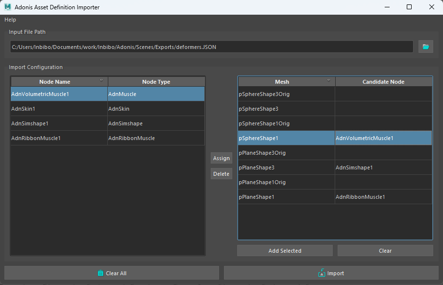
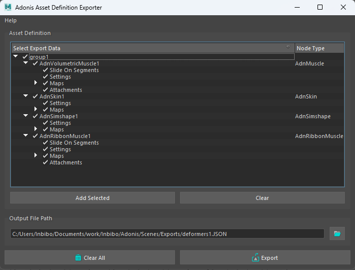
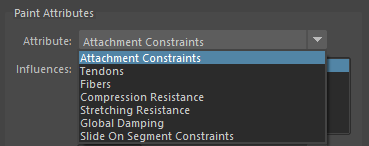
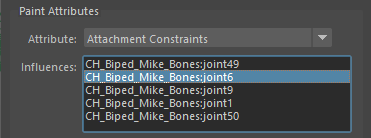
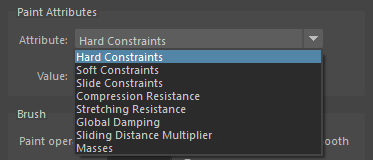

# Tools

AdonisFX includes several tools to allow for a better experience when setting up deformers. In this page these tools will get detailed, with the specifications on how they work on each deformer and how to properly set the mup and use them.

## AdonisFX Import Tool

The **AdonisFX Import Tool** allows the user to import the configuration for a specific defomrer from a previously exported AAD (Adonis Attribute Definition) file.

<figure>
  
  <figcaption>Figure 1: AdonisFX Import Tool</figcaption>
</figure>

To open the tool ress the  shelf button or go to *AdonisFX menu > Import*.

Once the tool is open, to import deformer configuration we must first locate the AAD file. To do so, go to *Input File Path* and select and AAD file from a directory.

We may distinguish two main sections in the tool, marked clearly with two lists. The one in the left will display the deformer nodes found in the AAD file, while the one in the right will list the nodes found in the current scene selection. This selection can be redone and expanded by selecting elements from the scene and pressing the *Add Selected* button. 

To assign a deformer from the AAD file to a mesh, we must select a node from the list on the left and a mesh from the list in the right. Then we must press the *Assign* button, after which the *Candidate Node* setion of the list on the right will get updated with the name of the node we selected.

After everything is properly set up, we must press the *Import* button to apply the changes. We will now see the selected elements from the scene have the imported deformer node attached.

<figure>
  
  <figcaption>Figure 1: AdonisFX Import Tool</figcaption>
</figure>

> [!NOTE]
> - When using this tool it has to be taken into consideration that the mesh from which the AAD file was exported **must have the same number of vertices** as the one to which the configuration is getting exported.

## AdonisFX Export Tool

The **AdonisFX Import Tool** allows the user to save in an external file the configuration for a specific defomrer into an AAD (Adonis Attribute Definition) file.

<figure>
  
  <figcaption>Figure 1: AdonisFX Export Tool</figcaption>
</figure>

To open the tool ress the  shelf button or go to *AdonisFX menu > Import*.

Once the tool is open, to export AAD file we must select the deformer (or the group in which it is contained), and press the *Add Selected* button. After doing this, the list in the tool will get filled with all the information related to the Adonis deformers, specifying the deformer type and the possible elements to export. Here we are able to select exactly what elements of the deformer we wish to export.

Once that is set we must select the *Output File Path*, to which the AAD file will get exported.

Once everything is properly set up, pressing the *Export* button will generate the file in the designated location.

<figure>
  
  <figcaption>Figure 1: AdonisFX Export Tool</figcaption>
</figure>

> [!NOTE]
> - When using this tool to export more than one Adonis deformer, all meshes with deformers must be contained within the same group in the scene.

## AdonisFX Paint Tool

To configure the paintable attributes in Adonis deformers, the AdonisFX paint tool must be used. Apart from the standard functionalities that the Maya default paint context provides, this tool also processes the painted weights to guarantee that the requirements of the specific solver of the selected deformer are satisfied.

<figure>
   
  <figcaption>Figure 1: AdonisFX Paint Tool</figcaption>
</figure>

Do the following to open the tool:

  1. Select the mesh with the Adonis deformer applied to.
  2. Press the paint tool  shelf button or go to AdonisFX menu > Paint Tool.

The selected attribute in the enumerator exposed at the top of the UI is the active attribute in the paint context. Now you can use the tool as it was the Artisan's tool from Maya, the behaviour of the different widgets/fields is the same.

### AdonisFX Paint Tool on AdnMuscle deformers (volumetric and ribbon)

In the specific case of adnMuscle deformers, the AdonisFX Paint Tool will display the following attributes:

<figure markdown> 
   
  <figcaption> Figure 3: AdonisFX paint tool displaying the paintable attributes of the deformer. </figcaption> 
</figure>

Following, we present the key aspects to keep in mind while painting each muscle attribute:

  - **Attachment Constraints**
    1. If this attribute type is selected, then a list widget is shown with the names of the attachments connected to the Ribbon Muscle deformer.
    2. Select the desired attachment you want to paint from the list widget and paint the weight values.
    3. When selecting an attachment in the list, it will also get selected in the scene, facilitating its identification.
    4. If more than one attachment was added to the system, then the paint tool will normalise the weights automatically after a stroke has been completed, meaning that the addition of all attachment constraint weights in a vertex will always add up to a maximum value of 1.0.
    5. If any attachment is removed or added to the system, then the paint tool will refresh the list on mouse hover over the UI.

    <figure>
       
      <figcaption>Figure 2: AdonisFX Paint Tool</figcaption>
    </figure>

  - **Tendons**
    1. We recommend to paint values of 1.0 wherever the tendon tissue is and values of 0.0 in the rest of the mesh.
    2. This painting will internally trigger an automatic estimation of fibers directions.
  - **Fibers**
    1. When selecting the fibers attribute, the fibers debugger will automatically get enabeled, displaying the [muscle fibers](muscle.md#debug).
    2. The initial direction displayed will be the one set by tendon weights.
    3. To modify the fibers direction, comb the fibers towards the desired direction.
    4. For better precission adjust the set direction using the *Smooth* brush.
    5. To get all fibers better aligned in a more homogeneous way, press the flood button while having the *Smooth* brush selected.
  - **Stretching and Compression Resistance**
    1. Stretching resistance is set to 1.0 by default. With this value, the solver will apply the corrections to the edges needed to keep the lengths at rest. Set values lower than 1.0 to linearly reduce the amount of correction applied by the solver when the edges get stretched.
    2. Compression resistance is set to 1.0 by default. With this value, the solver will apply the corrections to the edges needed to keep the lengths at rest. Set values lower than 1.0 to linearly reduce the amount of correction applied by the solver when the edges get compressed.
  - **Slide on Segment Constraints**
    1. Slide on Segment Constraints operate similarly to attachment constraints, as they are both multi-influence attributes.
    2. The entries in the list widget correspond in this case to the segments added to the constraint, with the name of the segment being "*root_transform* - *tip_transform*".
    2. Select the desired segment you want to paint from the list widget and paint the weight values.
    4. When selecting a segment in the list the two scene objects that form the root and tip of the segment will get selected as well, facilitating its identification.
    5. If more than one segment was added to the system, then the paint tool will normalise the weights automatically after a stroke has been completed, meaning that the addition of all slide on segment constraint weights in a vertex will always add up to a maximum value of 1.0.

### AdonisFX Paint Tool on AdnSkin deformers

In the specific case of adnSkin deformers, the AdonisFX Paint Tool will display the following attributes:

<figure markdown> 
   
  <figcaption> Figure 4: Paintable attributes listed in the UI for adnSkin deformers. </figcaption>
</figure>

Following, we present the key aspects to keep in mind while painting each muscle attribute:

  - **Hard Constraints**
    1. Hard constraints are set to 1.0 by default. With this value the solver will apply the corrections to the vertices needed to keep them at a constant transformation, local to the closest point on the reference mesh at initialization.
    2. This value is normalised alongside Soft Constraints and Slide Constraints.
  - **Soft Constraints**
    1. Soft constraints are set to 0.0 by default. With this value the solver will apply no corrections to the vertices regarding the vertices keeping a constant distanche to the closest point of the reference mesh.
    2. This value is normalised alongside Hard Constraints and Slide Constraints.
  - **Slide Constraints**
    1. Slide constraints are set to 0.0 by default. With this value the solver will apply no corrections to the vertices regarding the sliding of the simulated mesh along the reference surface.
    2. This value is normalised alongside Hard Constraints and Soft Constraints.
  - **Stretching and Compression Resistance**
    1. Stretching resistance is set to 1.0 by default. With this value, the solver will apply the corrections to the edges needed to keep the lengths at rest. Set values lower than 1.0 to linearly reduce the amount of correction applied by the solver when the edges get stretched.
    2. Compression resistance is set to 1.0 by default. With this value, the solver will apply the corrections to the edges needed to keep the lengths at rest. Set values lower than 1.0 to linearly reduce the amount of correction applied by the solver when the edges get compressed.
  - **Sliding distance Multiplier**
    1. Sliding distance Multiplier is set to 1.0 by default. With this value, every vertex of the geometry will be able to slide along every vertex of the reference surface.
    2. It is suggested to lower the value in those areas where slide constraints are less relevant or not present for better performance without losing quality.
  - **Masses**
    1. Masses are set to 1.0 by default. This will mean that by default the solver will consider that the skin has a uniform mass.

## AdonisFX Sensors Connection Editor

To ease with the connection of sensors to deformers AdonisFX has the **AdonisFX Sensors Connection Editor**, a simple to use, yet robust tool that simplifies greatly this process.

To use this tool go to the AdonisFX menu > Sensors (under the *Edit* section) > Connection Editor.

<figure markdown> 
   
  <figcaption> Figure 3: Sensor connection editor after opening it for the first time. </figcaption>
</figure>

We can distinguish two main sections in this tool, labeled *source* and *destination*. In the source section the [sensors](sensors.md), alongside their signal attributes, will get displayed and in the destination section the **deformers**, alongside their possible input attributes, will get displayed.

To retrieve these objects and display them in the tool, select the desired element from the scene (an Adonis locator containing a sensor or a deformer) and press their respective **Reload Left** or **Reload Right** button.

For source elements (sensors) press the **Reload Left** button and for destination elements (deformers) press the **Reload Right** button.

<figure markdown> 
   
  <figcaption> Figure 4: Sensor connection editor after adding sensors and deformers from the selection. </figcaption>
</figure>

To make the connections just select the two specific attributes you want to connect (one from *source* and one from *destination*) and press the **Make Connection** button. A message will then get displayed announcing that the connection has been propperly made.

If you wish to clear the selection to reset the tool to its initial state, press the **Clear All** button.