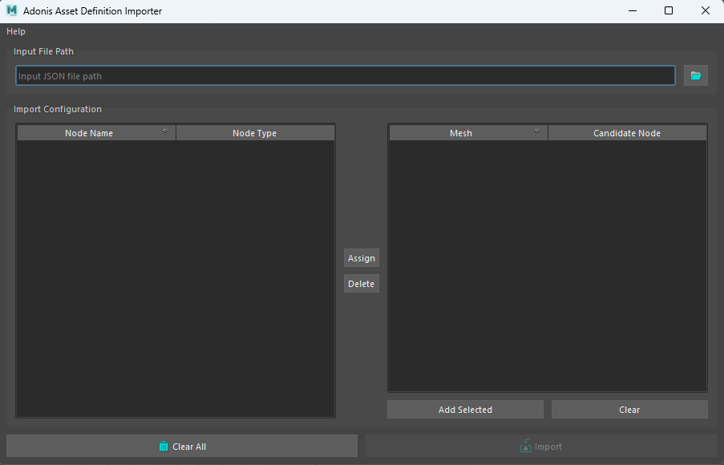

# Tools

AdonisFX includes several tools that allow for a smoother experience when interacting or configuring nodes and deformers. This page is intended to provide detailed explanation of the use, setup and application of each tool.

## AdonisFX Import Tool

The **AdonisFX Import Tool** allows the user to import the configuration for a specific deformer from a previously exported AAD (Adonis Asset Definition) file. It allows the user to easily configure a deformer from an already known setup which includes data like weight maps, connections and attribute values.

<figure>
  
  <figcaption><b>Figure 1</b>: AdonisFX Import Tool UI</figcaption>
</figure>

### How To Use

To open the importer tool press the  shelf button or go to AdonisFX Menu > *Import*.

To import and apply an ADD file to an entity in the current open scene with the deformer information follow these steps:

1. Locate the ADD file by going to *Input File Path's* folder button and select an AAD file from a directory.
2. Locate the available deformer names that were fetched from the AAD file on the left section of the tool ("Node" | "Node Type").
3. Locate the available nodes found in the current scene selection to which the AAD file configuration can be applied to ("Mesh" | "Candidate Node"). The selection can be redone and expanded by selecting elements from the scene and pressing the *Add Selected* button or can be cleared using the *Clear* button.
4. Select the deformer from which the AAD file data will be fetched in the left hand panel.
5. Select the node to which to apply the selected deformer configuration in the right hand panel.
6. Press the *Assign* button to temporarily assign the configuration to the target node. Or clear the assignment using *Delete*.
7. The assignments can then be imported using the *Import* button or everything can be cleared using the *Clear All* button.

After following the previous steps the tool will inform about the status of the import: it failed, only partial data could be imported or all data could be imported.

<figure>
  
  <figcaption><b>Figure 2</b>: AdonisFX Import Tool Active State</figcaption>
</figure>

> [!NOTE]
> - When using this tool it has to be taken into consideration that the mesh from which the AAD file was exported **must have the same number of vertices** as the one to which the configuration is getting imported.

## AdonisFX Export Tool

The **AdonisFX Export Tool** allows the user to export the configuration for a specific deformer into an AAD (Adonis Asset Definition) file. It allows the user to easily save a deformer configuration 
from an already existing setup containing data like weight maps, connections and attribute values.

<figure>
  
  <figcaption><b>Figure 3</b>: AdonisFX Export Tool Default State</figcaption>
</figure>

### How To Use

To open the tool press the  shelf button or go to AdonisFX Menu > *Export*.

To export and apply an ADD file for the current entity in the current open scene with the deformer information follow these steps:

1. If the tool had been opened on an already active selection containing an Adonis deformer the node will appear in the *Select Export Data* list. To add and remove a new selection press *Add Selection* or *Clear*.
2. Select, using the checkboxes, the deformers and the individual settings to export to the AAD file. For example selecting *Maps* and *Attachments* would export the painted attribute maps and the matrices for the attachments relative to an AdnMuscle or AdnRibbonMuscle deformer.
3. Define a name for the ADD file by going to *Output File Path* and selecting the folder icon.
4. Finally, pressing the *Export* button will generate the file in the designated location.

The AAD file that has been exported can then be imported in a scene with similar characteristics.

<figure>
  
  <figcaption><b>Figure 4</b>: AdonisFX Export Tool Active State</figcaption>
</figure>

> [!NOTE]
> - When using this tool to export more than one Adonis deformer, all meshes with deformers must be contained within the same group in the scene.

## AdonisFX Paint Tool

Some Adonis deformers require the use of a custom paint tool (external but similar to Maya's paint tool) for their correct setup. Examples of paintable deformers that require the paint tool are the AdnSkin, AdnMuscle or the AdnRibbonMuscle deformers. Requiring the use of a custom paint tool ensures for a correct setup by applying operations like normalizing painted weights and allowing the user to paint multi-influences for a single vertex. The tool can also be used to visualize relevant information about attachments, segments or even giving the ability to the user to comb vectors (fibers). The custom paint tool's functionalities are very similar to Maya's paint tool functionalities.

<figure>
   
  <figcaption><b>Figure 5</b>: AdonisFX Paint Tool</figcaption>
</figure>

### How To Use

To open the tool:

  1. Select the mesh with the Adonis deformer applied to.
  2. Press the paint tool  shelf button or go to AdonisFX Menu > *Paint Tool*.

The selected attribute in the enumerator exposed at the top of the UI is the active attribute in the paint context. Depending on the deformer and the attribute the UI can adjust to support multi-influence attributes by exposing the influences or restricting certain functionalities of the tool.

#### AdonisFX Paint Tool on AdnMuscle deformers (muscle and ribbon)

In the specific case of AdnMuscle deformers, the AdonisFX Paint Tool will display the following attributes:

<!-- Note for later to update this information once the Global Damping attribute is added-->
<figure markdown>
   
  <figcaption><b>Figure 6</b>: AdonisFX paint tool displaying the paintable attributes of the deformer. </figcaption>
</figure>

  - **Attachment Constraints**
    1. If this attribute type is selected, then a list widget is shown with the names of the attachments connected to the Muscle deformer.
    2. Select the desired attachment to paint from the list widget and paint the weight values.
    3. When selecting an attachment in the list, it will also get selected in the scene, facilitating its identification.
    4. If more than one attachment was added to the system, then the paint tool will normalize the weights automatically after a stroke has been completed, meaning that the addition of all attachment constraint weights in a vertex will always add up to a maximum value of 1.0.
    5. If any attachment is removed or added to the system, then the paint tool will refresh the list on mouse hover over the UI.

    <figure>
       
      <figcaption><b>Figure 7</b>: AdonisFX Paint Tool</figcaption>
    </figure>

  - **Tendons**
    1. It is recommended to paint values of 1.0 wherever the tendon tissue is and values of 0.0 in the rest of the mesh.
    2. This painting will internally trigger an automatic estimation of fibers direction which can be displayed using the debug functionalities of the Muscle deformer.
  - **Fibers**
    1. When selecting the fibers attribute, the fibers debugger will automatically get enabled, displaying the [muscle fibers](muscle.md#debug).
    2. The initial direction displayed will be the one estimated by tendon weights.
    3. To modify the fibers direction, comb the fibers towards the desired direction.
    4. For better precision adjust the set direction using the *Smooth* brush.
    5. To get all fibers more tightly aligned in a homogeneous way, press the flood button while having the *Smooth* brush selected.
  - **Stretching and Compression Resistance**
    1. Stretching resistance is set to 1.0 by default. With this value, the solver will apply the corrections to the edges needed to keep the lengths at rest. Set values lower than 1.0 to linearly reduce the amount of correction applied by the solver when the edges get stretched.
    2. Compression resistance is set to 1.0 by default. With this value, the solver will apply the corrections to the edges needed to keep the lengths at rest. Set values lower than 1.0 to linearly reduce the amount of correction applied by the solver when the edges get compressed.
<!-- Note for later to update this information once the Global Damping attribute is added-->
  - **Slide on Segment Constraints**
    1. Slide on Segment Constraints operate similarly to attachment constraints, as they are both multi-influence attributes.
    2. The entries in the list widget correspond in this case to the segments added to the constraint, with the name of the segment being "*root_transform* - *tip_transform*".
    2. Select the desired segment to paint from the list widget and paint the weight values.
    4. When selecting a segment in the list the two scene objects that form the root and tip of the segment will get selected as well, facilitating its identification.
    5. If more than one segment was added to the system, then the paint tool will normalize the weights automatically after a stroke has been completed, meaning that the addition of all slide on segment constraint weights in a vertex will always add up to a maximum value of 1.0.

To find a more precise example for setting up this deformer refer to the documentation page [muscle](muscle.md).

#### AdonisFX Paint Tool on AdnSkin deformers

In the specific case of an AdnSkin deformer, the AdonisFX Paint Tool will display the following attributes:

<figure markdown> 
   
  <figcaption><b>Figure 8</b>: Paintable attributes listed in the UI for an AdnSkin deformer. </figcaption>
</figure>

  - **Hard Constraints**
    1. Hard constraints are set to 1.0 by default. With this value the solver will apply the corrections to the vertices needed to keep them at a constant transformation, local to the closest point on the reference mesh at initialization.
    2. This value is normalized alongside Soft Constraints and Slide Constraints.
  - **Soft Constraints**
    1. Soft constraints are set to 0.0 by default. With this value the solver will apply no corrections to the vertices regarding the vertices keeping a constant distance to the closest point of the reference mesh.
    2. This value is normalized alongside Hard Constraints and Slide Constraints.
  - **Slide Constraints**
    1. Slide constraints are set to 0.0 by default. With this value the solver will apply no corrections to the vertices regarding the sliding of the simulated mesh along the reference surface.
    2. This value is normalized alongside Hard Constraints and Soft Constraints.
  - **Stretching and Compression Resistance**
    1. Stretching resistance is set to 1.0 by default. With this value, the solver will apply the corrections to the edges needed to keep the lengths at rest. Set values lower than 1.0 to linearly reduce the amount of correction applied by the solver when the edges get stretched.
    2. Compression resistance is set to 1.0 by default. With this value, the solver will apply the corrections to the edges needed to keep the lengths at rest. Set values lower than 1.0 to linearly reduce the amount of correction applied by the solver when the edges get compressed.
  - **Sliding Distance Multiplier**
    1. Sliding distance Multiplier is set to 1.0 by default. With this value, every vertex of the geometry will be able to slide along every vertex of the reference surface.
    2. It is suggested to lower the value in those areas where slide constraints are less relevant or not present for better performance without losing quality.
  - **Masses**
    1. Masses are set to 1.0 by default. This will mean that by default the solver will consider that the skin has a uniform mass.

To find a more precise example for setting up this deformer refer to the documentation page [skin](skin.md).

## AdonisFX Sensors Connection Editor

To ease with the connection of sensors to deformers AdonisFX provides the **AdonisFX Sensors Connection Editor** in charge of facilitating the connection of sensors to the active deformers in the scene.

### How To Use

To use this tool go to the AdonisFX Menu > Sensors (under the Edit section) > *Connection Editor*.

<figure markdown> 
   
  <figcaption><b>Figure 9</b>: Sensor connection editor after opening it for the first time. </figcaption>
</figure>

Two main sections can be distinguished in this tool, labeled *source* and *destination*. In the source section the [sensors](sensors.md), alongside their signal attributes, will get displayed and in the destination section the **deformers**, alongside their possible input attributes, will get displayed.

To retrieve these objects and display them in the tool, select the desired element from the scene (an Adonis locator containing a sensor or a deformer) and press their respective *Reload Left* or *Reload Right* button.

For Source elements (sensors) press the *Reload Left* button and for Destination elements (deformers) press the *Reload Right* button.

<figure markdown> 
   
  <figcaption><b>Figure 10</b>: Sensor connection editor after adding sensors and deformers from the selection. </figcaption>
</figure>

To make the connections select the two specific attribute to connect (one from *source* and one from *destination*) and press the *Make Connection* button. A message will then get displayed informing that the connection has been properly made (if nothing failed).

To clear the selection and reset the tool to its initial state, press the *Clear All* button.