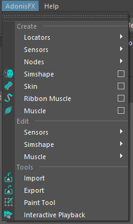
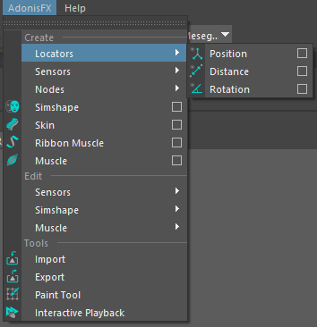
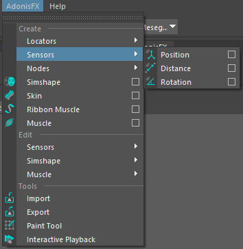
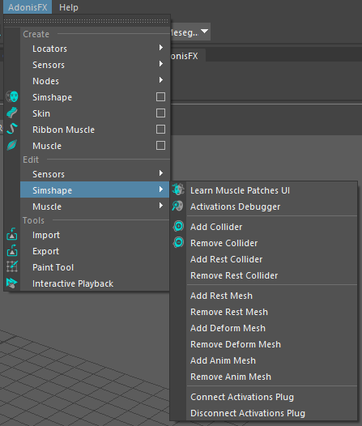

# UI Overview

The Adonis UI for maya can be separated into two main elements: the **AdonisFX Shelf** and the **AdonisFX Menu**. Many of the uses Here we will go into detail in both of them to explain what every element of the UI does.

## AdonisFX Shelf

The AdonisFX shelf can be found in the Maya shelf tab under the label "*AdonisFX*". It allows for quick access to the main Adonis functionalities 

<figure markdown>
  {width=100%}
  <figcaption>Figure 1: AdonisFX shelf tab menu.</figcaption>
</figure>

### Locators

### Sensors

### Simshape

### Skin + Muscles

### Tools

## AdonisFX Maya Menu

<figure markdown>
  {width=30%}
  <figcaption>Figure 1: AdonisFX menu.</figcaption>
</figure>

### *Create* Group

#### Locators + Sensors

<figure markdown>
  {width=30%}
  <figcaption>Figure 1: AdonisFX menu.</figcaption>
</figure>

<figure markdown>
  {width=30%}
  <figcaption>Figure 1: AdonisFX menu.</figcaption>
</figure>

#### Deformers

### Edit group

#### Sensors

<figure markdown>
  {width=30%}
  <figcaption>Figure 1: AdonisFX menu.</figcaption>
</figure>

#### Simshape

<figure markdown>
  {width=30%}
  <figcaption>Figure 1: AdonisFX menu.</figcaption>
</figure>

#### Muscle

<figure markdown>
  {width=30%}
  <figcaption>Figure 1: AdonisFX menu.</figcaption>
</figure>

### Tools group