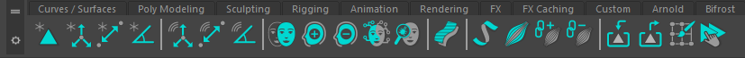
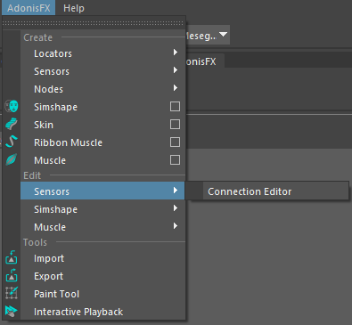
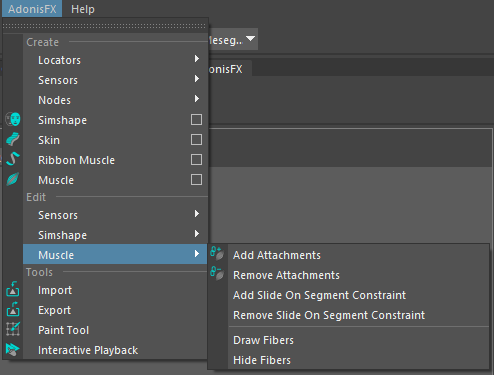

# UI Overview

The Adonis UI for Maya can be separated into two main elements: the **AdonisFX Shelf** and the **AdonisFX Menu**. The many uses the UI elements have will be explained in this page.

## AdonisFX Shelf

The AdonisFX shelf can be found in the Maya shelf tab under the label *AdonisFX*. It allows for quick access to the main Adonis functionalities.

<figure style="width: 100%;" markdown>
  
  <figcaption><b>Figure 1</b>: AdonisFX shelf tab menu.</figcaption>
</figure>

| Icon | Description | Menu Shortcut |
| :--- | :---------- | :------------ |
|  | Create an [AdnLocator](locators#adonisfx-logo-locator) at the origin. This object is a standard Maya locator with a custom shape for better visualization in the viewport. | |
|  | Creates an [AdnLocatorPosition](locators#adnlocatorposition) based on the transform object selected. The locator shape represents the position change of the element provided. Using the double click command will open a window to provide a custom name for the node. | AdonisFX Menu > Create Locators > *Position* |
|  | Creates an [AdnLocatorDistance](locators#adnlocatordistance) based on the two transform objects selected. The locator shape represents the distance between the two elements provided. Using the double click command will open a window to provide a custom name for the node. | AdonisFX Menu > Create Locators > *Distance* |
|  | Creates an [AdnLocatorRotation](locators#adnlocatorrotation) based on the three transform objects selected. The locator shape represents the angle between the three elements provided, being the second element selected where the angle is at. Using the double click command will open a window to provide a custom name for the node. | AdonisFX Menu > Create Locators > *Rotation* |
|||
|  | Creates an [AdnSensorPosition](sensors#adnsensorposition) based on the transform object and position locator selected (only providing the transform object will generate the locator and the sensor). The sensor will evaluate the position change outputting the result in its plugs. The locator will now update visually depending on the levels of the sensor plugs. Using the double click command will open a window to provide a custom name for the node. | AdonisFX Menu > Create Sensors > *Position* |
|  | Create an [AdnSensorDistance](sensors#adnsensordistance) based on the two transform objects and distance locator selected (only providing the transform objects will generate the locator and the sensor). The sensor will evaluate the distance change, respectively with the initial distance when the sensor was created, outputting the result in its plugs. The locator will now update visually depending on the levels of the sensor plugs. Using the double click command will open a window to provide a custom name for the node. | AdonisFX Menu > Create Sensors > *Distance* |
|  | Create an [AdnSensorRotation](sensors#adnsensorrotation) based on the three transform objects and angle locator selected (only providing the transform objects will generate the locator and the sensor). The sensor will evaluate the angle change outputting the result in its plugs. The locator will now update visually depending on the levels of the sensor plugs. Using the double click command will open a window to provide a custom name for the node. | AdonisFX Menu > Create Sensors > *Rotation* |
|||
|  | Create [AdnSimshape](simshape#create-simshape), applies an AdnSimshape deformer to the mesh selected. For more information about the possible selections see [Create AdnSimshape](simshape#create-simshape). Using the double click command will open a window to provide a custom name for the node and the possibility to customize the generic solver parameters. | AdonisFX Menu > *Create Simshape* |
|  | [Add Collider to AdnSimshape](simshape#add-collider), Assigns a collider to the AdnSimshape deformer. Selecting first, in order, collider and mesh with AdnSimshape applied. | AdonisFX Menu > Edit Simshape > *Add Collider* |
|  | [Remove Collider from AdnSimshape](simshape#remove-collider), removes the collider from the AdnSimshape deformer. Selecting first, in order, collider assigned and mesh with AdnSimshape applied. | AdonisFX Menu > Edit Simshape > *Remove Collider* |
|  | Launches the [AdnSimshape Muscle Patches Learning](simshape#generate-muscle-patches) tool used to generate the *Adonis Muscle Patches* file (.amp) file. | AdonisFX Menu > Edit Simshape > *Learn Muscle Patches UI* |
|  | Toggles the [Simshape Activations Debug Mode](simshape#debug-activations). Current frame must match the specified initialization frame at the AdnSimshape deformer to toggle. | AdonisFX Menu > Edit Simshape > *Activations Debugger* |
|||
|  | Create [AdnSkin](skin#create-adnskin), applies an AdnSkin deformer to the selection. First select, in order, reference mesh and skin mesh to apply the deformer. Using the double click command will open a window to provide a custom name for the node and the possibility to customize the generic solver parameters. | AdonisFX Menu > *Create Skin* |
|  | Create [AdnRibbonMuscle](ribbon#create-ribbon-muscle), applies an AdnRibbonMuscle deformer to the selection. The deformer will be applied to the last element in the selection, everything else will be consider an attachment (optional on creation). Using the double click command will open a window to provide a custom name for the node and the possibility to customize the generic solver parameters. | AdonisFX Menu > *Create Ribbon Muscle* |
|  | Create [AdnMuscle](muscle#create-muscle), applies a AdnMuscle deformer to the selection. The deformer will be applied to the last element in the selection, everything else will be consider an attachment (optional on creation). Using the double click command will open a window to provide a custom name for the node and the possibility to customize the generic solver parameters. | AdonisFX Menu > *Create Muscle* |
|  | Assigns attachment objects to the deformer selected (utility usable with [AdnRibbonMuscle](ribbon#attachments) and [Muscle](muscle#attachments) deformers). The mesh with the deformer applied must be the last element in the selection. Utility usable with [AdnRibbonMuscle](ribbon#attachments) and [Muscle](muscle#attachments) deformers. | AdonisFX Menu > Edit Muscle > *Add Attachments* |
|  | Removes attachment objects assigned to the deformer selected (utility usable with [AdnRibbonMuscle](ribbon#attachments) and [AdnMuscle](muscle#attachments) deformers). The mesh with the deformer applied must be the last element in the selection. | AdonisFX Menu > Edit Muscle > *Remove Attachments* |
|||
|  | Launch the Adonis Asset Definition [Importer](tools#adonisfx-import-tool) to load and create the Adonis nodes from file (.JSON). | AdonisFX Menu > Tools *Importer* |
|  | Launch the Adonis Asset Definition [Exporter](tools#adonisfx-export-tool) to save Adonis nodes information into an importable file (.JSON). | AdonisFX Menu > Tools *Exporter* |
|  | Opens the [Paint Tool UI](tools#adonisfx-paint-tool) ready to paint the selected object. | AdonisFX Menu > *Tools* Paint Tool |
|  | Enables Maya Interactive Playback. In this playback mode, dynamic interaction with objects while seeing the simulation updates can be toggled. | AdonisFX Menu > Tools *Interactive Playback* |

## AdonisFX Maya Menu

The AdonisFX Maya Menu provides apart from all the options available in the shelf, advanced utilities and customization of the nodes. These new utilities, that are not present in the shelf, will be described and referenced in this section.

<figure style="width: 30%;" markdown>
  
  <figcaption><b>Figure 2</b>: AdonisFX Menu.</figcaption>
</figure>

### Create Group

#### Locators + Sensors

Option boxes are available at the AdonisFX Menu for [Locators](locators.md) and [Sensors](sensors.md) creation. Opening a small auxiliar window with the possibility to provide a custom name for the node.

<figure style="width: 50%;" markdown>
  
  <figcaption><b>Figure 3</b>: Locators/Sensors creator UI.</figcaption>
</figure>

<figure style="width: 50%;" markdown>
  
  <figcaption><b>Figure 4</b>: AdonisFX Menu Create Locators section.</figcaption>
</figure>

<figure style="width: 50%;" markdown>
  
  <figcaption><b>Figure 5</b>: AdonisFX Menu Create Sensors section.</figcaption>
</figure>

#### Deformers

Option boxes can be used for deformer creation. Opening an auxiliar window with the possibility to, other than providing a custom name for the deformer, provide customized generic solver parameters.

<figure style="width: 50%;" markdown>
  
  <figcaption><b>Figure 6</b>: Deformer Creator UI creating an AdnSkin deformer.</figcaption>
</figure>

### Edit group

#### Sensors

- **Connection Editor**. Launches the [Connection Editor](tools#adonisfx-sensors-connection-editor) UI. This tool will assist with the connectivity of the locators and sensors output plugs with the AdonisFX deformer nodes.

<figure style="width: 50%;" markdown>
  
  <figcaption><b>Figure 7</b>: AdonisFX Menu Edit Sensors section.</figcaption>
</figure>

#### Simshape

- **Learn Muscle Patches UI**. Launches the [AdnSimshape Muscle Patches Learning](simshape#generate-muscle-patches) tool used to generate the *Adonis Muscle Patches* (.amp) file.
- **Activations Debugger**. Toggles the [Simshape Activations Debug Mode](simshape#debug-activations). Current frame must match the specified initialization frame at the AdnSimshape deformer to toggle.
- **Add Collider**. Assigns a [Collider](simshape#add-collider) to the deformer selected. The selection must consist of: first the mesh to assign as a Collider and lastly the mesh with the deformer applied.
- **Remove Collider**. Removes a [Collider](simshape#remove-collider) from the deformer selected. The selection must consist of: first the Collider mesh to remove and lastly the mesh with the deformer applied.
- **Add Rest Collider**. Assigns a [Rest Collider](simshape#add-rest-collider) to the deformer selected. The selection must consist of: first the mesh to assign as a Rest Collider and lastly the mesh with the deformer applied.
- **Remove Rest Collider**. Removes a [Rest Collider](simshape#remove-rest-collider) from the deformer selected. The selection must consist of: first the Rest Collider mesh to remove and lastly the mesh with the deformer applied.
- **Add Rest Mesh**. Assigns a [Rest Mesh](simshape#requirements) to the deformer selected. The selection must consist of: first the Rest Mesh that to assign and lastly the mesh with the deformer applied.
- **Remove Rest Mesh**. Removes a [Rest Mesh](simshape#requirements) from the deformer selected. The selection must consist of: first the Rest Mesh that to remove and lastly the mesh with the deformer applied.
- **Add Deform Mesh**. Assigns a [Deform Mesh](simshape#requirements) to the deformer selected. The selection must consist of: first the Deform Mesh that to assign and lastly the mesh with the deformer applied.
- **Remove Deform Mesh**. Removes a [Deform Mesh](simshape#requirements) from the deformer selected. The selection must consist of: first the Deform Mesh that to remove and lastly the mesh with the deformer applied.
- **Add Anim Mesh**. Assigns an [Anim Mesh](simshape#requirements) to the deformer selected. The selection must consist of: first the Anim Mesh to assign and lastly the mesh with the deformer applied.
- **Remove Anim Mesh**. Removes an [Anim Mesh](simshape#requirements) from the deformer selected. The selection must consist of: first the Anim Mesh to remove and lastly the mesh with the deformer applied.
- **Connect Activations Plug**. Connects the output compression map from an [Edge Evaluator](edge_evaluator#simshape-activation-using-edge-evaluator-node) node to the activations plug of the AdnSimshape deformer selected. The selection must consist of: first the Edge Evaluator node and lastly the AdnSimshape deformer node.
- **Disconnect Activations Plug**. Disconnects the output compression map from an [Edge Evaluator](edge_evaluator#simshape-activation-using-edge-evaluator-node) node from the activations plug of the AdnSimshape deformer selected. The selection must consist of: first the Edge Evaluator node and lastly the AdmSimshape deformer node.

<figure style="width: 50%;" markdown>
  
  <figcaption><b>Figure 8</b>: AdonisFX Menu Edit AdnSimshape section.</figcaption>
</figure>

#### Muscle

- **Add [Slide On Segment](muscle#slide-on-segment-constraint) Constraint**. Adds segments based on the two (or more) transform objects and the mesh with the deformer node applied selected.
- **Remove [Slide On Segment](muscle#slide-on-segment-constraint) Constraint**. Removes anchors from segments based on the transform objects and the mesh with the deformer node applied selected.
- **Draw Fibers**. Enables *Muscle Fibers* Debugging from all the [AdnRibbonMuscle](ribbon#debug-features) an [AdnMuscle](muscle#debug-features) found in the scene.
- **Hide Fibers**. Disables *Muscle Fibers* Debugging from all the [AdnRibbonMuscle](ribbon#debug-features) an [AdnMuscle](muscle#debug-features) found in the scene that were debugging *Muscle Fibers*.

<figure style="width: 50%;" markdown>
  
  <figcaption><b>Figure 9</b>: AdonisFX Menu Edit Muscle section.</figcaption>
</figure>
