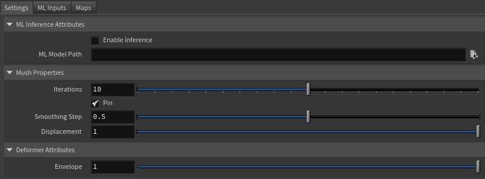
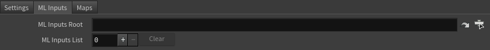
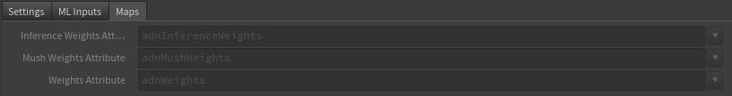

# AdnMLDeformer

The AdnMLDeformer is a SOP deformer for Houdini that applies deformation driven by a trained Adonis ML model. It uses KineFX joint transforms as inputs for ML inference and applies the resulting deformation to the input geometry. The node also integrates mush smoothing to refine the inferred shape and provides paintable weights to control the influence of the inference, mush smoothing, and overall deformation per vertex.

To know more about the how to train an Adonis ML model, please check the [Adonis ML Neural Training Tool](../tools/neural_training_tool.md) page.

## How To Use

The AdnMLDeformer requires three main inputs:

* The geometry to apply the deformer to. This geometry can be deformed by a bonedeform node.
* The Adonis ML model file (.adnm).
* The geostream containing the KineFX joints. This stream must include the `name` and `localtransform` per-point attributes.

To create and configure the deformer easily, there is a shortcut in the Adonis menu.

1. Select the geometry to apply the deformer to, and then the node containing the KineFX joints.
2. Go to the Adonis menu and click on ML Deformer.
3. A simple UI will pop up to provide two inputs: ML Model File and Joints Info File.
4. Click on the Browse button of the ML Model File to provide the .adnm file.
5. Click on the Browse button of the Joints Info File to provide the joints.json file. Make sure that both files are compatible with each other; that is, the joints.json file must be the one generated during the training process when the Adonis ML model was trained.
6. Click on the Create button.
7. The AdnMLDeformer will be created before the bonedeform node, if present, of the given geometry, and the joints found in the KineFX rig and present in the joints.json file will be populated in the "ML Inputs" tab of the node.
8. The deformer is ready. Tweak the envelope and/or enable or disable the inference to see the effect of the Adonis ML model.

> [NOTE]
> - Creating the node manually is also possible in the Network View through Adonis > Deformer > AdnMLDeformer.
> - In this case, the ML Model path and the list of ML Inputs (KineFX joints) can be populated afterwards by selecting the AdnMLDeformer plus the geometry with the KineFX joints and launching Adonis > ML Deformer.
> - The use of the simple UI is required to ensure that the list of ML Inputs is consistent with the Adonis ML Model.

The AdnMLDeformer integrates the mush algorithm to apply smoothing to the shape resulting from the inferred deformation. This algorithm requires a reference geometry to cache the displacements. Typically, the AdnMLDeformer is applied before the deformation chain; that is, the input source geometry is at rest, meaning that the input source is valid for mush data initialization. However, the AdnMLDeformer supports a second source to optionally ingest a custom rest shape for mush data initialization.

## Attributes

### ML Inference Attributes

| Name | Type | Default | Animatable | Description |
| :--- | :--- | :------ | :--------- | :---------- |
| **Enable Inference** | Boolean | True | ✓ | Flag to enable or disable the inferred deformation. |
| **ML Model Path**    | String  |      | ✓ | File path to the trained Adonis ML model.           |

### Mush Properties

| Name | Type | Default | Animatable | Description |
| :--- | :--- | :------ | :--------- | :---------- |
| **Iterations**     | Integer | 10      | ✓ | Number of smoothing iterations applied by the mush algorithm. Greater values produce smoother results at the expense of additional computational cost. Has a range of [0, 20]. The upper limit is soft; higher values can be used. |
| **Pin**            | Boolean | True    | ✓ | Flag to pin the vertices on the boundaries.                                                                                                                                                                                        |
| **Smoothing Step** | Float   | 0.5     | ✓ | Amount of smoothing applied at each iteration. Has a range of [0.0, 1.0].                                                                                                                                                          |
| **Displacement**   | Float   | 1.0     | ✓ | Controls how much of the computed displacement is applied to the geometry. Has a range of [0.0, 1.0].                                                                                                                              |

### Deformer Attributes
| Name | Type | Default | Animatable | Description |
| :--- | :--- | :------ | :--------- | :---------- |
| **Envelope** | Float | 1.0 | ✓ | Specifies the deformation scale factor. Has a range of [0.0, 1.0]. The upper and lower limits are soft, and values can be set in a range of [-2.0, 2.0]. |

### ML Inputs

| Name | Type | Default | Animatable | Description |
| :--- | :--- | :------ | :--------- | :---------- |
| **ML Inputs Root** | String |   | ✓ | Object path of the KineFX joint rig with the `name` and `localtransform` attributes required to retrieve the *ML Inputs* list. |
| **ML Inputs List** | List   | 0 | ✓ | Number of inputs required by the Adonis ML model for inference.                                                                |
| **ML Inputs**      | String |   | ✓ | Name of the KineFX joint from which to read the `localtransform` attribute used as input to the Adonis ML model for inference. |

### Maps

| Name | Type | Default | Animatable | Description |
| :--- | :--- | :------ | :--------- | :---------- |
| **Inference Weights Attribute** | float | 1.0 | ✓ | Specifies the name of the per-point attribute used to read the weight of the inferred deformation. The expected attribute name is `adnInferenceWeights`. The expected range of the per-component per-point values is [0.0, 1.0]. |
| **Mush Weights Attribute**      | float | 1.0 | ✓ | Specifies the name of the per-point attribute used to read the weight of the mush smoothing. The expected attribute name is `adnMushWeights`. The expected range of the per-component per-point values is [0.0, 1.0].            |
| **Weights Attribute**           | float | 1.0 | ✓ | Specifies the name of the per-point attribute used to read the weight of the deformation. The expected attribute name is `adnWeights`. The expected range of the per-component per-point values is [0.0, 1.0].                   |

## Parameter Template

<figure markdown>
  
  <figcaption><b>Figure 1</b>: AdnMLDeformer Parameter Template (Part 1): Settings.</figcaption>
</figure>

<figure markdown>
  
  <figcaption><b>Figure 2</b>: AdnMLDeformer Parameter Template (Part 2): Settings.</figcaption>
</figure>

<figure markdown>
  
  <figcaption><b>Figure 3</b>: AdnMLDeformer Parameter Template (Part 3): Maps.</figcaption>
</figure>

## Paintable Weights

| Name | Default | Description |
| :--- | :------ | :---------- |
| **Inference Weights** | 1.0 | Weights map used to control the influence of the inferred deformation at each vertex. |
| **Mush Weights**      | 1.0 | Weights map used to control the influence of the mush deformation at each vertex.     |
| **Weights**           | 1.0 | Global weights map used to control the influence of the deformer at each vertex.      |
