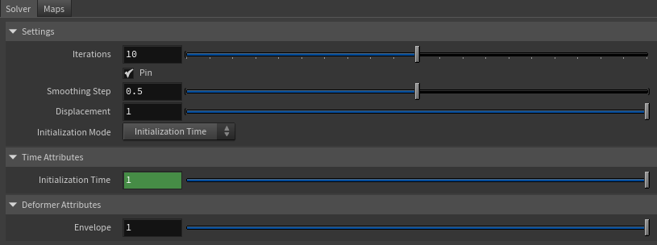
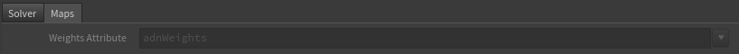

# AdnMush

AdnMush is a Houdini SOP designed to smooth deformations while preserving the overall shape and details of the geometry. It works by computing a smoothed representation of the mesh and applying the deformation as an offset from that smoothed surface, helping to reduce undesirable artifacts such as volume loss and skinning irregularities.

## How To Use

The AdnMush deformer is easy to create and configure in Houdini. It only requires a mesh to apply the deformation onto.

1. Go to the geometry context of the rig containing the geometry to apply the deformer to.
2. Press TAB and navigate to the submenu Adonis > Deformers to find the AdnMush {style="width:4%"} SOP type.
3. Create it and connect the geometry to the first input.

## Attributes

### Settings

| Name | Type | Default | Animatable | Description |
| :--- | :--- | :------ | :--------- | :---------- |
| **Iterations**          | Integer    | 10                  | ✓ | Number of smoothing iterations applied by the algorithm. Greater values produce smoother results at the expense of additional computational cost. Has a range of \[0, 20\]. The upper limit is soft, higher values can be used. |
| **Pin**                 | Boolean    | True                | ✓ | Flag to pin the vertices on the boundaries. |
| **Smoothing Step**      | Float      | 0.5                 | ✓ | Amount of smoothing applied at each iteration. Has a range of \[0.0, 1.0\]. |
| **Displacement**        | Float      | 1.0                 | ✓ | Controls how much of the computed displacement is applied to the geometry. Has a range of \[0.0, 1.0\]. |
| **Initialization Mode** | Enumerator | Initialization Time | ✗ | Defines how the reference state of the deformer is initialized. See the [Initialization Modes](mush#initialization-modes) section for details. |

### Time Attributes
| Name | Type | Default | Animatable | Description |
| :--- | :--- | :------ | :--------- | :---------- |
| **Initialization Time** | Time | *Current frame* | ✗ | Sets the frame at which the deformer will be initialized. |
| **Current Time**        | Time | *Current frame* | ✓ | Current playback frame. |

### Deformer Attributes
| Name | Type | Default | Animatable | Description |
| :--- | :--- | :------ | :--------- | :---------- |
| **Envelope** | Float | 1.0 | ✓ | Specifies the deformation scale factor. Has a range of \[0.0, 1.0\]. The upper and lower limits are soft, values can be set in a range of \[-2.0, 2.0\]. |

## Initialization Modes

AdnMush supports two different initialization workflows:

### Initialization Time

In this mode, the deformer initializes its internal reference state using the geometry connected to the first input of the SOP at the frame specified by *Initialization Time*.

This mode is useful when a specific frame should be used as the reference pose. For example, it can be used to initialize the deformer from a bind pose or any other desired state of the geometry.

### Original Geometry

In this mode, the deformer initializes its internal reference state using the geometry connected to the second input of the SOP.

The initialization is automatically recomputed whenever topology changes are detected on the geometry.

This mode is useful when the reference state should always be derived from the original geometry stored in the construction history.

> [!NOTE]
> If the *Initialization Mode* is set to *Original Geometry*, the SOP containing the original shape of the geometry must be connected to the second input.

## Parameter Template

<figure markdown>
  
  <figcaption><b>Figure 1</b>: AdnMush Parameter Template (Part 1): Solver.</figcaption>
</figure>

<figure markdown>
  
  <figcaption><b>Figure 2</b>: AdnMush Parameter Template (Part 2): Maps.</figcaption>
</figure>

## Paintable Weights

| Name | Default | Description |
| :--- | :------ | :---------- |
| **Weights** | 1.0 | Global weights map used to control the influence of the deformer at each vertex. |
