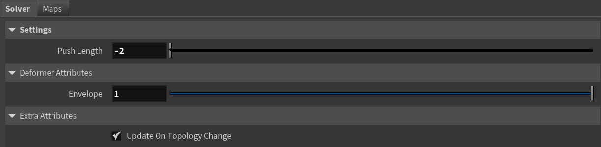
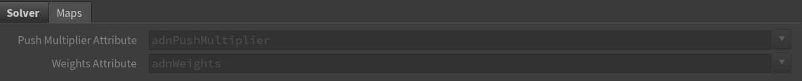

# AdnPush

AdnPush is a Houdini SOP designed to push a surface along the direction of its normals. This deformation can be applied outwards (i.e., the surface bulges and gains volume) or inwards (i.e., the surface shrinks and loses volume). This deformer is useful for refining meshes by increasing or decreasing their volume, as well as for modeling purposes. For example, a common use case is generating internal fascia geometry from skin geometry. Check [this section](../simple_setup#adnpush) to see a simple setup of this.

## How to use

The AdnPush SOP is easy to create and configure in Houdini. It only requires a mesh to apply the node to. Following the example mentioned above, this mesh would be the skin geometry at rest.

1. Go to the geometry context of the rig containing the geometry to apply the deformer to.
2. Press TAB and navigate to the submenu AdonisFX > Deformers to find the AdnPush {style="width:4%"} SOP type.
3. Create it and connect the geometry to the input.
4. Modify the value of the *Push Length* parameter to see the result of the push deformation. Check the [Attributes](push#attributes) section to customize their configuration.

## Attributes

### Settings
| Name | Type | Default | Animatable | Description |
| :--- | :--- | :------ | :--------- | :---------- |
| **Push Length** | Float | 0.0 | ✓ | Length of the push to apply. A positive value pushes the vertices along the direction of the normal, while a negative value pushes them in the opposite direction. Has a range of \[-1.0, 1.0\]. The upper and lower limits are soft; higher or lower values can be used. |

### Deformer Attributes
| Name | Type | Default | Animatable | Description |
| :--- | :--- | :------ | :--------- | :---------- |
| **Envelope** | Float | 1.0 | ✓ | Specifies the deformation scale factor. Has a range of \[0.0, 1.0\]. The upper and lower limits are soft, values can be set in a range of \[-2.0, 2.0\] |

### Extra Attributes
| Name | Type | Default | Animatable | Description |
| :--- | :--- | :------ | :--------- | :---------- |
| **Update On Topology Change** | Boolean | True | ✓ | Toggles the update of the internal geometry connectivity data only when the topology of the input mesh changes. If enabled, the SOP runs faster by reusing that information at each frame. If disabled, the SOP runs slower because that information needs to be recomputed at each frame. |

### Maps

| Name | Type | Default | Animatable | Description |
| :--- | :--- | :------ | :--------- | :---------- |
| **Push Multiplier Attribute** | float | 1.0 | ✗  | Specifies the name of the per-point attribute to read the multiplier of the push length. The expected attribute name is `adnPushMultiplier`. The expected range of the per-point values is \[0.0, 1.0\].  |
| **Weights Attribute**         | float | 1.0 | ✗  | Specifies the name of the per-point attribute to read the weight of the deformation. The expected attribute name is `adnWeights`. The expected range of the per-component per-point values is \[0.0, 1.0\]. |

> [!NOTE]
> - All maps parameters are disabled in the Maps tab because the attribute names are fixed to drive specific functionalities of the solver.
> - Fixed point attribute names also ensure compatibility with the API.
> - To copy the map names of the disabled attributes for painting (using an attribute paint node) right click on the disabled map attribute parameter, press "Copy Parameter", select the attribute paint node and on the attribute name entry right click and press "Paste Values". This allows to easily copy the attribute name for painting.
> - The *Make Paintable* utility provided in the AdonisFX menu > Utils, can be used to create the attribpaint node and automatically populate the entries with the map names of the AdnPush SOP.
> - If a point attribute on the geostream does not match the naming convention exposed in the node, use an "Attribute Rename" node to rename the attribute to match the expected naming convention.

## Parameter Template

<figure markdown>
  
  <figcaption><b>Figure 1</b>: AdnPush Parameter Template (Part 1): Solver.</figcaption>
</figure>

<figure markdown>
  
  <figcaption><b>Figure 2</b>: AdnPush Parameter Template (Part 2): Maps.</figcaption>
</figure>

## Paintable Weights

To provide more control, the AdnPush SOP includes two paintable attributes.

| Name | Default | Description |
| :--- | :------ | :---------- |
| **Push Multiplier** | 1.0 | Weight used to multiply the global Push Length to determine the amount of adjustment applied at each vertex. |
| **Weights**         | 1.0 | Global weights map used to control the influence of the deformer at each vertex. |

<figure markdown>
  
  <figcaption><b>Figure 3</b>: Example of Push Multiplier map of AdnPush SOP applied to the skin layer of a biped to obtain the fascia geometry. Left: front view. Right: back view.</figcaption>
</figure>

> [!NOTE]
> To tweak the point attributes of an AdnPush SOP, an `attribpaint` is needed. To ease the creation and initial configuration of this node, select the AdnPush SOP and click on AdonisFX > Utils > Make Paintable. This utility will create an `attribcreate` node to define the required point attributes and assign their default values followed by an `attribpaint` node to allow these attributes to be modified. Both nodes are automatically named and properly connected to the AdnPush node.

## Connections

Connections in AdonisFX for Houdini should be handled in two ways:
  - Detail expression: `detail("/obj/geo1/L_adnLocatorRotation_armFlexionShape", "adnActivationRotation", 0)` where the first component should contain an API compliant naming convention and the second the detail attribute name that some of the AdonisFX SOP nodes output. This should be used when the requirement is for the connected geometry to cook before retrieving the detail attribute. This could be used for example to drive a parameter of the node using the activation value output from a sensor/locator.
  - Channel expression: `ch("../AdnMuscle1/envelope")` where the first component should contain an API compliant naming convention and the second the referenced channel to the parameter name. This could be used to for example connect a float attribute to drive a parameter on the node.
