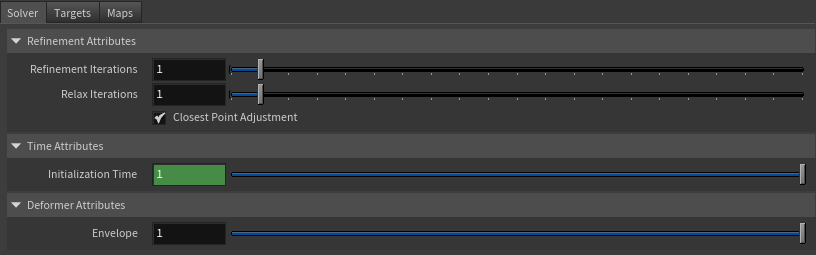
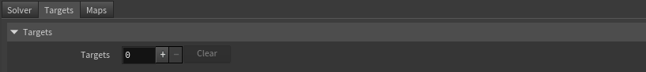
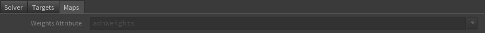

# AdnRadialWrap

AdnRadialWrap is a Houdini SOP that reshapes and reposes an input geometry using pairs of corresponding landmarks.

The deformation is driven by two sets of landmarks: input landmarks, positioned on the input geometry, and goal landmarks, positioned on one or more goal geometries. Each input landmark must relate to a goal landmark describing its desired location on the goal geometry. By establishing these correspondences, AdnRadialWrap computes a smooth deformation that transforms the input geometry toward the shape defined by the goal landmarks.

Both input and goal landmarks must be defined as geometry points in two separate SOP nodes, such as Houdini's Add node, which will be connected as inputs to the AdnRadialWrap node.

The goal geometries themselves are primarily used as references for landmark placement and for the refinement process in the AdnRadialWrap deformer.

Once the landmark pairs have been defined, the deformer can compute the main reshaping and repose deformation without requiring the goal geometries themselves. Optionally, one or more goal geometries can be used to further refine the result by progressively adjusting and fitting the geometry to the goal surfaces, helping produce smoother and more accurate results while preserving the overall shape defined by the landmarks.

AdnRadialWrap does not require topological match between the input and goal geometries because the correspondence is actually described by the pairs of landmarks. This makes it particularly useful for character reshaping, anatomy transfer, pose transfer, and fitting operations between related but structurally different meshes.

## How To Use

The AdnRadialWrap is easy to create and configure in Houdini:

1. Go to the geometry context of the rig containing the geometry to apply the deformer to.
2. Press TAB and navigate to the submenu Adonis > Deformers to find the AdnRadialWrap {style="width:4%"} SOP type.
3. Create it and connect the geometry to the first input.
4. Go to the **Targets** tab in the AdnRadialWrap parameters, add a new entry to *Targets* to add a goal geometry.
5. Provide the object path of the goal geometry in *Target World Mesh*.
6. Connect the geometry containing the input landmarks to the second input of the AdnRadialWrap SOP.
7. Connect the geometry containing the goal landmarks to the third input of the AdnRadialWrap SOP.

> [!NOTE]
> - AdnRadialWrap requires at least four pairs of corresponding landmarks to produce a deformation.
> - The number of input and goal landmarks must be the same.

## Attributes

### Refinement
| Name | Type | Default | Animatable | Description |
| :--- | :--- | :------ | :--------- | :---------- |
| **Refinement Iterations**    | Integer | 1    | ✓ | Number of iterations for the refinement process. Higher values may produce a better quality result at the cost of performance. Has a range of \[1, 20\]. The upper limit is soft, higher values can be used. |
| **Relax Iterations**         | Integer | 1    | ✓ | Number of relaxation iterations performed for each refinement iteration. Has a range of \[1, 20\]. The upper limit is soft, higher values can be used. |
| **Closest Point Adjustment** | Boolean | True | ✓ | Toggles the closest point adjustment performed at the end of each refinement iteration. |

### Time Attributes
| Name | Type | Default | Animatable | Description |
| :--- | :--- | :------ | :--------- | :---------- |
| **Initialization Time** | Time | *Current frame* | ✗ | Sets the frame at which the deformer will be initialized. |

### Deformer Attributes
| Name | Type | Default | Animatable | Description |
| :--- | :--- | :------ | :--------- | :---------- |
| **Envelope** | Float | 1.0 | ✓ | Specifies the deformation scale factor. Has a range of \[0.0, 1.0\]. The upper and lower limits are soft, values can be set in a range of \[-2.0, 2.0\]. |

### Maps

| Name | Type | Default | Animatable | Description |
| :--- | :--- | :------ | :--------- | :---------- |
| **Weights Attribute** | float | 1.0 | ✗  | Specifies the name of the per-point attribute to read the weight of the deformation. The expected attribute name is `adnWeights`. The expected range of the per-component per-point values is \[0.0, 1.0\]. |

> [!NOTE]
> - All maps parameters are disabled in the Maps tab because the attribute names are fixed to drive specific functionalities of the solver.
> - Fixed point attribute names also ensure compatibility with the API.
> - To copy the map names of the disabled attributes for painting (using an attribute paint node) right click on the disabled map attribute parameter, press "Copy Parameter", select the attribute paint node and on the attribute name entry right click and press "Paste Values". This allows to easily copy the attribute name for painting.
> - The *Make Paintable* utility provided in the Adonis menu > Utils, can be used to create the attribpaint node and automatically populate the entries with the map names of the AdnRadialWrap SOP.
> - If a point attribute on the geostream does not match the naming convention exposed in the node, use an "Attribute Rename" node to rename the attribute to match the expected naming convention.

## Parameter Template

<figure markdown>
  
  <figcaption><b>Figure 1</b>: AdnRadialWrap Parameter Template (Part 1): Solver.</figcaption>
</figure>

<figure markdown>
  
  <figcaption><b>Figure 2</b>: AdnRadialWrap Parameter Template (Part 2): Targets.</figcaption>
</figure>

<figure markdown>
  
  <figcaption><b>Figure 3</b>: AdnRadialWrap Parameter Template (Part 3): Maps.</figcaption>
</figure>

## Paintable Weights

| Name | Default | Description |
| :--- | :------ | :---------- |
| **Weights** | 1.0 | Global weights map used to control the influence of the deformer at each vertex. |

> [!NOTE]
> To tweak the point attributes of an AdnRadialWrap SOP, an `attribpaint` is needed. To ease the creation and initial configuration of this node, select the AdnRadialWrap SOP and click on Adonis > Utils > Make Paintable. This utility will create an `attribcreate` node to define the required point attributes and assign their default values followed by an `attribpaint` node to allow these attributes to be modified. Both nodes are automatically named and properly connected to the AdnRadialWrap node.

## Connections

Connections in Adonis for Houdini should be handled in two ways:
  - Detail expression: `detail("/obj/geo1/L_adnLocatorRotation_armFlexionShape", "adnActivationRotation", 0)` where the first component should contain an API compliant naming convention and the second the detail attribute name that some of the Adonis SOP nodes output. This should be used when the requirement is for the connected geometry to cook before retrieving the detail attribute. This could be used for example to drive a parameter of the node using the activation value output from a sensor/locator.
  - Channel expression: `ch("../AdnMuscle1/envelope")` where the first component should contain an API compliant naming convention and the second the referenced channel to the parameter name. This could be used for example to connect a float attribute to drive a parameter on the node.
