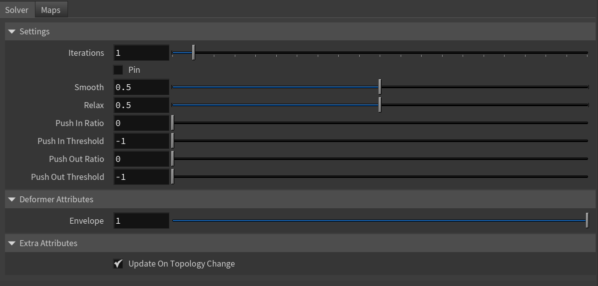
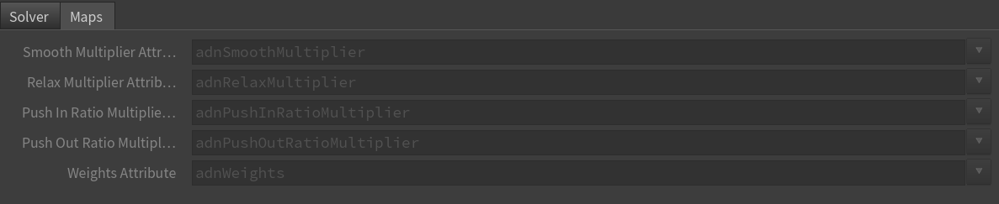
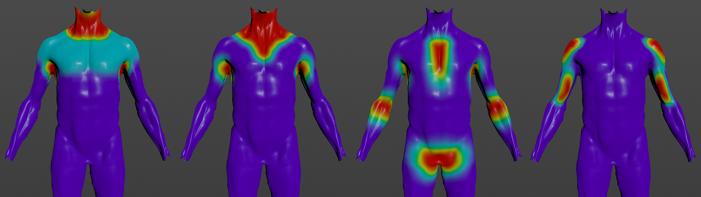

# AdnRelax

AdnRelax is a Houdini SOP designed to smooth creases and correct over-compression or over-stretching on geometry surfaces. This deformer can help refining different types of meshes, like the fascia and skin resulting from the simulation by computing an iterative algorithm that combines smoothing, relaxation, and volume corrections. The AdnRelax SOP applies smoothing and relaxation in each iteration, while the volume correction (i.e. a push in and push out adjustment in the direction of the point normals) is applied during the final iteration.

## How to use

The AdnRelax SOP is easy to create and configure in Houdini. It only requires the mesh to apply the relaxation onto. Typically, this mesh would be the simulated fascia or skin.

1. Go to the geometry context of the rig containing the geometry to apply the deformer to.
2. Press TAB and navigate to the submenu AdonisFX > Deformer to find the AdnRelax {style="width:4%"} SOP type.
3. Create it and connect the geometry to the input.
4. Increase the number of iterations to see the effect of the deformation. Check the [Attributes](relax#attributes) section to customize their configuration.

## Attributes

### Settings
| Name | Type | Default | Animatable | Description |
| :--- | :--- | :------ | :--------- | :---------- |
| **Iterations**         | Integer | 1      | X | Number of iterations of the relaxation algorithm. Greater values mean greater computational cost. Has a range of \[1, 10\]. The upper limit is soft, higher values can be used. |
| **Pin**                | Boolean | False  | ✓ | Flag to pin the vertices on the boundaries. |
| **Smooth**             | Float   | 0.5    | ✓ | Amount of smoothing to apply. Has a range of \[0.0, 1.0\]. |
| **Relax**              | Float   | 0.5    | ✓ | Amount of relaxation to apply. Has a range of \[0.0, 1.0\]. |
| **Push In Ratio**      | Float   | 0.0    | ✓ | Amount of correction applied by the push in adjustment. Has a range of \[0.0, 2.0\]. The upper limit is soft, higher values can be used. |
| **Push In Threshold**  | Float   | -1.0   | ✓ | Maximum correction applied by the push in adjustment. The threshold will be ignored if its value is 0.0 or less. Has a range of \[-1.0, 2.0\]. The upper limit is soft, higher values can be used. |
| **Push Out Ratio**     | Float   | 0.0    | ✓ | Amount of correction applied by the push out adjustment. Has a range of \[0.0, 2.0\]. The upper limit is soft, higher values can be used. |
| **Push Out Threshold** | Float   | -1.0   | ✓ | Maximum correction applied by the push out adjustment. The threshold will be ignored if its value is 0.0 or less. Has a range of \[-1.0, 2.0\]. The upper limit is soft, higher values can be used. |

### Deformer Attributes
| Name | Type | Default | Animatable | Description |
| :--- | :--- | :------ | :--------- | :---------- |
| **Envelope** | Float | 1.0 | ✓ | Specifies the deformation scale factor. Has a range of \[0.0, 1.0\]. The upper and lower limits are soft, values can be set in a range of \[-2.0, 2.0\]|

### Extra Attributes
| Name | Type | Default | Animatable | Description |
| :--- | :--- | :------ | :--------- | :---------- |
| **Update On Topology Change** | Boolean | True | ✓ | Toggles the update of the internal geometry connectivity data only when the topology of the input mesh changes. If enabled, the SOP runs faster by reusing that information at each frame. If disabled, the SOP runs slower because that information needs to be recomputed at each frame. |

### Maps

| Name | Type | Default | Animatable | Description |
| :--- | :--- | :------ | :--------- | :---------- |
| **Smooth Multiplier Attribute**         | float | 1.0 | ✗  | Specifies the name of the per-point attribute to read the multiplier of the smoothing. The expected attribute name is `adnSmoothMultiplier`. The expected range of the per-point values is \[0.0, 1.0\].  |
| **Relax Multiplier Attribute**          | float | 1.0 | ✗  | Specifies the name of the per-point attribute to read the multiplier of the relaxation. The expected attribute name is `adnRelaxMultiplier`. The expected range of the per-point values is \[0.0, 1.0\].  |
| **Push In Ratio Multiplier Attribute**  | float | 1.0 | ✗  | Specifies the name of the per-point attribute to read the multiplier of the push in ratio. The expected attribute name is `adnPushInRatioMultiplier`. The expected range of the per-point values is \[0.0, 1.0\].  |
| **Push Out Ratio Multiplier Attribute** | float | 1.0 | ✗  | Specifies the name of the per-point attribute to read the multiplier of the push out ratio. The expected attribute name is `adnPushOutRatioMultiplier`. The expected range of the per-point values is \[0.0, 1.0\].  |
| **Weights Attribute**                   | float | 1.0 | ✗  | Specifies the name of the per-point attribute to read the weight of the deformation. The expected attribute name is `adnWeights`. The expected range of the per-component per-point values is \[0.0, 1.0\]. |

> [!NOTE]
> - All maps parameters are disabled in each entry added to these multiparams because the attribute names are fixed to drive specific functionalities of the deformer.
> - Fixed point attribute names also ensure compatibility with the API.

## Parameter Template

<figure markdown>
  
  <figcaption><b>Figure 1</b>: AdnRelax Parameter Template (Part 1): Solver.</figcaption>
</figure>

<figure markdown>
  
  <figcaption><b>Figure 2</b>: AdnRelax Parameter Template (Part 2): Maps.</figcaption>
</figure>

## Paintable Weights

To provide more control, some key parameters of the AdnRelax SOP are exposed as paintable attributes.

| Name | Default | Description |
| :--- | :------ | :---------- |
| **Push In Ratio Multiplier**  | 1.0 | Weight to multiply the push in adjustment applied to the geometry surface. |
| **Push Out Ratio Multiplier** | 1.0 | Weight to multiply the push out adjustment applied to the geometry surface. |
| **Smooth Multiplier**         | 1.0 | Weight to multiply the smoothing applied to the geometry surface. |
| **Relax Multiplier**          | 1.0 | Weight to multiply the relaxation applied to the geometry surface.  |
| **Weights**                   | 1.0 | Global weights map used to control the influence of the deformer at each vertex. |

<figure markdown>
  
  <figcaption><b>Figure 3</b>: Example of paintable weights of AdnRelax SOP applied to the fascia layer of a biped. From left to right: smooth multiplier, relax multiplier, push in ratio multiplier, push out ratio multiplier.</figcaption>
</figure>
