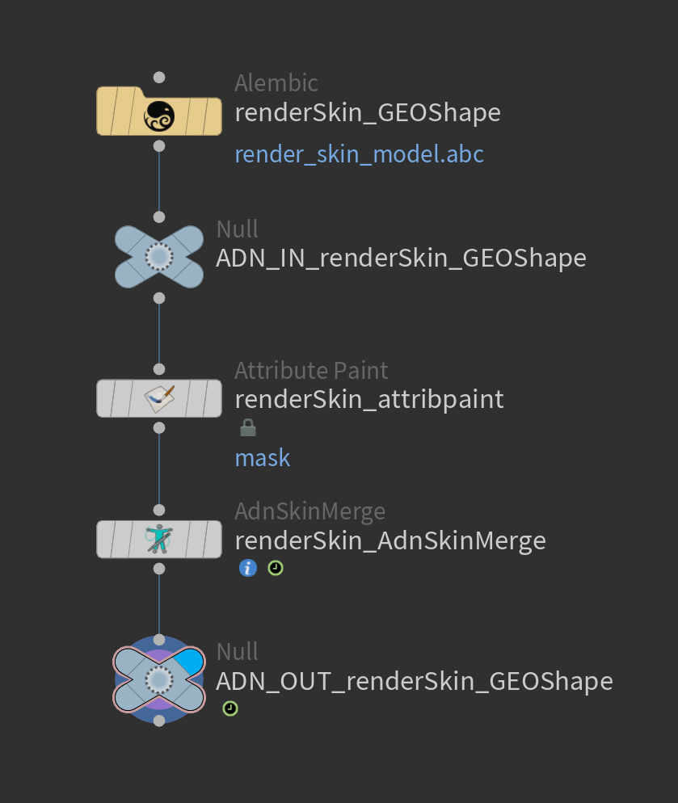
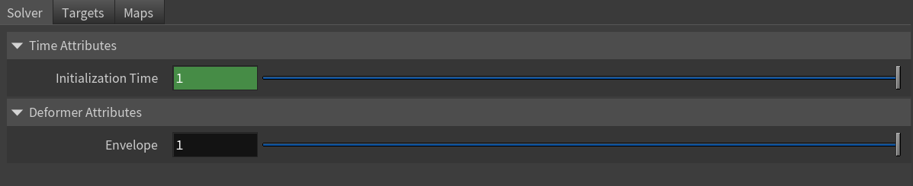
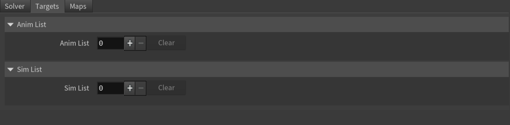
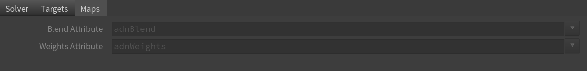
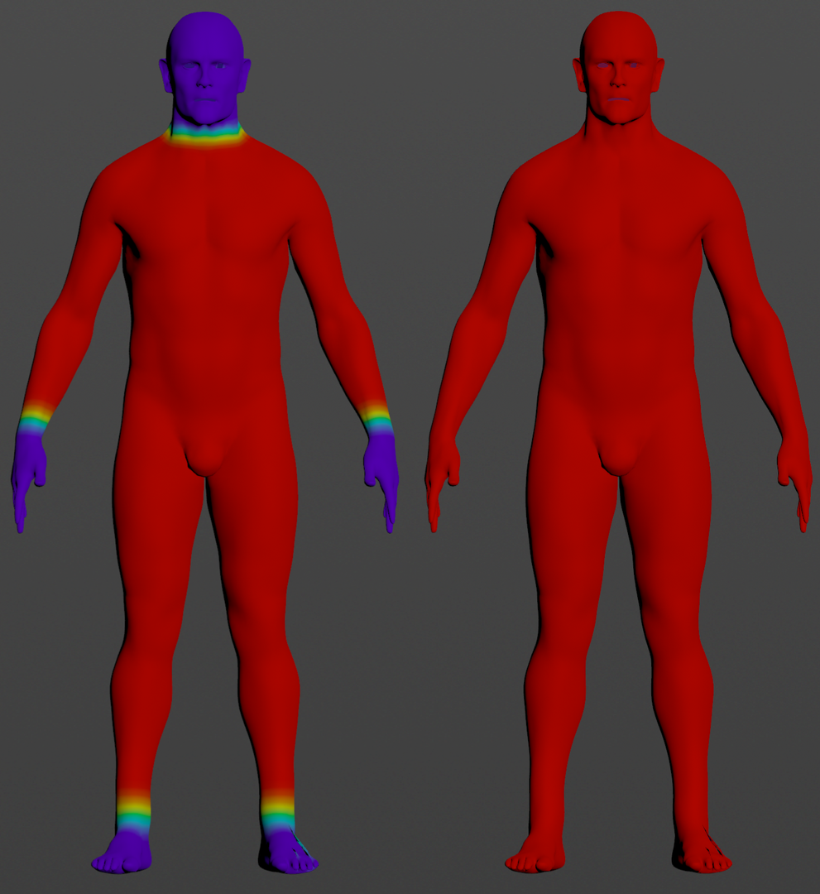

# AdnSkinMerge

AdnSkinMerge is a Houdini SOP to blend animation and simulation together. It allows for the merging of several animation and simulation meshes into a single final mesh.

The influence simulation or animation meshes will have on the final mesh can be freely painted and modified by painting a blend weights map.

### How To Use

To create an AdnSkinMerge SOP within a Houdini scene, the following inputs must be provided:

  - **Final Mesh (F)**: Mesh to apply the merge results.
  - **Animation Mesh List (Al)**: Mesh(es) to drive the simulation skin.
  - **Simulation Mesh List (Sl)**: Mesh(es) with either an AdnSkin SOP applied or with the results from the skin simulation applied.

The process to create an AdnSkinMerge SOP is:

1. Go to the geometry context of the rig containing the geometry to apply the solver onto.
2. Press TAB and navigate to the submenu AdonisFX > Solvers to find the AdnSkinMerge {style="width:4%"} SOP type.
3. Create it and connect the geometry to the input.
4. Add the animation and simulation meshes to the *Anim List* and *Sim List* multiparms respectively exposed in the *Targets* tab. Take into consideration the following requirements:
    - Add a mesh by increasing the number of entries in the multiparm and providing the object path of the geometry to the new entry.
    - At least one mesh must be added in each field.
    - To add meshes to any list, select the meshes in the scene and click the respective *Add Selected* button.
    - Adding the same mesh twice to a list is not supported.
    - Adding the same mesh as a Simulation Mesh and as an Animation Mesh is not advised.
    - To remove a single element from the list click on the **X** button of that element.
    - To clear any list fully press the respective Clear button.
5. To modulate the influence of the simulation mesh inputs, use an `attribpaint` node to customize the blend weights map.

> [!NOTE]
> On create, the *Initialization Time* parameter of AdnSkinMerge is set to the `$FSTART` frame. Make sure to adjust this value according to your needs.

<figure style="width: 75%;" markdown>
   
  <figcaption><b>Figure 1</b>: Example of AdnSkinMerge network. The attribpaint node has to be placed prior to the AdnSkinMerge SOP. Using null nodes with ADN_IN_ and ADN_OUT_ prefixes to encapsulate the AdonisFX deformable section is recommended to keep the network compatible with the API.</figcaption>
</figure>

Once the AdnSkinMerge SOP is created, the input meshes (animation mesh list, simulation mesh list or both) can be modified:

- **Add**:
    1. Increment the number of entries in the *Anim List* or *Sim List* multiparm. This adds a new entry to the list.
    2. Enter the object path of the geometry to add. The path can be absolute or relative to the SOP.
    3. Make sure to recook the AdnSkinMerge at initialization time for this change to take effect.
- **Remove**:
    1. Locate the target to remove in the *Anim List* or *Sim List* multiparm.
    2. Remove it using the **X** button for that item.
    3. Alternatively, to remove all targets, click the **Clear** button of the *Anim List* or *Sim List* multiparm.
    4. Make sure to recook the AdnSkinMerge at initialization time for this change to take effect.

## Attributes

### Time Attributes
| Name | Type | Default | Animatable | Description |
| :--- | :--- | :------ | :--------- | :---------- |
| **Initialization Time** | Time  | *Start frame* | ✗ | Sets the frame at which the solver will be initialized. |

### Deformer Attributes
| Name | Type | Default | Animatable | Description |
| :--- | :--- | :------ | :--------- | :---------- |
| **Envelope**            | Float | 1.0           | ✓ | Specifies the deformation scale factor. Has a range of \[0.0, 1.0\]. The upper and lower limits are soft, values can be set in a range of \[-2.0, 2.0\]|

### Targets Attributes
| Name | Type | Default | Animatable | Description |
| :--- | :--- | :------ | :--------- | :---------- |
| **Anim List**       | List      | 0     | ✗ | List of geometry targets from animation. |
| **Anim World Mesh** | String    |       | ✓ | Object path of the mesh used as animation input. |
| **Sim List**        | List      | 0     | ✗ | List of geometry targets from simulation. |
| **Sim World Mesh**  | String    |       | ✓ | Object path of the mesh used as simulation input. |

### Maps

| Name | Type | Default | Animatable | Description |
| :--- | :--- | :------ | :--------- | :---------- |
| **Blend Attribute**   | float | 1.0 | ✗  | Specifies the name of the per-point attribute to read the blend weights from. The expected attribute name is `adnBlend`. The expected range of the per-point values is \[0.0, 1.0\].  |
| **Weights Attribute** | float | 1.0 | ✗  | Specifies the name of the per-point attribute to read the weight of the deformation. The expected attribute name is `adnWeights`. The expected range of the per-component per-point values is \[0.0, 1.0\]. |

> [!NOTE]
> - All maps parameters are disabled in the Maps tab because the attribute names are fixed to drive specific functionalities of the solver.
> - Fixed point attribute names also ensure compatibility with the API.
> - To copy the map names of the disabled attributes for painting (using an attribute paint node) right click on the disabled map attribute parameter, press "Copy Parameter", select the attribute paint node and on the attribute name entry right click and press "Paste Values". This allows to easily copy the attribute name for painting.
> - If a point attribute on the geostream does not match the naming convention exposed in the node, use an "Attribute Rename" node to rename the attribute to match the expected naming convention.

## Parameter Template

<figure style="width: 75%;" markdown>
  
  <figcaption><b>Figure 2</b>: AdnSkinMerge Attribute Editor: Solver.</figcaption>
</figure>

<figure style="width: 75%;" markdown>
  
  <figcaption><b>Figure 3</b>: AdnSkinMerge Attribute Editor: Targets.</figcaption>
</figure>

<figure style="width: 75%;" markdown>
  
  <figcaption><b>Figure 4</b>: AdnSkinMerge Attribute Editor: Maps.</figcaption>
</figure>

## Paintable Weights
| Name | Default | Description |
| :--- | :------ | :---------- |
| **Blend**       | 0.0 | Weight to modulate the influence the simulation meshes have over the animation meshes. Higher values will add more influence of the simulation meshes over the final mesh.<ul><li>*Tip*: Paint only over areas where animation and simulation meshes overlap.</li></ul> |
| **Weight**      | 1.0 | Default weight attribute to determine the influence of the deformer over the input geometry. |

<figure markdown>
  
  <figcaption><b>Figure 5</b>: Example of blend map (left) and weights map (right) in AdnSkinMerge.</figcaption>
</figure>

> [!NOTE]
> To tweak the point attributes of an AdnSkinMerge SOP, an `attribpaint` is needed. To ease the creation and initial configuration of this node, select the AdnSkinMerge SOP and click on AdonisFX > Utils > Make Paintable. This utility will create an `attribcreate` node to define the required point attributes and assign their default values followed by an `attribpaint` node to allow these attributes to be modified. Both nodes are automatically named and properly connected to the AdnSkinMerge node.
