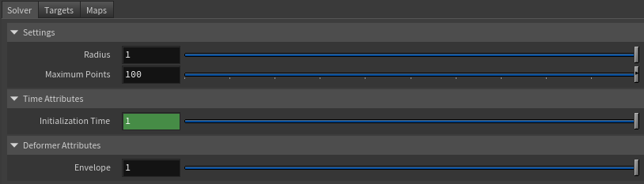

# AdnSoftWrap

AdnSoftWrap is a Houdini SOP that transfers deformations from one or more target geometries to an input geometry using a proximity-based influence model.

For every point of the deformed geometry, the deformer searches for nearby points belonging to the connected target geometries. All target points found within a user-defined radius are considered as potential influences, up to a maximum number of neighboring points. The resulting deformation is then computed from the contribution of those neighboring targets points and applied to the affected point.

This deformer is particularly useful for transferring complex deformations between unrelated meshes, driving secondary geometry, or creating flexible deformation setups without requiring topological correspondence.

## How to use

The AdnSoftWrap is easy to create and configure in Houdini. It requires the mesh to apply the deformation onto and the target(s) that will drive the deformation.

1. Go to the geometry context of the rig containing the geometry to apply the deformer to.
2. Press TAB and navigate to the submenu Adonis > Deformers to find the AdnSoftWrap {style="width:4%"} SOP type.
3. Create it and connect the geometry to the input.
4. Go to the **Targets** tab in the AdnSoftWrap parameters, add a new entry to *Targets* to add a geometry target.
5. Provide the object path of the target geometry in *Target World Mesh*.

## Attributes

### Settings
| Name | Type | Default | Animatable | Description |
| :--- | :--- | :------ | :--------- | :---------- |
| **Radius**         | Time | 1.0 | ✗ | Defines the maximum distance used to search for influencing target points. Only target points located within this radius can contribute to the deformation of a given point. Larger values increase the area of influence and produce smoother results at the cost of performance.|
| **Maximum Points** | Time | 100 | ✗ | Defines the maximum number of neighboring target points that can influence a point of the deformed geometry. Larger values will produce smoother results at the cost of performance.|

### Time Attributes
| Name | Type | Default | Animatable | Description |
| :--- | :--- | :------ | :--------- | :---------- |
| **Initialization Time** | Time | *Current frame* | ✗ | Sets the frame at which the deformer will be initialized. |
| **Current Time**        | Time | *Current frame* | ✓ | Current playback frame. |

### Deformer Attributes
| Name | Type | Default | Animatable | Description |
| :--- | :--- | :------ | :--------- | :---------- |
| **Envelope** | Float | 1.0 | ✓ | Specifies the deformation scale factor. Has a range of \[0.0, 1.0\]. The upper and lower limits are soft, values can be set in a range of \[-2.0, 2.0\]|

### Maps

| Name | Type | Default | Animatable | Description |
| :--- | :--- | :------ | :--------- | :---------- |
| **Weights Attribute** | float | 1.0 | ✗  | Specifies the name of the per-point attribute to read the weight of the deformation. The expected attribute name is `adnWeights`. The expected range of the per-component per-point values is \[0.0, 1.0\]. |

> [!NOTE]
> - All maps parameters are disabled in the Maps tab because the attribute names are fixed to drive specific functionalities of the solver.
> - Fixed point attribute names also ensure compatibility with the API.
> - To copy the map names of the disabled attributes for painting (using an attribute paint node) right click on the disabled map attribute parameter, press "Copy Parameter", select the attribute paint node and on the attribute name entry right click and press "Paste Values". This allows to easily copy the attribute name for painting.
> - The *Make Paintable* utility provided in the Adonis menu > Utils, can be used to create the attribpaint node and automatically populate the entries with the map names of the AdnSoftWrap SOP.
> - If a point attribute on the geostream does not match the naming convention exposed in the node, use an "Attribute Rename" node to rename the attribute to match the expected naming convention.

## Parameter Template

<figure markdown>
  
  <figcaption><b>Figure 1</b>: AdnSoftWrap Parameter Template (Part 1): Solver.</figcaption>
</figure>

<figure markdown>
  
  <figcaption><b>Figure 2</b>: AdnSoftWrap Parameter Template (Part 2): Maps.</figcaption>
</figure>

## Paintable Weights

| Name | Default | Description |
| :--- | :------ | :---------- |
| **Weights** | 1.0 | Global weights map used to control the influence of the deformer at each vertex. |

> [!NOTE]
> To tweak the point attributes of an AdnSoftWrap SOP, an `attribpaint` is needed. To ease the creation and initial configuration of this node, select the AdnSoftWrap SOP and click on Adonis > Utils > Make Paintable. This utility will create an `attribcreate` node to define the required point attributes and assign their default values followed by an `attribpaint` node to allow these attributes to be modified. Both nodes are automatically named and properly connected to the AdnSoftWrap node.

## Connections

Connections in Adonis for Houdini should be handled in two ways:
  - Detail expression: `detail("/obj/geo1/L_adnLocatorRotation_armFlexionShape", "adnActivationRotation", 0)` where the first component should contain an API compliant naming convention and the second the detail attribute name that some of the Adonis SOP nodes output. This should be used when the requirement is for the connected geometry to cook before retrieving the detail attribute. This could be used for example to drive a parameter of the node using the activation value output from a sensor/locator.
  - Channel expression: `ch("../AdnMuscle1/envelope")` where the first component should contain an API compliant naming convention and the second the referenced channel to the parameter name. This could be used to for example connect a float attribute to drive a parameter on the node.
