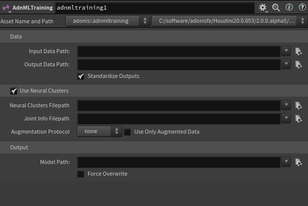
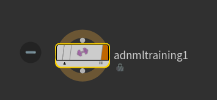
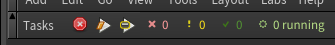
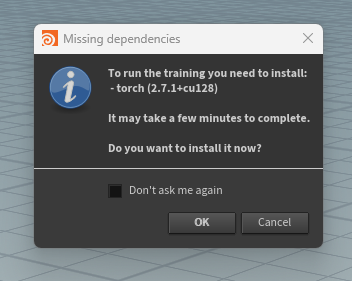
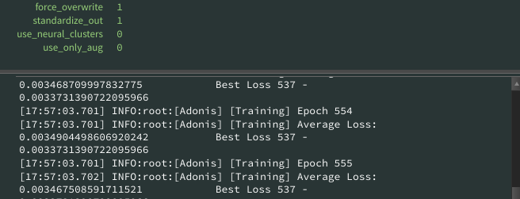

# AdnMLTraining TOP HDA

The **AdnMLTraining TOP HDA** is a TOPs wrapper around the Adonis neural training script. It provides a Houdini parameter interface to configure and launch the neural training process from a TOP graph.

The tool can be used to train an `.adnm` model from the input and output data generated by the ML data extraction workflow. It can also use neural cluster data when a neural cluster `.json` file has been prepared with the [AdnNeuralClusteringPaintTool](../tools/neural_clustering_paint_tool).

The AdnMLTraining TOP HDA can help orchestrate the training process together with other TOP tasks, including data extraction when desired. Connected inputs are not strictly required, but they can be used to define TOP graph dependencies and data flow.

The AdnMLTraining TOP HDA can also help manage the training dependencies. If the required machine learning dependencies are missing when the TOP graph is launched, the tool prompts the user to install them. The dependencies can also be installed manually from **Adonis > Utils > Install ML Dependencies**.

When GPU-capable ML dependencies and a compatible GPU are available, training uses the GPU, which is usually much faster. If GPU execution is not available, training falls back to CPU execution, which can be significantly slower.

> [!NOTE]
> This page describes how to run training from Houdini using the AdnMLTraining TOP HDA.
> For more information about running training in a standalone way, and how to install the ML dependencies using a `.bat` file, refer to the [Neural Training script documentation](../scripts/neural_training).

## Requirements

To train a model with the AdnMLTraining TOP HDA, the following files are required:

- *Input Data Path*: Input data `.csv` file used for training.
- *Output Data Path*: Output data `.csv` file used for training.
- *Model Path*: Output `.adnm` model path.

The input and output data files are usually generated by the data extraction workflow. For more information about generating training data, refer to the [AdnMLDataExtraction TOP HDA](../tools/data_extraction_tool) documentation.

The output model path must use the `.adnm` extension.

When training with neural clusters, the following additional files are required:

- *Neural Clusters Filepath*: Neural cluster `.json` file generated by the [AdnNeuralClusteringPaintTool](../tools/neural_clustering_paint_tool).
- *Joint Info Filepath*: Joint information `.json` file used by the neural cluster training process. This file should be selected from the same dataset folder as the input and output data files generated during data extraction.

> [!NOTE]
> The AdnMLTraining TOP HDA does not strictly require connected inputs. Inputs can be used to define TOP graph dependencies and data flow, but the training files are selected through the path parameters.

## How To Use

1. Create an **AdnMLTraining** TOP HDA.

<figure style="width:90%; margin-left:5%" markdown>
  
  <figcaption><b>Figure 1</b>: AdnMLTraining parameter template. The tool exposes the data paths, neural cluster options, augmentation settings, and output model path used to launch training from TOPs.</figcaption>
</figure>

2. Place the node in a TOP graph.

    The AdnMLTraining TOP HDA can be used as part of a TOP graph to orchestrate the training process.

    Connecting inputs is optional. Inputs can be used to define graph dependencies and data flow, but the files used for training are selected with the path parameters on the node.

<figure style="width:70%; margin-left:15%" markdown>
  
  <figcaption><b>Figure 2</b>: AdnMLTraining TOP node in the network view. The node can be used as part of a TOP graph to orchestrate the training process and define data flow.</figcaption>
</figure>

3. Set the input and output data paths.

    Use *Input Data Path* to specify the input data `.csv` file used for training.

    Use *Output Data Path* to specify the output data `.csv` file used for training.

    These files are usually generated by the data extraction process. For more information about generating training data, refer to the [AdnMLDataExtraction TOP HDA](../tools/data_extraction_tool) documentation.

    Enable *Standardize Outputs* to rescale the output data to a standard normal distribution. This is generally recommended for better training results. If the amount of training poses is low, disabling this option may help preserve the original data distribution.

4. Enable neural clusters if needed.

    Enable *Use Neural Clusters* to train using neural cluster data.

    When this option is enabled, the training process uses the neural cluster `.json` file, the joint info `.json` file, and the augmentation settings.

    Use *Neural Clusters Filepath* to specify the neural cluster `.json` file containing the cluster data. This file is generated by the [AdnNeuralClusteringPaintTool](../tools/neural_clustering_paint_tool) and describes the painted cluster regions used to provide locality information during training.

    Use *Joint Info Filepath* to specify the joint info `.json` file containing the joint information used by the neural cluster training process. This file should be selected from the same dataset folder as the input and output data files generated during data extraction.

5. Configure augmentation if needed.

    Use *Augmentation Protocol* to apply an experimental data augmentation protocol during training.

    Use this only when training without augmentation is not giving good results and the dataset is small.

    The available augmentation protocols are *none*, *random*, and *simple*. When augmentation is enabled, the tool uses the neural clusters to generate new synthetic poses from the training samples.

    These generated poses may contain artifacts and may be less aligned to the original simulated silhouette.

    Enable *Use Only Augmented Data* to train only with the augmented synthetic data, without including the original samples.

    *Use Only Augmented Data* is ignored when *Augmentation Protocol* is set to *none*.

6. Set the output model path.

    Use *Model Path* to specify where the trained model file will be saved.

    The output model path must use the `.adnm` extension.

    Enable *Force Overwrite* to overwrite the existing model file if one already exists at the target path. Use this with caution, because the previous model file will be irreversibly deleted.

7. Cook the TOP graph.

    Cook the TOP graph to launch the training work item.

    Use the TOP execution buttons to generate static work items and cook the graph, similarly to the data extraction workflow.

<figure style="width:90%; margin-left:5%" markdown>
  
  <figcaption><b>Figure 3</b>: TOP execution controls used to generate work items and cook the AdnMLTraining TOP graph.</figcaption>
</figure>

8. Install missing dependencies if prompted.

    If the required machine learning dependencies are missing, the tool displays a prompt when the TOP graph is executed.

    Press **OK** to install the dependencies from the prompt. This may take a few minutes.

    Alternatively, install the dependencies manually from **Adonis > Utils > Install ML Dependencies**. This manual installation option opens a separate console window.

    For standalone dependency installation using a `.bat` file, refer to the [Neural Training script documentation](../scripts/neural_training).

<figure style="width:60%; margin-left:20%" markdown>
  
  <figcaption><b>Figure 4</b>: Missing dependencies prompt shown when the TOP graph is executed and the required machine learning dependencies are not installed.</figcaption>
</figure>

9. Review the training output.

    After training finishes, the `.adnm` model file is written to the *Model Path*.

    The tool also generates a `<model_name>_log.txt` file next to the `.adnm` model. This log can be used to inspect training progress, epochs, losses, warnings, and errors.

    A `<model_name>_config.json` file is also generated with the training parameters used for the run. This can be used to review how the model was trained.

    During or after execution, the work item output can also show epoch and average loss information. This is useful for debugging training behavior directly from TOPs.

<figure style="width:90%; margin-left:5%" markdown>
  
  <figcaption><b>Figure 5</b>: Training output showing epoch progress, average loss, and best loss information. This information is useful for debugging and is also written to the generated log file next to the output model.</figcaption>
</figure>

## Parameters

### Data

| Name | Type | Default | Description |
| :--- | :--- | :------ | :---------- |
| *Input Data Path* | File Path |  | Path to the input data `.csv` file used for training. This file is usually generated by the data extraction process. |
| *Output Data Path* | File Path |  | Path to the output data `.csv` file used for training. This file is usually generated by the data extraction process. |
| *Standardize Outputs* | Toggle | On | Rescales the output data to a standard normal distribution. This is generally recommended for better training results. If the amount of training poses is low, it may be better to disable this option to preserve the original data distribution. |

### Neural Clusters

| Name | Type | Default | Description |
| :--- | :--- | :------ | :---------- |
| *Use Neural Clusters* | Toggle | Off | Enables training with neural cluster data. When enabled, the neural cluster `.json`, joint info `.json`, and augmentation settings are used during training. |
| *Neural Clusters Filepath* | File Path |  | Path to the neural cluster `.json` file containing the cluster data. This file is generated by the [AdnNeuralClusteringPaintTool](../tools/neural_clustering_paint_tool). |
| *Joint Info Filepath* | File Path |  | Path to the joint info `.json` file containing the joint information used by the neural cluster training process. This file should be selected from the same dataset folder as the input and output data files generated during data extraction. |
| *Augmentation Protocol* | Menu | none | Experimental data augmentation protocol to apply during training. Use only when training without augmentation is not giving good results and the dataset is small. Available options are *none*, *random*, and *simple*. This option uses the neural clusters to generate new synthetic poses from the training samples. The synthetic poses generated may contain artifacts and may be less aligned to the original simulated silhouette. |
| *Use Only Augmented Data* | Toggle | Off | Uses only the augmented synthetic data for training, without including the original samples. This option is ignored if no augmentation protocol is selected. |

### Output

| Name | Type | Default | Description |
| :--- | :--- | :------ | :---------- |
| *Model Path* | File Path |  | Path where the trained model file will be saved. The output file must use the `.adnm` extension. |
| *Force Overwrite* | Toggle | Off | Forces the tool to overwrite the model file if it already exists in the target path. Use with caution, because this will irreversibly delete any existing model file at the target path. |

## Training Dependencies

The AdnMLTraining TOP HDA requires the machine learning dependencies to be installed before training can run.

If the dependencies are missing when the TOP graph is cooked, the tool displays a prompt asking whether to install them.

This prompt appears as part of the TOP graph execution. The manual **Adonis > Utils > Install ML Dependencies** option is a separate installation workflow and opens a console window.

The dependencies can be installed in one of the following ways:

- From the missing dependencies prompt shown when launching training.
- From **Adonis > Utils > Install ML Dependencies**.
- From the standalone `.bat` installation workflow described in the [Neural Training script documentation](../scripts/neural_training).

Installing the dependencies may take a few minutes.

When GPU-capable ML dependencies and a compatible GPU are available, training uses the GPU. GPU training is usually much faster than CPU training.

If GPU execution is not available, the training process falls back to CPU execution. CPU training can be significantly slower, especially for larger datasets or more complex training configurations.

## Output Files

After a successful training run, the following files are generated:

- `<model_name>.adnm`: Trained Adonis neural model file.
- `<model_name>_log.txt`: Training log file generated next to the `.adnm` model.
- `<model_name>_config.json`: Configuration file storing the training parameters used for the run.

The `<model_name>_log.txt` file can be used to inspect the training process. It contains epoch information, average loss, best loss, warnings, errors, and other training messages.

The `<model_name>_config.json` file can be used to review the training configuration used to produce the model.

## Troubleshooting

If the training process fails or does not produce the expected result, check the following:

1. Check the TOP work item task graph and output.

    The TOP task graph can show whether the work item failed and may provide error information for the failed task. The work item output can also show epoch progress, average loss, and best loss information, which is useful for debugging training behavior.

2. Check the generated `<model_name>_log.txt` file.

    The log file is generated next to the `.adnm` model and contains detailed training information, including epochs, losses, warnings, and errors.

3. Check the generated `<model_name>_config.json` file.

    The config file records the training parameters used for the run. This can help confirm that the correct paths, neural cluster settings, augmentation settings, and output options were used.

4. Confirm that the ML dependencies are installed.

    If the dependencies are missing, install them from the prompt, from **Adonis > Utils > Install ML Dependencies**, or by following the standalone dependency installation instructions in the [Neural Training script documentation](../scripts/neural_training).

5. Confirm that the output path is valid.

    The *Model Path* must use the `.adnm` extension. If a model already exists at the target path, enable *Force Overwrite* only if the existing model can be safely replaced.

6. Confirm whether training is running on GPU or CPU.

    When GPU execution is available, training uses the GPU and should usually run much faster. If GPU execution is not available, training falls back to CPU execution, which can be significantly slower.

## Result

After the AdnMLTraining TOP HDA finishes successfully, an `.adnm` model file is generated at the path specified by *Model Path*.

The generated model can then be used as part of the Adonis neural workflow.

The training run also generates a `<model_name>_log.txt` file and a `<model_name>_config.json` file next to the output model so the user can inspect the training process and review the parameters used.

## Recommendations

- Use data generated by the AdnMLDataExtraction workflow as the training input and output data.
- Keep the input data, output data, and joint info files together in the same dataset folder.
- Use *Standardize Outputs* for most training runs.
- Consider disabling *Standardize Outputs* only when the number of training poses is low and preserving the original output distribution gives better results.
- Use neural clusters when local deformation regions should be isolated during training.
- Use augmentation only when the dataset is small and training without augmentation is not producing good results.
- Use a compatible GPU when available, because GPU training is usually much faster than CPU training.
- Review the generated `<model_name>_log.txt` file after training to inspect epoch progress and loss values.
- Review the generated `<model_name>_config.json` file to confirm the training configuration used for the model.
- Use *Force Overwrite* carefully, because it deletes any existing model file at the target path.

## Limitations

- Augmentation is experimental and should only be used when training without augmentation is not giving good results and the dataset is small.
- Augmented poses may contain artifacts and may be less aligned to the original simulated silhouette.
- Neural cluster training quality depends on the quality of the painted cluster data and the joint associations provided.
- Very small datasets may produce lower-quality models, especially when training complex deformations.
