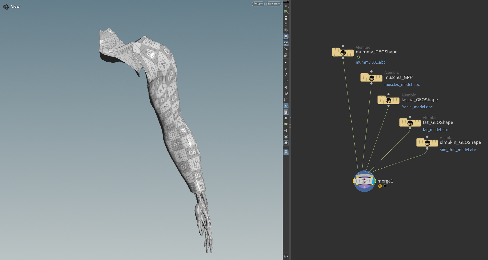
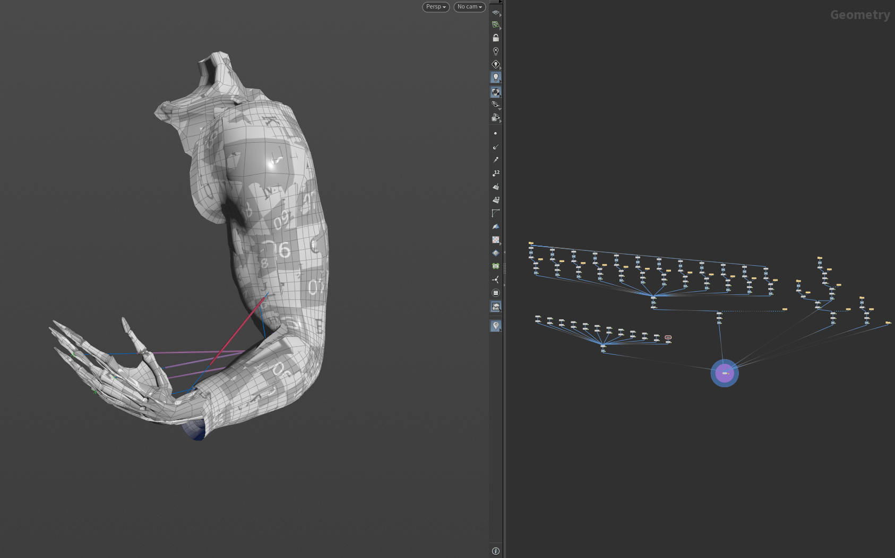

# AdnTurbo

The AdnTurbo script is a Python script that automates the setup of an AdonisFX rig on a clean asset. It configures the following layers in sequence:

- **Muscle layer**
- **Locators and Sensors**
- **Glue layer**
- **Fascia layer**
- **Fat layer**
- **Skin layer**

Please, check this [section](#limitations) to know more about the current limitations.

The main function to run AdnTurbo is `apply_turbo`, which is defined as follows:

<pre><code style="white-space: pre; margin: 20px 0; padding: 10px; box-sizing: border-box;">from adn.scripts.houdini.turbo import apply_turbo

def apply_turbo(
    mummy,                           # str: name or path of the skeletal mesh
    muscles,                         # str or list: muscle geometry names
    fascia=None,                     # str: fascia geometry name
    fat=None,                        # str: fat geometry name
    skin=None,                       # str: skin geometry name
    glue=True,                       # bool: enable glue layer
    locators=True,                   # bool: enable creation of locators and sensors
    space_scale=1.0,                 # float: simulation scale factor
    force=False,                     # bool: remove existing AdonisFX nodes
    muscle_piece_attrib_name="path", # str: name of the primitive attribute used to separate the muscles
    report_data=None                 # dict: collects errors and warnings
)
</code></pre>

## Requirements

Each layer builds upon the previous one, this means that a specific layer cannot be created unless all the previous layer inputs have been provided. This rule applies to all the layers except for **Locators and Sensors**, which can be enabled or disabled without affecting the building of other layers.

To configure at least the muscle layer, the following inputs are required:

- **mummy**: the skeletal mesh that drives the muscle simulation.
- **muscles**: one or more meshes representing muscles.

When these two inputs are provided, the muscle layer will be completely configured including AdonisFX locators and sensors.

To configure the downstream layers, the following inputs have to be provided:

- **locators**: flag indicating if locators and sensors have to be built.
- **glue**: flag indicating if the glue layer has to be built.
- **fascia**: the fascia mesh to which AdnSkin is applied. The **glue** input must be `True` for the fascia layer to be built.
- **fat**: the fat mesh to which AdnFat is applied. The **fascia** input must be provided for the fat layer to be built.
- **skin**: the skin mesh to which AdnSkin is applied. The **fat** input must be provided for the skin layer to be built.

> [!NOTE]
> - Muscles can be provided as a combined mesh (i.e. a single geometry node containing all the muscles) or as a list of separated muscles.
> - If muscles are provided as a combined mesh, the geostream must contain a primitive attribute, passed to `apply_turbo` via the `muscle_piece_attrib_name` argument, to allow AdnTurbo to identify each individual muscle.

## Arguments

In this section we provide a brief overview of the arguments of the `apply_turbo` function.

| Argument | Required | Type | Default | Description |
| :------- | :------- | :--- | :------ | :---------- |
| **mummy**                    | Yes      | string         |        | Path to the node that contains the skeletal mesh that drives the muscle simulation. |
| **muscles**                  | Yes      | string or list |        | Geometries to apply an AdnMuscle SOP to. It can be: 1) path to the node containing the geometry of all the muscles; 2) list of paths to the nodes containing each isolated muscle geometry. |
| **fascia**                   | Optional | string         | None   | Path to the node that contains the geometry to apply the AdnSkin SOP to. Requires `glue=True`. |
| **fat**                      | Optional | string         | None   | Path to the node that contains the geometry to apply the AdnFat SOP to. Requires fascia to be provided first. |
| **skin**                     | Optional | string         | None   | Path to the node that contains the geometry to apply the AdnSkin SOP to. Requires fat to be provided first. |
| **glue**                     | Optional | bool           | True   | If True, creates an AdnGlue node using all muscles merged as input. |
| **locators**                 | Optional | bool           | True   | If True, creates sticky nodes, sensors and locators for each muscle. |
| **space_scale**              | Optional | float          | 1.0    | Factor to scale simulation space. It will be set to the space scale attribute of all the solvers created. |
| **force**                    | Optional | bool           | False  | If True, deletes all existing AdonisFX nodes before executing to create the new nodes from a clean scene. |
| **muscle_piece_attrib_name** | Optional | string         | `path` | String defining the name of the primitive attribute that will be used to identify each muscle geometry. |
| **report_data**              | Optional | dictionary     | None   | A dictionary (`{"errors": [], "warnings": []}`) to capture any issues during execution. |

## How to use

1. Open a scene containing the geometries for all the layers to be built.

<figure style="width:90%; margin-left:5%" markdown>
  
  <figcaption><b>Figure 1</b>: Starting point to execute the AdnTurbo script onto an arm asset. The scene contains the geometries for: mummy, muscles, fascia, fat and skin.</figcaption>
</figure>

2. Create the arguments for the `apply_turbo` function.

<pre><code style="white-space: pre; margin: 20px 0; padding: 10px; box-sizing: border-box;">mummy       = "/obj/geo1/mummy_GEOShape"
muscles     = "/obj/geo1/muscles_GRP"
locators    = True
glue        = True
fascia      = "/obj/geo1/fascia_GEOShape"
fat         = "/obj/geo1/fat_GEOShape"
skin        = "/obj/geo1/simSkin_GEOShape"
report_data = {"errors": [], "warnings": []}
</code></pre>

3. Run the following command in a Python Script tab by providing the previous arguments.

<pre><code style="white-space: pre; margin: 20px 0; padding: 10px; box-sizing: border-box;">from adn.scripts.houdini.turbo import apply_turbo
apply_turbo(
    mummy,
    muscles,
    fascia=fascia,
    fat=fat,
    skin=skin,
    glue=glue,
    locators=locators,
    report_data=report_data
)
</code></pre>

> [!NOTE]
> It is recommended to pass optional arguments using keyword syntax (e.g. `fascia=fascia`), since the `apply_turbo` function defines additional parameters that may be unused and could lead to incorrect behavior if values are passed positionally.

<figure style="width:90%; margin-left:5%" markdown>
  
  <figcaption><b>Figure 2</b>: All simulation layers configured after the execution: muscles, glue, fascia, fat and skin (including locators and sensors).</figcaption>
</figure>

4. If something goes wrong during the execution, error and warning messages will be added to the `report_data` dictionary. Execute the following code to log all the information in the terminal for troubleshooting.

<pre><code style="white-space: pre; margin: 20px 0; padding: 10px; box-sizing: border-box;">import logging
for err in report_data["errors"]:
    logging.error(err)
for warn in report_data["warnings"]:
    logging.warning(warn)
</code></pre>

> [!NOTE]
> - Note that the whole AdnTurbo can be undone.
> - If there are AdonisFX nodes in the scene and the `force` argument is set to `False` the AdnTurbo script will generate an error in `report_data` indicating to clear the scene or to run the script again with `force=True` to automatically delete all the AdonisFX nodes.
> - Fascia and fat meshes must have the same topology for the AdnFat deformer to be created by AdnTurbo.
> - AdnTurbo can also be executed with the **AdnTurbo Tool**. For more details, please refer to the [AdnTurbo Tool page](../tools/turbo_tool).

## Result

As a result of executing the script by providing the geometries for all the layers, the following nodes will be created:

- An AdnMuscle for each muscle geometry with the mummy geometry as target.
- An AdonisFX locator and sensor for each AdnMuscle to drive the muscle activation.
- An AdnGlue node with all the muscles merged as input.
- An AdnSkin node for the fascia geometry with the mummy and glue as targets.
- An AdnRelax node applied on top of the fascia AdnSkin.
- An AdnFat node for the fat geometry with the fascia geometry as base mesh.
- An AdnRelax node applied on top of the AdnFat.
- An AdnSkin node for the skin geometry.

## Limitations

- The glue layer cannot be bypassed. This means that if the `fascia` argument is provided, the `glue` flag must be `True` for the script to complete successfully.
- The default values that the AdnTurbo script will use to configure each deformer cannot be customized.
