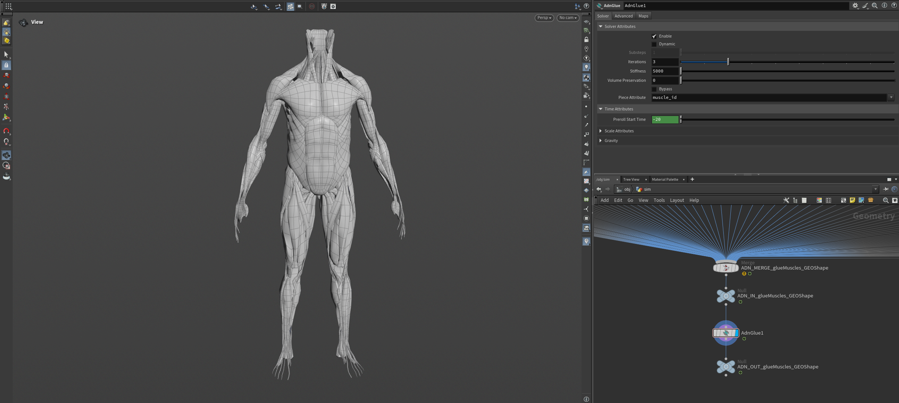
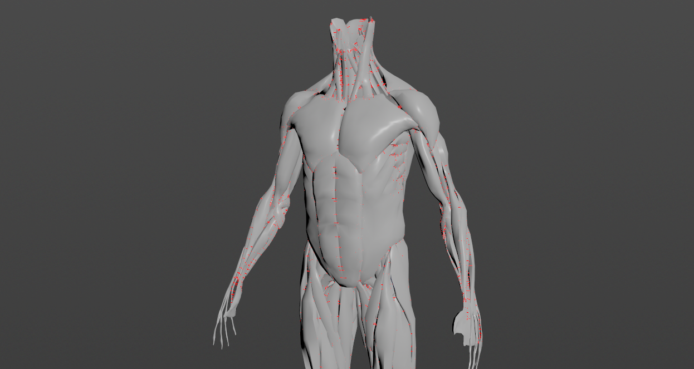
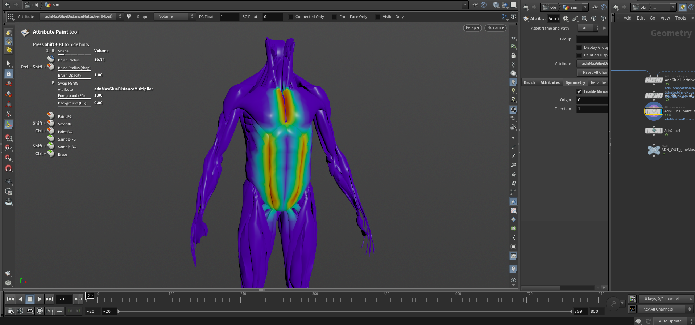
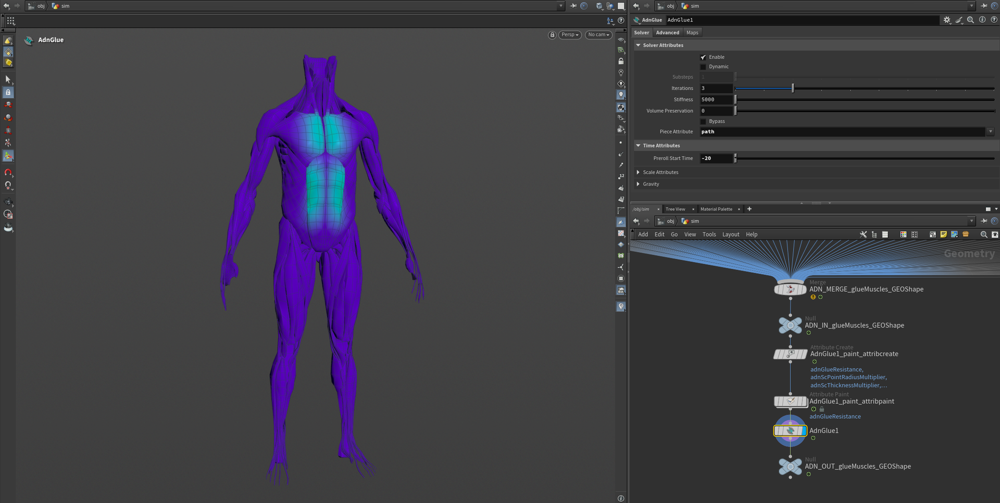

# A Simple Setup

This page is dedicated to explain, step by step, a simple process of creating and setting every AdonisFX SOP in Houdini. The scenarios presented here are intended to provide the minimum required configurations to obtain plausible results.

## AdnMuscle

## AdnRibbonMuscle

## AdnGlue

To make the simulated muscles behave more compact and avoid large gaps between them, an AdnGlue node can be used. To create a basic scenario using the AdnGlue node, start with a scene with the following elements:

  - A list of simulated muscles to be glued together.
  - A merge node that combines the simulated muscles into a single geometry.

The AdnGlue node will take all the simulated muscles merged as a single input.

> [!NOTE]
> AdnGlue requires the input geometry to contain a primitive attribute to be able to identify each muscle.

### Create Node

To create the AdnGlue node, press TAB and navigate to the submenu AdonisFX > Solvers to find the AdnGlue {style="width:4%"} SOP type. Then connect the merged muscles to the AdnGlue input.

<figure>
   
  <figcaption><b>Figure X</b>: AdnGlue SOP creation scenario.</figcaption>
</figure>

After the node creation, input muscles can be added or removed from the existing AdnGlue by pressing AdonisFX > Glue > *Add Inputs* or AdonisFX > Glue > *Remove Inputs* respectively.

Input muscles can be added or removed from the existing AdnGlue by connecting or disconnecting them from the merge node. After that, make sure to recook the AdnGlue at preroll start time for this change to take effect.

> [!NOTE]
> Adding and removing inputs requires to revisit and update the paintable maps to ensure that the painted values are correct for the new list of geometries.

The *Max Glue Distance* attribute is set to 0.0 by default. Therefore, for the glue constraints to take effect, this value must be adjusted.

### Paint Weights

Once the AdnGlue node is properly created, you can use Maya Paint Tool to paint its weights and correctly set up the node properties. With the *Max Glue Distance* previously adjusted, the default values of the paintable maps already allow the node to compute the glue constraints.

Once the AdnGlue node is properly created, an *Attribute Paint* node can be used to paint its weights and correctly setup the node properties. To ease this process the *Make Paintable* utility found in the AdonisFX menu can be used. Pressing this option with the AdnGlue node selected will add the following nodes to the deformable chain:
- Attribute Create node to create and set the default values for the point attributes corresponding to the paintable maps.
- Attribute Paint node to be able to modify those point attributes.

<!-- TODO: Continue here -->

<figure>
   
  <figcaption><b>Figure X</b>: Deformable chain after using the "Make Paintable" utility.</figcaption>
</figure>

The most important maps are *Glue Resistance*, *Max Glue Distance Multiplier*, and *Shape Preservation*. The first two are flooded with a value of 1.0 by default, while the last one is flooded with 0.0.

Since the *Max Glue Distance* is initially the same for all muscles, you may want to adjust it for specific areas. This can be done by painting the *Max Glue Distance Multiplier* map. You can paint this map with a value of 0.0 in areas where you do not want the glue constraint to apply. This prevents the creation of the constraint in those areas and can improve the simulation performance.

<figure>
   
  <figcaption><b>Figure 22</b>: Glue Distance Multiplier map painted in specific areas where muscles are supposed to be glued together.</figcaption>
</figure>

<figure>
   
  <figcaption><b>Figure 23</b>: Displaying the Glue Constraints debugger after painting the Glue Distance Multiplier in the target area.</figcaption>
</figure>

The *Glue Resistance* map modulates the strength of the glue constraint. To reduce the effect of the constraint in specific areas, lower the values in this map accordingly. Glue constraints won't be computed for vertices with a weight value of 0.0.

<figure>
   
  <figcaption><b>Figure 24</b>: Glue Resistance map painted in specific areas where muscles are supposed to be glued together.</figcaption>
</figure>

Finally, shape preservation constraints help to maintain the original shape of the muscles. These constraints are useful if the gluing produces undesired shape on the output mesh. If that is not the case, then this map can stay unmodified (0.0) which will make the solver run faster. If shape preservation is required, then increase the values on those areas where the shape has been altered during the simulation.

> [!NOTE]
> In case you are experiencing issues trying to paint weights on the AdnGlue output geometry, find in the [limitations section of AdnGlue](solvers/glue#limitations) a proposed workaround.

## AdnFat

## AdnSkin

## AdnRelax

## AdnPush

## AdnSkinMerge

## AdnSimshape
