# A Simple Setup

This page is dedicated to explain, step by step, a simple process of creating and setting the main AdonisFX solvers and deformers SOPs in Houdini. The scenarios presented here are intended to provide the minimum required configurations to obtain plausible results.

## AdnMuscle

To create a basic scenario using the AdnMuscle SOP deformer, start with a scene with the following elements:

 - An animation rig or a skeletal mesh (i.e. the mummy) or both.
 - A geometry representing the muscle to simulate.

In this case the proposed example is to simulate a biceps in an animated full body rig. The AdnMuscle SOP will be applied to the mesh of the biceps.

<figure style="width:75%" markdown>
  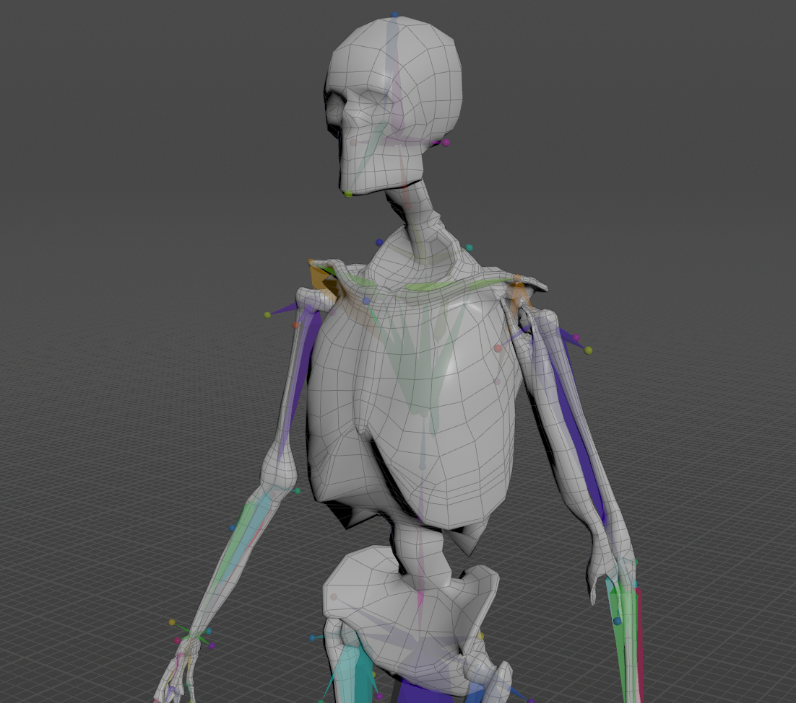
  <figcaption><b>Figure 1</b>: Basic setup for biceps simulations.</figcaption>
</figure>

### Create Deformer

To create the AdnMuscle SOP, press TAB and navigate to the submenu AdonisFX > Solvers to find the AdnMuscle SOP {style="width:4%"} type. Then connect the muscle geometry to the input of the AdnMuscle node.

<figure markdown>
  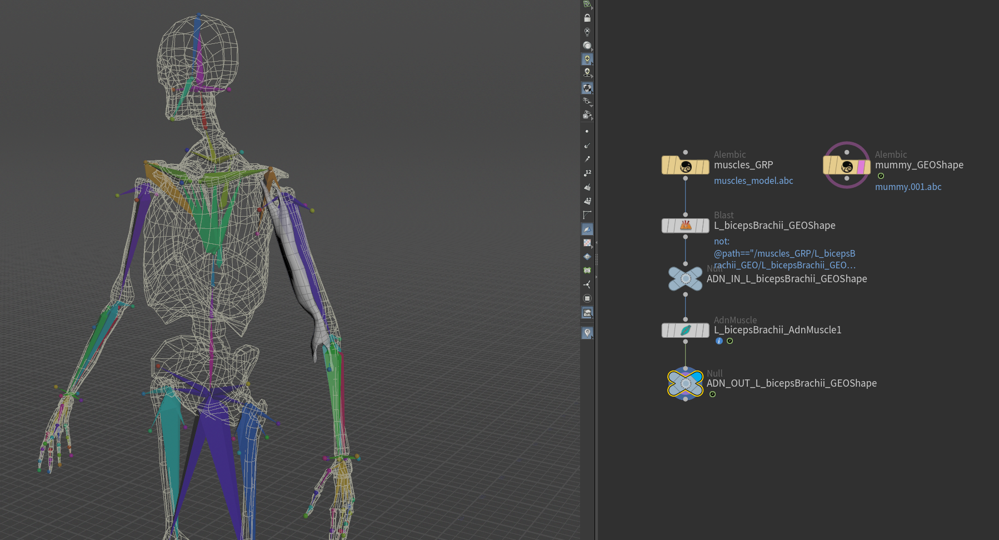
  <figcaption><b>Figure 2</b>: AdnMuscle SOP creation scenario. Using null nodes with ADN_IN_ and ADN_OUT_ prefixes to encapsulate the AdonisFX deformable section is recommended to keep the network compatible with the API.</figcaption>
</figure>

In order to add targets to the muscles, go to the *Targets* tab on the AdnMuscle node, press **+** under the *Targets* collapsible to add a new entry and provide the path to the SOP containing the target geometry. The geometries added as targets can be used to drive attachment to geometry and slide on geometry constraints.

> - Attachments to geometry and slide on geometry constraints are meant to simulate muscle-to-bone and muscle-to-muscle interactions.
> - For muscle-to-muscle interactions, only unidirectional relationships are supported. This means that having muscles A and B, it is possible to assign A as target of B or B as target of A, but not the two at the same time.

It is also possible to define attachments to the joints of the rig by pressing **+** under the *Attachments To Transform* collapsible and providing the SOP path of the joint to which the muscle will be attached.

Optionally, add Slide On Segment Constraints. This constraint works in a similar way to Slide On Geometry Constraints, however, instead of providing a geometry, a pair of joints of the rig will be specified representing the segment the muscle will slide on. Press **+** under the *Slide On Segment Constraints* collapsible and provide the SOP paths to a pair of joints of the rig (e.g. shoulder and elbow).

<figure style="width:75%" markdown>
  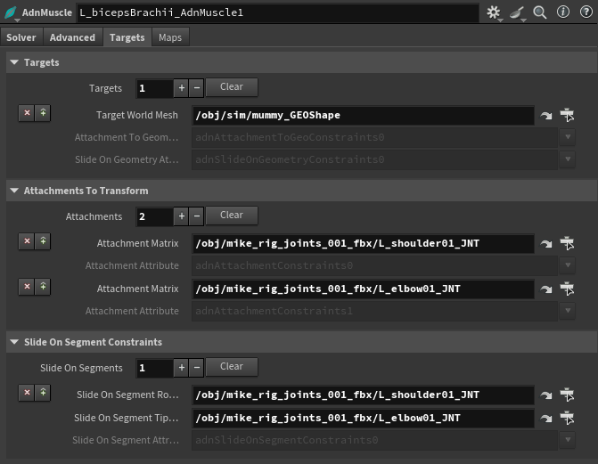
  <figcaption><b>Figure 3</b>: AdnMuscle Targets tab configured with: the mummy geometry as target, the shoulder and elbow joints as attachment and as a segment.</figcaption>
</figure>

### Paint Weights

To tweak the point attributes of an AdnMuscle SOP, an `attribpaint` is needed. To ease the creation and initial configuration of this node, select the AdnMuscle SOP and click on AdonisFX > Utils > Make Paintable. This utility will create an `attribcreate` node to define the required point attributes and assign their default values followed by an `attribpaint` node to allow these attributes to be modified. Both nodes are automatically named and properly connected to the AdnMuscle node.

<figure style="width:75%" markdown>
  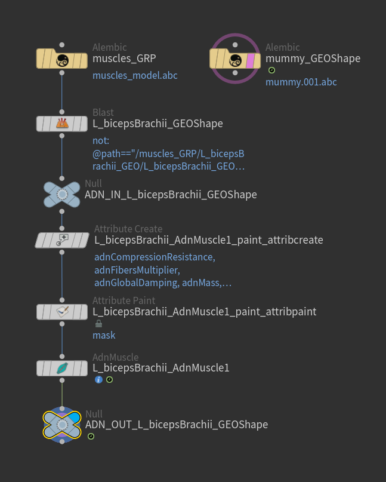
  <figcaption><b>Figure 4</b>: Deformable section after using the "Make Paintable" utility.</figcaption>
</figure>

Start by painting attachment weights, painting the influence for each target by selecting the corresponding target from the list and painting its desired influence.

> [!NOTE]
> In this example the influence painting for both types of attachment constraint is shown. The different types of attachments can be used together or not depending on the needs of the simulation and the rig setup.

<figure markdown>
  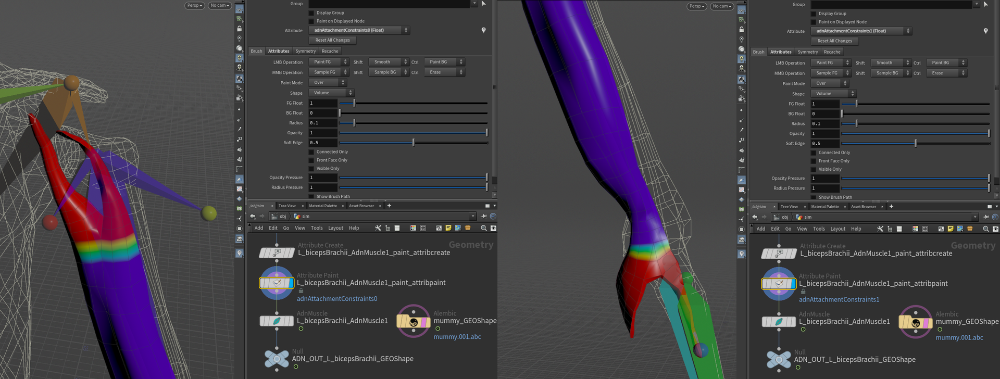
  <figcaption><b>Figure 5</b>: Transform Attachment influences (joints and locators).</figcaption>
</figure>

<figure style="width:75%" markdown>
  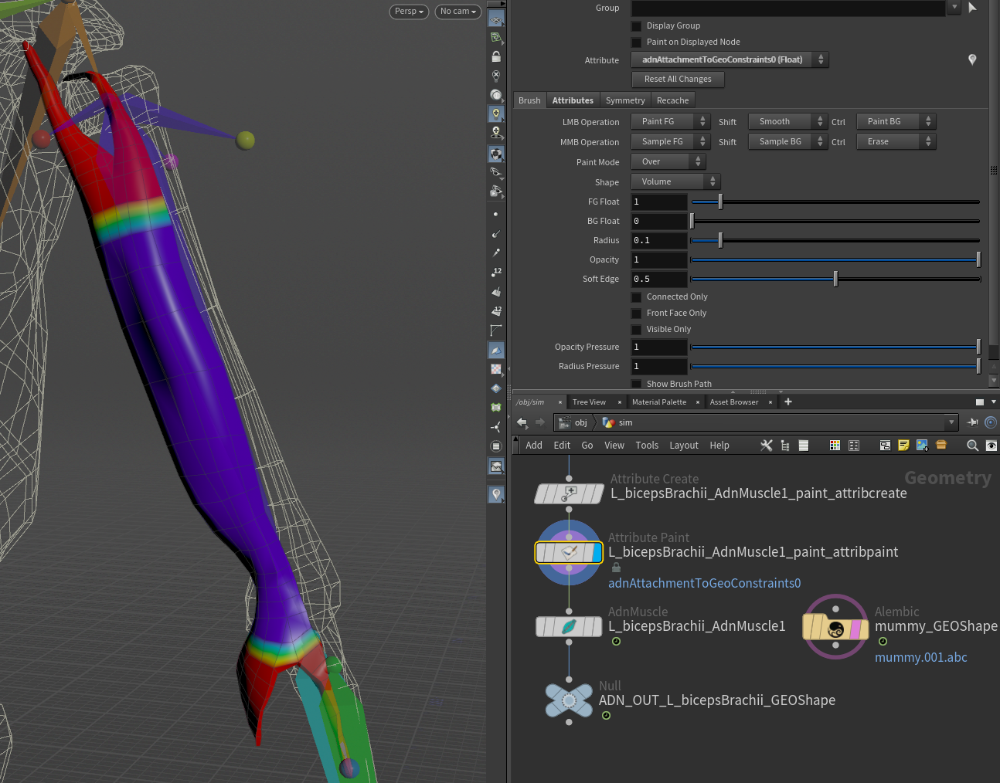
  <figcaption><b>Figure 6</b>: Geometry Attachment influences (meshes).</figcaption>
</figure>

Then, paint the muscle tendon weights, by selecting the *Tendon* attribute from the *Attribute* enumerator and paint over the parts of the muscle that should have tendon tissue.

<figure style="width:75%" markdown>
  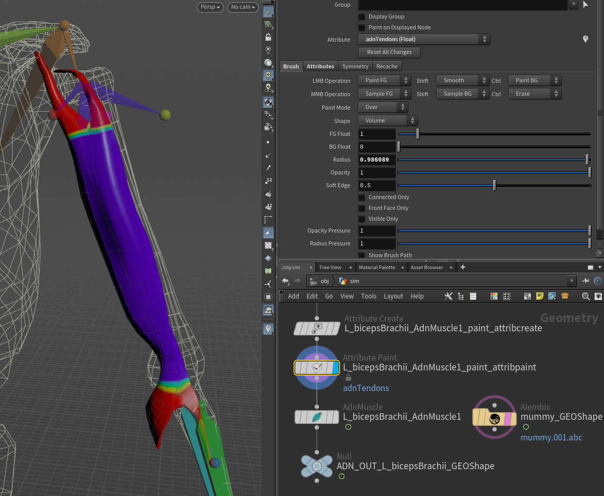
  <figcaption><b>Figure 7</b>: Tendon weights for biceps.</figcaption>
</figure>

Once tendons are painted it is possible to groom the fibers making use of the AdnFiberGroom HDA. To create this node, press TAB, navigate to the submenu AdonisFX > Utils to find the AdnFiberGroom {style="width:4%"} HDA type and connect it to the AdnMuscle after the `attribpaint` node.

To simplify the creation of the AdnFiberGroom HDA, AdonisFX provides *Make Groomable* utility in AdonisFX > Utils. Use this utility by providing the corresponding AdnMuscle SOP in the selection to create an AdnFiberGroom node that computes the initial fiber directions based on the previously painted `adnTendons` map. It also allows to further groom and refine the fibers if additional adjustments are needed. The AdnFiberGroom node will be automatically named and properly connected to the muscle SOP node.

<figure style="width:70%" markdown>
  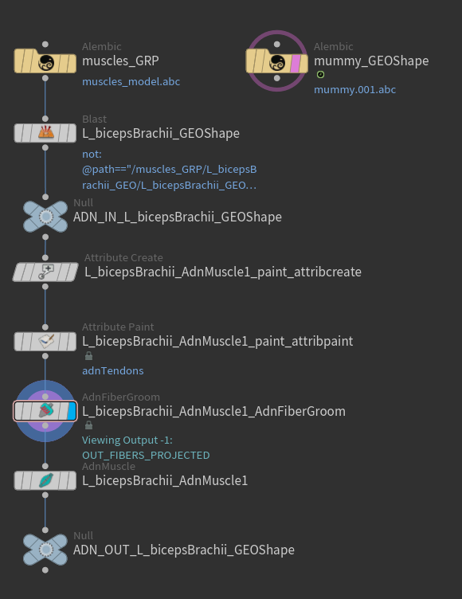
  <figcaption><b>Figure 8</b>: Deformable section after using the "Make Groomable" utility.</figcaption>
</figure>

<figure style="width:75%" markdown>
  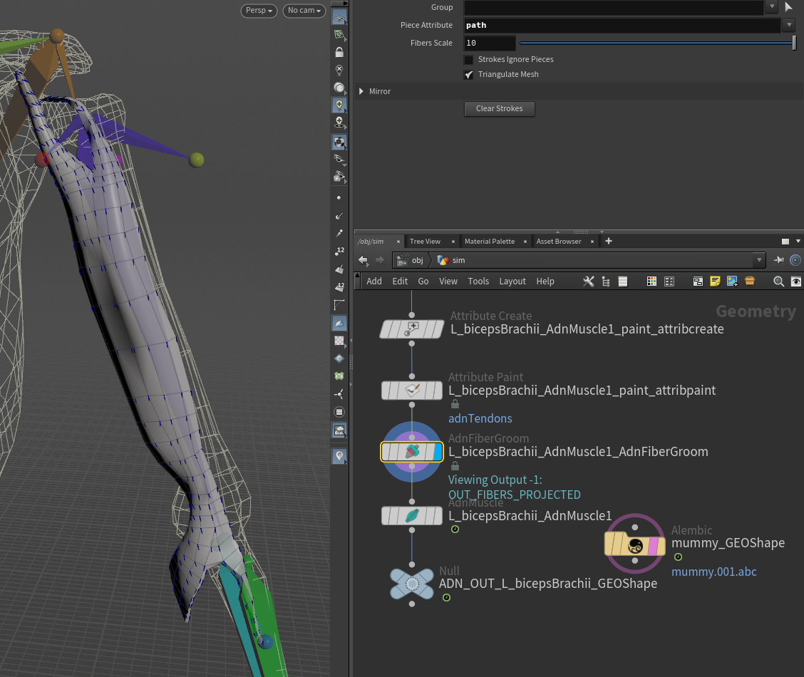
  <figcaption><b>Figure 9</b>: Muscle fibers grooming.</figcaption>
</figure>

Finally, paint Slide On Segment or Slide On Geometry Constraints (if added). It is recommended to paint only the vertices that are not attached to the rig. In this example, the tendons are painted with a value of 0.0, while the rest of the shape is painted to 1.0 or lower values.

<figure style="width:75%" markdown>
  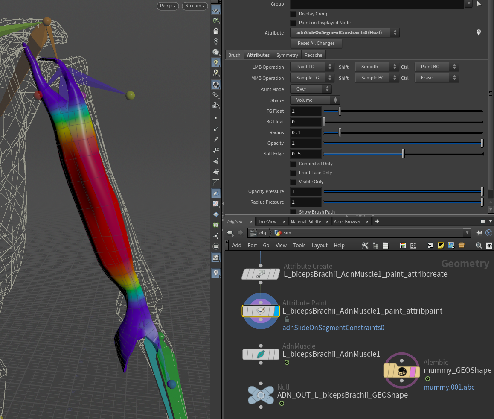
  <figcaption><b>Figure 10</b>: Slide on segment weights for biceps.</figcaption>
</figure>

<figure style="width:75%" markdown>
  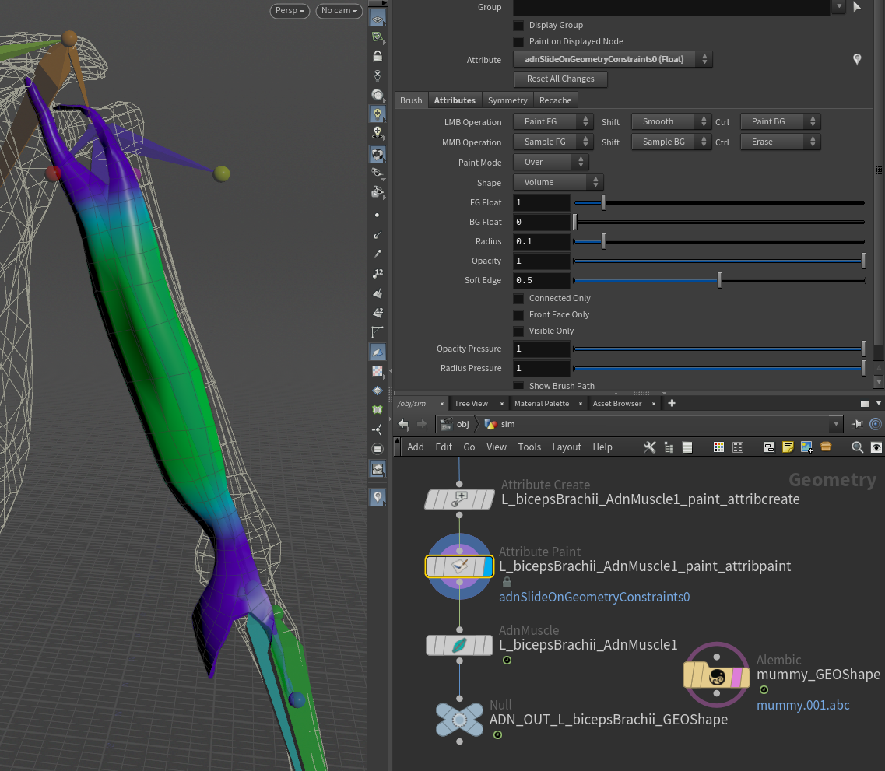
  <figcaption><b>Figure 11</b>: Slide on geometry weights for biceps.</figcaption>
</figure>

### Connect Sensors

To have the muscle changing and responding to external inputs (i.e. the flexion of the arm), AdnSensorRotation can be added to drive the activation of the muscle. 

To do this, first create a rotation sensor to compute the elbow angle. Press TAB and navigate to the submenu AdonisFX > Sensors to find the AdnSensorRotation {style="width:4%"} SOP type.

Then create a rotation locator to visualize the elbow angle. Press TAB and navigate to the submenu AdonisFX > Locators to find the AdnLocatorRotation {style="width:4%"} SOP type and connect the sensor to the locator.

Once the sensor and locator are created, go to the *Input* tab of both nodes and provide the SOP paths to the transform nodes from which to extract the transformation information (e.g. shoulder, elbow and wrist joints). Alternatively, use the "Operator Chooser" in the locator and sensor UI to select the correct target nodes containing transform information. Generally these input nodes will be located on the */obj* level as a null, joint or rivet.

<figure style="width:75%" markdown>
  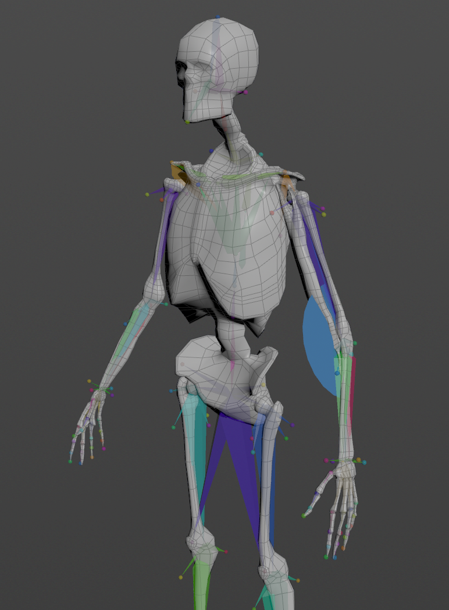
  <figcaption><b>Figure 12</b>: Rotation locator and sensor setup in elbow.</figcaption>
</figure>

Now that the locator is created it has to be connected to the deformer. In order to make this connection, use a detail or channel expression. This will allow for the AdnMuscle SOP to pick up the activation attribute from the locator:

  - Detail expression: `detail("/obj/geo1/L_adnLocatorRotation_armFlexionShape", "adnActivationRotation", 0)`
  - Channel expression: `ch("../L_adnLocatorRotation_armFlexionShape/adnActivationRotation")`

<figure style="width:75%" markdown>
  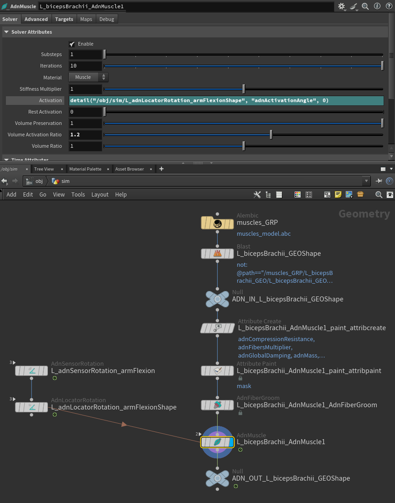
  <figcaption><b>Figure 13</b>: Locator connected via detail expression.</figcaption>
</figure>

When the elbow is flexed (and therefore the angle from the locator gets smaller) the muscle activation will get higher, simulating a much more realistic scenario.

To tweak additional parameters of the AdnMuscle deformer, check this [page](solvers/muscle).

## AdnRibbonMuscle

The process to set up an AdnRibbonMuscle SOP is very similar to the one of setting up an AdnMuscle. It essentially follows the same steps. Start with the following elements:

 - An animation rig or a skeletal mesh (i.e. the mummy) or both.
 - A geometry representing the muscle to simulate.

In this case a planar muscle will be simulated corresponding to a biceps, which will yield similar results to the case of the AdnMuscle SOP previously shown.

<figure style="width:75%" markdown>
  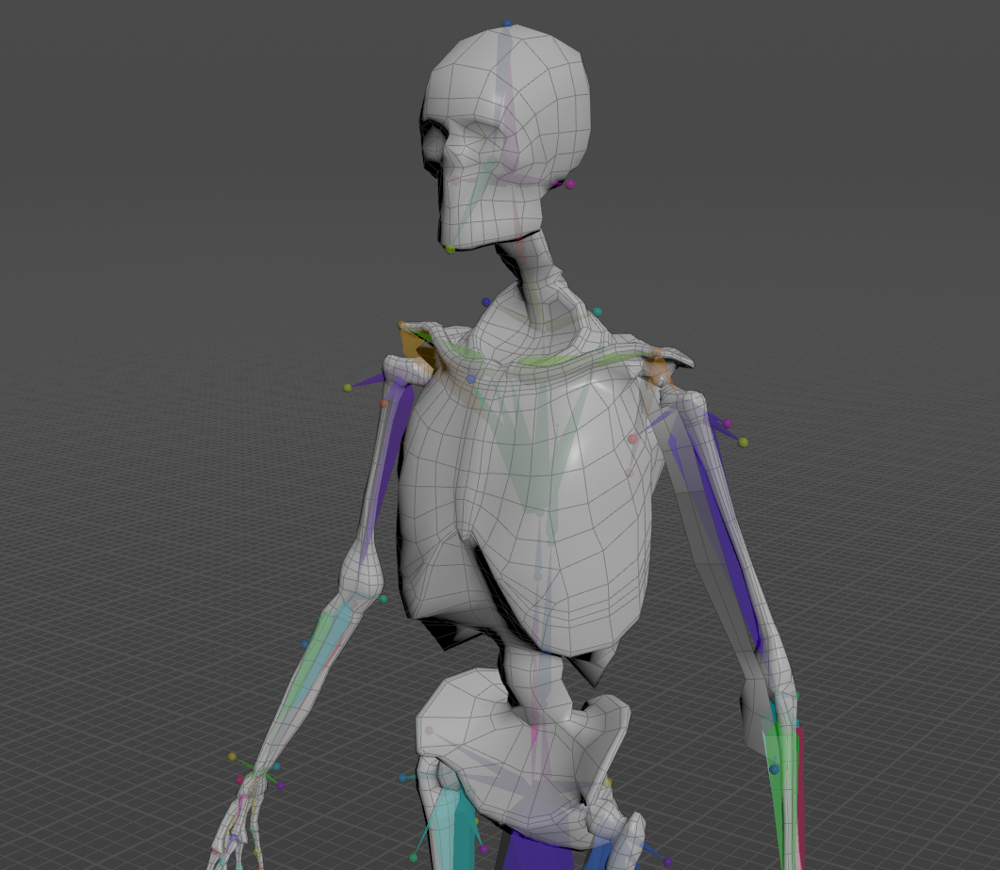
  <figcaption><b>Figure 14</b>: Basic setup for planar biceps simulations.</figcaption>
</figure>

### Create Deformer

Similar to AdnMuscle, to create the AdnRibbonMuscle SOP, press TAB and navigate to the submenu AdonisFX > Solvers to find the AdnRibbonMuscle {style="width:4%"} SOP type. Then connect the planar muscle geometry to the input of the AdnRibbonMuscle node.

<figure markdown>
  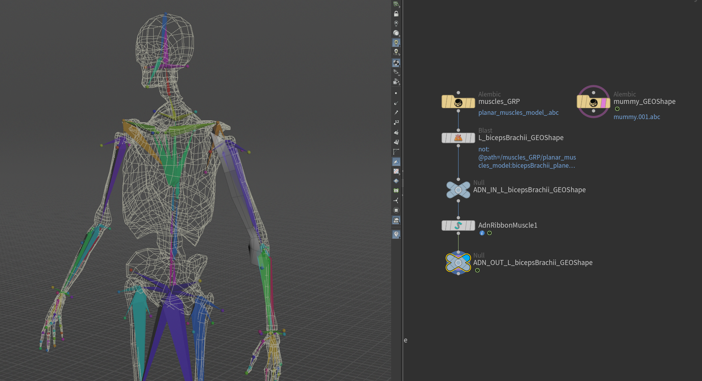
  <figcaption><b>Figure 15</b>: AdnRibbonMuscle SOP creation scenario. Using null nodes with ADN_IN_ and ADN_OUT_ prefixes to encapsulate the AdonisFX deformable section is recommended to keep the network compatible with the API.</figcaption>
</figure>

In order to add targets to the muscles, go to the *Targets* tab on the AdnRibbonMuscle node, press **+** under the *Targets* collapsible to add a new entry and provide the path to the SOP containing the target geometry. The geometries added as targets can be used to drive attachment to geometry and slide on geometry constraints.

> - Attachments to geometry and slide on geometry constraints are meant to simulate muscle-to-bone and muscle-to-muscle interactions.
> - For muscle-to-muscle interactions, only unidirectional relationships are supported. This means that having muscles A and B, it is possible to assign A as target of B or B as target of A, but not the two at the same time.

It is also possible to define attachments to the joints of the rig by pressing **+** under the *Attachments To Transform* collapsible and providing the SOP path of the joint to which the muscle will be attached.

Optionally, add Slide On Segment Constraints. This constraint works in a similar way to Slide On Geometry Constraints, however, instead of providing a geometry, a pair of joints of the rig will be specified representing the segment the muscle will slide on. Press **+** under the *Slide On Segment Constraints* collapsible and provide the SOP paths to a pair of joints of the rig (e.g. shoulder and elbow).

<figure style="width:75%" markdown>
  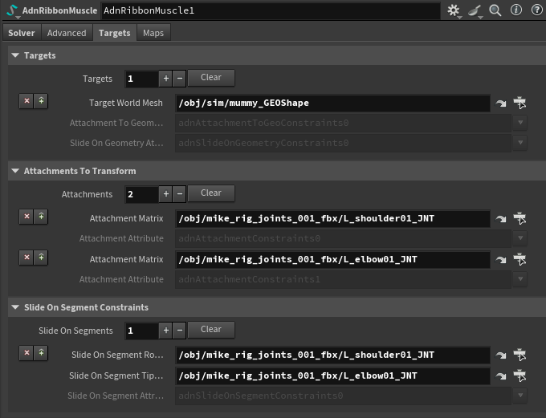
  <figcaption><b>Figure 16</b>: AdnRibbonMuscle Targets tab configured with: the mummy geometry as target, the shoulder and elbow joints as attachment and as a segment.</figcaption>
</figure>

### Paint Weights

To tweak the point attributes of an AdnRibbonMuscle SOP, an `attribpaint` is needed. To ease the creation and initial configuration of this node, select the AdnRibbonMuscle SOP and click on AdonisFX > Utils > Make Paintable. This utility will create an `attribcreate` node to define the required point attributes and assign their default values followed by an `attribpaint` node to allow these attributes to be modified. Both nodes are automatically named and properly connected to the AdnRibbonMuscle node.

<figure style="width:75%" markdown>
  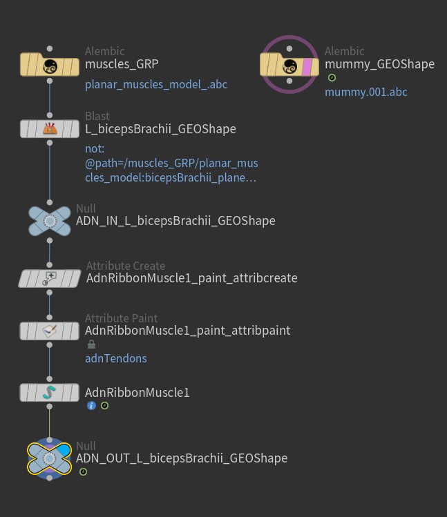
  <figcaption><b>Figure 17</b>: Deformable section after using the "Make Paintable" utility.</figcaption>
</figure>

Start by painting attachment weights, painting the influence for each target by selecting the corresponding target from the list and painting its desired influence.

> [!NOTE]
> In this example the influence painting for both types of attachment constraint is shown. The different types of attachments can be used together or not depending on the needs of the simulation and the rig setup.

<figure markdown>
  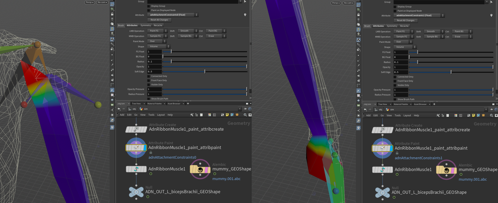
  <figcaption><b>Figure 18</b>: Transform Attachment influences (joints and locators).</figcaption>
</figure>

<figure style="width:75%" markdown>
  
  <figcaption><b>Figure 19</b>: Geometry Attachment influences (meshes).</figcaption>
</figure>

Then, paint the muscle tendon weights, by selecting the *Tendon* attribute from the *Attribute* enumerator and paint over the parts of the muscle that should have tendon tissue.

<figure style="width:75%" markdown>
  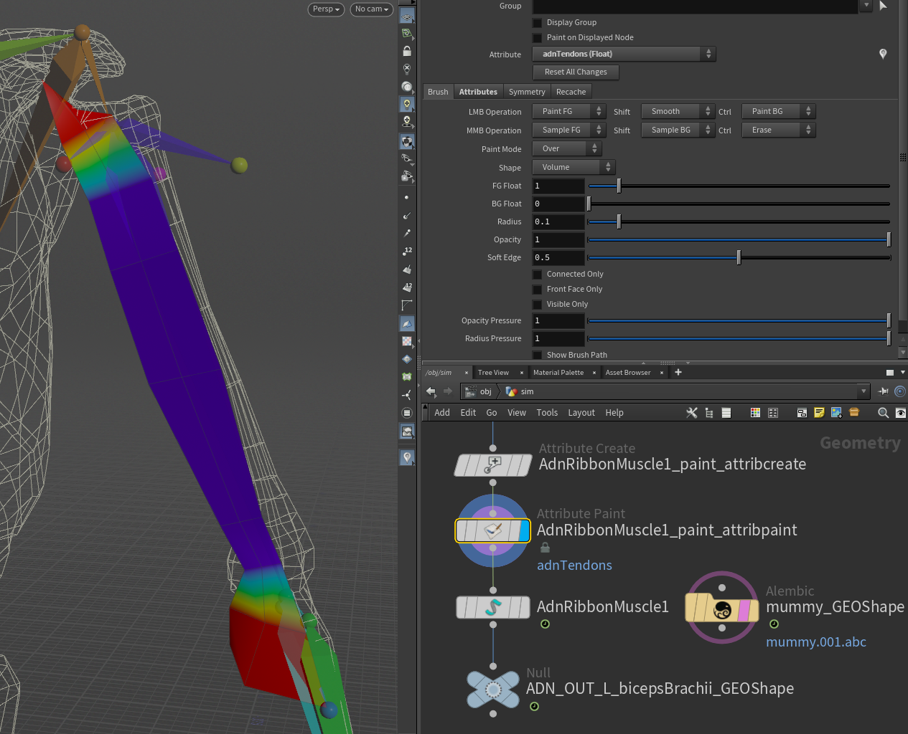
  <figcaption><b>Figure 20</b>: Tendon weights for biceps.</figcaption>
</figure>

Once tendons are painted it is possible to groom the fibers making use of the AdnFiberGroom HDA. To create this node, press TAB, navigate to the submenu AdonisFX > Utils to find the AdnFiberGroom {style="width:4%"} HDA type and connect it to the AdnRibbonMuscle after the `attribpaint` node.

To simplify the creation of the AdnFiberGroom HDA, AdonisFX provides *Make Groomable* utility in AdonisFX > Utils. Use this utility by providing the corresponding AdnRibbonMuscle SOP in the selection to create an AdnFiberGroom node that computes the initial fiber directions based on the previously painted `adnTendons` map. It also allows to further groom and refine the fibers if additional adjustments are needed. The AdnFiberGroom node will be automatically named and properly connected to the muscle SOP node.

<figure style="width:70%" markdown>
  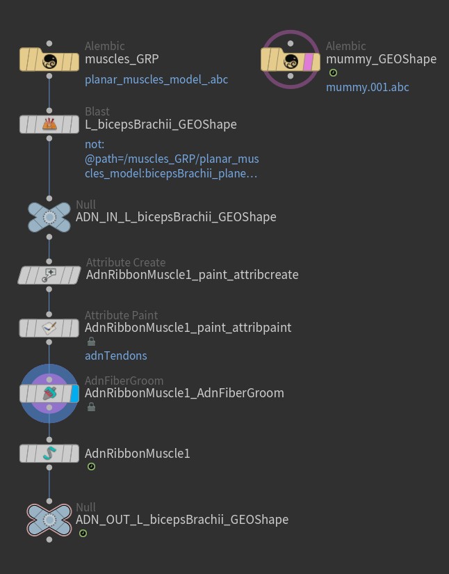
  <figcaption><b>Figure 21</b>: Deformable section after using the "Make Groomable" utility.</figcaption>
</figure>

<figure style="width:75%" markdown>
  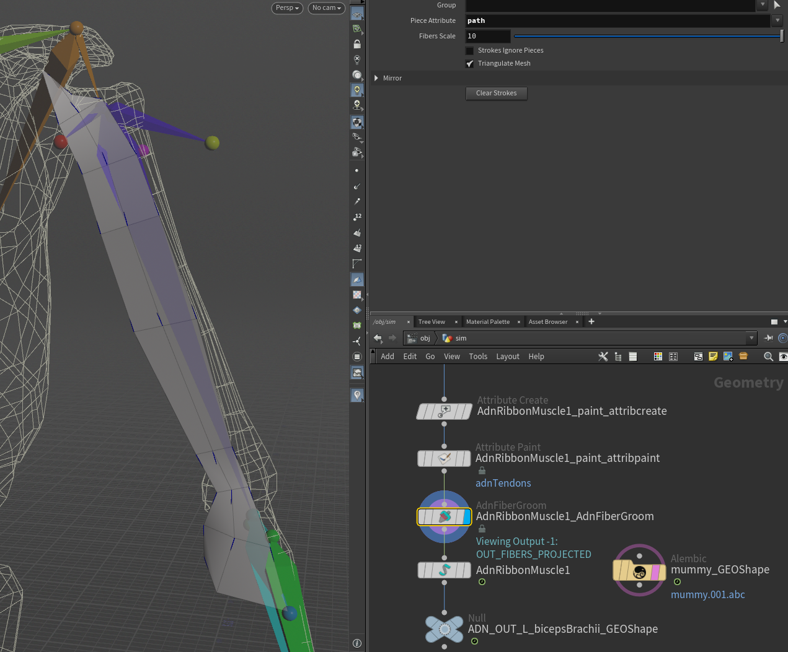
  <figcaption><b>Figure 22</b>: Muscle fibers grooming.</figcaption>
</figure>

Finally, paint Slide On Segment or Slide On Geometry Constraints (if added). It is recommended to paint only the vertices that are not attached to the rig. In this example, the tendons are painted with a value of 0.0, while the rest of the shape is painted to 1.0 or lower values.

<figure style="width:75%" markdown>
  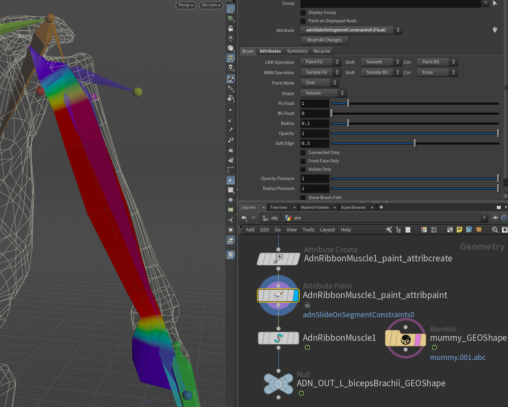
  <figcaption><b>Figure 23</b>: Slide on segment weights for biceps.</figcaption>
</figure>

<figure style="width:75%" markdown>
  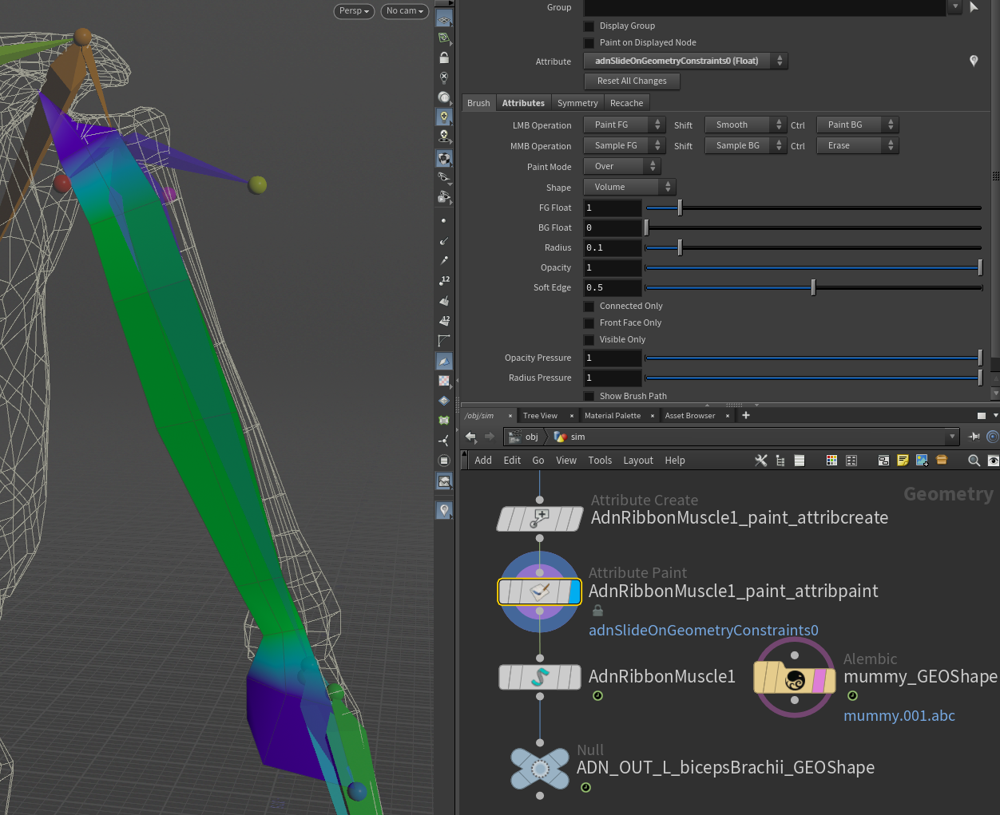
  <figcaption><b>Figure 24</b>: Slide on geometry weights for biceps.</figcaption>
</figure>

### Connect Sensors

The process to connect an AdnSensor to an AdnRibbonMuscle is the exact same as the one followed [here](#connect-sensors).

<figure style="width:75%" markdown>
  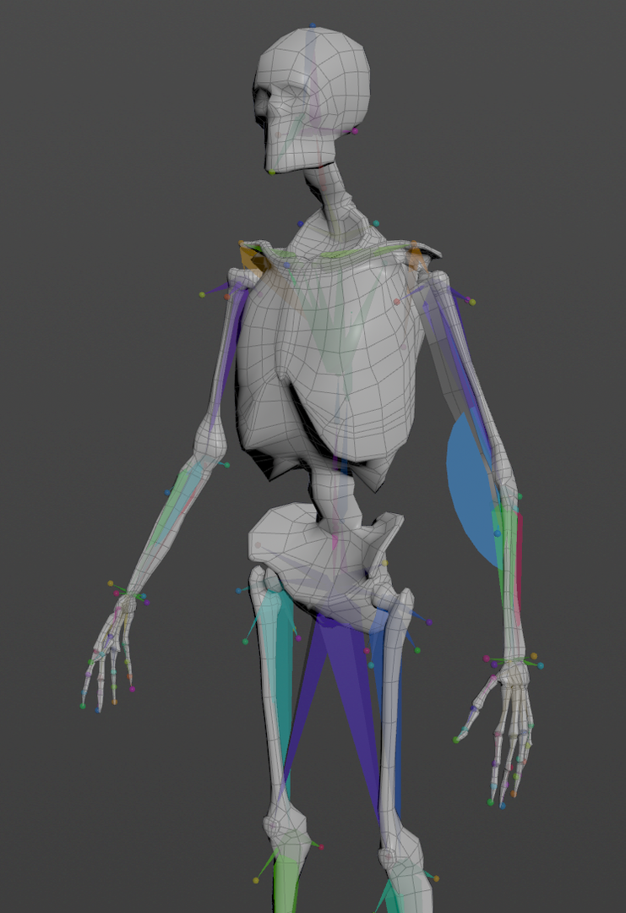
  <figcaption><b>Figure 25</b>: Rotation locator and sensor setup in elbow.</figcaption>
</figure>

To tweak additional parameters of the AdnRibbonMuscle SOP, check this [page](solvers/ribbon.md).

## AdnGlue

To make the simulated muscles behave more compact and avoid large gaps between them, an AdnGlue node can be used. To create a basic scenario using the AdnGlue node, start with a scene with the following elements:

  - A list of simulated muscles to be glued together.
  - A merge node that combines the simulated muscles into a single geometry.

The AdnGlue node will take all the simulated muscles merged as a single input.

> [!NOTE]
> - AdnGlue requires the input geometry to contain a primitive attribute to be able to identify each muscle.
> - If the AdnGlue input does not contain a primitive attribute, click on AdonisFX > Utils > Create Muscle PieceID by having the AdnGlue input selected. This utility will create a `connectivity` node in charge of computing the primitive attribute that will identify each muscle piece.

### Create Node

To create the AdnGlue node, press TAB and navigate to the submenu AdonisFX > Solvers to find the AdnGlue {style="width:4%"} SOP type. Then connect the merged muscles to the AdnGlue input and select the *Piece Attribute* to allow the SOP to identify each muscle piece.

<figure markdown>
  
  <figcaption><b>Figure X</b>: AdnGlue SOP creation scenario. Using null nodes with ADN_IN_ and ADN_OUT_ prefixes to encapsulate the AdonisFX deformable section is recommended to keep the network compatible with the API.</figcaption>
</figure>

Input muscles can be added or removed from the existing AdnGlue by connecting or disconnecting them from the merge node. After that, make sure to recook the AdnGlue at preroll start time for this change to take effect.

> [!NOTE]
> Adding and removing inputs requires to revisit and update the paintable maps to ensure that the painted values are correct for the new list of geometries.

The *Max Glue Distance* attribute is set to 0.0 by default. Therefore, for the glue constraints to take effect, this value must be adjusted.

### Paint Weights

To tweak the point attributes of an AdnGlue SOP, an `attribpaint` is needed. To ease the creation and initial configuration of this node, select the AdnGlue SOP and click on AdonisFX > Utils > Make Paintable. This utility will create an `attribcreate` node to define the required point attributes and assign their default values followed by an `attribpaint` node to allow these attributes to be modified. Both nodes are automatically named and properly connected to the AdnGlue node.

<figure markdown>
  
  <figcaption><b>Figure X</b>: Deformable section after using the "Make Paintable" utility.</figcaption>
</figure>

With the *Max Glue Distance* previously adjusted, the default values of the paintable maps already allow the node to compute the glue constraints.

The most important maps are `adnGlueResistance`, `adnMaxGlueDistanceMultiplier`, and `adnShapePreservation`, which are flooded with a value of 1.0 by default.

Since the *Max Glue Distance* is initially the same for all muscles, you may want to adjust it for specific areas. This can be done by painting the `adnMaxGlueDistanceMultiplier` map. You can paint this map with a value of 0.0 in areas where you do not want the glue constraint to apply. This prevents the creation of the constraint in those areas and can improve the simulation performance.

<figure markdown>
  
  <figcaption><b>Figure X</b>: Example of Glue Distance Multiplier map painted only on the areas between the left and right pectoralis and abdominis muscles. In this case, the glue constraints will be created only between vertices with non-zero value.</figcaption>
</figure>

The `adnGlueResistance` map modulates the strength of the glue constraint. To reduce the effect of the constraint in specific areas, lower the values in this map accordingly. Glue constraints won't be computed for vertices with a weight value of 0.0.

<figure markdown>
  
  <figcaption><b>Figure X</b>: Example of Glue Resistance map painted only on the areas between the left and right pectoralis and abdominis muscles. In this case, the glue constraints will be created only between vertices with non-zero value.</figcaption>
</figure>

Finally, shape preservation constraints help to maintain the original shape of the muscles and are flooded to 1.0 by default. These constraints are useful if the gluing produces undesired shape on the output mesh. If that is not the case, flood the map to 0.0, which will make the solver run faster. If shape preservation is required, then increase the values on those areas where the shape has been altered during the simulation.

## AdnFat

To create a basic scenario using the AdnFat SOP, start with a scene with the following elements:

  - A fat tissue mesh without animation or deformation that will become the simulated mesh.
  - One base mesh to which the fat layer will be attached to. This could be for example the fascia.

<figure markdown>
  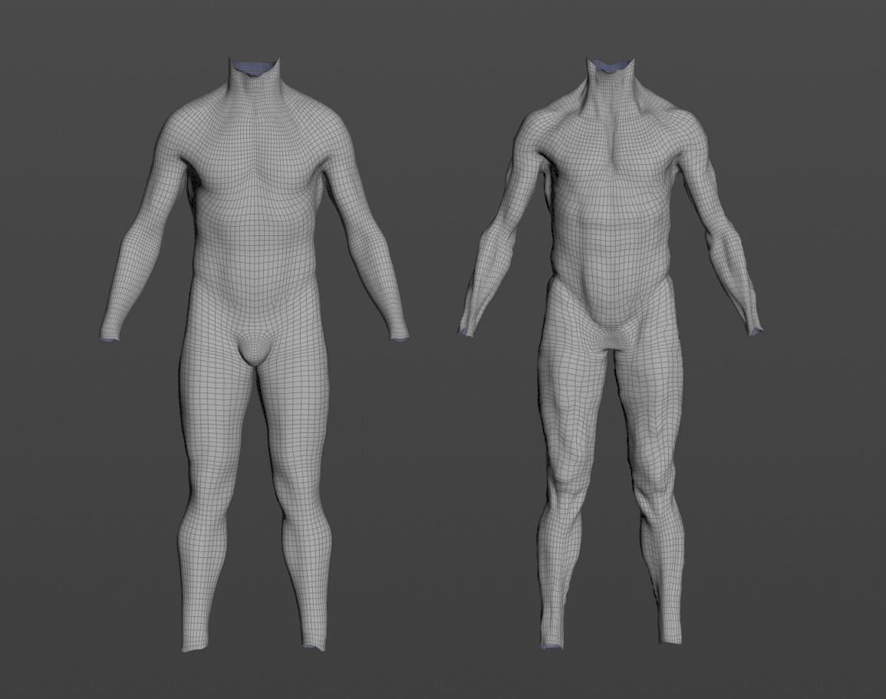
  <figcaption><b>Figure X</b>: Basic setup for fat simulations. The mesh on the left corresponds to the fat tissue to be simulated, while the mesh on the right corresponds to the fascia obtained from the AdnSkin simulation. </figcaption>
</figure>

> [!NOTE]
> - The base mesh and the fat mesh must have the same vertex count and triangulation.
> - Both, the base mesh and the fat mesh must be connected to the AdnFat SOP, otherwise the Fat solver will abort the simulation and the node will display an error.

### Create Node

To create the AdnFat SOP, press TAB and navigate to the submenu AdonisFX > Solvers to find the AdnFat {style="width:4%"} SOP type. Then connect the fat mesh to the first input and the base mesh (e.g. the simulated fascia) to the second input.

<figure markdown>
  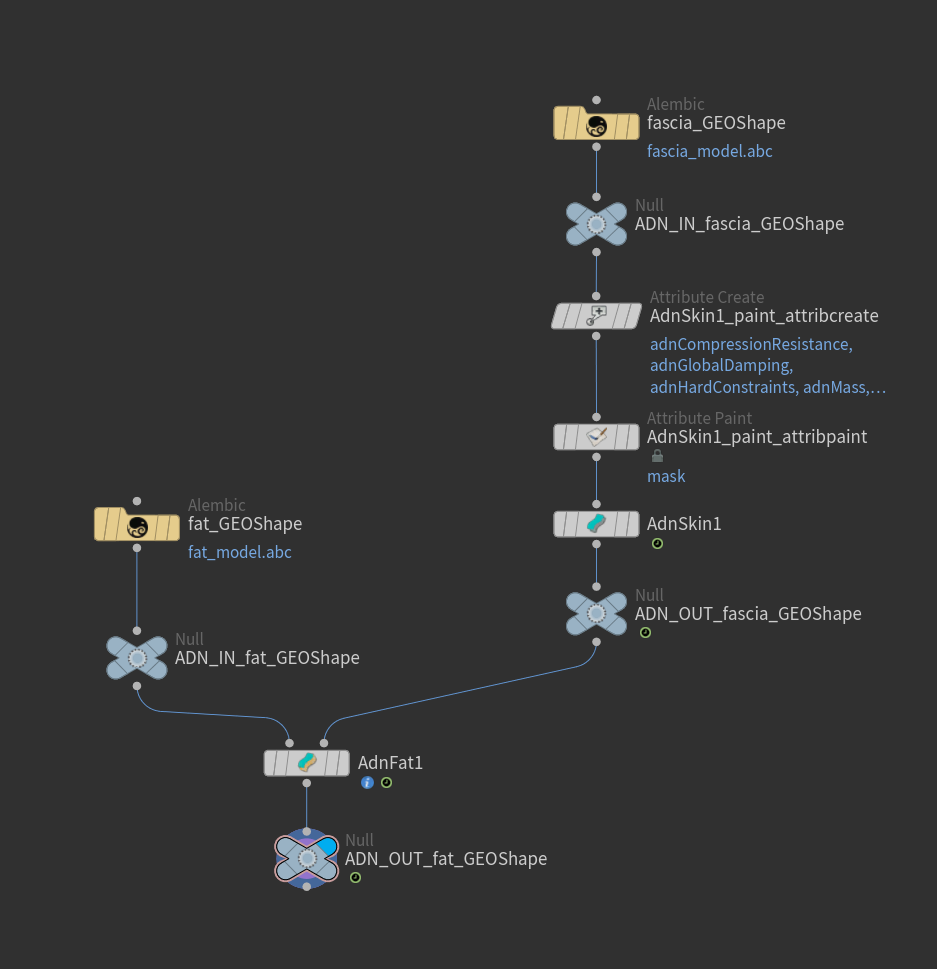
  <figcaption><b>Figure X</b>: AdnFat SOP creation scenario. Using null nodes with ADN_IN_ and ADN_OUT_ prefixes to encapsulate the AdonisFX deformable section is recommended to keep the network compatible with the API.</figcaption>
</figure>

After basic configuration, to alter the dynamics of the fat layer (e.g. adding or reducing the jiggle) it is advisable to tweak the main attributes like: *Iterations*, *Substeps*, *Global Damping Multiplier* or the per-constraint stiffness values in the *Override Constraint Stiffness* section.

### Paint Weights

To tweak the point attributes of an AdnFat SOP, an `attribpaint` is needed. To ease the creation and initial configuration of this node, select the AdnFat SOP and click on AdonisFX > Utils > Make Paintable. This utility will create an `attribcreate` node to define the required point attributes and assign their default values followed by an `attribpaint` node to allow these attributes to be modified. Both nodes are automatically named and properly connected to the AdnFat node.

<figure markdown>
  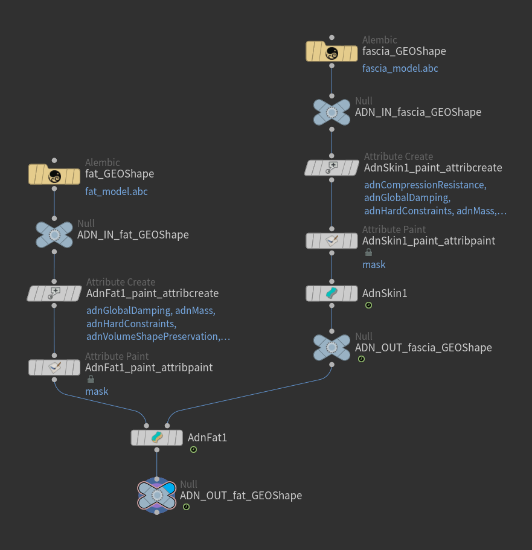
  <figcaption><b>Figure X</b>: Deformable section after using the "Make Paintable" utility.</figcaption>
</figure>

With the default paint setup provided, the simulation should already create plausible results. However, below we walk you through the three main maps that can be altered to modify the behavior of the fat simulation.

In the case of the AdnFat SOP, the most important paintable maps are `adnShapePreservation`, `adnVolumeShapePreservation` and `adnHardConstraints`. The first two are flooded to 1.0 by default, while the last one is flooded to 0.0.

With `adnShapePreservation` being flooded to 1.0 by default, the solver will try to maintain the internal structural shape properties of the fat layer. Reducing this map's values can increase the amount of jiggling in the fat tissue in combination with different other parameters. However, reducing the `adnShapePreservation` map can decrease the fat layer's ability to maintain its shape. Finding the right balance will allow you to get the desired results. It may be advisable to keep this map flooded to 1.0 and reduce its value in areas that don't require any structural shape preservation.

On the other hand, `adnVolumeShapePreservation` will also try to maintain the shape of the fat volume but with different computation mechanisms than `adnShapePreservation`. It is advisable to keep this map flooded to 1.0 for best results and only reduce its value (by flooding the mesh) whenever the shape of the fat layer can be altered during simulation.

Finally, the `adnHardConstraints` map provides additional control for stronger attachments to the base mesh. In most cases, this map can be left unmodified so that the solver does not apply this constraint. However, when there is a large enough gap between the simulated mesh and the base mesh in areas close to edges (e.g. neck, wrists or ankles), it can be useful to paint them with a value of 1.0 to mitigate excessive motion.

<figure markdown>
  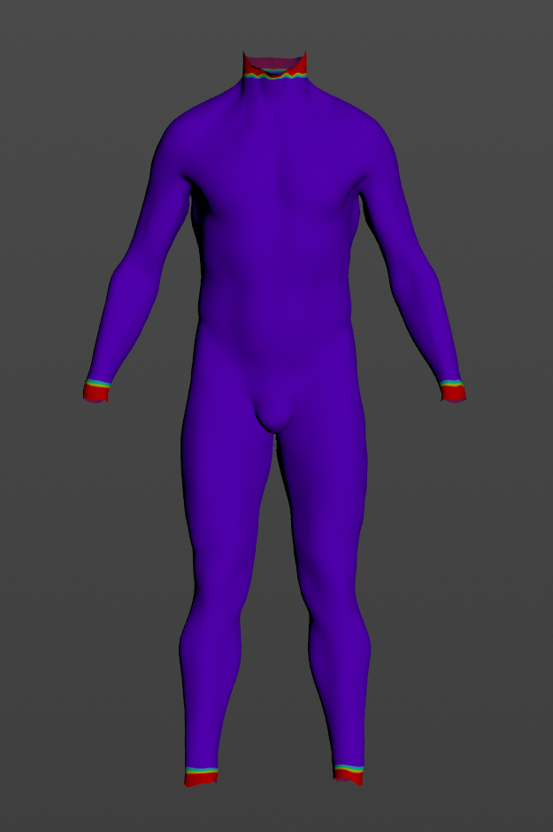
  <figcaption><b>Figure X</b>: Hard constraints weights paint.</figcaption>
</figure>

## AdnSkin

To create a basic scenario using the AdnSkin SOP, start with a scene with the following elements:

  - A skin mesh without animation or deformation.
  - One or more target meshes with deformation.

<figure markdown>
  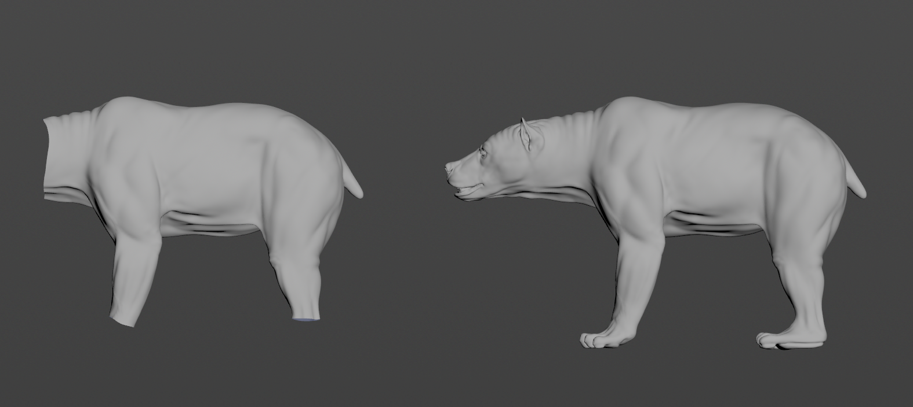
  <figcaption><b>Figure X</b>: Basic setup for skin simulation. The mesh on the left corresponds to the skin mesh to be simulated, while the mesh on the right corresponds to the animated target mesh. </figcaption>
</figure>

### Create Deformer

To create the AdnSkin node, press TAB and navigate to the submenu AdonisFX > Solvers to find the AdnSkin {style="width:4%"} SOP type. Then connect the skin mesh to the AdnSkin input.

To add target mesh(es), go to the *Targets* tab on the AdnSkin node, press **+** to add a new target entry and set the path to the SOP node containing the target geometry to the *Target World Mesh* parameter.

<figure markdown>
  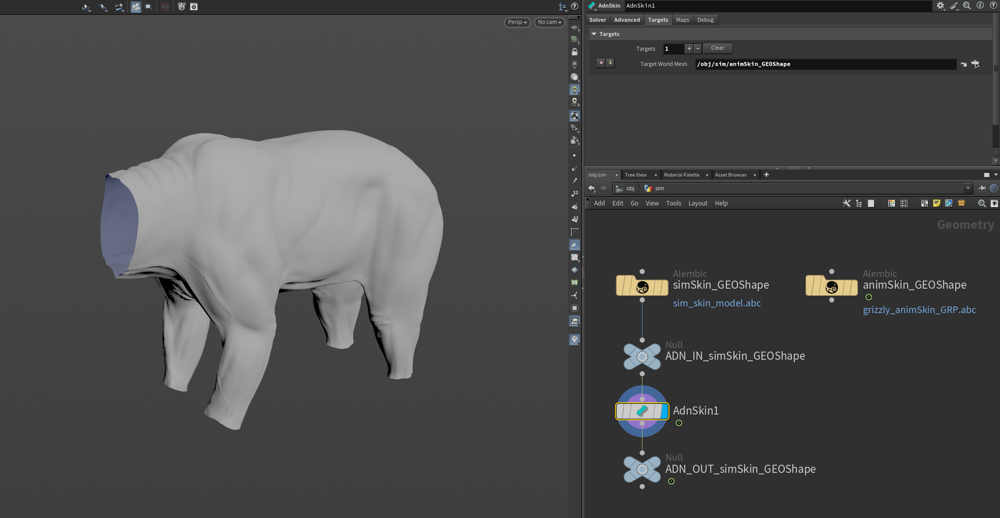
  <figcaption><b>Figure X</b>: AdnSkin SOP creation scenario. Using null nodes with ADN_IN_ and ADN_OUT_ prefixes to encapsulate the AdonisFX deformable section is recommended to keep the network compatible with the API.</figcaption>
</figure>

### Paint Weights

To tweak the point attributes of an AdnSkin SOP, an `attribpaint` is needed. To ease the creation and initial configuration of this node, select the AdnSkin SOP and click on AdonisFX > Utils > Make Paintable. This utility will create an `attribcreate` node to define the required point attributes and assign their default values followed by an `attribpaint` node to allow these attributes to be modified. Both nodes are automatically named and properly connected to the AdnSkin node.

<figure markdown>
  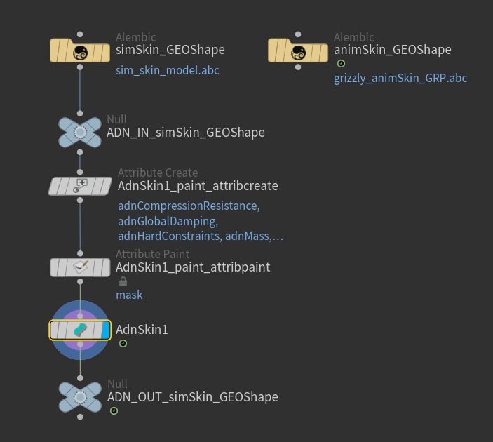
  <figcaption><b>Figure X</b>: Deformable section after using the "Make Paintable" utility.</figcaption>
</figure>

Start by painting the `adnSoftConstraints` map. Flood this map with a low value of 0.45 to have a uniform distribution of soft constraints. This will help the skin to follow the target mesh.

Now paint `adnHardConstraints` in two steps. First, flood this weight to a value of 0.3 to help the skin (together with the soft weights) to follow the target mesh. Then, set the edges to 1.0 to attach them strongly to the target mesh.

Then select the `adnSlideConstraints` attribute and paint weights only in those areas where the skin is supposed to slide over the target mesh. In this case, focus these weights over the scapulas and the joints of the limbs.

Finally, select the `adnMaxSlidingDistanceMultiplier` attribute and paint weights to 1.0 only in the sliding areas. This will ensure that the vertices with sliding properties will get assigned with the maximum sliding distance (defined by the *Max Sliding Distance* attribute), while the non-sliding vertices will get assigned with 0.0 sliding distance, which will improve the performance of the simulation.

<figure markdown>
  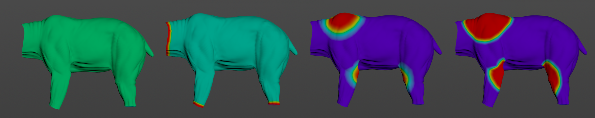
  <figcaption><b>Figure X</b>: AdnSkin weight maps. From left to right: adnSoftConstraints, adnHardConstraints, adnSlideConstraints and adnMaxSlidingDistanceMultiplier.</figcaption>
</figure>

With this basic paint setup the AdnSkin deformer will already show plausible results, expected of the skin to the target mesh. However, the possible parameters and tweaks to display high fidelity dynamics can be seen in the documentation for [AdnSkin](solvers/skin).

> [!NOTE]
> Soft, hard, and slide constraints form a compound constraint known as Uber constraint. Therefore, the sum of the weights for these three constraint types must not exceed 1.0. If the total weight is higher, the solver will still run the simulation because an internal normalization is applied. However, the AdnSkin SOP node will display a warning indicating that the weights will be normalized (see Figure X).

<figure markdown>
  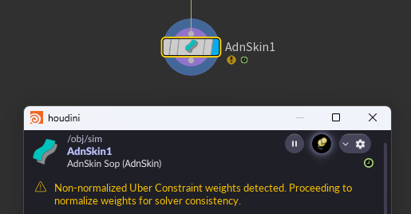
  <figcaption><b>Figure X</b>: AdnSkin warning because of non-normalized Uber constraint weights.</figcaption>
</figure>

## AdnRelax

To create a basic scenario using the AdnRelax SOP, start with a scene with a mesh to apply the relaxation onto. This could be for example the simulated fascia layer.

<figure markdown>
  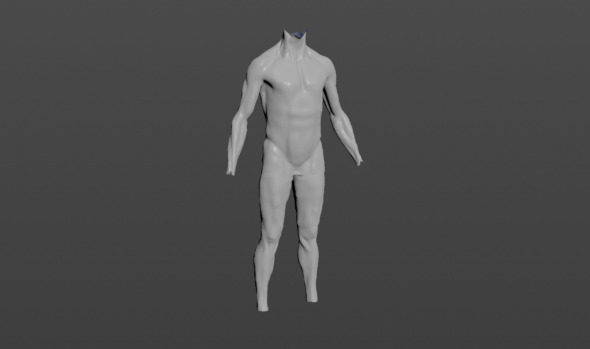
  <figcaption><b>Figure X</b>: Basic setup for AdnRelax. The mesh is the result of the fascia simulation to which AdnRelax is going to be applied. </figcaption>
</figure>

### Create Node

To create the AdnRelax SOP:

1. Go to the geometry context of the rig containing the geometry to apply the SOP to.
2. Press TAB and navigate to the submenu AdonisFX > Deformers to find the AdnRelax {style="width:4%"} SOP type.
3. Create it and connect the geometry to the input.
4. Increase the number of iterations to see the effect of the relaxation algorithm.

<figure markdown>
  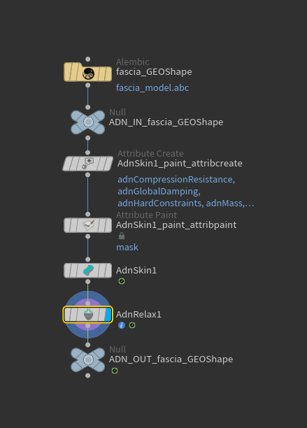
  <figcaption><b>Figure X</b>: AdnRelax SOP creation scenario. The AdnRelax node is applied to the fascia obtained from the AdnSkin simulation. </figcaption>
</figure>

### Paint Weights

The AdnRelax paintable maps default to 1.0 if the point attributes are not found in the input source. They act as multipliers for the main relax parameters (i.e., *Smooth*, *Relax*, *Push In Ratio*, and *Push Out Ratio*). Therefore, the relaxation algorithm will be applied uniformly over the entire mesh unless the maps are adjusted.

To tweak the point attributes of an AdnRelax SOP, an `attribpaint` is needed. To ease the creation and initial configuration of this node, select the AdnRelax SOP and click on AdonisFX > Utils > Make Paintable. This utility will create an `attribcreate` node to define the required point attributes and assign their default values followed by an `attribpaint` node to allow these attributes to be modified. Both nodes are automatically named and properly connected to the AdnRelax node.

<figure markdown>
  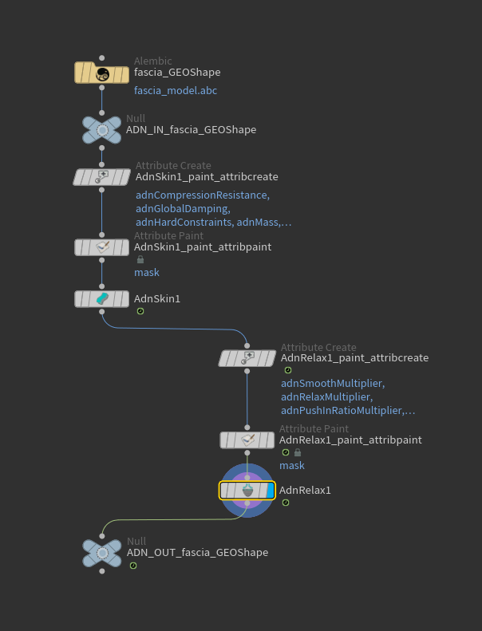
  <figcaption><b>Figure X</b>: Network after using the "Make Paintable" utility. </figcaption>
</figure>

Now the deformed mesh can be refined in specific areas by modifying the paintable attributes. Flood a specific map to 0.0 and paint higher values in the areas where the relaxation algorithm should take effect.

<figure markdown>
  
  <figcaption><b>Figure X</b>: Example of paintable weights of AdnRelax SOP applied to the fascia layer of a biped. From left to right: smooth multiplier, relax multiplier, push in ratio multiplier, push out ratio multiplier.</figcaption>
</figure>

The smoothing is modulated by the `adnSmoothMultiplier` map. Keep it flooded to 1.0 to smooth the surface of the entire mesh, or flood it to 0.0 and paint values of 1.0 in the areas that need smoothing.

The relaxation is modulated by the `adnRelaxMultiplier` map. Keep it flooded to 1.0 to relax the surface of the entire mesh, or flood it to 0.0 and paint values of 1.0 in the areas that need relaxation.

After smoothing and relaxation are applied, the mesh may lose some volume or detail. Push in and push out adjustments can be used to recover volume and detail. The attributes *Push In Ratio* and *Push Out Ratio* are set to 0.0 by default, to apply these adjustments, increase their values. Then, use the `adnPushInRatioMultiplier` and `adnPushOutRatioMultiplier` maps to modulate the specific areas where these adjustments will take effect.

If a specific area shows volume loss, flood the `adnPushOutRatioMultiplier` to 0.0 and paint values of 1.0 in areas that need to recover volume so that the push out adjustment moves the vertices outward along their normals.

If a specific area has lost detail, flood the `adnPushInRatioMultiplier` to 0.0 and paint values of 1.0 in areas that need more detail so that the push in adjustment moves the vertices inward, opposite to the direction of their normals.

<figure markdown>
  
  <figcaption><b>Figure X</b>: Example of AdnRelax results with a distribution of weights shown in Figure X. On the left, the input geometry before applying the relaxation; on the right the output geometry resulting from the relaxation. The parameters of the SOP in this example are: iterations set to 25, pin enabled, smooth and relax set to 0.5, push-in and push-out set to 1.0, and thresholds set to -1.0.</figcaption>
</figure>

## AdnPush

A good example of a use case for the AdnPush SOP is to generate the internal fascia of a character from the outer skin mesh. To prepare this scenario, start with the skin mesh at rest, duplicate it and rename it.

<figure markdown>
  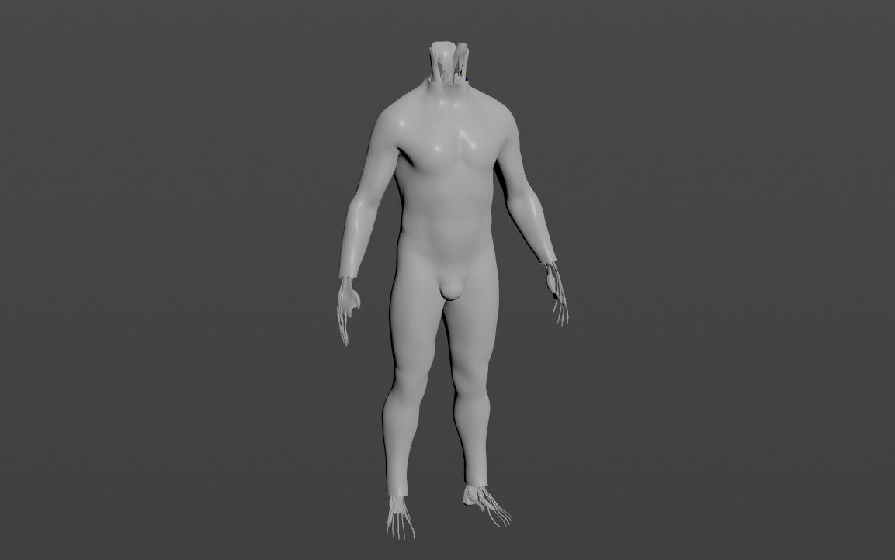
  <figcaption><b>Figure X</b>: Fascia geometry result of duplicating and renaming the outer skin mesh at rest.</figcaption>
</figure>

### Create Node

To create the AdnPush SOP, press TAB and navigate to the submenu AdonisFX > Deformers to find the AdnPush 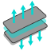{style="width:4%"} SOP type and connect the copy of the skin mesh at rest to the AdnPush input. Then, set a negative value to the *Push Length* parameter to apply the push effect inwards (e.g. -2.0).

<figure style="width:75%;" markdown>
  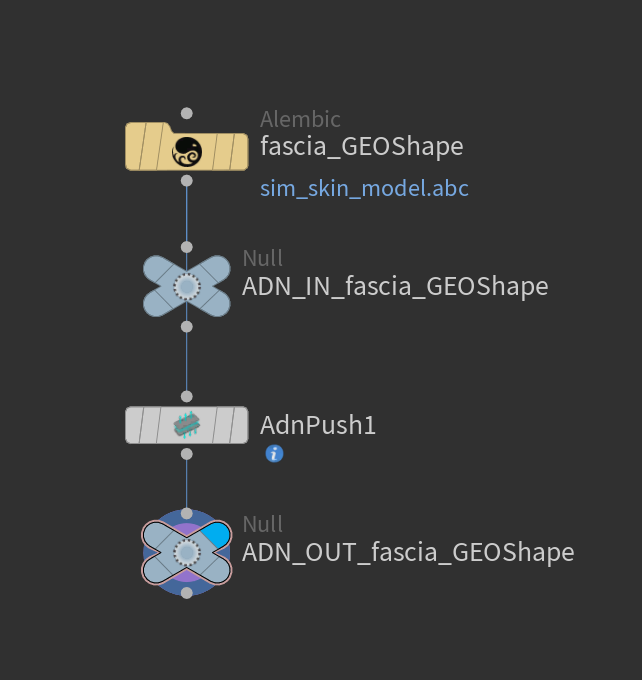
  <figcaption><b>Figure X</b>: AdnPush SOP creation scenario. Using null nodes with ADN_IN_ and ADN_OUT_ prefixes to encapsulate the AdonisFX deformable section is recommended to keep the network compatible with the API.</figcaption>
</figure>

<figure markdown>
  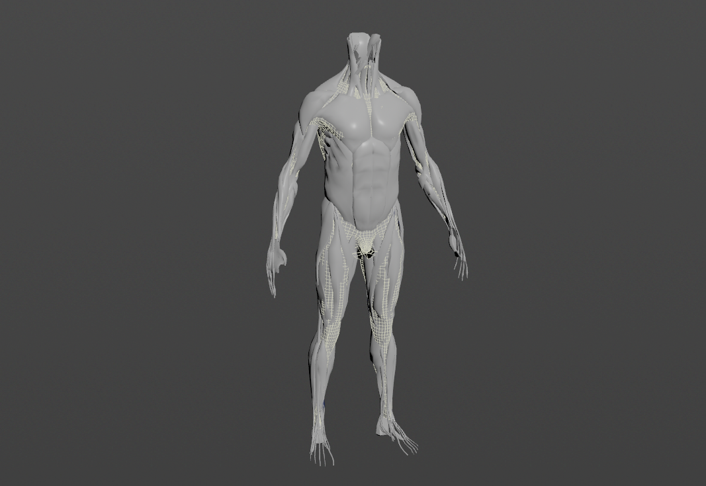
  <figcaption><b>Figure X</b>: Result of applying a uniform Push Length of -2.0 to the whole input geometry.</figcaption>
</figure>

Keeping the muscle layer visible is helpful to drive the configuration of the AdnPush settings, especially the paintable maps. It is expected and intended to get intersections with the muscle layer at this point. Those intersections will be fixed by tweaking the maps.

### Paint Weights

To tweak the point attributes of an AdnPush SOP, an `attribpaint` is needed. To ease the creation and initial configuration of this node, select the AdnPush SOP and click on AdonisFX > Utils > Make Paintable. This utility will create an `attribcreate` node to define the required point attributes and assign their default values followed by an `attribpaint` node to allow these attributes to be modified. Both nodes are automatically named and properly connected to the AdnPush node.

<figure style="width:75%;" markdown>
  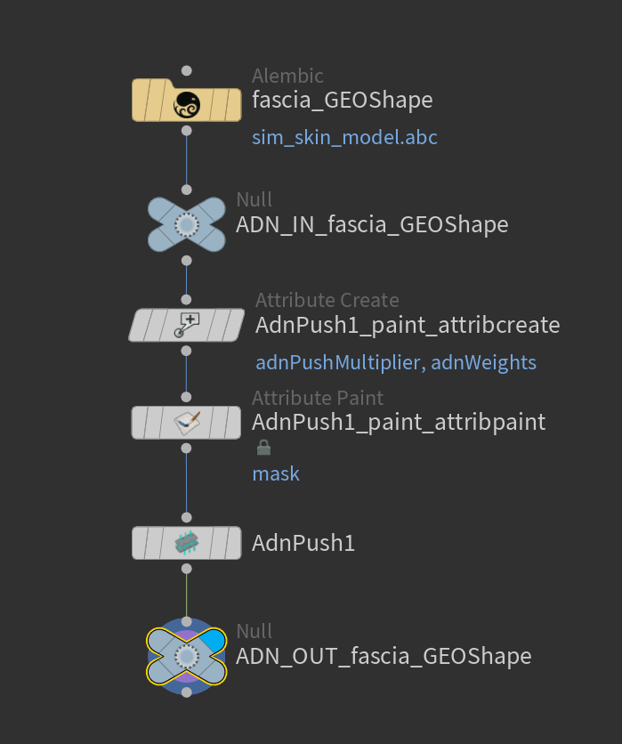
  <figcaption><b>Figure X</b>: Deformable section after using the "Make Paintable" utility.</figcaption>
</figure>

The `adnPushMultiplier` and `adnWeights` maps are flooded to 1.0 by default. The push multiplier is meant to modulate the amount of push across the entire mesh as it is the map that multiplies the global *Push Length* at each point. In the example with the muscle layer visible, this map can be tweaked to remove the intersections.

<figure markdown>
  
  <figcaption><b>Figure X</b>: Example of Push Multiplier map of AdnPush SOP.</figcaption>
</figure>

<figure markdown>
  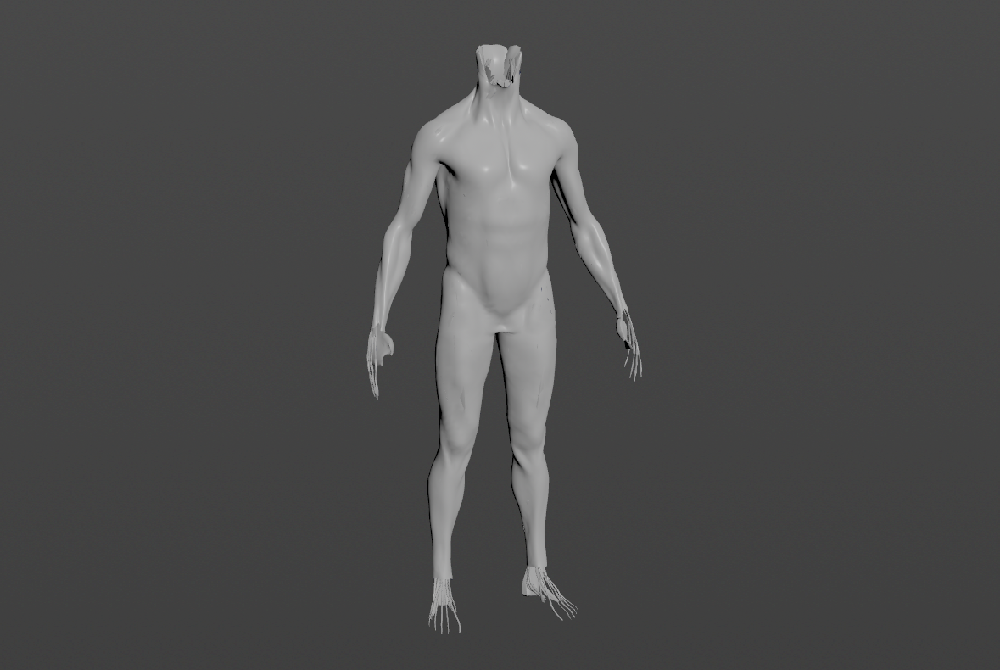
  <figcaption><b>Figure X</b>: Example of AdnPush results with a global push of -2.0 and the push multiplier map from Figure X. Most of the intersections present in Figure X introduced by the uniform push are fixed now thanks to the painted map.</figcaption>
</figure>

## AdnSkinMerge

To create a basic scenario using the AdnSkinMerge SOP, start with a scene with the following elements:

  - One or more animation meshes with deformation.
  - One or more simulation meshes, for example with an AdnSkin SOP applied and properly configured.
  - A final mesh without animation or deformation.

The AdnSkinMerge SOP will be applied to the final mesh which will be the result of blending the animation and simulation meshes.

<figure markdown>
  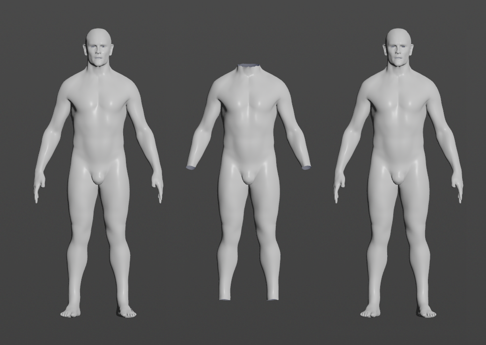
  <figcaption><b>Figure X</b>: Minimum required geometries to configure an AdnSkinMerge SOP. From left to right: Animation Mesh, Simulation Mesh and Final Mesh to apply the AdnSkinMerge SOP.</figcaption>
</figure>

### Create Node

To create the AdnSkinMerge node, press TAB and navigate to the submenu AdonisFX > Solvers to find the AdnSkinMerge {style="width:4%"} SOP type. Then connect the final mesh to the AdnSkinMerge input and go to the *Targets* tab to provide the *anim* and *sim* meshes. Make sure the initialization time corresponds to the start time where all the geometries are in rest pose.

<figure markdown>
  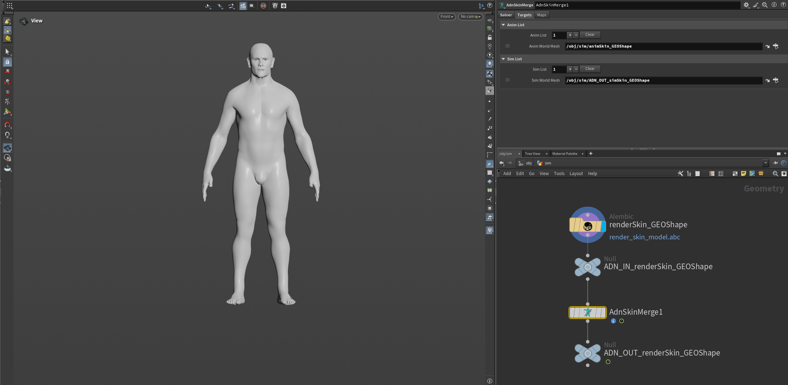
  <figcaption><b>Figure X</b>: AdnSkinMerge SOP creation scenario. Using null nodes with ADN_IN_ and ADN_OUT_ prefixes to encapsulate the AdonisFX deformable section is recommended to keep the network compatible with the API.</figcaption>
</figure>

### Paint Weights

To tweak the point attributes of an AdnSkinMerge SOP, an `attribpaint` is needed. To ease the creation and initial configuration of this node, select the AdnSkinMerge SOP and click on AdonisFX > Utils > Make Paintable. This utility will create an `attribcreate` node to define the required point attributes and assign their default values followed by an `attribpaint` node to allow these attributes to be modified. Both nodes are automatically named and properly connected to the AdnSkinMerge node.

<figure style="width: 70%;" markdown>
  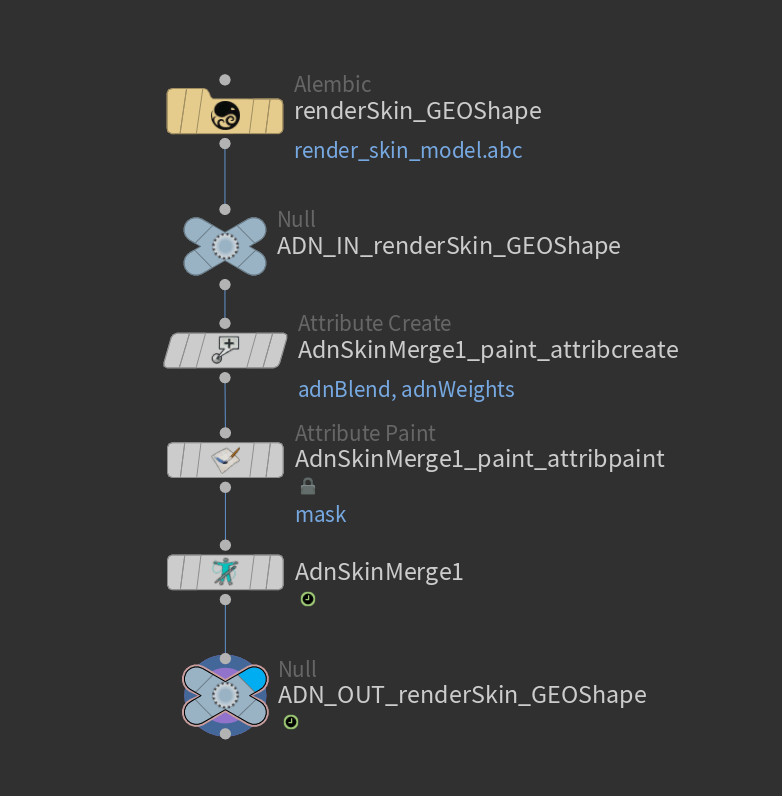
  <figcaption><b>Figure X</b>: Deformable section after using the "Make Paintable" utility.</figcaption>
</figure>

Once the `attribpaint` node is created the weights can be painted to blend the animation and simulation meshes into the final mesh.

The `adnBlend` attribute represents the level of influence of the simulated mesh: a value of 0.0 makes the vertices follow the animated inputs, while a value of 1.0 makes the vertices follow the simulated inputs.

To have a smooth transition from the simulated mesh to the animated mesh, smooth the painting in the areas near the edges between the simulation and animation meshes.

<figure markdown>
  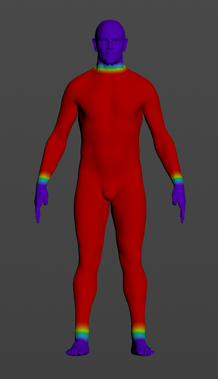
  <figcaption><b>Figure X</b>: Blend weights painted map.</figcaption>
</figure>

With this basic paint setup the AdnSkinMerge SOP will now show the results of skin simulation transferred to the final mesh.

<figure markdown>
  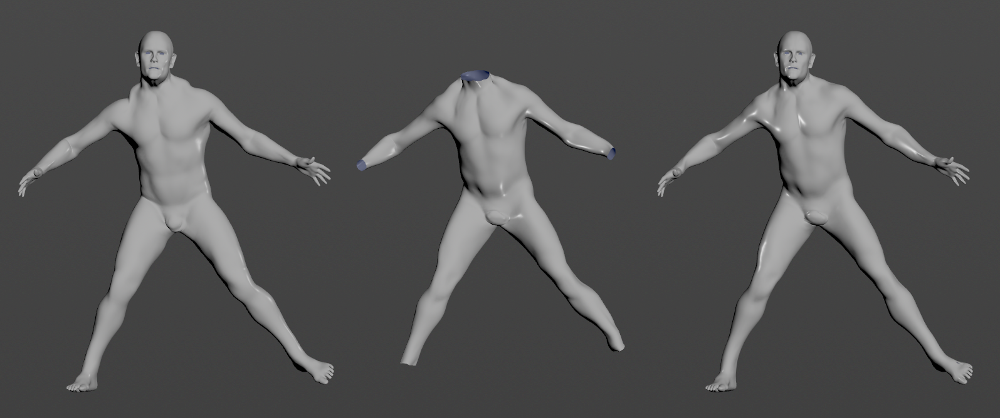
  <figcaption><b>Figure X</b>: Result of AdnSkinMerge in a specific frame. From left to right: Animation Mesh, Simulation Mesh and Final Mesh.</figcaption>
</figure>

## AdnSimshape

To create a basic scenario using the AdnSimshape SOP, start with a scene with the following elements:

 - An animated facial mesh to which to apply the SOP.
 - A rest mesh.
 - Optionally, a deformation mesh with only the facial deformation (no animation) to allow muscle activations.

All these meshes must have the same number of vertices and correspond to the same facial model.

<figure markdown>
  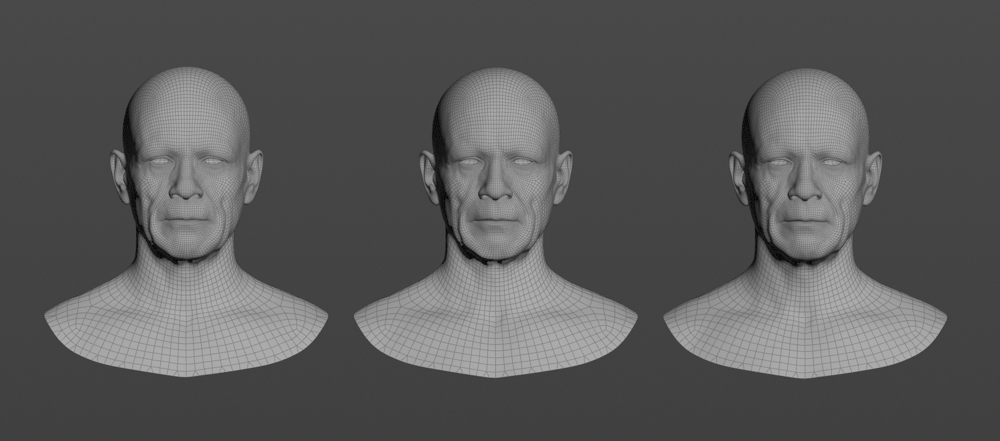
  <figcaption><b>Figure X</b>: Basic setup for facial simulations. From left to right: rest mesh, deformation mesh and animation mesh.</figcaption>
</figure>

### Create Node

To create the AdnSimshape node, press TAB and navigate to the submenu AdonisFX > Solvers to find the AdnSimshape {style="width:4%"} SOP type. Then connect the animated mesh to the first input, the rest mesh to the third input and the deformation mesh to the fourth input.

<figure markdown>
  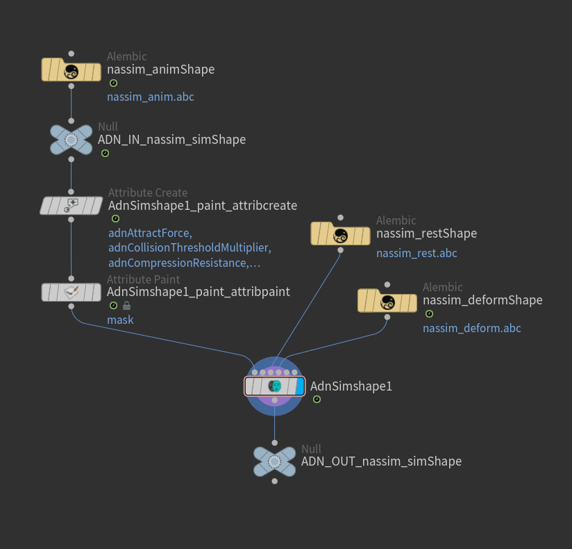
  <figcaption><b>Figure X</b>: AdnSimshape SOP creation scenario. Using null nodes with ADN_IN_ and ADN_OUT_ prefixes to encapsulate the AdonisFX deformable section is recommended to keep the network compatible with the API.</figcaption>
</figure>

### Paint Weights

To tweak the point attributes of an AdnSimshape SOP, an `attribpaint` is needed. To ease the creation and initial configuration of this node, select the AdnSimshape SOP and click on AdonisFX > Utils > Make Paintable. This utility will create an `attribcreate` node to define the required point attributes and assign their default values followed by an `attribpaint` node to allow these attributes to be modified. Both nodes are automatically named and properly connected to the AdnSimshape node.

The most important paintable map is the `adnAttractForce` as this is the value that dictates how much of each simulated vertex should follow the animation. This value is flooded by default to 1.0, meaning that by default the simulated mesh will follow the animation completely, without displaying dynamics.

In high deformation areas, such as around the mouth or under the eyes, add medium to low values (in this case painting with a value of 0.4).

Painting lower Attraction Force weights in meatier areas of the face, such as under the neck or in the cheeks to show more dynamics in these regions. In this case a value of 0.15 will be applied.

The lowest values (0.1 in this case) will be applied to the area under the jaw where dynamics will appear the most.

<figure markdown>
  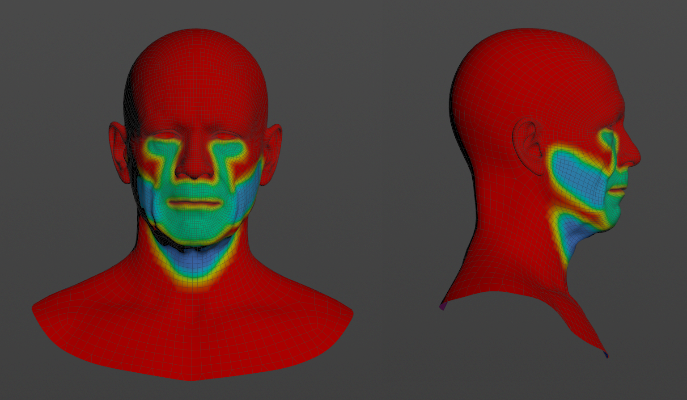
  <figcaption><b>Figure X</b>: Example of the attraction force map.</figcaption>
</figure>

After painting similar weights to the ones displayed and pressing playback to check the animation, realistic dynamics should be simulated in the face. Many more paintable weights to better customize and tweak face dynamics are available and fully explained in the documentation for [AdnSimshape](solvers/simshape).

### Add muscle activations

To further have a realistic depiction of facial dynamics, facial muscle activations can be simulated. The AdnSimshape SOP has two methods of handling muscle activations:

 - AdonisFX Muscle Patches file.
 - Edge Evaluator Node.

Refer to this [section](solvers/simshape#muscle-activations) to see how to use Muscle Patches files. However, in this example, it is taken advantage of the AdnEdgeEvaluator SOP. The process is the following:

- Press TAB and navigate to the submenu AdonisFX > Utils to find the AdnEdgeEvaluator {style="width:4%"} SOP type.
- Connect the deformation mesh to the first input and the rest mesh to the second input.
- Cook the AdnEdgeEvaluator node and the `adnCompression` point attribute will be written into the geostream.
- Transfer the `adnCompression` point attribute to the geostream of the first input of AdnSimshape with the name `adnActivation`.
- Select the *Plug Values* options in the *Activation Mode* dropdown located in the *Muscles Activation Settings* section of the AdnSimshape node.

<figure markdown>
  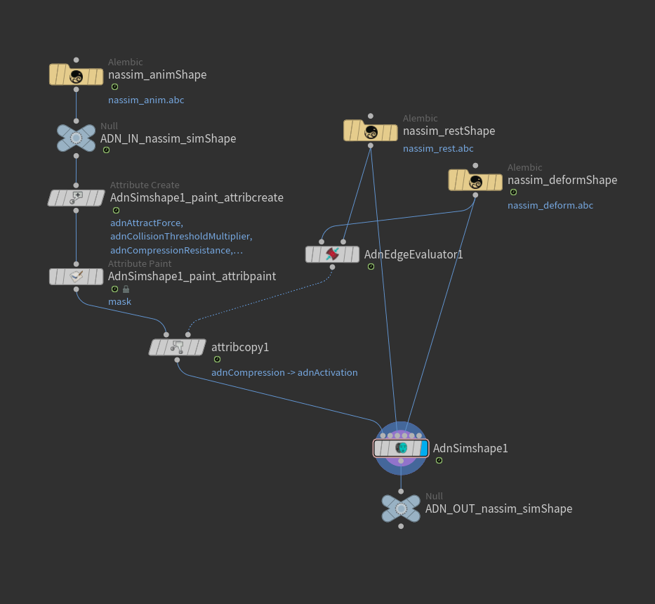
  <figcaption><b>Figure X</b>: Example of the AdnEdgeEvaluator SOP usage in conjunction with AdnSimshape SOP to drive the activations. </figcaption>
</figure>

The output activation values can be debugged by checking the option *Write Out Activation* and visualizing the `adnOutActivation` point attribute.
