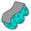
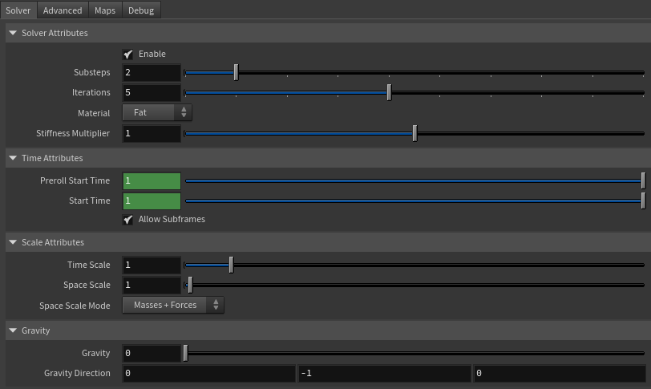
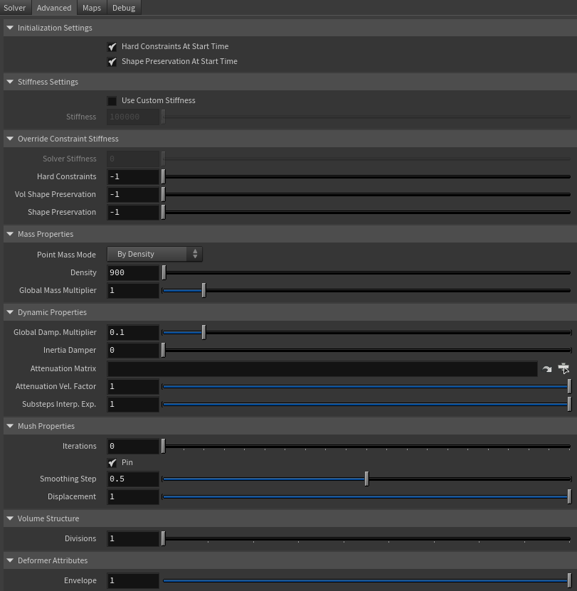
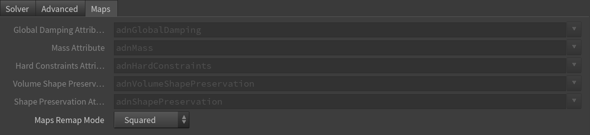
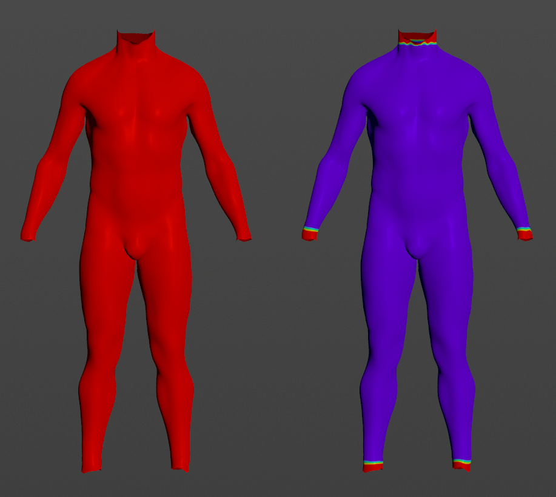
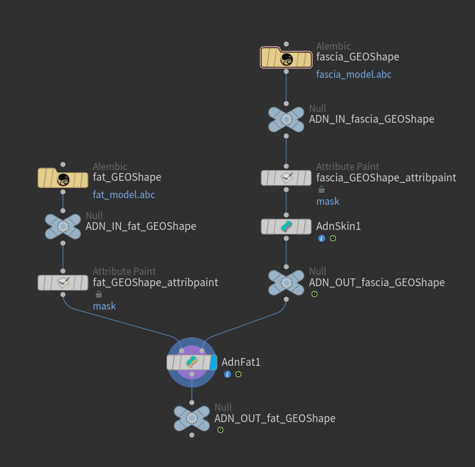

# AdnFat

AdnFat is a Houdini SOP for fat tissue simulation. Thanks to a combination of volume, shape preservation and hard constraints, this SOP can produce dynamics that allow the fat geometry to produce realistic jiggle-like dynamics.

The inputs to the SOP are two geometries coherent in terms of number of vertices and triangulation. The first one is the geometry to be simulated (i.e. the fat geometry to simulate), while the second one is a deformed geometry which works as base mesh to drive the simulation (e.g. the simulated fascia). Given these two compatible surfaces, the solver procedurally constructs a volumetric internal structure between them. This structure is then simulated by computing: 1) volume constraints to make it resistant to compression and expansion; 2) volume shape preservation constraints to make the internal volume resistant to deformation; 3) hard constraints to attach the borders of the mesh to the base mesh; and 4) shape preservation constraints to preserve the original shape between connected vertices.

### How To Use

The AdnFat SOP is easy to create and configure in Houdini. The solver requires two input geometries that represent the inner and outer layers of the fat tissue. Typically, the inner layer corresponds to the simulated fascia, while the outer layer corresponds to the actual fat mesh to simulate. The inner layer works as a base mesh that the outer fat layer has to follow.

An AdnFat setup requires the following inputs:

  - **Base Mesh (B)**: Mesh to drive the simulation mesh (e.g. the simulated fascia geometry).
  - **Fat Mesh (F)**: Mesh to apply the AdnFat onto (e.g. the fat geometry).

> [!NOTE]
> - **B** and **F** must have the same vertex count and triangulation.
> - Both, **B** and **F** must be connected to the AdnFat SOP, otherwise the Fat solver will abort the simulation and the node will display an error.

The process to create an AdnFat is:

1. Go to the geometry context of the rig containing the base and fat meshes.
2. Press TAB and navigate to the submenu AdonisFX > Solvers to find the AdnFat {style="width:4%"} SOP type.
3. Create it and connect the fat geometry to the first input and the base geometry to the second input.
4. The AdnFat is now ready to simulate using the default settings. Refer to the next section to customize their configuration.

## Attributes

### Solver Attributes
| Name | Type | Default | Animatable | Description |
| :--- | :--- | :------ | :--------- | :---------- |
| **Enable**               | Boolean    | True    | ✓ | Flag to enable or disable the SOP computation. |
| **Substeps**             | Integer    | 2       | ✓ | Number of steps that the solver will execute per simulation frame. Greater values mean greater computational cost. Has a range of \[1, 10\]. The upper limit is soft, higher values can be used. |
| **Iterations**           | Integer    | 5       | ✓ | Number of iterations that the solver will execute per simulation step. Greater values mean greater computational cost. Has a range of \[1, 10\]. The upper limit is soft, higher values can be used. |
| **Material**             | Enumerator | Fat     | ✓ | Solver stiffness presets per material. The materials are listed from lowest to highest stiffness. There are 8 different presets: Fat: 103, Muscle: 5e3, Rubber: 106, Tendon: 5e7, Leather: 108, Wood: 6e9, Skin: 12e3. |
| **Stiffness Multiplier** | Float      | 1.0     | ✓ | Multiplier factor to scale up or down the material stiffness. Has a range of \[0.0, 2.0\]. The upper limit is soft, higher values can be used. |

### Time Attributes
| Name | Type | Default | Animatable | Description |
| :--- | :--- | :------ | :--------- | :---------- |
| **Preroll Start Time** | Time | *Current frame* | ✗ | Sets the frame at which the preroll begins. The preroll ends at *Start Time*. |
| **Start Time**         | Time | *Current frame* | ✗ | Determines the frame at which the simulation starts. |

### Scale Attributes
| Name | Type | Default | Animatable | Description |
| :--- | :--- | :------ | :--------- | :---------- |
| **Time Scale**       | Float      | 1.0             | ✓ | Sets the scaling factor applied to the simulation time step. Has a range of \[0.0, 2.0\]. The upper limit is soft, higher values can be used. |
| **Space Scale**      | Float      | 1.0             | ✓ | Sets the scaling factor applied to the masses and/or the forces (e.g. gravity). AdonisFX interprets the scene units in centimeters. If modeling your creature you apply a scaling factor for whatever reason (e.g. to avoid precision issues in Maya), you will have to adjust for this scaling factor using this attribute. If your character is supposed to be 170 units tall, but you prefer to model it to be 17 units tall, then you will need to set the space scale to a value of 10. This will ensure that your 17 units creature will simulate as if it was 170 units tall. Has a range of \[0.0, 2.0\]. The upper limit is soft, higher values can be used. |
| **Space Scale Mode** | Enumerator | Masses + Forces | ✓ | Determines if the spatial scaling affects the masses, the forces, or both. The available options are: <ul><li>Masses: The *Space Scale* only affects masses.</li><li>Forces: The *Space Scale* only affects forces.</li><li>Masses + Forces: The *Space Scale* affects masses and forces.</li><ul> |

### Gravity
| Name | Type | Default | Animatable | Description |
| :--- | :--- | :------ | :--------- | :---------- |
| **Gravity**           | Float  | 0.0              | ✓ | Sets the magnitude of the gravity acceleration in m/s2. The value is internally converted to cm/s2. Has a range of \[0.0, 100.0\]. The upper limit is soft, higher values can be used. |
| **Gravity Direction** | Float3 | {0.0, -1.0, 0.0} | ✓ | Sets the direction of the gravity acceleration. Vectors introduced do not need to be normalized, but they will get normalized internally. |

### Advanced Settings

#### Initialization Settings
| Name | Type | Default | Animatable | Description |
| :--- | :--- | :------ | :--------- | :---------- |
| **Hard At Start Time**               | Boolean | True  | ✗ | Flag that forces the hard constraints to reinitialize at start time. This attribute has effect only if preroll start time is lower than start time. |
| **Shape Preservation At Start Time** | Boolean | True  | ✗ | Flag that forces the shape preservation constraints to reinitialize at start time. This attribute has effect only if preroll start time is lower than start time. |

#### Stiffness Settings
| Name | Type | Default | Animatable | Description |
| :--- | :--- | :------ | :--------- | :---------- |
| **Use Custom Stiffness**                  | Boolean | False          | ✓ | Toggles the use of a custom stiffness value. If custom stiffness is used, *Material* and *Stiffness Multiplier* will be disabled and *Stiffness* will be used instead. |
| **Stiffness**                             | Float   | 105 | ✓ | Sets the custom stiffness value. Its value must be greater than 0.0. |

#### Override Constraint Stiffness
| Name | Type | Default | Animatable | Description |
| :--- | :--- | :------ | :--------- | :---------- |
| **Solver Stiffness**            | Float |  0.0 | ✗ | Shows the global stiffness value currently used by the solver. |
| **Hard Constraints**            | Float | -1.0 | ✓ | Sets the stiffness override value for hard constraints. If the value is less than 0.0, the global stiffness will be used. Otherwise, this custom stiffness will override the global stiffness. Has a range of \[0.0, 1012\]. The upper limit is soft, higher values can be used. |
| **Volume Shape Preservation**   | Float | -1.0 | ✓ | Sets the stiffness override value for the volume shape preservation constraints. If the value is less than 0.0, the global stiffness will be used. Otherwise, this custom stiffness will override the global stiffness. Has a range of \[0.0, 1012\]. The upper limit is soft, higher values can be used. |
| **Shape Preservation**          | Float | -1.0 | ✓ | Sets the stiffness override value for the shape preservation constraints. If the value is less than 0.0, the global stiffness will be used. Otherwise, this custom stiffness will override the global stiffness. Has a range of \[0.0, 1012\]. The upper limit is soft, higher values can be used. |

> [!NOTE]
> Providing a stiffness override value of 0.0 will disable the computation of that constraint.

#### Mass Properties

| Name | Type | Default | Animatable | Description |
| :--- | :--- | :------ | :--------- | :---------- |
| **Point Mass Mode**        | Enumerator | By Density       | ✓ | Defines how masses should be used in the solver.<ul><li>*By Density* allows to estimate the mass value by multiplying Density * Area.</li><li>*By Uniform Value* allows to set a uniform mass value.</li></ul> |
| **Density**                | Float      | 900.0            | ✓ | Sets the density value in kg/m3 to be able to estimate mass values with *By Density* mode. The value is internally converted to g/cm3. Has a range of \[0.001, 106\]. Lower and upper limits are soft, lower and higher values can be used. |
| **Global Mass Multiplier** | Float      | 1.0              | ✓ | Sets the scaling factor applied to the mass of every point. Has a range of \[0.001, 10.0\]. Lower and upper limits are soft, lower and higher values can be used. |

#### Dynamic Properties
| Name | Type | Default | Animatable | Description |
| :--- | :--- | :------ | :--------- | :---------- |
| **Global Damping Multiplier**   | Float      | 0.1  | ✓ | Sets the scaling factor applied to the global damping of every point. Has a range of \[0.0, 1.0\]. The upper limit is soft, higher values can be used. |
| **Inertia Damper**              | Float      | 0.0  | ✓ | Sets the linear damping applied to the dynamics of every point. Has a range of \[0.0, 1.0\]. The upper limit is soft, higher values can be used. |
| **Attenuation Velocity Matrix** | String     |      | ✓ | Object path of the node to extract the transformation matrix from to compute the velocity attenuation. |
| **Attenuation Velocity Factor** | Float      | 1.0  | ✓ | Sets the weight of the attenuation applied to the velocities of the simulated vertices driven by the *Attenuation Matrix*. Has a range of \[0.0, 1.0\]. The upper limit is soft, higher values can be used. |
| **Substeps Interp. Exp.**       | Float      | 1.0  | ✓ | Sets the exponential factor to weight the interpolation at each substep. Has a range of \[0.0, 1.0\]. The upper limit is soft, higher values can be used. A value of 0.0 disables the interpolation: base geometry and attenuation matrix are not interpolated. A value of 1.0 applies linear interpolation (base geometry and attenuation matrix) between previous and current frame based on a linear weight, i.e. `weight = substep / num_substeps`. A value between 0.0 and 1.0 applies exponential interpolation (base geometry and attenuation matrix) between previous and current frame based on an exponential weight, i.e. `weight = (substep / num_substeps) ^ exponent`. |

#### Volume Structure
| Name | Type | Default | Animatable | Description |
| :--- | :--- | :------ | :--------- | :---------- |
| **Divisions**   | Integer      | 1  | ✗ | Sets the number of divisions to create in the internal volume. The lower this value is, the faster the solver computes. Has a range of \[1, 10\]. The upper limit is soft, higher values can be used. |

### Deformer Attributes
| Name | Type | Default | Animatable | Description |
| :--- | :--- | :------ | :--------- | :---------- |
| **Envelope** | Float | 1.0 | ✓ | Specifies the deformation scale factor. Has a range of \[0.0, 1.0\]. The upper and lower limits are soft, values can be set in a range of \[-2.0, 2.0\]|

### Maps
| Name | Type | Default | Animatable | Description |
| :--- | :--- | :------ | :--------- | :---------- |
| **Global Damping Attribute**                  | float      | 1.0     | ✗ | Specifies the name of the per-point attribute to read the global damping from. The expected attribute name is `adnGlobalDamping`. The expected range of the per-point values is \[0.0, 1.0\]. |
| **Mass Attribute**                            | float      | 1.0     | ✗ | Specifies the name of the per-point attribute to read the mass values from. The expected attribute name is `adnMass`. The expected range of the per-point values is \[0.001, 1.0\]. |
| **Hard Constraints Attribute**                | float      | 0.0     | ✗ | Specifies the name of the per-point attribute to read the hard constraints values from. The expected attribute name is `adnHardConstraints`. The expected range of the per-point values is \[0.0, 1.0\]. |
| **Volume Shape Preservation Attribute**       | float      | 1.0     | ✗ | Specifies the name of the per-point attribute to read the volume shape preservation values from. The expected attribute name is `adnVolumeShapePreservation`. The expected range of the per-point values is \[0.0, 1.0\]. |
| **Shape Preservation Attribute**              | float      | 1.0     | ✗ | Specifies the name of the per-point attribute to read the shape preservation values from. The expected attribute name is `adnShapePreservation`. The expected range of the per-point values is \[0.0, 1.0\]. |
| **Maps Remap Mode**                           | Enumerator | Squared | ✗ | Defines the mode of remapping the painted values of volume shape preservation, shape preservation and hard constraints. The other paintable maps remain unmodified. Each remap mode applies a function to the input painted values (x) to get the final value used for the simulation (y).<ul><li>Linear: `y = x`</li><li>Squared: `y = x^2`</li><li>Cubic: `y = x^3`</li><li>Square Root: `y = x^(1/2)`</li><li>Cube Root: `y = x^(1/3)`</li><li>Logarithmic: `y = log((exp(1) - 1) * x + 1)`</li></ul> |

> [!NOTE]
> - All maps parameters are disabled in the Maps tab because the attribute names are fixed to drive specific functionalities of the solver.
> - Fixed point attribute names also ensure compatibility with the API.
> - To copy the map names of the disabled attributes for painting (using an attribute paint node) right click on the disabled map attribute parameter, press "Copy Parameter", select the attribute paint node and on the attribute name entry right click and press "Paste Values". This allows to easily copy the attribute name for painting.
> - If a point attribute on the geostream does not match the naming convention exposed in the node, use an "Attribute Rename" node to rename the attribute to match the expected naming convention.

## Parameter Template

<figure style="width: 75%;" markdown>
  
  <figcaption><b>Figure 1</b>: AdnFat Parameter Template: Solver.</figcaption>
</figure>

<figure style="width: 75%;" markdown>
  
  <figcaption><b>Figure 2</b>: AdnFat Parameter Template: Advanced.</figcaption>
</figure>

<figure style="width: 75%;" markdown>
  
  <figcaption><b>Figure 3</b>: AdnFat Parameter Template: Maps.</figcaption>
</figure>

## Paintable Weights

In order to provide more artistic control, some key parameters of the AdnFat solver are exposed as paintable attributes in the SOP. The maps are point attributes that must be present in the geometry stream injected into the SOP. For that, the Houdini attribpaint node can be used.

| Name | Default | Description |
| :--- | :------ | :---------- |
| **Global Damping**              | 1.0 | Set global damping per vertex in the simulated mesh. The greater the value per vertex is the more damping of velocities. |
| **Hard Constraints**            | 0.0 | Weight to modulate the correction applied to the vertices and the internal virtual points to keep them at a constant transformation, local to the closest point on the base mesh at initialization. Hard Constraint maps will force the points to keep the original position.<ul><li>*Tip*: In most of the cases this map is flooded to 0.0.</li><li>*Tip*: Only if the volume between the fat mesh and the base mesh on the edges is big (e.g. wrists, ankle, neck) then it might be useful to paint a value of 1.0 in those areas.</li><li>*Tip*: Smooth the borders by using the Smooth and Flood combination to make sure that there are no discontinuities in the weights map. This will help the simulation to not produce sharp differences in the dynamics of every vertex compared to its connected vertices.</li></ul> |
| **Masses**                      | 1.0 | Multiplier to the individual mass values per vertex in the simulated volume. |
| **Shape Preservation**          | 1.0 | Amount of correction to apply to a vertex to maintain the initial state of the shape formed with the surrounding vertices. |
| **Volume Shape Preservation**   | 1.0 | Amount of correction to apply to the volume structure to preserve the initial volumetric shape and prevent it from distortion. |

<figure>
  
  <figcaption><b>Figure 4</b>: Example of painted weights on the fat layer: on the left the map is flooded to 1.0 for global damping, mass, volume shape preservation and shape preservation; on the right the hard constraints map is painted to 1.0 on the extremities. </figcaption>
</figure>

<figure style="width: 75%;" markdown>
  
  <figcaption><b>Figure 5</b>: Example of AdnFat net. Using null nodes with ADN_IN_ and ADN_OUT_ prefixes to encapsulate the AdonisFX deformable section is recommended to keep the net compatible with the API.</figcaption>
</figure>
