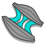
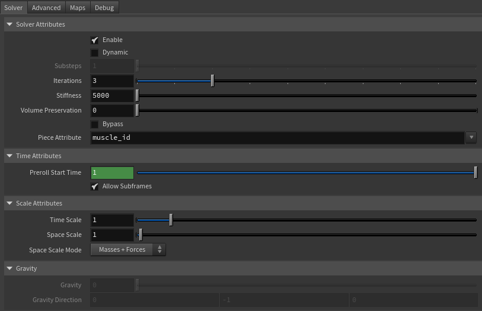
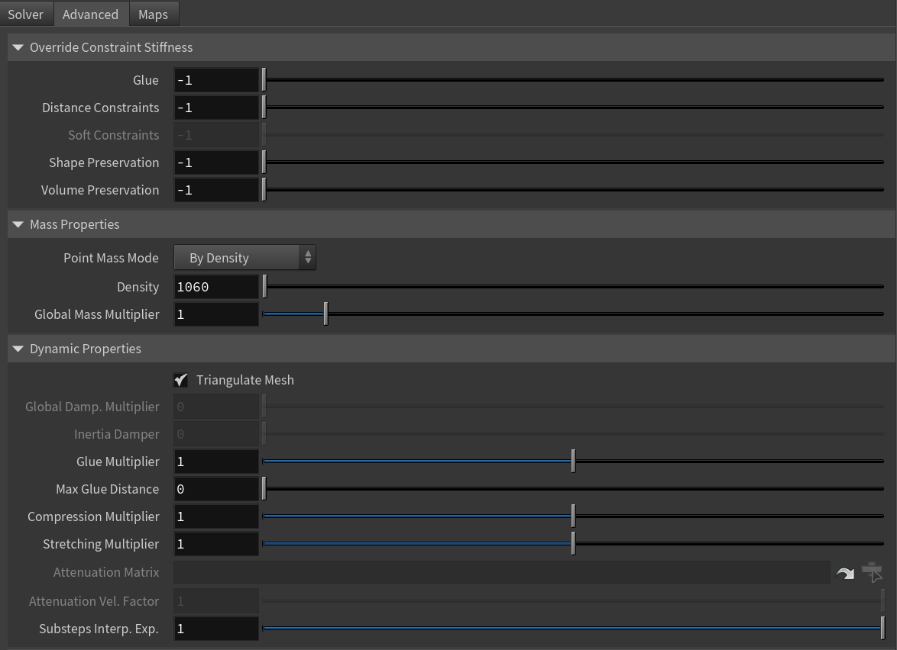
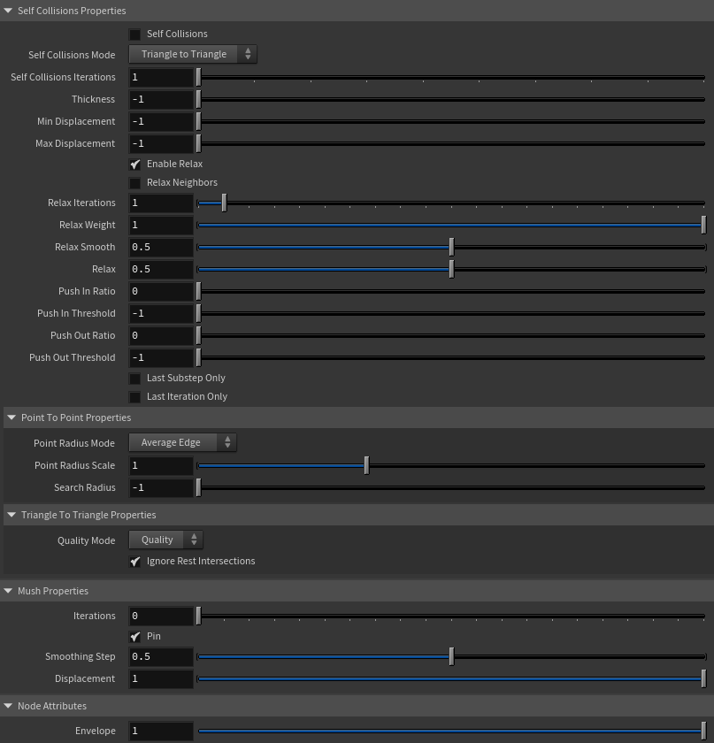
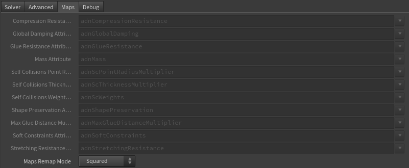
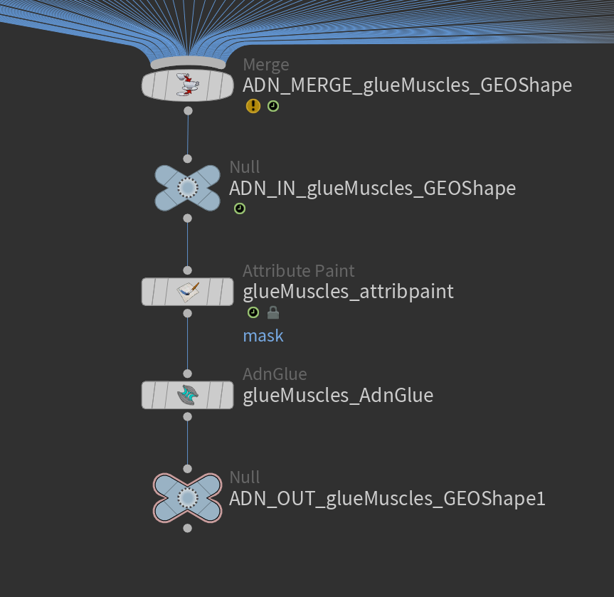

# AdnGlue

AdnGlue is a Houdini SOP that can be used to attach multiple muscles together. This solver uses as input a series of simulated muscles and allows the user to define glue connections between those muscles by using a maximum glue distance value and painted maps.

There are two differentiated modes that this solver can run in:

- **Static**. The solver ingests the input geometry data at each simulated frame and computes the glue connections, as well as the distance, shape and volume constraints directly over the point positions of that input geometry data. There is no influence of gravity nor inertia propagated from one frame to the next one.
- **Dynamic**. The solver behaves as a standard time-dependent simulation solver where the external forces (i.e. gravity) are integrated to introduce inertia to the system. The input geometries become a target geometry used by the solver to compute soft constraints against. Glue, distance, shape and volume constraints are computed too. By default, the AdnGlue runs in static mode, but there is a boolean attribute exposed to allow switching to dynamic mode.

### How To Use

The AdnGlue SOP can be applied to a single geometry containing any set of geometries merged together. The input geometry is split by the *Piece Attribute* (`pieceID`) to get individual geometry pieces which represent every input muscle. At each simulation frame, the solver gathers the geometry data of each muscle and solves the constraints created between the neighboring geometries. This is achieved by creating attachments between each vertex of a geometry and the closest point on the surface of one of the other geometries (the closest one). More aspects are then computed to ensure that the simulated output preserves the original shape and edge-lengths of the simulated meshes. The output of the SOP is the combined mesh with the results of the solver applied onto.

To create an AdnGlue node within a Houdini scene, the following inputs must be provided:

  - **Input Geometry** (IG): Single geometry source containing all the geometries merged together. The geometry must include a per-primitive attribute to allow the solver to extract a list of separated geometries to be glued (e.g., `path`, `muscle_id`, `name`, etc).

> [!NOTE]
> - In the context of an AdonisFX rig, the merged geometries would generally be the output of the individually simulated muscles (via AdnMuscle or AdnRibbonMuscle SOPs). It is important to maintaining the piece attribute intact after merging them together to distinguish each separate muscle entity.
> - The order in which the geometries are merged can affect the output of the simulation result.

The process to create an AdnGlue node is:

1. Select all the geometry nodes to glue and merge them together via `merge` SOP. Alternatively nodes like an `object_merge` node or similar can be used to combine the geometries.
2. Press TAB and navigate to the submenu AdonisFX > Solvers to find the AdnGlue {style="width:4%"} SOP type.
3. Create it and connect the merged geometry to the input.
4. The solver is ready to simulate with default settings. Check the next section to customize their configuration.

> [!NOTE]
> - By default, no glue connections are created, resulting in the output geometry being identical to the input mesh.
> - Check the description of *Max Glue Distance* attribute and also the paintable maps to control the amount of glue connections to create and the areas where they have to be created.

## Attributes

### Solver Attributes
| Name | Type | Default | Animatable | Description |
| :--- | :--- | :------ | :--------- | :---------- |
| **Enable**                | Boolean    | True       | ✓ | Flag to enable or disable the node computation. |
| **Dynamic**               | Boolean    | False      | ✓ | Flag to switch the solver to run in dynamic mode. |
| **Substeps**              | Integer    | 1          | ✓ | Number of steps that the solver will execute per simulation frame. Greater values mean greater computational cost. Has a range of \[1, 10\]. The upper limit is soft, higher values can be used. Only available in dynamic mode. |
| **Iterations**            | Integer    | 3          | ✓ | Number of iterations that the solver will execute per simulation step. Greater values mean greater computational cost. Has a range of \[1, 10\]. The upper limit is soft, higher values can be used. |
| **Stiffness**             | Float      | 5000.0     | ✓ | Defines the overall stiffness of the material to be used for the simulation. This value can be later overridden for each different aspect of the solver to fit creative needs. |
| **Volume Preservation**   | Float      | 0.0        | ✓ | The amount of volume to preserve each simulated input muscle. Has a range of \[0.0, 1.0\]. The upper limit is soft, higher values can be used. |
| **Bypass**                | Boolean    | False      | ✓ | When set to True, this attribute makes the input geometry pass through the solver without any simulation being applied. The solver does only transfer the input geometries into the output combined mesh. This is very useful if you want to compare results between having and not having the glue simulation performed. |
| **Piece Attribute**       | String     | muscle_id  | ✗ | Specifies the name of the per-primitive attribute to read the piece ID values from. It is used to identify the piece of geometry that will be operated on. Each unique entry inside of the primitive piece id should represent each muscle to be glued together inside of the solver. |

### Time Attributes
| Name | Type | Default | Animatable | Description |
| :--- | :--- | :------ | :--------- | :---------- |
| **Preroll Start Time** | Time | *Current frame* | ✗ | Sets the frame at which the node initializes. |

### Scale Attributes
| Name | Type | Default | Animatable | Description |
| :--- | :--- | :------ | :--------- | :---------- |
| **Time Scale**       | Float      | 1.0             | ✓ | Sets the scaling factor applied to the simulation time step. Has a range of \[0.0, 2.0\]. The upper limit is soft, higher values can be used. |
| **Space Scale**      | Float      | 1.0             | ✓ | Sets the scaling factor applied to the masses and/or the forces (e.g. gravity). AdonisFX interprets the scene units in centimeters. If modeling your creature you apply a scaling factor for whatever reason (e.g. to avoid precision issues in Maya), you will have to adjust for this scaling factor using this attribute. If your character is supposed to be 170 units tall, but you prefer to model it to be 17 units tall, then you will need to set the space scale to a value of 10. This will ensure that your 17 units creature will simulate as if it was 170 units tall. Has a range of \[0.0, 2.0\]. The upper limit is soft, higher values can be used. |
| **Space Scale Mode** | Enumerator | Masses + Forces | ✓ | Determines if the spatial scaling affects the masses, the forces, or both. The available options are: <ul><li>Masses: The *Space Scale* only affects masses.</li><li>Forces: The *Space Scale* only affects forces.</li><li>Masses + Forces: The *Space Scale* affects masses and forces.</li><ul> |

### Gravity
| Name | Type | Default | Animatable | Description |
| :--- | :--- | :------ | :--------- | :---------- |
| **Gravity**           | Float  | 0.0              | ✓ | Sets the magnitude of the gravity acceleration in m/s2. The value is internally converted to cm/s2. Has a range of \[0.0, 100.0\]. The upper limit is soft, higher values can be used. Only available in dynamic mode. |
| **Gravity Direction** | Float3 | {0.0, -1.0, 0.0} | ✓ | Sets the direction of the gravity acceleration. Vectors introduced do not need to be normalized, but they will get normalized internally. Only available in dynamic mode. |

### Advanced Settings

#### Override Constraint Stiffness
| Name | Type | Default | Animatable | Description |
| :--- | :--- | :------ | :--------- | :---------- |
| **Glue**                 | Float | -1.0 | ✓ | Sets the stiffness override value for the glue constraints used to attach the muscles to one another. If the value is less than 0.0, the global stiffness will be used. Otherwise, this custom stiffness will override the global stiffness. Has a range of \[0.0, 1012\]. The upper limit is soft, higher values can be used. |
| **Distance Constraints** | Float | -1.0 | ✓ | Sets the stiffness override value for distance constraints. If the value is less than 0.0, the global stiffness will be used. Otherwise, this custom stiffness will override the global stiffness. Has a range of \[0.0, 1012\]. The upper limit is soft, higher values can be used. |
| **Soft Constraints**     | Float | -1.0 | ✓ | Sets the stiffness override value for soft constraints. If the value is less than 0.0, the global stiffness will be used. Otherwise, this custom stiffness will override the global stiffness. Has a range of \[0.0, 1012\]. The upper limit is soft, higher values can be used. Only available in dynamic mode. |
| **Shape Preservation**   | Float | -1.0 | ✓ | Sets the stiffness override value for the shape preservation constraints. If the value is less than 0.0, the global stiffness will be used. Otherwise, this custom stiffness will override the global stiffness. Has a range of \[0.0, 1012\]. The upper limit is soft, higher values can be used. |
| **Volume Constraints**   | Float | -1.0 | ✓ | Sets the stiffness override value for volume constraints. If the value is less than 0.0, the global stiffness will be used. Otherwise, this custom stiffness will override the global stiffness. Has a range of \[0.0, 1012\]. The upper limit is soft, higher values can be used. |

> [!NOTE]
> Providing a stiffness override value of 0.0 will disable the computation of that constraint.

#### Mass Properties

| Name | Type | Default | Animatable | Description |
| :--- | :--- | :------ | :--------- | :---------- |
| **Point Mass Mode**        | Enumerator | By Density       | ✓ | Defines how masses should be used in the solver.<ul><li>*By Density* allows to estimate the mass value by multiplying Density * Area.</li><li>*By Uniform Value* allows to set a uniform mass value.</li></ul> |
| **Density**                | Float      | 1060.0           | ✓ | Sets the density value in kg/m3 to be able to estimate mass values with *By Density* mode. The value is internally converted to g/cm3. Has a range of \[0.001, 106\]. Lower and upper limits are soft, lower and higher values can be used. |
| **Global Mass Multiplier** | Float      | 1.0              | ✓ | Sets the scaling factor applied to the mass of every point. Has a range of \[0.001, 10.0\]. Lower and upper limits are soft, lower and higher values can be used. |

#### Dynamic Properties
| Name | Type | Default | Animatable | Description |
| :--- | :--- | :------ | :--------- | :---------- |
| **Triangulate Mesh**            | Boolean     | True  | ✗ | Use the internally triangulated mesh to build constraints. |
| **Global Damping Multiplier**   | Float       | 0.0   | ✓ | Sets the scaling factor applied to the global damping of every point. Has a range of \[0.0, 1.0\]. The upper limit is soft, higher values can be used. Only available in dynamic mode. |
| **Inertia Damper**              | Float       | 0.0   | ✓ | Sets the linear damping applied to the dynamics of every point. Has a range of \[0.0, 1.0\]. The upper limit is soft, higher values can be used. Only available in dynamic mode. |
| **Glue Multiplier**             | Float       | 1.0   | ✓ | Sets the multiplier factor for the weights of the glue constraint. Has a range of \[0.0, 2.0\]. The upper limit is soft, higher values can be used. |
| **Max Glue Distance**           | Float       | 0.0   | ✓ | Sets maximum distance at which a vertex has to be from neighbor surfaces to create a glue constraint. Depending on the scale of your creature, higher values might be required to guarantee dense glue connections to be created. Use the debugger to help you define the value that fits your creature the best. |
| **Compression Multiplier**      | Float       | 1.0   | ✓ | Sets the scaling factor applied to the compression resistance of every point. Has a range of \[0.0, 2.0\]. The upper limit is soft, higher values can be used. |
| **Stretching Multiplier**       | Float       | 1.0   | ✓ | Sets the scaling factor applied to the stretching resistance of every point. Has a range of \[0.0, 2.0\]. The upper limit is soft, higher values can be used. |
| **Attenuation Velocity Matrix** | String      |       | ✓ | Object path of the node to extract the transformation matrix from to compute the velocity attenuation. |
| **Attenuation Velocity Factor** | Float       | 1.0   | ✓ | Sets the weight of the attenuation applied to the velocities of the simulated vertices driven by the *Attenuation Matrix*. Has a range of \[0.0, 1.0\]. The upper limit is soft, higher values can be used. Only available in dynamic mode. |
| **Substeps Interp. Exp.**       | Float       | 1.0   | ✓ | Sets the exponential factor to weight the interpolation at each substep (only if dynamic is enabled). Has a range of \[0.0, 1.0\]. The upper limit is soft, higher values can be used. A value of 0.0 disables the interpolation: input geometry targets and attenuation matrix are not interpolated. A value of 1.0 applies linear interpolation (input geometry targets and attenuation matrix) between previous and current frame based on a linear weight, i.e. `weight = substep / num_substeps`. A value between 0.0 and 1.0 applies exponential interpolation (input geometry targets and attenuation matrix) between previous and current frame based on an exponential weight, i.e. `weight = (substep / num_substeps) ^ exponent`. |

#### Self Collisions Properties
| Name | Type | Default | Animatable | Description |
| :--- | :--- | :------ | :--------- | :---------- |
| **Self Collisions**             | Boolean     | False                 | ✓ | Toggles the self collisions on and off. |
| **Self Collisions Mode**        | Enumerator  | Triangle to Triangle  | ✓ | Determines the method used for self-collision detection and response.<ul><li>Point to Point: detects and resolves collisions between points only.</li><li>Triangle to Triangle: detects and resolves collisions between triangles, providing more accurate results for thin meshes but at a higher computational cost.</li></ul> |
| **Self Collisions Iterations**  | Integer     | 1                     | ✓ | Sets the number of iterations for the self-collision correction. Has a range of \[1, 10\]. The upper limit is soft, higher values can be used. |
| **Thickness**                   | Float      | -1.0                   | ✓ | Sets the thickness value for self-collision detection. Points closer than this distance will be considered in self-collision. A value of -1.0 disables thickness for self-collisions. Has a range of \[-1.0, 3.0\]. The upper limit is soft, higher values can be used. |
| **Min Displacement**            | Float      | -1.0                   | ✓ | Sets the minimum displacement a point must have to be considered for self-collision correction. Below this value, no correction will be applied. A value of -1.0 disables this check. Has a range of \[-1.0, 1000.0\]. The upper limit is soft, higher values can be used. |
| **Max Displacement**            | Float      | -1.0                   | ✓ | Sets the maximum displacement a point can have to be considered for self-collision correction. Above this value, no correction will be applied. A value of -1.0 disables this check. Has a range of \[-1.0, 1000.0\]. The upper limit is soft, higher values can be used. |
| **Enable Relax**                | Boolean     | True                  | ✓ | Toggles the relaxation process for self collision affected points. |
| **Relax Neighbors**             | Boolean     | False                 | ✓ | Sets if the relaxation process for self collisions should also consider the neighboring points that were detected in the self collision corrections. |
| **Relax Iterations**            | Integer     | 1                     | ✓ | Sets the number of iterations to compute for self collision affected points. Smoothing and relaxation are applied in each iteration, while pushing in and pushing out are applied only in the last iteration. Has a range of \[0, 20\]. The upper limit is soft, higher values can be used. |
| **Relax Weight**                | Float       | 1.0                   | ✓ | Influence of the smoothing and relaxation for self collision affected points. Has a range of \[0.0, 1.0\]. |
| **Relax Smooth**                | Float       | 0.5                   | ✓ | Amount of smoothing to apply for self collision affected points. Has a range of \[0.0, 1.0\]. |
| **Relax**                       | Float       | 0.5                   | ✓ | Amount of relaxation to apply for self collision affected points. Has a range of \[0.0, 1.0\]. |
| **Push In Ratio**               | Float       | 0.0                   | ✓ | Amount of correction applied by the push in adjustment for self collision affected points. Has a range of \[0.0, 2.0\]. The upper limit is soft, higher values can be used. |
| **Push In Threshold**           | Float       | -1.0                  | ✓ | Maximum correction applied by the push in adjustment for self collision affected points. The threshold will be ignored if its value is 0.0 or less. Has a range of \[-1.0, 2.0\]. The upper limit is soft, higher values can be used. |
| **Push Out Ratio**              | Float       | 0.0                   | ✓ | Amount of correction applied by the push out adjustment for self collision affected points. Has a range of \[0.0, 2.0\]. The upper limit is soft, higher values can be used. |
| **Push Out Threshold**          | Float       | -1.0                  | ✓ | Maximum correction applied by the push out adjustment for self collision affected points. The threshold will be ignored if its value is 0.0 or less. Has a range of \[-1.0, 2.0\]. The upper limit is soft, higher values can be used. |
| **Last Substep Only**           | Boolean     | False                 | ✗ | If enabled, self-collisions are only computed in the last substep of the simulation. |
| **Last Iteration Only**         | Boolean     | False                 | ✗ | If enabled, self-collisions are only computed in the last iteration of each substep. |
| **Point Radius Mode**           | Enumerator | Average Edge           | ✗ | Determines how the point radius is computed for self-collisions.<ul><li>Uniform Value: uses the uniform value to estimate the radius.</li><li>Average Edge: uses the average edge length of the connected edges per vertex.</li><li>Minimum Edge: uses the minimum edge length of the connected edges per vertex.</li></ul> |
| **Point Radius Scale**          | Float      | 1.0                    | ✗ | Sets the scaling factor applied to the point radius. It uses the value directly if the *Point Radius Mode* is set to *Uniform Value*. Has a range of \[0.0, 3.0\]. The upper limit is soft, higher values can be used. |
| **Search Radius**               | Float      | -1.0                   | ✓ | Sets the search radius for the self collision detection. It is used to determine the maximum distance to search for self collisions. If a value lower than 0.0 is used, the search radius will be estimated from the number of steps and the average edge length of the whole mesh. A value greater than 0.0 will represent a search radius in scene units. Has a range of \[-1.0, 1.0\]. The upper limit is soft, higher values can be used. |
| **Quality Mode**                | Enumerator | Quality                | ✓ | Sets the quality mode for self-collision detection. <ul><li>*Quality* is more accurate, recommended for final results.</li><li>*Fast* provides higher performance, recommended for preview.</li></ul> |
| **Ignore Rest Intersections**   | Boolean    | True                   | ✗ | Ignore self-collision detection and correction for primitives that are intersecting in the rest pose. |

### Node Attributes
| Name | Type | Default | Animatable | Description |
| :--- | :--- | :------ | :--------- | :---------- |
| **Envelope** | Float | 1.0 | ✓ | Specifies the deformation scale factor. Has a range of \[0.0, 1.0\]. The upper and lower limits are soft, values can be set in a range of \[-2.0, 2.0\]|

### Maps

| Name | Type | Default | Animatable | Description |
| :--- | :--- | :------ | :--------- | :---------- |
| **Compression Resistance Attribute**                  | float         | 1.0     | ✗ | Specifies the name of the per-point attribute to read the compression resistance values from. The expected attribute name is `adnCompressionResistance`. The expected range of the per-point values is \[0.0, 1.0\].  |
| **Global Damping Attribute**                          | float         | 1.0     | ✗ | Specifies the name of the per-point attribute to read the global damping from. The expected attribute name is `adnGlobalDamping`. The expected range of the per-point values is \[0.0, 1.0\]. |
| **Glue Resistance Attribute**                         | float         | 1.0     | ✗ | Specifies the name of the per-point attribute to read the glue resistance weights from. The expected attribute name is `adnGlueResistance`. The expected range of the per-point values is \[0.0, 1.0\]. |
| **Mass Attribute**                                    | float         | 1.0     | ✗ | Specifies the name of the per-point attribute to read the mass values from. The expected attribute name is `adnMass`. The expected range of the per-point values is \[0.001, 1.0\]. |
| **Self Collisions Point Radius Multiplier Attribute** | float         | 1.0     | ✗ | Specifies the name of the per-point attribute to read the point radius multiplier values from used by the self-collisions constraints in Point-To-Point mode to detect intersecting points. The expected attribute name is `adnScPointRadiusMultiplier`. The expected range of the per-point values is \[0.001, 1.0\]. |
| **Self Collisions Thickness Multiplier Attribute**    | float         | 1.0     | ✗ | Specifies the name of the per-point attribute to read the thickness multiplier values from used by the self-collisions constraints to detect intersections. The expected attribute name is `adnScThicknessMultiplier`. The expected range of the per-point values is \[0.001, 1.0\]. |
| **Self Collisions Weights Attribute**                 | float         | 1.0     | ✗ | Specifies the name of the per-point attribute to read the self-collisions weights from to control the points that will be involved in self-collisions solving. The expected attribute name is `adnScWeights`. The expected range of the per-point values is \[0.001, 1.0\]. |
| **Shape Preservation Attribute**                      | float         | 1.0     | ✗ | Specifies the name of the per-point attribute to read the shape preservation values from. The expected attribute name is `adnShapePreservation`. The expected range of the per-point values is \[0.0, 1.0\]. |
| **Max Glue Distance Multiplier Attribute**            | float         | 1.0     | ✗ | Specifies the name of the per-point attribute to read the maximum distance multiplier from to control the glue constraints initialization. The expected attribute name is `adnMaxGlueDistanceMultiplier`. The expected range of the per-point values is \[0.0, 1.0\]. |
| **Soft Constraints Attribute**                        | float         | 1.0     | ✗ | Specifies the name of the per-point attribute to read the soft constraints weights. The expected attribute name is `adnSoftConstraints`. The expected range of the per-point values is \[0.0, 1.0\]. |
| **Stretching Resistance Attribute**                   | float         | 1.0     | ✗ | Specifies the name of the per-point attribute to read the stretching resistance values from. The expected attribute name is `adnStretchingResistance`. The expected range of the per-point values is \[0.0, 1.0\]. |
| **Maps Remap Mode**                                   | Enumerator    | Squared | ✗ | Defines the mode of remapping the painted values of soft and shape preservation constraints. The other paintable maps remain unmodified. Each remap mode applies a function to the input painted values (x) to get the final value used for the simulation (y).<ul><li>Linear: `y = x`</li><li>Squared: `y = x^2`</li><li>Cubic: `y = x^3`</li><li>Square Root: `y = x^(1/2)`</li><li>Cube Root: `y = x^(1/3)`</li><li>Logarithmic: `y = log((exp(1) - 1) * x + 1)`</li></ul> |

> [!NOTE]
> - All maps parameters are disabled in the Maps tab because the attribute names are fixed to drive specific functionalities of the solver.
> - Fixed point attribute names also ensure compatibility with the API.

## Parameter Template

<figure style="width: 75%;" markdown>
   
  <figcaption><b>Figure 1</b>: AdnGlue Parameter Template: Solver.</figcaption>
</figure>

<figure style="width: 75%;" markdown>
   
  <figcaption><b>Figure 2</b>: AdnGlue Parameter Template: Advanced (Part 1).</figcaption>
</figure>

<figure style="width: 75%;" markdown>
   
  <figcaption><b>Figure 3</b>: AdnGlue Parameter Template: Advanced (Part 2).</figcaption>
</figure>

<figure style="width: 75%;" markdown>
   
  <figcaption><b>Figure 4</b>: AdnGlue Parameter Template: Maps.</figcaption>
</figure>

## Paintable Weights

In order to provide more artistic control, some key parameters of the AdnGlue solver are exposed as paintable attributes in the node. The Maya paint tool must be used to paint those parameters to ensure that the values satisfy the solver requirements.

| Name | Default | Description |
| :--- | :------ | :---------- |
| **Compression Resistance**                  | 1.0 | Force to correct the edge lengths if the current length is smaller than the rest length. A higher value represents higher correction.<ul><li>*Tip*: To optimize the painting of the weight, flood it to 1.0 as a starting point and tweak some areas later on.</li><li>*Tip*: Reducing the value of the weight in some areas will contribute to reduce wrinkling effect.</li></ul> |
| **Global Damping**                          | 1.0 | Set global damping per vertex in the simulated mesh. The greater the value per vertex is the more it will attempt to retain its previous position. Only available in dynamic mode. |
| **Glue Resistance**                         | 1.0 | Force to preserve the distance to the closest point on the closest neighbor surface. A higher value represents higher correction.<ul><li>*Tip*: Paint a value of 0.0 in those areas where the gluing effect is not needed and it will increase the performance.</li></ul> |
| **Mass**                                    | 1.0 | Multiplier to the individual mass values per vertex. |
| **Max Glue Distance Multiplier**            | 1.0 | Multiplier to the individual values of the max glue distance per vertex. <ul><li>*Tip*: Paint a value of 0.0 in those areas where the gluing effect is not needed and it will increase the performance.</li></ul> |
| **Self Collision Point Radius Multiplier**  | 1.0 | Multiply the point radius of each vertex.<ul><li>*Tip*: Paint with a value of 0.0 the areas that should not compute self collisions to reduce the computational impact.</li></ul> |
| **Self Collision Thickness Multiplier**     | 1.0 | Multiply the *Thickness* of each vertex.<ul><li>*Tip*: Paint with a value of 0.0 the areas to ignore the thickness for the intersections detection process; and with a value greater than 0.0 the areas to push along the direction of the normals for the intersections detection process.</li></ul> |
| **Self Collision Weights**                  | 1.0 | Amount of correction to apply to the current vertex when a collision with another vertex is detected.<ul><li>*Tip*: Paint with a value of 0.0 the areas that should not compute self collisions to reduce the computational impact.</li><li>*Tip*: Paint with a higher value the areas that should receive more correction due to self-intersections, and with a lower value the areas that should receive less correction.</li></ul> |
| **Shape Preservation**                      | 1.0 | Amount of correction to apply to a vertex to maintain the initial state of the shape formed with the surrounding vertices. |
| **Soft Constraints**                        | 1.0 | Weight to modulate the correction applied to the vertices to keep them at a constant distance to the corresponding vertex on the input geometries at initialization. These constraint weights will allow the glued geometry to follow the input geometries in dynamic mode. Only available in dynamic mode. |
| **Stretching Resistance**                   | 1.0 | Force to correct the edge lengths if the current length is greater than the rest length. A higher value represents higher correction.<ul><li>*Tip*: To optimize the painting of the weight, flood it to 1.0 as a starting point and tweak some areas later on.</li><li>*Tip*: Smooth the borders by using the Smooth and Flood combination to make sure that there are no discontinuities in the weights map. This will help the simulation to not produce sharp differences in the dynamics of every vertex compared to its connected vertices.</li></ul> |

<figure markdown>
  
  <figcaption><b>Figure 4</b>: Example of painted weights on the glue layer: on the left the map is flooded to 1.0 used for compression, stretching, glue resistance, global damping, mass, max glue distance multiplier, shape preservation and soft constraints; in the middle the front view of the self-collisions weights map; on the right the back view of the self-collisions weights map.</figcaption>
</figure>

<figure style="width: 75%;" markdown>
   
  <figcaption><b>Figure 5</b>: Example of AdnGlue net. Using null nodes with ADN_IN_ and ADN_OUT_ prefixes to encapsulate the AdonisFX deformable section is recommended to keep the net compatible with the API.</figcaption>
</figure>

## Advanced

### Inputs

Once the AdnGlue SOP is created, it is possible to add new inputs and remove currently connected ones. This is handled by the solver automatically on initialization only (i.e. at preroll start time). In each initialization, the solver processed the input source and the *Piece Attribute* to split the geometry into the required individual pieces.

- **Add inputs**:
    1. Find the geometry nodes to be assigned as inputs to the AdnGlue and make sure they have the primitive attribute specified by the *Piece Attribute* of the AdnGlue.
    2. Add them to the `merge` SOP that is connected to the AdnGlue.
    3. Make sure to recook the AdnGlue at preroll start time for this change to take effect.
- **Remove inputs**:
    1. Find the geometry nodes to be removed as inputs of the AdnGlue.
    2. Remove them to the list of inputs of the `merge` SOP that is connected to the AdnGlue.
    3. Make sure to recook the AdnGlue at preroll start time for this change to take effect.

> [!NOTE]
> Adding and removing inputs requires to revisit and update the paintable maps to ensure that the painted values are correct for the new list of geometries.
