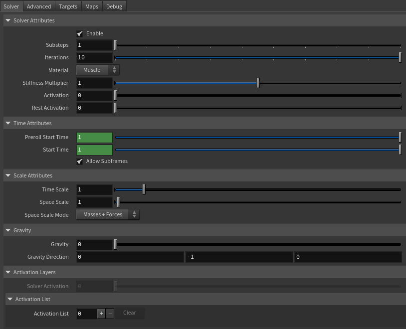
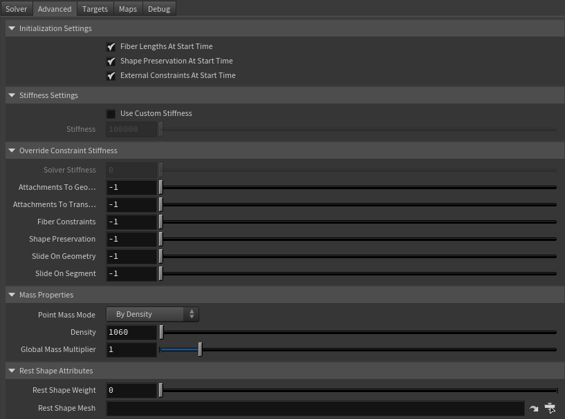
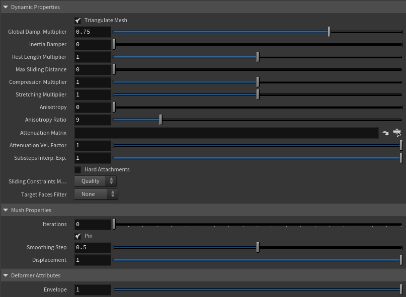
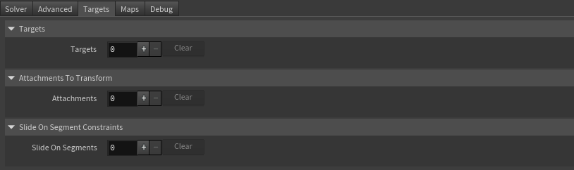
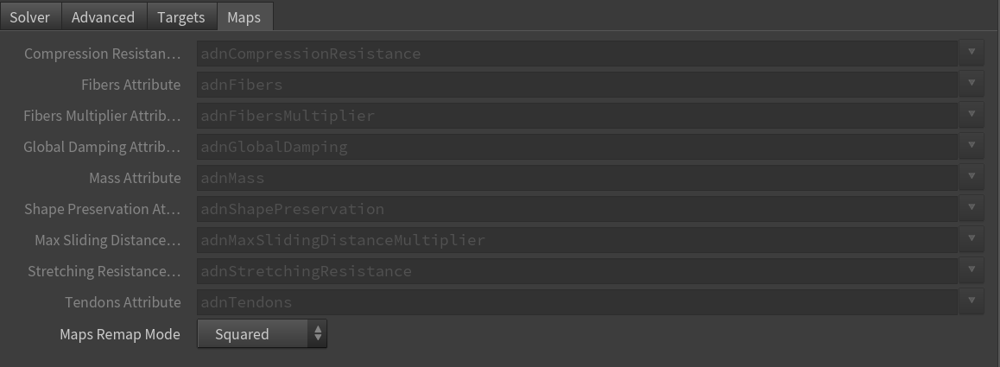
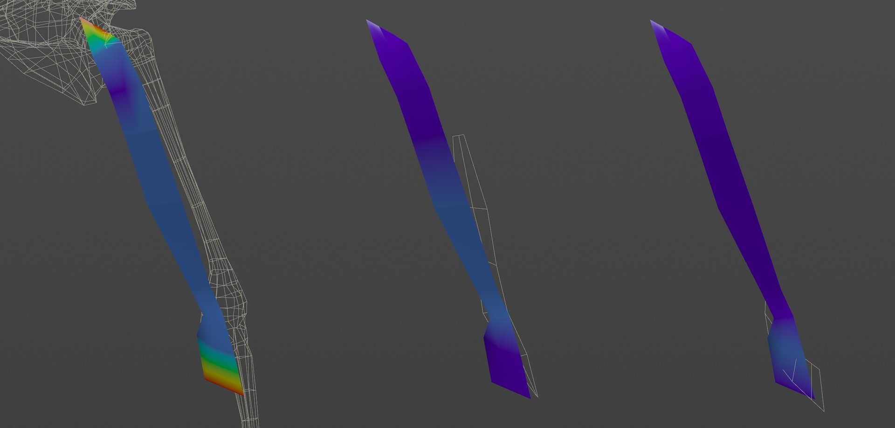
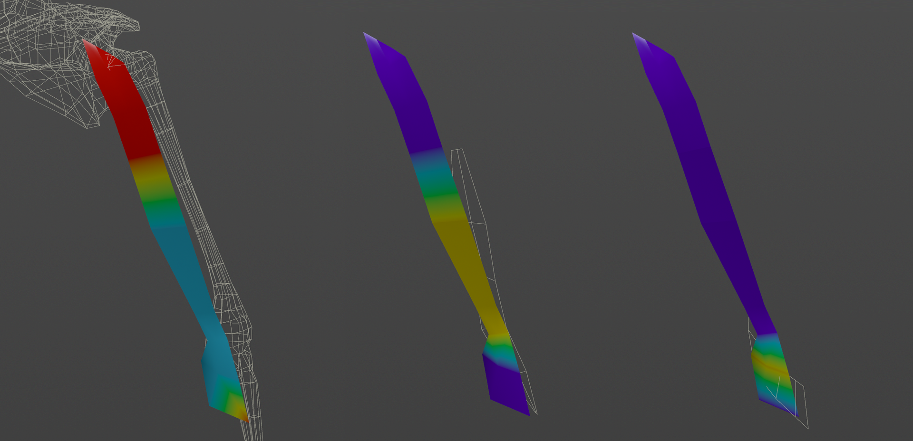
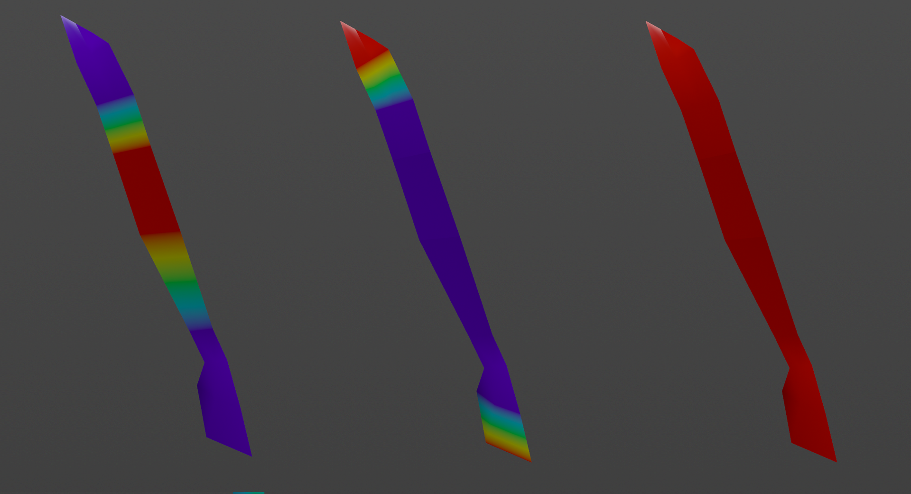
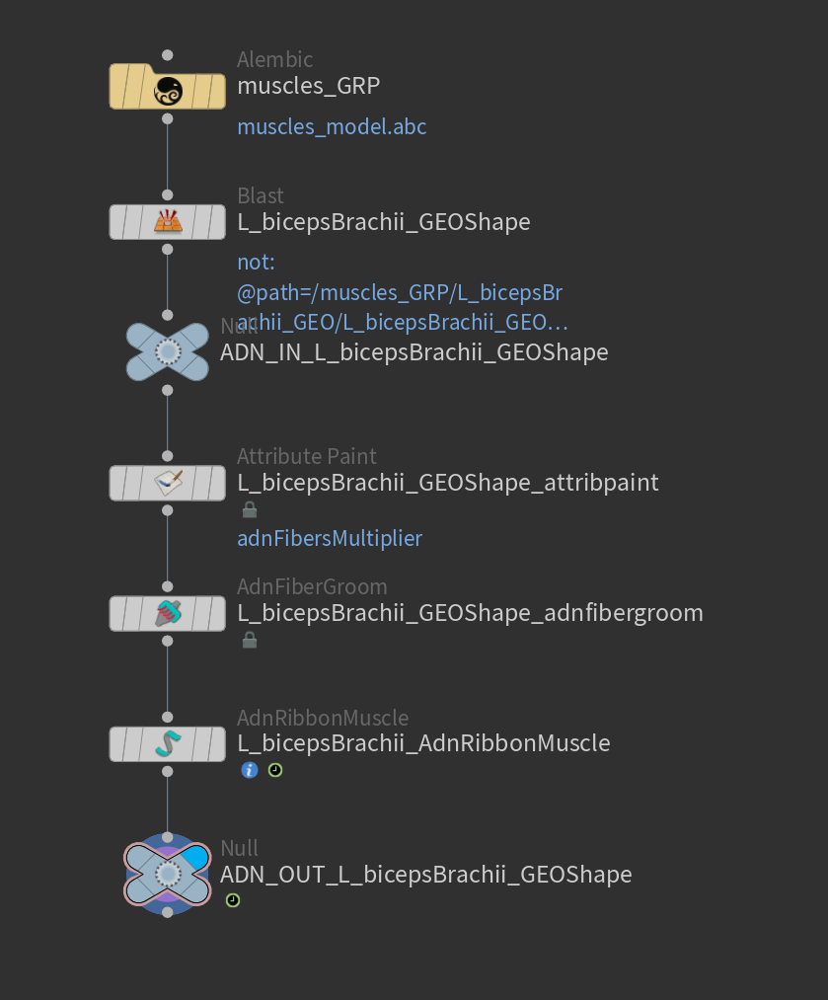

# AdnRibbonMuscle

AdnRibbonMuscle is a Houdini SOP for fast, robust, and easy-to-configure muscle simulation on a surface. Thanks to the combination of internal (structural) and external (attachment and slide) constraints, this SOP can produce dynamics that allow the mesh to acquire realistic muscle-like behavior of a ribbon, including fiber activation to modulate rigidity and attachment properties that allow the muscle to follow the global kinematics of the character through external objects.

The influence of these constraints on the simulated mesh can be freely modified by painting the available maps or by uniformly adjusting their influence using multipliers in the SOP parameters. In addition to maps and multipliers, there are many other parameters available to control the muscle’s dynamics and behavior, offering a wide range of configuration options.

### How To Use

The AdnRibbonMuscle SOP is very simple to apply to geometry and set up in a Houdini scene. It works by connecting the geometry to be simulated to the single input of the SOP. Then, attachment objects are added in the **Targets** tab, and maps are painted to make the simulated geometry follow those objects. This introduces a significant portion of the solver’s dynamics. Additionally, there are several intuitive, easy-to-set parameters and other paintable maps that allow further tweaking of the simulation to achieve the desired results.

An AdnRibbonMuscle setup requires the following inputs:

- **Targets (T)**: A list of objects with which the simulated muscle will interact. Targets can be nodes to define attachment points via their transformation matrix (e.g., rig joints, null nodes, etc.) or geometries to define those attachment points via closest point queries on their surface (e.g., bones or other muscles). Providing a list of targets is optional; however, targets are required to enable attachment and sliding behaviors on the muscle. One or multiple targets are supported. Refer to the [Targets Section](#targets) for more information.
- **Muscle Geometry (M)**: The mesh to which the AdnRibbonMuscle SOP will be applied.

To create an AdnRibbonMuscle, follow these steps:

1. Go to the geometry context of the rig containing the muscle geometries and ensure that the muscle is a single geometry piece.
2. Press TAB and navigate to the submenu AdonisFX > Solvers to find the AdnRibbonMuscle {style="width:4%"} SOP type.
3. Create it and connect the geometry to the input.
4. Go to the **Targets** tab in the AdnRibbonMuscle parameters, add a new entry to *Targets* to add a geometry target (e.g., the mummy).
5. Provide the object path of the target geometry in *Target World Mesh*.
6. The AdnRibbonMuscle is now ready to simulate using the default settings. Refer to the next section to customize its configuration.

## Attributes

### Solver Attributes
| Name | Type | Default | Animatable | Description |
| :--- | :--- | :------ | :--------- | :---------- |
| **Enable**                  | Boolean    | True   | ✓ | Flag to enable or disable the SOP computation. |
| **Substeps**                | Integer    | 1      | ✓ | Number of steps that the solver will execute per simulation frame. Greater values mean greater computational cost. Has a range of \[1, 10\]. The upper limit is soft, higher values can be used. |
| **Iterations**              | Integer    | 10     | ✓ | Number of iterations that the solver will execute per simulation step. Greater values mean greater computational cost. Has a range of \[1, 10\]. The upper limit is soft, higher values can be used. |
| **Material**                | Enumerator | Muscle | ✓ | Solver stiffness presets per material. The materials are listed from lowest to highest stiffness. There are 8 different presets: Fat: 103, Muscle: 5e3, Rubber: 106, Tendon: 5e7, Leather: 108, Wood: 6e9, Skin: 12e3. |
| **Stiffness Multiplier**    | Float      | 1.0    | ✓ | Multiplier factor to scale up or down the material stiffness. Has a range of \[0.0, 2.0\]. The upper limit is soft, higher values can be used. |
| **Activation**              | Float      | 0.0    | ✓ | Current activation of the deformed muscle. The activation modifies the stiffness of the muscle depending on the fibers direction of the muscle. Has a range of \[0.0, 1.0\]. To ingest activations driven by multiple sensors into the muscle, refer to the [AdnActivation](../utils/activation#adnactivation) page. |
| **Rest Activation**         | Float      | 0.0    | ✓ | Value representing the amount of rest activation to apply to the muscle. Has a range of \[0.0, 1.0\]. |

### Time Attributes
| Name | Type | Default | Animatable | Description |
| :--- | :--- | :------ | :--------- | :---------- |
| **Preroll Start Time** | Time | *Current frame* | ✗ | Sets the frame at which the preroll begins. The preroll ends at *Start Time*. |
| **Start Time**         | Time | *Current frame* | ✗ | Determines the frame at which the simulation starts. |

### Scale Attributes
| Name | Type | Default | Animatable | Description |
| :--- | :--- | :------ | :--------- | :---------- |
| **Time Scale**       | Float      | 1.0             | ✓ | Sets the scaling factor applied to the simulation time step. Has a range of \[0.0, 2.0\]. The upper limit is soft, higher values can be used. |
| **Space Scale**      | Float      | 1.0             | ✓ | Sets the scaling factor applied to the masses and/or the forces (e.g. gravity). AdonisFX interprets the scene units in centimeters. If modeling your creature you apply a scaling factor for whatever reason (e.g. to avoid precision issues in Houdini), you will have to adjust for this scaling factor using this attribute. If your character is supposed to be 170 units tall, but you prefer to model it to be 17 units tall, then you will need to set the space scale to a value of 10. This will ensure that your 17 units creature will simulate as if it was 170 units tall. Has a range of \[0.0, 2.0\]. The upper limit is soft, higher values can be used. |
| **Space Scale Mode** | Enumerator | Masses + Forces | ✓ | Determines if the spatial scaling affects the masses, the forces, or both. The available options are: <ul><li>Masses: The *Space Scale* only affects masses.</li><li>Forces: The *Space Scale* only affects forces.</li><li>Masses + Forces: The *Space Scale* affects masses and forces.</li><ul> |

### Gravity
| Name | Type | Default | Animatable | Description |
| :--- | :--- | :------ | :--------- | :---------- |
| **Gravity**           | Float  | 0.0              | ✓ | Sets the magnitude of the gravity acceleration in m/s2. The value is internally converted to cm/s2. Has a range of \[0.0, 100.0\]. The upper limit is soft, higher values can be used. |
| **Gravity Direction** | Float3 | {0.0, -1.0, 0.0} | ✓ | Sets the direction of the gravity acceleration. Vectors introduced do not need to be normalized, but they will get normalized internally. |

### Activation Layers
| Name | Type | Default | Animatable | Description |
| :--- | :--- | :------ | :--------- | :---------- |
| **Solver Activation**               | Float       | 0.0   | ✗ | Shows the global activation value currently used by the solver. This global activation is the result of applying all the activation layers configured in the **activation** and **activation list** attributes. |
| **Activation List**                 | List        | Empty | ✗ | List of activation layers where each item is a multiparam  of three elements: bypass operator, value and operator. |
| **Activation List Bypass Operator** | Boolean     | True  | ✓ | If enabled, it bypasses the current operator in the activation list, which will not contribute to the final activation value. |
| **Activation List Value**           | Float       | 0.0   | ✓ | Activation value that will contribute, given the operator type, to the final activation. |
| **Activation List Operator**        | Enumerator  | Add   | ✓ | Operator used to contribute to the final activation. This can be: Over, Add, Sub, Mult, Divide. |

### Advanced Settings

#### Initialization Settings
| Name | Type | Default | Animatable | Description |
| :--- | :--- | :------ | :--------- | :---------- |
| **Fiber Lengths At Start Time**        | Boolean | True  | ✗ | Flag that forces the fiber constraints to reinitialize the rest length at start time. This attribute has effect only if preroll start time is lower than start time. |
| **Shape Preservation At Start Time**   | Boolean | False | ✗ | Flag that forces the shape preservation constraints to reinitialize at start time. This attribute has effect only if preroll start time is lower than start time. |
| **External Constraints At Start Time** | Boolean | True  | ✗ | Flag that forces the external constraints (attachments to transform, attachments to geometry, slide on segment and slide on geometry) to reinitialize at start time. This attribute has effect only if preroll start time is lower than start time. |

#### Stiffness Settings
| Name | Type | Default | Animatable | Description |
| :--- | :--- | :------ | :--------- | :---------- |
| **Use Custom Stiffness**                  | Boolean | False          | ✓ | Toggles the use of a custom stiffness value. If custom stiffness is used, *Material* and *Stiffness Multiplier* will be disabled and *Stiffness* will be used instead. |
| **Stiffness**                             | Float   | 105 | ✓ | Sets the custom stiffness value. Its value must be greater than 0.0. |

#### Override Constraint Stiffness
| Name | Type | Default | Animatable | Description |
| :--- | :--- | :------ | :--------- | :---------- |
| **Solver Stiffness**         | Float |  0.0 | ✗ | Shows the global stiffness value currently used by the solver. |
| **Attachments To Geometry**  | Float | -1.0 | ✓ | Sets the stiffness override value for attachment to geometry constraints. If the value is less than 0.0, the global stiffness will be used. Otherwise, this custom stiffness will override the global stiffness. Has a range of \[0.0, 1012\]. The upper limit is soft, higher values can be used. |
| **Attachments To Transform** | Float | -1.0 | ✓ | Sets the stiffness override value for attachment to transform constraints. If the value is less than 0.0, the global stiffness will be used. Otherwise, this custom stiffness will override the global stiffness. Has a range of \[0.0, 1012\]. The upper limit is soft, higher values can be used. |
| **Fiber Constraints**        | Float | -1.0 | ✓ | Sets the stiffness override value for fiber constraints. If the value is less than 0.0, the global stiffness will be used. Otherwise, this custom stiffness will override the global stiffness. Has a range of \[0.0, 1012\]. The upper limit is soft, higher values can be used. |
| **Shape Preservation**       | Float | -1.0 | ✓ | Sets the stiffness override value for shape preservation constraints. If the value is less than 0.0, the global stiffness will be used. Otherwise, this custom stiffness will override the global stiffness. Has a range of \[0.0, 1012\]. The upper limit is soft, higher values can be used. |
| **Slide On Geometry**        | Float | -1.0 | ✓ | Sets the stiffness override value for slide on geometry constraints. If the value is less than 0.0, the global stiffness will be used. Otherwise, this custom stiffness will override the global stiffness. Has a range of \[0.0, 1012\]. The upper limit is soft, higher values can be used. |
| **Slide On Segment**         | Float | -1.0 | ✓ | Sets the stiffness override value for slide on segment constraints. If the value is less than 0.0, the global stiffness will be used. Otherwise, this custom stiffness will override the global stiffness. Has a range of \[0.0, 1012\]. The upper limit is soft, higher values can be used. |

> [!NOTE]
> Providing a stiffness override value of 0.0 will disable the computation of that constraint.

#### Mass Properties

| Name | Type | Default | Animatable | Description |
| :--- | :--- | :------ | :--------- | :---------- |
| **Point Mass Mode**        | Enumerator | By Density | ✓ | Defines how masses should be used in the solver.<ul><li>*By Density* allows to estimate the mass value by multiplying Density * Area.</li><li>*By Uniform Value* allows to set a uniform mass value.</li></ul> |
| **Density**                | Float      | 1060.0     | ✓ | Sets the density value in kg/m3 to be able to estimate mass values with *By Density* mode. The value is internally converted to g/cm3. Has a range of \[0.001, 106\]. Lower and upper limits are soft, lower and higher values can be used. |
| **Global Mass Multiplier** | Float      | 1.0        | ✓ | Sets the scaling factor applied to the mass of every point. Has a range of \[0.001, 10.0\]. Lower and upper limits are soft, lower and higher values can be used. |

#### Rest Shapes Attributes

| Name | Type | Default | Animatable | Description |
| :--- | :--- | :------ | :--------- | :---------- |
| **Rest Shape Weight** | Float   | 0.0 | ✓ | Defines the influence of the given rest shape to the final shape of the muscle. Has a range of \[0.0, 1.0\]. A value of 0.0 makes the solver ignore the rest shape. A value of 1.0 makes the solver refresh the data of fibers and shape preservation constraints at each frame to align with the rest shape. A value between 0.0 and 1.0 applies an interpolation between the original constraints data (0.0) and the rest shape constraints data (1.0). Note that this parameter is ignored if there is no rest shape connected to the solver. |
| **Rest Shape Mesh**   | String  |     | ✓ | Object path of the geometry to drive the goal shape of the muscle during simulation. This geometry is used to refresh the data of the fibers and shape preservation constraints at each frame. |

#### Dynamic Properties
| Name | Type | Default | Animatable | Description |
| :--- | :--- | :------ | :--------- | :---------- |
| **Triangulate Mesh**            | Boolean    | True     | ✗ | Use the internally triangulated mesh to build constraints. |
| **Global Damping Multiplier**   | Float      | 0.75     | ✓ | Sets the scaling factor applied to the global damping of every point. Has a range of \[0.0, 1.0\]. The upper limit is soft, higher values can be used. |
| **Inertia Damper**              | Float      | 0.0      | ✓ | Sets the linear damping applied to the dynamics of every point. Has a range of \[0.0, 1.0\]. The upper limit is soft, higher values can be used. |
| **Rest Length Multiplier**      | Float      | 1.0      | ✓ | Sets the scaling factor applied to the edge lengths at rest. Has a range of \[0.0, 2.0\]. The upper limit is soft, higher values can be used. |
| **Max Sliding Distance**        | Float      | 0.0      | ✗ | Determines the size of the sliding area. It corresponds to the maximum distance to the closest point on the target mesh computed on initialization. The higher this value is, the higher quality and the lower performance. If the value provided is considered too high for a given target mesh, a warning will be displayed to the user. Has a range of \[0.0, 10.0\]. The upper limit is soft, higher values can be used. |
| **Compression Multiplier**      | Float      | 1.0      | ✓ | Sets the scaling factor applied to the compression resistance of every point. Has a range of \[0.0, 2.0\]. The upper limit is soft, higher values can be used. |
| **Stretching Multiplier**       | Float      | 1.0      | ✓ | Sets the scaling factor applied to the stretching resistance of every point. Has a range of \[0.0, 2.0\]. The upper limit is soft, higher values can be used. |
| **Anisotropy**                  | Float      | 0.0      | ✓ | Sets the anisotropic behavior of the fibers: 0 fully isotropic material, 1 fully anisotropic material. Has a range of \[0.0, 1.0\]. |
| **Anisotropy Ratio**            | Float      | 9.0      | ✓ | Sets the ratio of anisotropy of the muscle fibers to lower the stiffness on edges not aligned with the fibers flow: the higher this value is, the lower the stiffness of the orthogonal edges when the muscle is anisotropic. Has a range of \[1.0, 50.0\]. The upper limit is soft, higher values can be used. |
| **Attenuation Matrix**          | String     |          | ✓ | Object path of the node to extract the transformation matrix from to compute the velocity attenuation. |
| **Attenuation Velocity Factor** | Float      | 1.0      | ✓ | Sets the weight of the attenuation applied to the velocities of the simulated vertices driven by the *Attenuation Matrix*. Has a range of \[0.0, 1.0\]. The upper limit is soft, higher values can be used. |
| **Substeps Interp. Exp.**       | Float      | 1.0      | ✓ | Sets the exponential factor to weight the interpolation at each substep. Has a range of \[0.0, 1.0\]. The upper limit is soft, higher values can be used. A value of 0.0 disables the interpolation: input geometry targets and attenuation matrix are not interpolated. A value of 1.0 applies linear interpolation (input geometry targets and attenuation matrix) between previous and current frame based on a linear weight, i.e. `weight = substep / num_substeps`. A value between 0.0 and 1.0 applies exponential interpolation (input geometry targets and attenuation matrix) between previous and current frame based on an exponential weight, i.e. `weight = (substep / num_substeps) ^ exponent`. |
| **Hard Attachments**            | Boolean    | False    | ✓ | If enabled, attachment constraints will force the vertices to stick to the target transformation completely. |
| **Sliding Constraints Mode**    | Enumerator | Quality  | ✓ | Defines the mode of execution for the slide on geometry constraints.<ul><li>*Quality* is more accurate, recommended for final results.</li><li>*Fast* provides higher performance, recommended for preview.</li></ul> |

### Deformer Attributes
| Name | Type | Default | Animatable | Description |
| :--- | :--- | :------ | :--------- | :---------- |
| **Envelope** | Float | 1.0 | ✓ | Specifies the deformation scale factor. Has a range of \[0.0, 1.0\]. The upper and lower limits are soft, values can be set in a range of \[-2.0, 2.0\]|

### Targets Attributes
| Name | Type | Default | Animatable | Description |
| :--- | :--- | :------ | :--------- | :---------- |
| **Targets**                             | List      | 0     | ✗ | List of geometry targets used for setting up attachment to geometry and slide on geometry constraints. Each item is a multiparam of three elements: target world mesh, attachment to geometry attribute and slide on geometry attribute. |
| **Target World Mesh**                   | String    |       | ✓ | Object path of the mesh used for setting up attachment to geometry and slide on geometry constraints. |
| **Attachments To Geometry Attribute**   | float     | 0.0   | ✗ | Specifies the name of the per-point attribute to read the attachment to geo weight values from. The expected attribute name is `adnAttachmentToGeoConstraints#`. The expected range of the per-point values is \[0.0, 1.0\].  |
| **Slide On Geometry Attribute**         | float     | 0.0   | ✗ | Specifies the name of the per-point attribute to read the slide on geo weight values from. The expected attribute name is `adnSlideOnGeometryConstraints#`. The expected range of the per-point values is \[0.0, 1.0\]. |
||||||
| **Attachments To Transform**            | List      | 0     | ✗ | List of objects used for setting up attachment to transform constraints. Each item is a multiparam of two elements: attachment matrix and attachment attribute. |
| **Attachment Matrix**                   | String    |       | ✓ | Object path of the node used for setting up attachment to transform constraints. |
| **Attachment Attribute**                | float     | 0.0   | ✗ | Specifies the name of the per-point attribute to read the attachment weight values from. The expected attribute name is `adnAttachmentConstraints#`. The expected range of the per-point values is \[0.0, 1.0\]. |
||||||
| **Slide On Segments**                   | List      | 0     | ✗ | List of pair of objects used for setting up slide on segment constraints. |
| **Slide On Segment Root Matrix**        | String    |       | ✓ | Defines the path to the root transformation matrix to drive the slide on segment constraint. The path can be relative or absolute. |
| **Slide On Segment Tip Matrix**         | String    |       | ✓ | Defines the path to the tip transformation matrix to drive the slide on segment constraint. The path can be relative or absolute. |
| **Slide On Segment Attribute**          | float     | 0.0   | ✗ | Specifies the name of the per-point attribute to read the slide on segment weight values from. The expected attribute name is `adnSlideOnSegmentConstraints#`. The expected range of the per-point values is \[0.0, 1.0\]. |

> [!NOTE]
> - All maps parameters are disabled in each entry added to these multiparams because the attribute names are fixed to drive specific functionalities of the solver.
> - Fixed point attribute names also ensure compatibility with the API.
> - To copy the map names of the disabled attributes for painting (using an attribute paint node) right click on the disabled map attribute parameter, press "Copy Parameter", select the attribute paint node and on the attribute name entry right click and press "Paste Values". This allows to easily copy the attribute name for painting.
> - If a point attribute on the geostream does not match the naming convention exposed in the node, use an "Attribute Rename" node to rename the attribute to match the expected naming convention.

### Maps

| Name | Type | Default | Animatable | Description |
| :--- | :--- | :------ | :--------- | :---------- |
| **Compression Resistance Attribute**          | float       | 1.0             | ✗            | Specifies the name of the per-point attribute to read the compression resistance values from. The expected attribute name is `adnCompressionResistance`. The expected range of the per-point values is \[0.0, 1.0\].  |
| **Fibers Attribute**                          | Vec3        | {0.0, 0.0, 0.0} | ✗            | Specifies the name of the per-point attribute to read the fiber values from. The expected attribute name is `adnFibers`. The expected range of the per-component per-point values is \[0.0, 1.0\]. |
| **Fibers Multiplier Attribute**               | float       | 1.0             | ✗            | Specifies the name of the per-point attribute to read the fibers multiplier values from. The expected attribute name is `adnFibersMultiplier`. The expected range of the per-point values is \[0.0, 1.0\]. |
| **Global Damping Attribute**                  | float       | 1.0             | ✗            | Specifies the name of the per-point attribute to read the global damping from. The expected attribute name is `adnGlobalDamping`. The expected range of the per-point values is \[0.0, 1.0\]. |
| **Mass Attribute**                            | float       | 1.0             | ✗            | Specifies the name of the per-point attribute to read the mass values from. The expected attribute name is `adnMass`. The expected range of the per-point values is \[0.001, 1.0\]. |
| **Shape Preservation Attribute**              | float       | 1.0             | ✗            | Specifies the name of the per-point attribute to read the shape preservation values from. The expected attribute name is `adnShapePreservation`. The expected range of the per-point values is \[0.0, 1.0\]. |
| **Max Sliding Distance Multiplier Attribute** | float       | 1.0             | ✗            | Specifies the name of the per-point attribute to read the maximum sliding distance multiplier from. The expected attribute name is `adnMaxSlidingDistanceMultiplier`. The expected range of the per-point values is \[0.0, 1.0\]. |
| **Stretching Resistance Attribute**           | float       | 1.0             | ✗            | Specifies the name of the per-point attribute to read the stretching resistance values from. The expected attribute name is `adnStretchingResistance`. The expected range of the per-point values is \[0.0, 1.0\]. |
| **Tendons Attribute**                         | float       | 0.0             | ✗            | Specifies the name of the per-point attribute to read the tendon values from. The expected attribute name is `adnTendons`. The expected range of the per-point values is \[0.0, 1.0\]. |
| **Maps Remap Mode**                           | Enumerator  | Squared         | ✗            | Defines the mode of remapping the painted values of attachments to geometry, slide on geometry, attachments to transform, slide on segment and shape preservation constraints. The other paintable maps remain unmodified. Each remap mode applies a function to the input painted values (x) to get the final value used for the simulation (y).<ul><li>Linear: `y = x`</li><li>Squared: `y = x^2`</li><li>Cubic: `y = x^3`</li><li>Square Root: `y = x^(1/2)`</li><li>Cube Root: `y = x^(1/3)`</li><li>Logarithmic: `y = log((exp(1) - 1) * x + 1)`</li></ul> |

> [!NOTE]
> - All maps parameters are disabled in the Maps tab because the attribute names are fixed to drive specific functionalities of the solver.
> - Fixed point attribute names also ensure compatibility with the API.
> - To copy the map names of the disabled attributes for painting (using an attribute paint node) right click on the disabled map attribute parameter, press "Copy Parameter", select the attribute paint node and on the attribute name entry right click and press "Paste Values". This allows to easily copy the attribute name for painting.
> - If a point attribute on the geostream does not match the naming convention exposed in the node, use an "Attribute Rename" node to rename the attribute to match the expected naming convention.

## Parameter Template

<figure style="width: 75%;" markdown>
   
  <figcaption><b>Figure 1</b>: AdnRibbonMuscle Parameter Template: Solver.</figcaption>
</figure>

<figure style="width: 75%;" markdown>
   
  <figcaption><b>Figure 2</b>: AdnRibbonMuscle Parameter Template: Advanced (Part 1).</figcaption>
</figure>

<figure style="width: 75%;" markdown>
   
  <figcaption><b>Figure 3</b>: AdnRibbonMuscle Parameter Template: Advanced (Part 2).</figcaption>
</figure>

<figure style="width: 75%;" markdown>
   
  <figcaption><b>Figure 4</b>: AdnRibbonMuscle Parameter Template: Targets.</figcaption>
</figure>

<figure style="width: 75%;" markdown>
   
  <figcaption><b>Figure 5</b>: AdnRibbonMuscle Parameter Template: Maps.</figcaption>
</figure>

## Paintable Weights

In order to provide more artistic control, some key parameters of the muscle solver are exposed as paintable maps in the SOP. The maps are point attributes that must be present in the geometry stream injected into the SOP. For that, the Houdini attribpaint node can be used.

| Name | Default | Description |
| :--- | :------ | :---------- |
| **Attachments To Geometry**     | 0.0             | Multi-influence weight to indicate the influence of each geometry attachment at each vertex of the muscle. |
| **Attachments To Transform**    | 0.0             | Multi-influence weight to indicate the influence of each transform attachment at each vertex of the muscle. |
| **Compression Resistance**      | 1.0             | Force to correct the edge lengths if the current length is smaller than the rest length. A higher value represents higher correction. |
| **Fibers**                      | {0.0, 0.0, 0.0} | The SOP estimates the fiber directions at each vertex based on the tendon weights. In case that the estimated fibers do not fit well to the desired directions, the *AdnFiberGroom* HDA can be used to comb the fibers manually. The fibers can be displayed from that HDA. Check [this page](../utils/fiber_groom) to know more about this HDA.  |
| **Fibers Multiplier**           | 1.0             | Controls the area in which to concentrate the activation of the muscle. A higher value means more concentrated activation. |
| **Global Damping**              | 1.0             | Set global damping per vertex in the simulated mesh. The greater the value per vertex is the more it will attempt to retain its previous position. |
| **Masses**                      | 1.0             | Set individual mass values per vertex in the simulated mesh. |
| **Shape Preservation**          | 1.0             | Amount of correction to apply to the current vertex to maintain the initial state of the shape formed with the surrounding vertices. |
| **Slide On Geometry**           | 0.0             | Multi-influence weight to force vertices to displace only on the target geometry area defined by the *Max Sliding Distance* value. |
| **Slide On Segment**            | 0.0             | Multi-influence weight to force vertices to displace only in the direction of a user-specified group of segments. |
| **Sliding Distance Multiplier** | 1.0             | Determines the size of the sliding area per vertex. It corresponds to the maximum distance to the closest point on the target mesh computed on initialization. Greater values will allow for larger sliding areas but will also increase the computational cost.<ul><li>*Tip*: For areas where sliding is not required paint to 0.0. Use values closer to 1.0 in areas where more sliding freedom should be prioritized.</li></ul> |
| **Stretching Resistance**       | 1.0             | Force to correct the edge lengths if the current length is greater than the rest length. A higher value represents higher correction. |
| **Tendons**                     | 0.0             | Floating values to indicate the source of the muscle fibers. The solver will use that information to make an estimation of the fiber direction at each vertex. It is recommended to set a value of 1.0 wherever the tendinous tissue would be in an anatomically realistic muscle and a value of 0.0 in the rest of the mesh. |

<figure markdown>
   
  <figcaption><b>Figure 6</b>: Example of AdnRibbonMuscle attachment to geometry maps painted on a planar biceps with 3 targets. From left to right, the targets are the mummy, the brachialis muscle, and the pronator teres muscle.</figcaption>
</figure>

<figure markdown>
   
  <figcaption><b>Figure 7</b>: Example of AdnRibbonMuscle slide on geometry maps painted on a planar biceps with 3 targets. From left to right, the targets are the mummy, the brachialis muscle, and the pronator teres muscle.</figcaption>
</figure>

<figure markdown>
   
  <figcaption><b>Figure 8</b>: Example of other paintable maps on a planar biceps. On the left, the fibers multiplier map. In the middle, the tendons map. On the right, a map flooded with a value of 1.0 corresponding to all other remaining maps (compression, stretching, masses, global damping, shape preservation and sliding distance multiplier).</figcaption>
</figure>

> [!NOTE]
> - The attachment and sliding weights are normalized on initialization if the sum of the values for the multiple influences exceed the upper limit of 1.0.
> - If *AdnFiberGroom* HDA is used to comb the Fibers, it is recommended to place it after `attribpaint` nodes in charge of painting the Tendon weights, because the tendons map is an input to estimate an initial fibers flow.

<figure style="width: 75%;" markdown>
   
  <figcaption><b>Figure 9</b>: Example of AdnRibbonMuscle net. The attribpaint node has to be placed prior to the AdnFiberGroom. Using null nodes with ADN_IN_ and ADN_OUT_ prefixes to encapsulate the AdonisFX deformable section is recommended to keep the net compatible with the API.</figcaption>
</figure>

## Advanced

### Targets

Once the AdnRibbonMuscle SOP is created, it is possible to add and remove attachments from the muscle using the *Targets* tab. A target is evaluated as a **mesh** if its object path is added to *Target World Mesh* under the *Targets* multiparm (i.e., to set up attachment-to-geometry and slide-on-geometry constraints), and as a **transformation matrix** if its object path is added to *Attachment Matrix* under the *Attachments To Transform* multiparm (i.e., to set up attachment-to-transform constraints).

- **Add geometry targets**:
    1. Increment the number of entries in the *Targets* multiparm. This adds a new entry to the list.
    2. Enter the object path of the geometry to add. The path can be absolute or relative to the SOP.
    3. Make sure to recook the AdnRibbonMuscle at preroll start time for this change to take effect.
- **Remove geometry targets**:
    1. Locate the target to remove in the *Targets* multiparm.
    2. Remove it using the **X** button for that item.
    3. Alternatively, to remove all targets, click the **Clear** button of the *Targets* multiparm.
    4. Make sure to recook the AdnRibbonMuscle at preroll start time for this change to take effect.
- **Add attachment matrices**:
    1. Increment the number of entries in the *Attachments To Transform* multiparm. This adds a new entry to the list.
    2. Enter the object path of the node to add. The path can be absolute or relative to the SOP.
    3. Make sure to recook the AdnRibbonMuscle at preroll start time for this change to take effect.
- **Remove attachment matrices**:
    1. Locate the object to remove in the *Attachments To Transform* multiparm.
    2. Remove it using the **X** button for that item.
    3. Alternatively, to remove all attachments, click the **Clear** button of the *Attachments To Transform* multiparm.
    4. Make sure to recook the AdnRibbonMuscle at preroll start time for this change to take effect.

Transformation nodes such as joints or locators are used to create attachments to their world transformation matrices. Meshes, on the other hand, are used to create attachment-to-geometry and slide-on-geometry constraints. Refer to [A Simple Setup](../simple_setup#AdnRibbonMuscle) for more information on painting influence maps for these constraints.

> [!NOTE]
> - Attachment-to-geometry and slide-on-geometry constraints are intended to simulate muscle-to-bone and muscle-to-muscle interactions.
> - For muscle-to-muscle interactions, only unidirectional relationships are supported. This means that for two muscles, A and B, it is possible to assign A as a target of B or B as a target of A, but not both simultaneously.

### Slide On Segment Constraint

In addition to the previously described constraints, muscles can optionally use a constraint that defines a segment along which the muscle can slide. This constraint is configured in the *Slide On Segment Constraints* section of the *Targets* tab.

- **Add segment**:
    1. Increment the number of entries in the *Slide On Segment Constraints* multiparm. This adds a new entry to the list.
    2. Enter the object path of the node to use as the root of the segment. The path can be absolute or relative to the SOP.
    3. Enter the object path of the node to use as the tip of the segment. The path can be absolute or relative to the SOP.

> [!NOTE]
> - The transform nodes must follow a parent-to-child relationship in the hierarchy (as rig joints typically do).
> - It is recommended to paint only the vertices that are not attached to the rig, i.e., excluding tendon vertices.
> - This constraint is especially recommended for muscles on the limbs.

- **Remove segment**:
    1. Locate the segment to remove in the *Slide On Segment Constraints* multiparm.
    2. Remove it using the **X** button for that item.
    3. Alternatively, to remove all segments, click the **Clear** button of the *Slide On Segment Constraints* multiparm.

### Rest Shape

The muscle solver supports an art-directed shape that drives the fiber and shape preservation constraints. This shape is typically a sculpted version of the muscle (and must be topologically identical) representing the muscle in its fully activated state. Artists can add or remove this custom shape from the dedicated *Rest Shape Attributes* section in the *Advanced* tab.

- **Add rest shape**:
    1. Enter the object path of the geometry to use as the rest shape in the *Rest Shape Mesh* parameter.
    2. Set the *Rest Shape Weight* to a value greater than 0.0 for the feature to take effect.

> [!NOTE]
> - The topology of the rest shape and the muscle geometry must be identical (i.e., vertex count, vertex connectivity, polygonal structure, etc.).

- **Remove rest shape**:
    1. Clear the object path in the *Rest Shape Mesh* parameter.
    2. Alternatively, set the *Rest Shape Weight* to 0.0 to ignore the rest shape.

Additionally, if the muscle activation input is connected to the *Rest Shape Weight*, the influence of the rest shape on the final result will vary coherently with the activation level during the simulation.

### Fibers Multiplier

Painting the fibers multiplier map allows to concentrate the activation of a muscle in certain areas which would allow for more artistic control over the final shape of the muscle after contraction (activation).
Not painting the fibers multiplier map will cause the muscle to contract uniformly over its whole surface without concentrating the activations in the belly of the muscle. Painting to 0.0 the tendinous areas and painting to 1.0 the belly of the muscle will allow (after combing fibers and activating the muscle) to activate only the areas that had been painted with a value of 1.0.

### Activation Layers

The activation layers allow to drive the muscle activation by multiple sensors combined together without the need of using an [AdnActivation](../utils#activation) node. In practice, having an AdnActivation node with multiple input sensors connected to the **activation** attribute of an AdnRibbonMuscle is equivalent to connecting those sensors directly to the activation list of that muscle.

The activation layers contribute to the final activation of the muscle solver, where the first layer will always be the **activation** scalar attribute. Then, every value in the **activation list** array plug is applied on top taking into consideration the operator and the bypass flag. The resulting value is the global activation that the solver will use for the simulation, and it is written onto the read-only **output solver activation** attribute.

The operators available are:

1. **Over (Override)**: Overrides the accumulated solver activation value with Value. If the current accumulated activation value is 1.0 and Value is 2.0 then the new accumulated value will be 2.0.
2. **Add (Add)**: Adds the accumulated solver activation value with Value. If the current accumulated activation value is 1.0 and Value is 2.0 then the new accumulated value will be 3.0.
3. **Sub (Subtract)**: Subtracts the accumulated solver activation value with Value. If the current accumulated activation value is 1.0 and Value is 2.0 then the new accumulated value will be -1.0.
4. **Mult (Multiply)**: Multiplies the accumulated solver activation value with Value. If the current accumulated activation value is 1.0 and Value is 2.0 then the new accumulated value will be 2.0.
5. **Div (Divide)**: Divides the accumulated solver activation value with Value. If the current accumulated activation value is 1.0 and Value is 2.0 then the new accumulated value will be 0.5.

> [!NOTE]
> - All operators will be evaluated from top to bottom (starting from the lowest index and ending on the last index used).
> - The final value will be clamped in the range 0 to 1 to ensure that the solver activation is always normalized.
