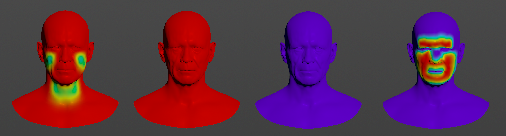
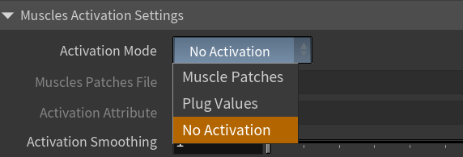
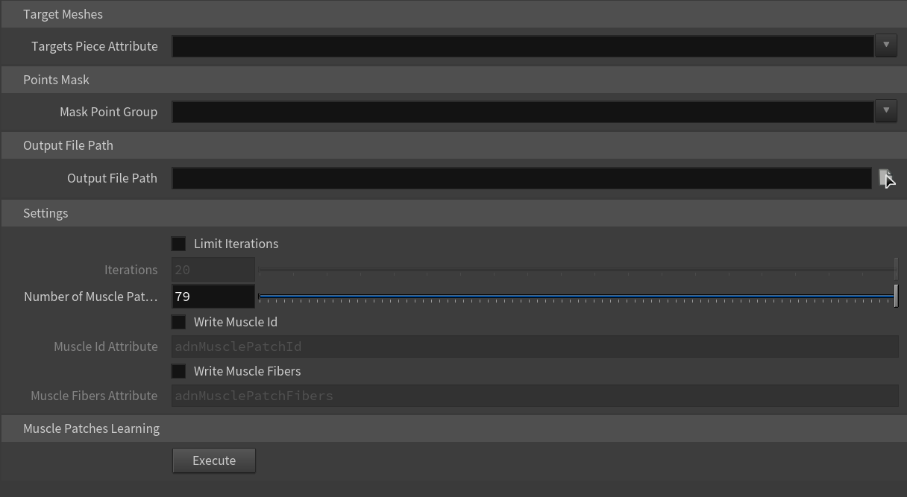
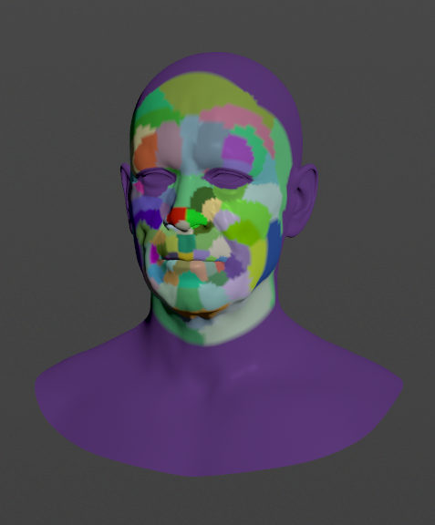
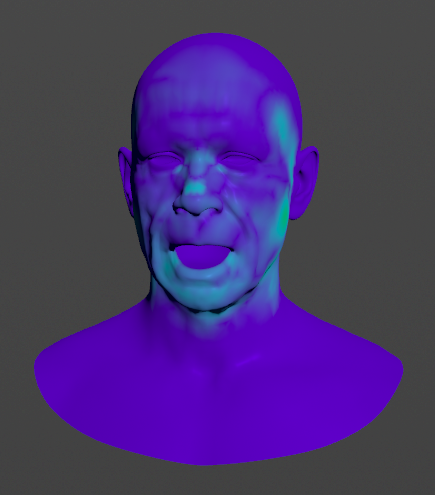

# AdnSimshape

AdnSimshape is a Houdini SOP to produce facial simulation in the animation rig of an asset. Given a facial expression, the SOP is able to compute the activation of the vertices in order to emulate the changes in the rigidity of the skin. As a result, the dynamics of the simulated skin mimic the behavior of internal muscles contracting.

During simulation, the solver reduces the inertias of the vertices with higher values of activation, while it computes standard simulation in the vertices that are not activated. One of the key features of AdnSimshape is the ability to extract muscle information directly from the neutral geometry and the set of deformed geometries with the facial expressions using Machine Learning techniques.

### How To Use

The AdnSimshape SOP is of great simplicity to set up and apply to a mesh within a Houdini scene. The combination of a rest mesh, deform mesh and animated mesh allows the system to compute activation values which would drive the behavior and inertias of the output skin mesh (simulated mesh).

To create an AdnSimshape SOP within a Houdini scene, the following inputs must be provided:

  - **Rest Mesh (R)**: Mesh with no deformation or animation (optional).
  - **Deform Mesh (D)**: Mesh with deformation driven by the facial expressions (optional, only if muscle activations with AdonisFX Muscle Patches is required).
  - **Animated Mesh (A)**: Mesh with deformation driven by the facial expressions and animation result of the binding to the animation rig.
  - **Simulation Mesh (S)**: Mesh to apply the SOP to. This mesh can be the animation mesh or a separate mesh with no deformation nor animation.

> [!NOTE]
> - All input geometries must have the same number of vertices.
> - If **R** is not provided, the system will use the initial state of **S** as the rest mesh.
> - If **D** is not provided, the simulation will not produce activations.
> - If **A** is not provided, the system will use the input mesh to the deformer (**S**) as the animated mesh.

To create an AdnSimshape, follow these steps:

  1. Go to the geometry context of the rig containing the input geometries.
  2. Press TAB and navigate to the submenu AdonisFX > Solvers to find the AdnSimshape  {style="width:4%"} SOP type.
  3. Create it and connect the geometries to the corresponding inputs (**S** to the first input; **A** to the second input; **R** to the third input; **D** to the fourth input).
  4. The AdnSimshape is now ready to simulate with default settings and *Material* set to *Skin*. Check the next section to customize their configuration.

## Attributes

### Solver Attributes
| Name | Type | Default | Animatable | Description |
| :--- | :--- | :------ | :--------- | :---------- |
| **Enable**               | Boolean    | True    | ✓ | Flag to enable or disable the deformer computation. |
| **Substeps**             | Integer    | 1       | ✓ | Number of steps that the solver will execute per simulation frame. Greater values mean greater computational cost. Has a range of \[1, 10\]. The upper limit is soft, higher values can be used. |
| **Iterations**           | Integer    | 3       | ✓ | Number of iterations that the solver will execute per simulation step. Greater values mean greater computational cost. Has a range of \[1, 10\]. The upper limit is soft, higher values can be used. |
| **Material**             | Enumerator | Skin    | ✓ | Solver stiffness presets per material. The materials are listed from lowest to highest stiffness. There are 8 different presets: Fat: 103, Muscle: 5e3, Rubber: 106, Tendon: 5e7, Leather: 108, Wood: 6e9, Skin: 12e3. |
| **Stiffness Multiplier** | Float      | 1.0     | ✓ | Multiplier factor to scale up or down the material stiffness. Has a range of \[0.0, 2.0\]. The upper limit is soft, higher values can be used. |

### Muscles Activation Settings
| Name | Type | Default | Animatable | Description |
| :--- | :--- | :------ | :--------- | :---------- |
| **Activation Mode**          | Enumerator | No activation      | ✗ | Mode to drive the muscle activations. There are 3 different modes: <ul><li>Muscle Patches (Disabled by default): An AdonisFX Muscle Patches file (`.amp`) has to be provided to enable this option.</li><li>Plug Values (Disabled by default): The activation values will be read from the per-point `adnActivation` attribute stored in the first input geometry. </li><li>No Activation (Enabled by default): No activation is read.</li></ul> |
| **Muscle Patches File**      | String     |                    | ✗ | Path to the AdonisFX Muscle Patches file (`.amp`). |
| **Activation Attribute**     | String     | `adnActivation`    | ✗ | Name of the per-point attribute to read the activation values from. The activation values will be read from this attribute when the *Activation Mode* is set to *Plug Values*. The expected range of the per-point values is \[0.0, 1.0\]. |
| **Activation Smoothing**     | Integer    | 1                  | ✗ | Number of iterations for the activation smoothing algorithm. The greater the number, the smoother the activations per patch will be. Has a range of \[1, 20\]. The upper limit is soft, higher values can be used. |
| **Bidirectional Activation** | Boolean    | False              | ✓ | Flag to enable muscle activations in the positive and negative directions of the muscle patches fibers. |
| **Write Out Activation**     | Boolean    | False              | ✓ | Flag to toggle the writing of activations into an output plug. |
| **Out Activation Attribute** | String     | `adnOutActivation` | ✗ | Name of the per-point attribute to write the output activation weights to. |

### Time Attributes
| Name | Type | Default | Animatable | Description |
| :--- | :--- | :------ | :--------- | :---------- |
| **Preroll Start Time** | Time | *Current frame* | ✗ | Sets the frame at which the pre-roll begins. The pre-roll ends at *Start Time*. |
| **Start Time**         | Time | *Current frame* | ✗ | Determines the frame at which the simulation starts. |

### Scale Attributes
| Name | Type | Default | Animatable | Description |
| :--- | :--- | :------ | :--------- | :---------- |
| **Time Scale**       | Float      | 1.0             | ✓ | Sets the scaling factor applied to the simulation time step. Has a range of \[0.0, 2.0\]. The upper limit is soft, higher values can be used. |
| **Space Scale**      | Float      | 1.0             | ✓ | Sets the scaling factor applied to the masses and/or the forces (e.g. gravity). AdonisFX interprets the scene units in centimeters. If modeling your creature you apply a scaling factor for whatever reason (e.g. to avoid precision issues in Maya), you will have to adjust for this scaling factor using this attribute. If your character is supposed to be 170 units tall, but you prefer to model it to be 17 units tall, then you will need to set the space scale to a value of 10. This will ensure that your 17 units creature will simulate as if it was 170 units tall. Has a range of \[0.0, 2.0\]. The upper limit is soft, higher values can be used. |
| **Space Scale Mode** | Enumerator | Masses + Forces | ✓ | Determines if the spatial scaling affects the masses, the forces, or both. The available options are: <ul><li>Masses: The *Space Scale* only affects masses.</li><li>Forces: The *Space Scale* only affects forces.</li><li>Masses + Forces: The *Space Scale* affects masses and forces.</li><ul> |

### Gravity
| Name | Type | Default | Animatable | Description |
| :--- | :--- | :------ | :--------- | :---------- |
| **Gravity**           | Float  | 0.0              | ✓ | Sets the magnitude of the gravity acceleration in m/s2. The value is internally converted to cm/s2. Has a range of \[0.0, 100.0\]. The upper limit is soft, higher values can be used. |
| **Gravity Direction** | Float3 | {0.0, -1.0, 0.0} | ✓ | Sets the direction of the gravity acceleration. Vectors introduced do not need to be normalized, but they will get normalized internally. |

### Advanced Settings

#### Initialization Settings
| Name | Type | Default | Animatable | Description |
| :--- | :--- | :------ | :--------- | :---------- |
| **Shape Preservation At Start Time** | Boolean | True  | ✗ | Flag that forces the shape preservation constraints to reinitialize at start time. This attribute has effect only if preroll start time is lower than start time. |
| **Slide Collision At Start Time**    | Boolean | True  | ✗ | Flag that forces the slide collision constraints to reinitialize at start time. This attribute has effect only if preroll start time is lower than start time. |
| **Animatable Rest Mesh**             | Boolean | False | ✓ | Flag that enables reading animated rest mesh data. |
| **Initialize to Anim Mesh**          | Boolean | False | ✗ | Flag to instantiate points at animated mesh instead of rest mesh on initialization. |

#### Stiffness Settings
| Name | Type | Default | Animatable | Description |
| :--- | :--- | :------ | :--------- | :---------- |
| **Use Custom Stiffness**                  | Boolean | False          | ✓ | Toggles the use of a custom stiffness value. If custom stiffness is used, *Material* and *Stiffness Multiplier* will be disabled and *Stiffness* will be used instead. |
| **Stiffness**                             | Float   | 105 | ✓ | Sets the custom stiffness value. Its value must be greater than 0.0. |

#### Override Constraint Stiffness
| Name | Type | Default | Animatable | Description |
| :--- | :--- | :------ | :--------- | :---------- |
| **Solver Stiffness**            | Float |  0.0 | ✗ | Shows the global stiffness value currently used by the solver. |
| **Distance Constraints**        | Float | -1.0 | ✓ | Sets the stiffness override value for distance constraints. If the value is less than 0.0, the global stiffness will be used. Otherwise, this custom stiffness will override the global stiffness. Has a range of \[0.0, 1012\]. The upper limit is soft, higher values can be used. |
| **Shape Preservation**          | Float | -1.0 | ✓ | Sets the stiffness override value for shape preservation constraints. If the value is less than 0.0, the global stiffness will be used. Otherwise, this custom stiffness will override the global stiffness. Has a range of \[0.0, 1012\]. The upper limit is soft, higher values can be used. |
| **Slide Collision Constraints** | Float | -1.0 | ✓ | Sets the stiffness override value for slide collision constraints. If the value is less than 0.0, the global stiffness will be used. Otherwise, this custom stiffness will override the global stiffness. Has a range of \[0.0, 1012\]. The upper limit is soft, higher values can be used. |

> [!NOTE]
> Providing a stiffness override value of 0.0 will disable the computation of that constraint.

#### Mass Properties

| Name | Type | Default | Animatable | Description |
| :--- | :--- | :------ | :--------- | :---------- |
| **Point Mass Mode**        | Enumerator | By Density  | ✓ | Defines how masses should be used in the solver.<ul><li>*By Density* allows to estimate the mass value by multiplying Density * Area.</li><li>*By Uniform Value* allows to set a uniform mass value.</li></ul> |
| **Density**                | Float      | 1100.0      | ✓ | Sets the density value in kg/m3 to be able to estimate mass values with *By Density* mode. The value is internally converted to g/cm3. Has a range of \[0.001, 106\]. Lower and upper limits are soft, lower and higher values can be used. |
| **Global Mass Multiplier** | Float      | 1.0         | ✓ | Sets the scaling factor applied to the mass of every point. Has a range of \[0.001, 10.0\]. Lower and upper limits are soft, lower and higher values can be used. |

#### Dynamic Properties
| Name | Type | Default | Animatable | Description |
| :--- | :--- | :------ | :--------- | :---------- |
| **Triangulate Mesh**            | Boolean | True  | ✗ | Use the internally triangulated mesh to build constraints. |
| **Global Damping Multiplier**   | Float   | 0.75  | ✓ | Sets the scaling factor applied to the global damping of every point. Has a range of \[0.0, 1.0\]. The upper limit is soft, higher values can be used. |
| **Inertia Damper**              | Float   | 0.0   | ✓ | Sets the linear damping applied to the dynamics of every point. Has a range of \[0.0, 1.0\]. The upper limit is soft, higher values can be used. |
| **Rest Length Multiplier**      | Float   | 1.0   | ✓ | Sets the scaling factor applied to the edge lengths at rest. Has a range of \[0.0, 2.0\]. The upper limit is soft, higher values can be used. |
| **Compression Multiplier**      | Float   | 1.0   | ✓ | Sets the scaling factor applied to the compression resistance of every point. Has a range of \[0.0, 2.0\]. The upper limit is soft, higher values can be used. |
| **Stretching Multiplier**       | Float   | 1.0   | ✓ | Sets the scaling factor applied to the stretching resistance of every point. Has a range of \[0.0, 2.0\]. The upper limit is soft, higher values can be used. |
| **Attenuation Velocity Matrix** | String  |       | ✓ | Object path of the node to extract the transformation matrix from to compute the velocity attenuation. |
| **Attenuation Velocity Factor** | Float   | 1.0   | ✓ | Sets the weight of the attenuation applied to the velocities of the simulated vertices driven by the *Attenuation Matrix*. Has a range of \[0.0, 1.0\]. The upper limit is soft, higher values can be used. |
| **Substeps Interp. Exp.**       | Float   | 1.0   | ✓ | Sets the exponential factor to weight the interpolation at each substep. Has a range of \[0.0, 1.0\]. The upper limit is soft, higher values can be used. A value of 0.0 disables the interpolation: input geometry targets and attenuation matrix are not interpolated. A value of 1.0 applies linear interpolation (input geometry targets and attenuation matrix) between previous and current frame based on a linear weight, i.e. `weight = substep / num_substeps`. A value between 0.0 and 1.0 applies exponential interpolation (input geometry targets and attenuation matrix) between previous and current frame based on an exponential weight, i.e. `weight = (substep / num_substeps) ^ exponent`. |

#### Collision Settings
| Name | Type | Default | Animatable | Description |
| :--- | :--- | :------ | :--------- | :---------- |
| **Compute Collisions**   | Boolean | True | ✓ | Flag to enable collision correction in the deformer. If disabled, the deformer will ignore colliders when deforming the mesh. |
| **Keep Orientation**     | Boolean | True | ✓ | Flag to preserve the initial orientation of the vertices relative to the collider when handling collisions. If disabled, the mesh will suffer no changes if the orientation of the collider varies. |
| **Max Sliding Distance** | Float   | 0.0  | ✗ | Maximum distance (in world units) the simulated vertex is allowed to slide relative to the collider. If the value provided is considered too high for a given collider mesh, a warning will be displayed to the user. Has a range of \[0.0, 10.0\]. The upper limit is soft, higher values can be used. |

#### Attraction Settings
| Name | Type | Default | Animatable | Description |
| :--- | :--- | :------ | :--------- | :---------- |
| **Attraction Multiplier** | Float      | 1.0       | ✓ | Sets the scaling factor applied to the Attraction. Has a range of \[0.0, 2.0\]. The upper limit is soft, higher values can be used. |
| **Attraction Remap Mode** | Enumerator | Cube Root | ✓ | Defines the mode of remapping the painted attraction values (x) to get the final values used for the simulation (y).<ul><li>Linear: `y = x`</li><li>Squared: `y = x^2`</li><li>Cubic: `y = x^3`</li><li>Square Root: `y = x^(1/2)`</li><li>Cube Root: `y = x^(1/3)`</li><li>Logarithmic: `y = log((exp(1) - 1) * x + 1)`</li></ul> |

#### Activation Remap
| Name | Type | Default | Animatable | Description |
| :--- | :--- | :------ | :--------- | :---------- |
| **Activation Remap** | Ramp Attribute |  | ✗ | Curve to remap the activation values. |

### Deformer Attributes
| Name | Type | Default | Animatable | Description |
| :--- | :--- | :------ | :--------- | :---------- |
| **Envelope** | Float | 1.0 | ✓ | Specifies the deformation scale factor. Has a range of \[0.0, 1.0\]. The upper and lower limits are soft, values can be set in a range of \[-2.0, 2.0\]|

### Maps

| Name | Type | Default | Animatable | Description |
| :--- | :--- | :------ | :--------- | :---------- |
| **Attract Force Attribute**                  | float       | 1.0     | ✗ | Specifies the name of the per-point attribute to read the attract force values from. The expected attribute name is `adnAttractForce`. The expected range of the per-point values is \[0.0, 1.0\]. |
| **Collision Threshold Multiplier Attribute** | float       | 1.0     | ✗ | Specifies the name of the per-point attribute to read the collision threshold multiplier values from. The expected attribute name is `adnCollisionThresholdMultiplier`. The expected range of the per-point values is \[0.0, 1.0\]. |
| **Compression Resistance Attribute**         | float       | 0.0     | ✗ | Specifies the name of the per-point attribute to read the compression resistance values from. The expected attribute name is `adnCompressionResistance`. The expected range of the per-point values is \[0.0, 1.0\].  |
| **Global Damping Attribute**                 | float       | 1.0     | ✗ | Specifies the name of the per-point attribute to read the global damping from. The expected attribute name is `adnGlobalDamping`. The expected range of the per-point values is \[0.0, 1.0\]. |
| **Mass Attribute**                           | float       | 1.0     | ✗ | Specifies the name of the per-point attribute to read the mass values from. The expected attribute name is `adnMass`. The expected range of the per-point values is \[0.001, 1.0\]. |
| **Shape Preservation Attribute**             | float       | 1.0     | ✗ | Specifies the name of the per-point attribute to read the shape preservation values from. The expected attribute name is `adnShapePreservation`. The expected range of the per-point values is \[0.0, 1.0\]. |
| **Slide Collision Attribute**                | float       | 0.0     | ✗ | Specifies the name of the per-point attribute to read the slide collision values from. The expected attribute name is `adnSlideCollisionConstraints`. The expected range of the per-point values is \[0.0, 1.0\]. |
| **Stretching Resistance Attribute**          | float       | 1.0     | ✗ | Specifies the name of the per-point attribute to read the stretching resistance values from. The expected attribute name is `adnStretchingResistance`. The expected range of the per-point values is \[0.0, 1.0\]. |
| **Maps Remap Mode**                          | Enumerator  | Squared | ✗ | Defines the mode of remapping the painted values of shape preservation and slide collision constraints. The other paintable maps remain unmodified. Each remap mode applies a function to the input painted values (x) to get the final value used for the simulation (y).<ul><li>Linear: `y = x`</li><li>Squared: `y = x^2`</li><li>Cubic: `y = x^3`</li><li>Square Root: `y = x^(1/2)`</li><li>Cube Root: `y = x^(1/3)`</li><li>Logarithmic: `y = log((exp(1) - 1) * x + 1)`</li></ul> |

## Parameter Template

<!-- TODO Ask Carlos for 4k screenshots -->

<figure markdown>
   
  <figcaption><b>Figure 1</b>: AdnSimshape Attribute Editor.</figcaption>
</figure>

<figure markdown>
  
  <figcaption><b>Figure 2</b>: AdnSimshape Attribute Editor (Advanced Settings).</figcaption>
</figure>

<figure markdown>
  
  <figcaption><b>Figure 3</b>: AdnSimshape Attribute Editor (Debug menu).</figcaption>
</figure>

## Paintable Weights

In order to provide more artistic control, some key parameters of the AdnSimshape solver are exposed as paintable maps in the SOP. The maps are point attributes that must be present in the geometry stream injected into the SOP. For that, the Houdini attribpaint node can be used.

| Name | Default | Description |
| :--- | :------ | :---------- |
| **Attract Force**                  | 1.0 | Weight to control the amount of influence of the animated mesh. The higher the value is, the more influence and the less dynamics will appear. |
| **Collision Threshold Multiplier** | 1.0 | Factor to scale the distance vertex-to-collider at rest. It is used to modulate the minimum distance to the collider allowed for each vertex. |
| **Compression Resistance**         | 0.0 | Force to correct the edge lengths if the current length is smaller than the rest length. A higher value represents higher correction. |
| **Global Damping**                 | 1.0 | Set global damping per vertex in the simulated mesh. The greater the value per vertex the more it will attempt to retain its previous position. |
| **Mass**                           | 1.0 | Set individual mass values per vertex in the simulated mesh. |
| **Shape Preservation**             | 1.0 | Amount of correction to apply to the current vertex to maintain the initial state of the shape formed with the surrounding vertices. |
| **Slide Collision Constraints**    | 0.0 | Represents for which areas collisions should be computed against the collider. A value of 0.0 does not apply correction at all, while a value of 1.0 does apply the correction to fix intersections. |
| **Stretching Resistance**          | 1.0 | Force to correct the edge lengths if the current length is greater than the rest length. A higher value represents higher correction. |

<figure markdown>
   
  <figcaption><b>Figure 4</b>: Example of painted weights. On the left: attract force; on the middle-left: collision threshold multiplier, global damping, mass, shape preservation and stretching resistance; on the middle-right: compression resistance; on the right: slide collision constraints. </figcaption>
</figure>

## Advanced

### Muscle Activations
AdnSimshape can emulate the behavior of facial muscles by computing the muscle activation directly on the vertices of the skin geometry. The activation of the vertices is an advanced and optional feature that can work in two modes: from **muscle patches data** or from **plug values**.

<figure markdown>
  
  <figcaption><b>Figure 8</b>: Activation Modes switch exposed in the Attribute Editor.</figcaption>
</figure>

> [!NOTE = Activation Modes]
> === Muscle Patches
> The data in the AdonisFX Muscle Patches file in combination with the deformation status of the Deform Mesh are used to calculate the amount of activation at each vertex. The AMP file is the result of a Machine Learning process and can be generated following the steps presented [here](#generate-muscle-patches). The requirements for this mode to work are:
>  - AdonisFX Muscle Patches file
>  - Deform mesh
>
>  === Plug Values
> The plug values from the `adnActivation` point attribute are used to drive the level of activation at each vertex.
>
> **Note**
> - The values must be provided in the range 0 to 1, where 0.0 is no activation and 1.0 is maximum activation.
> - The values outside of the valid range will be clamped.
>
> === No Activation
> The activations are not computed. This option is selected by default.

#### Generate Muscle Patches

The data required to generate an AMP file is:

  - **Neutral mesh**: Rest mesh with a neutral facial expression.
  - **Target meshes**: Set of deformed meshes representing facial expressions.
    - The number of vertices in the neutral and the target meshes must match with the number of vertices of the simulated mesh that will be used for the simulation.

The AdnLearnMusclePatches SOP allows the user to generate the AMP file:

<figure style="width: 50%; padding-left: 5px;">
   
  <figcaption><b>Figure 9</b>: Learn Muscle Patches UI.</figcaption>
</figure>

1. Open the **Learn Muscle Patches UI**. Using the shelf button {style="width:4%"} or go to the Edit Simshape submenu from the AdonisFX menu and press *Learn Muscle Patches UI*.
2. Add the neutral mesh.
3. Add the target meshes. These geometries are the set of facial expressions produced by blendshapes or a facial rig.
4. Select the vertices on the neutral mesh that will be involved in the training for the muscle patches generation. If *Add Selected* is pressed with no selection, the tool will display a pop-up and inform that all vertices will be used for the learning process. This button has to necessarily be pressed to enable the execution of the learning process.
5. Browse or specify the destination AMP file.
6. Configure custom settings for the learning algorithm.
7. Press **Execute**.

 
<figure style="width: 50%;" markdown>
  
  <figcaption><b>Figure 10</b>: Example of muscle patches generated with the Learn Muscle Patches UI.</figcaption>
</figure>

Additional custom settings for the learning algorithm:

| Name | Type | Default | Description |
| :--- | :--- | :------ | :---------- |
| **Limit Iterations**         | Boolean | False | If enabled, the *Number of Iterations* will be taken into consideration. |
| **Number of Iterations**     | Integer | 20    | Maximum number of iterations allowed in the training process. The higher this value is, the more accurate the muscle patches estimation will be and the longer the execution will take. This parameter is ignored if *Limit Iterations* attribute is disabled. In that case, the training process will run until it achieves the most accurate solution. Has a range of \[1, 1e6\]. |
| **Number of Muscle Patches** | Integer | 79    | Maximum number of muscle patches expected in the results. Has a range of \[1, 1e6\]. |
| **Draw Muscle Patches**      | Boolean | True  | If enabled, the vertices of the neutral mesh will be colored according to the muscle patches resulting from the training. |

#### Debug Activations

AdnSimshape generates an output point attribute called `adnOutputActivation` that can be used to visualize the activations during the simulation.

<figure style="width: 50%" markdown>
  
  <figcaption><b>Figure 11</b>: Example of AdnSimshape running in Debug mode.</figcaption>
</figure>

### Colliders

AdnSimshape supports an internal collider that has to be bound to the rig and combined into a single object in order to mimic the internal structures. Colliders can represent structures like the skull or the teeth.

#### Add Collider

1. Select the collider object.
2. Select the mesh with the AdnSimshape deformer.
3. Press the AdonisFX Shelf > *Add Collider* Shelf Button {style="width:4%"} or go to the Edit Simshape submenu from the AdonisFX menu and press *Add Collider*.

> [!NOTE]
> - Avoid intersections between the collider and the rest/simulated mesh.
> - Colliders with high Level Of Detail will affect the simulation performance.

#### Remove Collider

1. Select the collider object.
2. Select the mesh with the AdnSimshape deformer.
3. Press the AdonisFX Shelf > *Remove Collider* Shelf Button {style="width:4%"} or go to the Edit Simshape submenu from the AdonisFX menu and press *Remove Collider*.

#### Add Rest Collider

The use of rest collider is recommended when the pre-roll simulation is not computed and the initialization to the animated mesh is enabled (see attribute *Initialize to Anim Mesh*). In order to allow the solver to build consistent collision data in those cases, it is necessary to provide both the rest mesh and the rest collider in the same space.

1. Select the rest collider object.
2. Select the mesh with the AdnSimshape deformer.
3. Go to the Edit Simshape submenu from the AdonisFX menu and press *Add Rest Collider*.

> [!NOTE]
> - Avoid intersections between the collider and the rest mesh.
> - Colliders with high Level Of Detail will affect the simulation performance.
> - Collider meshes must have the same number of vertices although it can be different from the number of vertices of the rest, deformed, animated and simulated meshes.

#### Remove Rest Collider

1. Select the rest collider object.
2. Select the mesh with the AdnSimshape deformer.
3. Go to the Edit Simshape submenu from the AdonisFX menu and press *Remove Rest Collider*.
