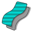
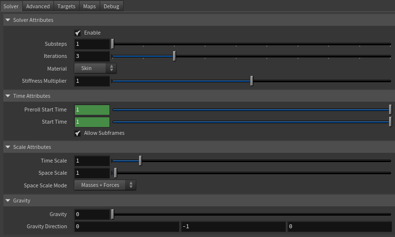
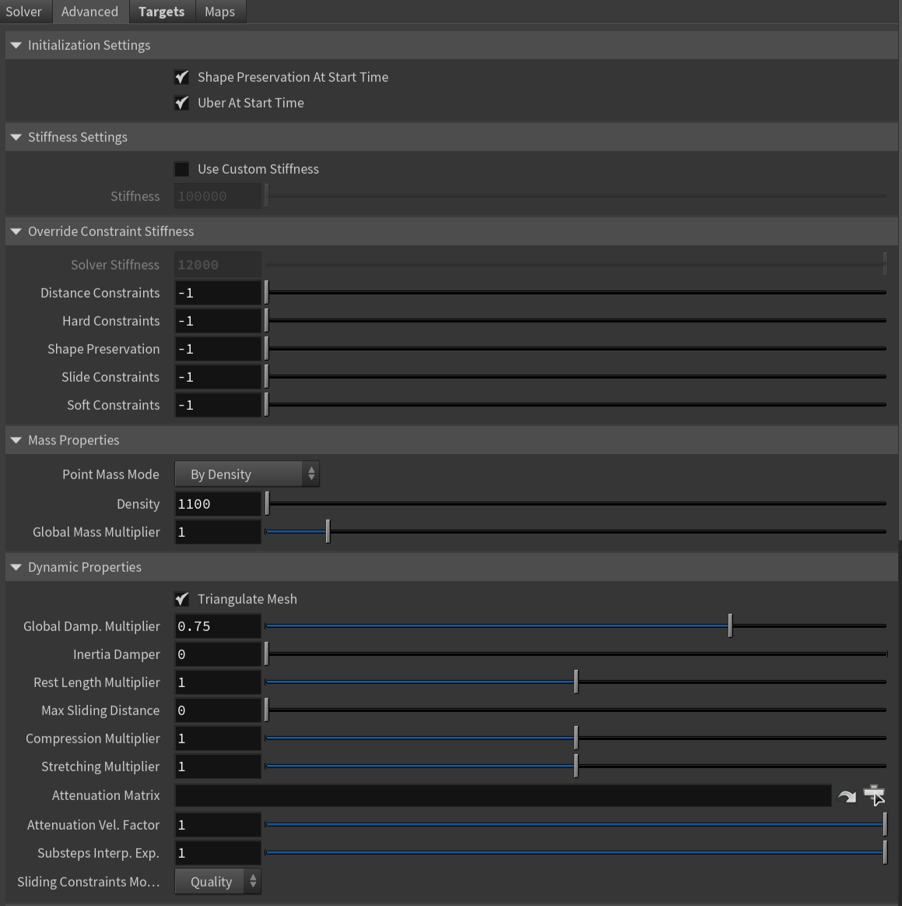
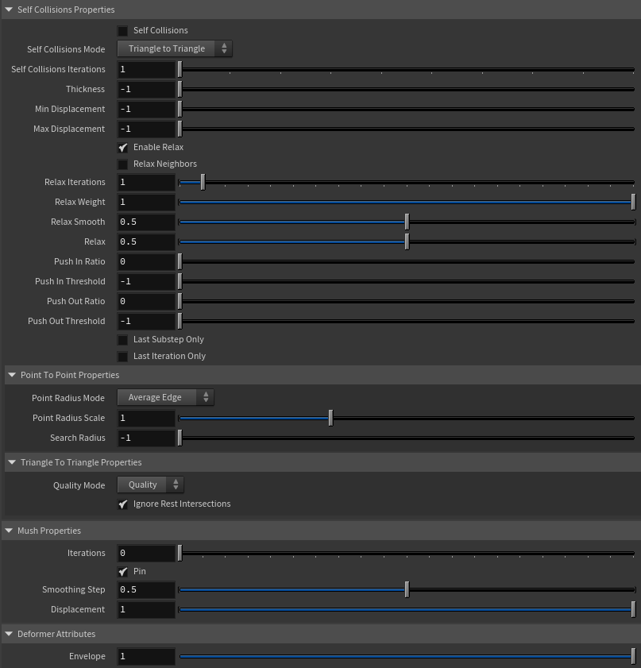
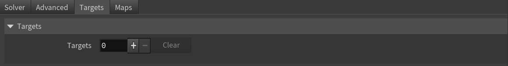
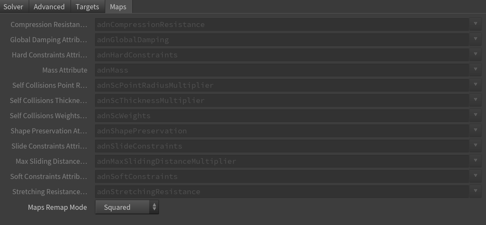
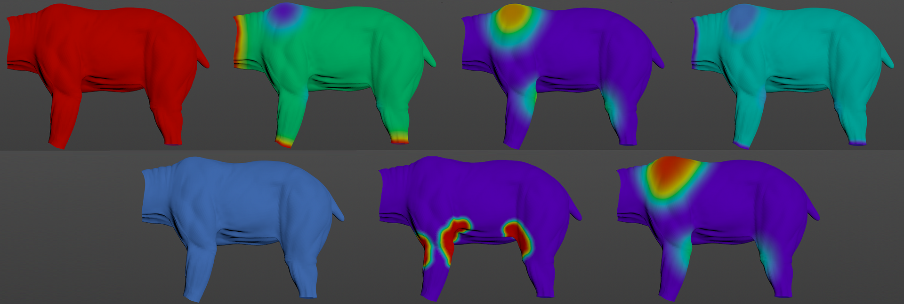
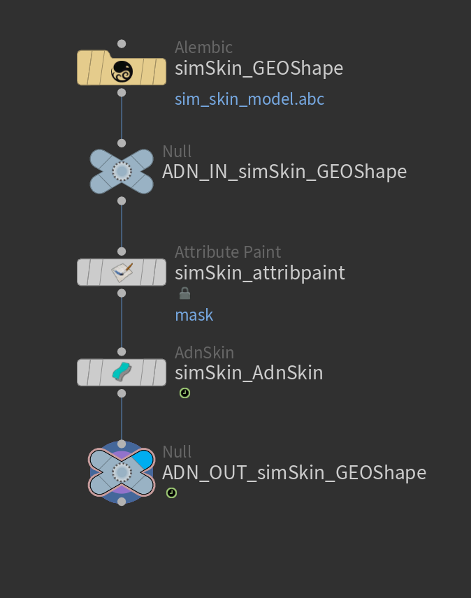

# AdnSkin

AdnSkin is a Houdini SOP for fast, robust and easy-to-configure skin simulation for digital assets. Thanks to the combination of internal and external constraints, the SOP can produce dynamics that allow the skin mesh to realistically react to the deformations of internal tissues (e.g. muscles, fascia) over time.

The influence these constraints have on the simulated mesh can be freely modified by painting specific point attributes or by regulating several multipliers exposed in the Parameter Template of the SOP. Besides the maps and multipliers there are many other parameters to regulate the skin's dynamics and behavior to a wide array of options.

### How To Use

The AdnSkin SOP is of great simplicity to set up and apply to a mesh within a Houdini scene. The way this deformer works is by applying simulation on top of the skin mesh (simulated mesh) which will be directly coupled to its target meshes (with deformation over time).

To create an AdnSkin the following inputs must be provided:

  - **Targets (T)**: List of geometries to drive the simulation mesh (e.g. the glued muscles to simulate the fascia, or the fat to simulate the skin).
  - **Skin Mesh (S)**: Mesh to apply the SOP onto.

The process to create the AdnSkin is:

1. Go to the geometry context of the rig containing the geometry to simulate.
2. Press TAB and navigate to the submenu AdonisFX > Solvers to find the AdnSkin {style="width:4%"} SOP type.
3. Create it and connect the geometry to the input.
4. Go to the **Targets** tab in the AdnSkin parameters, add a new entry to *Targets* to add a geometry target (e.g., the glued muscles to simulate the fascia, the fat geometry to simulate the skin).
5. Provide the object path of the target geometry in *Target World Mesh*.
6. The AdnSkin is now ready to simulate using the default settings. Refer to the next section to customize its configuration.

## Attributes

### Solver Attributes
| Name | Type | Default | Animatable | Description |
| :--- | :--- | :------ | :--------- | :---------- |
| **Enable**               | Boolean    | True | ✓ | Flag to enable or disable the deformer computation. |
| **Substeps**             | Integer    | 1    | ✓ | Number of steps that the solver will execute per simulation frame. Greater values mean greater computational cost. Has a range of \[1, 10\]. The upper limit is soft, higher values can be used. |
| **Iterations**           | Integer    | 3    | ✓ | Number of iterations that the solver will execute per simulation step. Greater values mean greater computational cost. Has a range of \[1, 10\]. The upper limit is soft, higher values can be used. |
| **Material**             | Enumerator | Skin | ✓ | Solver stiffness presets per material. The materials are listed from lowest to highest stiffness. There are 8 different presets: Fat: 103, Muscle: 5e3, Rubber: 106, Tendon: 5e7, Leather: 108, Wood: 6e9, Skin: 12e3. |
| **Stiffness Multiplier** | Float      | 1.0  | ✓ | Multiplier factor to scale up or down the material stiffness. Has a range of \[0.0, 2.0\]. The upper limit is soft, higher values can be used. |

### Time Attributes
| Name | Type | Default | Animatable | Description |
| :--- | :--- | :------ | :--------- | :---------- |
| **Preroll Start Time** | Time | *Current frame* | ✗ | Sets the frame at which the preroll begins. The preroll ends at *Start Time*. |
| **Start Time**         | Time | *Current frame* | ✗ | Determines the frame at which the simulation starts. |

### Scale Attributes
| Name | Type | Default | Animatable | Description |
| :--- | :--- | :------ | :--------- | :---------- |
| **Time Scale**       | Float      | 1.0             | ✓ | Sets the scaling factor applied to the simulation time step. Has a range of \[0.0, 2.0\]. The upper limit is soft, higher values can be used. |
| **Space Scale**      | Float      | 1.0             | ✓ | Sets the scaling factor applied to the masses and/or the forces (e.g. gravity). AdonisFX interprets the scene units in centimeters. If modeling your creature you apply a scaling factor for whatever reason (e.g. to avoid precision issues in Houdini), you will have to adjust for this scaling factor using this attribute. If your character is supposed to be 170 units tall, but you prefer to model it to be 17 units tall, then you will need to set the space scale to a value of 10. This will ensure that your 17 units creature will simulate as if it was 170 units tall. Has a range of \[0.0, 2.0\]. The upper limit is soft, higher values can be used. |
| **Space Scale Mode** | Enumerator | Masses + Forces | ✓ | Determines if the spatial scaling affects the masses, the forces, or both. The available options are: <ul><li>Masses: The *Space Scale* only affects masses.</li><li>Forces: The *Space Scale* only affects forces.</li><li>Masses + Forces: The *Space Scale* affects masses and forces.</li><ul> |

### Gravity
| Name | Type | Default | Animatable | Description |
| :--- | :--- | :------ | :--------- | :---------- |
| **Gravity**           | Float  | 0.0              | ✓ | Sets the magnitude of the gravity acceleration in m/s2. The value is internally converted to cm/s2. Has a range of \[0.0, 100.0\]. The upper limit is soft, higher values can be used. |
| **Gravity Direction** | Float3 | {0.0, -1.0, 0.0} | ✓ | Sets the direction of the gravity acceleration. Vectors introduced do not need to be normalized, but they will get normalized internally. |

### Advanced Settings

#### Initialization Settings
| Name | Type | Default | Animatable | Description |
| :--- | :--- | :------ | :--------- | :---------- |
| **Shape Preservation At Start Time** | Boolean | True | ✗ | Flag that forces the shape preservation constraints to reinitialize at start time. This attribute has effect only if preroll start time is lower than start time. |
| **Uber At Start Time**               | Boolean | True | ✗ | Flag that forces the uber constraints (hard, soft and slide) to reinitialize at start time. This attribute has effect only if preroll start time is lower than start time. |

#### Stiffness Settings
| Name | Type | Default | Animatable | Description |
| :--- | :--- | :------ | :--------- | :---------- |
| **Use Custom Stiffness**                  | Boolean | False          | ✓ | Toggles the use of a custom stiffness value. If custom stiffness is used, *Material* and *Stiffness Multiplier* will be disabled and *Stiffness* will be used instead. |
| **Stiffness**                             | Float   | 105 | ✓ | Sets the custom stiffness value. Its value must be greater than 0.0. |

#### Override Constraint Stiffness
| Name | Type | Default | Animatable | Description |
| :--- | :--- | :------ | :--------- | :---------- |
| **Solver Stiffness**     | Float |  0.0 | ✗ | Shows the global stiffness value currently used by the solver. |
| **Distance Constraints** | Float | -1.0 | ✓ | Sets the stiffness override value for distance constraints. If the value is less than 0.0, the global stiffness will be used. Otherwise, this custom stiffness will override the global stiffness. Has a range of \[0.0, 1012\]. The upper limit is soft, higher values can be used. |
| **Hard Constraints**     | Float | -1.0 | ✓ | Sets the stiffness override value for hard constraints. If the value is less than 0.0, the global stiffness will be used. Otherwise, this custom stiffness will override the global stiffness. Has a range of \[0.0, 1012\]. The upper limit is soft, higher values can be used. |
| **Shape Preservation**   | Float | -1.0 | ✓ | Sets the stiffness override value for shape preservation constraints. If the value is less than 0.0, the global stiffness will be used. Otherwise, this custom stiffness will override the global stiffness. Has a range of \[0.0, 1012\]. The upper limit is soft, higher values can be used. |
| **Slide Constraints**    | Float | -1.0 | ✓ | Sets the stiffness override value for slide constraints. If the value is less than 0.0, the global stiffness will be used. Otherwise, this custom stiffness will override the global stiffness. Has a range of \[0.0, 1012\]. The upper limit is soft, higher values can be used. |
| **Soft Constraints**     | Float | -1.0 | ✓ | Sets the stiffness override value for soft constraints. If the value is less than 0.0, the global stiffness will be used. Otherwise, this custom stiffness will override the global stiffness. Has a range of \[0.0, 1012\]. The upper limit is soft, higher values can be used. |

> [!NOTE]
> Providing a stiffness override value of 0.0 will disable the computation of that constraint.

#### Mass Properties

| Name | Type | Default | Animatable | Description |
| :--- | :--- | :------ | :--------- | :---------- |
| **Point Mass Mode**        | Enumerator | By Density  | ✓ | Defines how masses should be used in the solver.<ul><li>*By Density* allows to estimate the mass value by multiplying Density * Area.</li><li>*By Uniform Value* allows to set a uniform mass value.</li></ul> |
| **Density**                | Float      | 1100.0      | ✓ | Sets the density value in kg/m3 to be able to estimate mass values with *By Density* mode. The value is internally converted to g/cm3. Has a range of \[0.001, 106\]. Lower and upper limits are soft, lower and higher values can be used. |
| **Global Mass Multiplier** | Float      | 1.0         | ✓ | Sets the scaling factor applied to the mass of every point. Has a range of \[0.001, 10.0\]. Lower and upper limits are soft, lower and higher values can be used. |

#### Dynamic Properties
| Name | Type | Default | Animatable | Description |
| :--- | :--- | :------ | :--------- | :---------- |
| **Triangulate Mesh**            | Boolean    | True     | ✗ | Use the internally triangulated mesh to build constraints. |
| **Global Damping Multiplier**   | Float      | 0.75     | ✓ | Sets the scaling factor applied to the global damping of every point. Has a range of \[0.0, 1.0\]. The upper limit is soft, higher values can be used. |
| **Inertia Damper**              | Float      | 0.0      | ✓ | Sets the linear damping applied to the dynamics of every point. Has a range of \[0.0, 1.0\]. The upper limit is soft, higher values can be used. |
| **Rest Length Multiplier**      | Float      | 1.0      | ✓ | Sets the scaling factor applied to the edge lengths at rest. Has a range of \[0.0, 2.0\]. The upper limit is soft, higher values can be used. |
| **Max Sliding Distance**        | Float      | 0.0      | ✗ | Determines the size of the sliding area. It corresponds to the maximum distance to the closest point on the closest target mesh computed on initialization. The higher this value is, the higher quality and the lower performance. If the value provided is considered too high for a given target mesh, a warning will be displayed to the user. Has a range of \[0.0, 10.0\]. The upper limit is soft, higher values can be used.
| **Compression Multiplier**      | Float      | 1.0      | ✓ | Sets the scaling factor applied to the compression resistance of every point. Has a range of \[0.0, 2.0\]. The upper limit is soft, higher values can be used. |
| **Stretching Multiplier**       | Float      | 1.0      | ✓ | Sets the scaling factor applied to the stretching resistance of every point. Has a range of \[0.0, 2.0\]. The upper limit is soft, higher values can be used. |
| **Attenuation Matrix**          | String     |          | ✓ | Object path of the node to extract the transformation matrix from to compute the velocity attenuation. |
| **Attenuation Velocity Factor** | Float      | 1.0      | ✓ | Sets the weight of the attenuation applied to the velocities of the simulated vertices driven by the *Attenuation Matrix*. Has a range of \[0.0, 1.0\]. The upper limit is soft, higher values can be used. |
| **Substeps Interp. Exp.**       | Float      | 1.0      | ✓ | Sets the exponential factor to weight the interpolation at each substep. Has a range of \[0.0, 1.0\]. The upper limit is soft, higher values can be used. A value of 0.0 disables the interpolation: input geometry targets and attenuation matrix are not interpolated. A value of 1.0 applies linear interpolation (input geometry targets and attenuation matrix) between previous and current frame based on a linear weight, i.e. `weight = substep / num_substeps`. A value between 0.0 and 1.0 applies exponential interpolation (input geometry targets and attenuation matrix) between previous and current frame based on an exponential weight, i.e. `weight = (substep / num_substeps) ^ exponent`. |
| **Sliding Constraints Mode**    | Enumerator | Quality  | ✓ | Defines the mode of execution for the sliding constraints.<ul><li>*Quality* is more accurate, recommended for final results.</li><li>*Fast* provides higher performance, recommended for preview.</li></ul> |

#### Self Collisions Properties
| Name | Type | Default | Animatable | Description |
| :--- | :--- | :------ | :--------- | :---------- |
| **Self Collisions**             | Boolean     | False                 | ✓ | Toggles the self collisions on and off. |
| **Self Collisions Mode**        | Enumerator  | Triangle to Triangle  | ✓ | Determines the method used for self-collision detection and response.<ul><li>Point to Point: detects and resolves collisions between points only.</li><li>Triangle to Triangle: detects and resolves collisions between triangles, providing more accurate results for thin meshes but at a higher computational cost.</li></ul> |
| **Self Collisions Iterations**  | Integer     | 1                     | ✓ | Sets the number of iterations for the self-collision correction. Has a range of \[1, 10\]. The upper limit is soft, higher values can be used. |
| **Thickness**                   | Float      | -1.0                   | ✓ | Sets the thickness value for self-collision detection. Points closer than this distance will be considered in self-collision. A value of -1.0 disables thickness for self-collisions. Has a range of \[-1.0, 3.0\]. The upper limit is soft, higher values can be used. |
| **Min Displacement**            | Float      | -1.0                   | ✓ | Sets the minimum displacement a point must have to be considered for self-collision correction. Below this value, no correction will be applied. A value of -1.0 disables this check. Has a range of \[-1.0, 1000.0\]. The upper limit is soft, higher values can be used. |
| **Max Displacement**            | Float      | -1.0                   | ✓ | Sets the maximum displacement a point can have to be considered for self-collision correction. Above this value, no correction will be applied. A value of -1.0 disables this check. Has a range of \[-1.0, 1000.0\]. The upper limit is soft, higher values can be used. |
| **Enable Relax**                | Boolean     | True                  | ✓ | Toggles the relaxation process for self collision affected points. |
| **Relax Neighbors**             | Boolean     | False                 | ✓ | Sets if the relaxation process for self collisions should also consider the neighboring points that were detected in the self collision corrections. |
| **Relax Iterations**            | Integer     | 1                     | ✓ | Sets the number of iterations to compute for self collision affected points. Smoothing and relaxation are applied in each iteration, while pushing in and pushing out are applied only in the last iteration. Has a range of \[0, 20\]. The upper limit is soft, higher values can be used. |
| **Relax Weight**                | Float       | 1.0                   | ✓ | Influence of the smoothing and relaxation for self collision affected points. Has a range of \[0.0, 1.0\]. |
| **Relax Smooth**                | Float       | 0.5                   | ✓ | Amount of smoothing to apply for self collision affected points. Has a range of \[0.0, 1.0\]. |
| **Relax**                       | Float       | 0.5                   | ✓ | Amount of relaxation to apply for self collision affected points. Has a range of \[0.0, 1.0\]. |
| **Push In Ratio**               | Float       | 0.0                   | ✓ | Amount of correction applied by the push in adjustment for self collision affected points. Has a range of \[0.0, 2.0\]. The upper limit is soft, higher values can be used. |
| **Push In Threshold**           | Float       | -1.0                  | ✓ | Maximum correction applied by the push in adjustment for self collision affected points. The threshold will be ignored if its value is 0.0 or less. Has a range of \[-1.0, 2.0\]. The upper limit is soft, higher values can be used. |
| **Push Out Ratio**              | Float       | 0.0                   | ✓ | Amount of correction applied by the push out adjustment for self collision affected points. Has a range of \[0.0, 2.0\]. The upper limit is soft, higher values can be used. |
| **Push Out Threshold**          | Float       | -1.0                  | ✓ | Maximum correction applied by the push out adjustment for self collision affected points. The threshold will be ignored if its value is 0.0 or less. Has a range of \[-1.0, 2.0\]. The upper limit is soft, higher values can be used. |
| **Last Substep Only**           | Boolean     | False                 | ✗ | If enabled, self-collisions are only computed in the last substep of the simulation. |
| **Last Iteration Only**         | Boolean     | False                 | ✗ | If enabled, self-collisions are only computed in the last iteration of each substep. |
| **Point Radius Mode**           | Enumerator | Average Edge           | ✗ | Determines how the point radius is computed for self-collisions.<ul><li>Uniform Value: uses the uniform value to estimate the radius.</li><li>Average Edge: uses the average edge length of the connected edges per vertex.</li><li>Minimum Edge: uses the minimum edge length of the connected edges per vertex.</li></ul> |
| **Point Radius Scale**          | Float      | 1.0                    | ✗ | Sets the scaling factor applied to the point radius. It uses the value directly if the *Point Radius Mode* is set to *Uniform Value*. Has a range of \[0.0, 3.0\]. The upper limit is soft, higher values can be used. |
| **Search Radius**               | Float      | -1.0                   | ✓ | Sets the search radius for the self collision detection. It is used to determine the maximum distance to search for self collisions. If a value lower than 0.0 is used, the search radius will be estimated from the number of steps and the average edge length of the whole mesh. A value greater than 0.0 will represent a search radius in scene units. Has a range of \[-1.0, 1.0\]. The upper limit is soft, higher values can be used. |
| **Quality Mode**                | Enumerator | Quality                | ✓ | Sets the quality mode for self-collision detection. <ul><li>*Quality* is more accurate, recommended for final results.</li><li>*Fast* provides higher performance, recommended for preview.</li></ul> |
| **Ignore Rest Intersections**   | Boolean    | True                   | ✗ | Ignore self-collision detection and correction for primitives that are intersecting in the rest pose. |

### Deformer Attributes
| Name | Type | Default | Animatable | Description |
| :--- | :--- | :------ | :--------- | :---------- |
| **Envelope** | Float | 1.0 | ✓ | Specifies the deformation scale factor. Has a range of \[0.0, 1.0\]. The upper and lower limits are soft, values can be set in a range of \[-2.0, 2.0\]|

### Targets Attributes
| Name | Type | Default | Animatable | Description |
| :--- | :--- | :------ | :--------- | :---------- |
| **Targets**           | List      | 0     | ✗ | List of geometry targets used for setting up the external constraints (i.e., hard, soft and sliding constraints). |
| **Target World Mesh** | String    |       | ✓ | Object path of the mesh used as geometry target. |

### Maps

| Name | Type | Default | Animatable | Description |
| :--- | :--- | :------ | :--------- | :---------- |
| **Compression Resistance Attribute**                  | float         | 1.0     | ✗ | Specifies the name of the per-point attribute to read the compression resistance values from. The expected attribute name is `adnCompressionResistance`. The expected range of the per-point values is \[0.0, 1.0\].  |
| **Global Damping Attribute**                          | float         | 1.0     | ✗ | Specifies the name of the per-point attribute to read the global damping from. The expected attribute name is `adnGlobalDamping`. The expected range of the per-point values is \[0.0, 1.0\]. |
| **Hard Constraints Attribute**                        | float         | 1.0     | ✗ | Specifies the name of the per-point attribute to read the hard weights from. The expected attribute name is `adnHardConstraints`. The expected range of the per-point values is \[0.0, 1.0\]. |
| **Mass Attribute**                                    | float         | 1.0     | ✗ | Specifies the name of the per-point attribute to read the mass values from. The expected attribute name is `adnMass`. The expected range of the per-point values is \[0.001, 1.0\]. |
| **Self Collisions Point Radius Multiplier Attribute** | float         | 1.0     | ✗ | Specifies the name of the per-point attribute to read the point radius multiplier values from used by the self-collisions constraints in Point-To-Point mode to detect intersecting points. The expected attribute name is `adnScPointRadiusMultiplier`. The expected range of the per-point values is \[0.001, 1.0\]. |
| **Self Collisions Thickness Multiplier Attribute**    | float         | 1.0     | ✗ | Specifies the name of the per-point attribute to read the thickness multiplier values from used by the self-collisions constraints to detect intersections. The expected attribute name is `adnScThicknessMultiplier`. The expected range of the per-point values is \[0.001, 1.0\]. |
| **Self Collisions Weights Attribute**                 | float         | 1.0     | ✗ | Specifies the name of the per-point attribute to read the self-collisions weights from to control the points that will be involved in self-collisions solving. The expected attribute name is `adnScWeights`. The expected range of the per-point values is \[0.001, 1.0\]. |
| **Shape Preservation Attribute**                      | float         | 1.0     | ✗ | Specifies the name of the per-point attribute to read the shape preservation values from. The expected attribute name is `adnShapePreservation`. The expected range of the per-point values is \[0.0, 1.0\]. |
| **Slide Constraints Attribute**                       | float         | 1.0     | ✗ | Specifies the name of the per-point attribute to read the sliding weights from. The expected attribute name is `adnSlideConstraints`. The expected range of the per-point values is \[0.0, 1.0\]. |
| **Max Sliding Distance Multiplier Attribute**         | float         | 1.0     | ✗ | Specifies the name of the per-point attribute to read the maximum sliding distance multiplier from. The expected attribute name is `adnMaxSlidingDistanceMultiplier`. The expected range of the per-point values is \[0.0, 1.0\]. |
| **Soft Constraints Attribute**                        | float         | 1.0     | ✗ | Specifies the name of the per-point attribute to read the soft weights from. The expected attribute name is `adnSoftConstraints`. The expected range of the per-point values is \[0.0, 1.0\]. |
| **Stretching Resistance Attribute**                   | float         | 1.0     | ✗ | Specifies the name of the per-point attribute to read the stretching resistance values from. The expected attribute name is `adnStretchingResistance`. The expected range of the per-point values is \[0.0, 1.0\]. |
| **Maps Remap Mode**                                   | Enumerator    | Squared | ✗ | Defines the mode of remapping the painted values of soft and shape preservation constraints. The other paintable maps remain unmodified. Each remap mode applies a function to the input painted values (x) to get the final value used for the simulation (y).<ul><li>Linear: `y = x`</li><li>Squared: `y = x^2`</li><li>Cubic: `y = x^3`</li><li>Square Root: `y = x^(1/2)`</li><li>Cube Root: `y = x^(1/3)`</li><li>Logarithmic: `y = log((exp(1) - 1) * x + 1)`</li></ul> |

> [!NOTE]
> - All maps parameters are disabled in the Maps tab because the attribute names are fixed to drive specific functionalities of the solver.
> - Fixed point attribute names also ensure compatibility with the API.
> - To copy the map names of the disabled attributes for painting (using an attribute paint node) right click on the disabled map attribute parameter, press "Copy Parameter", select the attribute paint node and on the attribute name entry right click and press "Paste Values". This allows to easily copy the attribute name for painting.
> - The *Make Paintable* utility provided in the AdonisFX menu > Utils, can be used to create the attribpaint node and automatically populate the entries with the map names of the AdnSkin SOP.
> - If a point attribute on the geostream does not match the naming convention exposed in the node, use an "Attribute Rename" node to rename the attribute to match the expected naming convention.

## Parameter Template

<figure style="width: 75%;" markdown>
   
  <figcaption><b>Figure 1</b>: AdnSkin Parameter Template: Solver.</figcaption>
</figure>

<figure style="width: 75%;" markdown>
  
  <figcaption><b>Figure 2</b>: AdnSkin Parameter Template: Advanced (Part 1).</figcaption>
</figure>

<figure style="width: 75%;" markdown>
  
  <figcaption><b>Figure 3</b>: AdnSkin Parameter Template: Advanced (Part 2).</figcaption>
</figure>

<figure style="width: 75%;" markdown>
  
  <figcaption><b>Figure 4</b>: AdnSkin Parameter Template: Targets.</figcaption>
</figure>

<figure style="width: 75%;" markdown>
  
  <figcaption><b>Figure 5</b>: AdnSkin Parameter Template: Maps.</figcaption>
</figure>

## Paintable Weights

In order to provide more artistic control, some key parameters of the AdnSkin solver can be controlled via paintable point attributes. The maps are point attributes that must be present in the geometry stream injected into the SOP. For that, the Houdini attribpaint node can be used.

| Name | Default | Description |
| :--- | :------ | :---------- |
| **Compression Resistance**                 | 1.0 | Force to correct the edge lengths if the current length is smaller than the rest length. A higher value represents higher correction.<ul><li>*Tip*: To optimize the painting of the weight, flood it to 1.0 as a starting point and tweak some areas later on.</li><li>*Tip*: Reducing the value of the weight in some areas will contribute to reduce wrinkling effect.</li></ul> |
| **Global Damping**                         | 1.0 | Set global damping per vertex in the simulated mesh. The greater the value per vertex is the more damping of velocities. |
| **Hard Constraints**                       | 1.0 | Weight to modulate the correction applied to the vertices to keep them at a constant transformation, local to the closest point on the closest target mesh at initialization. Hard Constraint maps will force the geometry points to keep the original position. A low value of *Hard Constraints* may be desired to allow the skin to create wrinkles and sliding effect.<ul><li>*Tip*: In the example of a biped or quadruped creature, it is recommended to flood the geometry with a very low value 0.1, and then set a value of 1.0 to the edges of the skin to guarantee that it is properly attached to the target geometry.</li><li>*Tip*: Smooth the borders by using the Smooth and Flood combination to make sure that there are no discontinuities in the weights map. This will help the simulation to not produce sharp differences in the dynamics of every vertex compared to its connected vertices.</li></ul> |
| **Masses**                                 | 1.0 | Set individual mass values per vertex in the simulated mesh. |
| **Self Collision Point Radius Multiplier** | 1.0 | Multiply the point radius of each vertex.<ul><li>*Tip*: Paint with a value of 0.0 the areas that should not compute self collisions to reduce the computational impact.</li></ul> |
| **Self Collision Thickness Multiplier**    | 1.0 | Multiply the *Thickness* of each vertex.<ul><li>*Tip*: Paint with a value of 0.0 the areas to ignore the thickness for the intersections detection process; and with a value greater than 0.0 the areas to push along the direction of the normals for the intersections detection process.</li></ul> |
| **Self Collision Weights**                 | 1.0 | Amount of correction to apply to the current vertex when a collision with another vertex is detected.<ul><li>*Tip*: Paint with a value of 0.0 the areas that should not compute self collisions to reduce the computational impact.</li><li>*Tip*: Paint with a higher value the areas that should receive more correction due to self-intersections, and with a lower value the areas that should receive less correction.</li></ul> |
| **Shape Preservation**                     | 1.0 | Amount of correction to apply to the current vertex to maintain the initial state of the shape formed with the surrounding vertices. |
| **Slide Constraints**                      | 0.0 | Weight to modulate the correction applied to the vertices to keep them at a constant distance to the target mesh sliding along the target surface.<ul><li>*Tip*: In the example of a biped or quadruped creature, it is recommended to set a value of 1.0 on the scapulas, shoulders, elbows and knees and an overall value of 0 on the rest of the body.</li><li>*Tip*: Smooth the borders by using the Smooth and Flood combination to make sure that there are no discontinuities in the weights map. This will help the simulation to not produce sharp differences in the dynamics of every vertex compared to its connected vertices.</li></ul> |
| **Max Sliding Distance Multiplier**        | 1.0 | Determines the size of the sliding area per vertex. It corresponds to the maximum distance to the closest point on the closest target mesh computed on initialization. Greater values will allow for larger sliding areas but will also increase the computational cost.<ul><li>*Tip*: For areas where sliding is not required paint to 0. Use values closer to 1 in areas where more sliding freedom should be prioritized.</li></ul> |
| **Soft Constraints**                       | 0.0 | Weight to modulate the correction applied to the vertices to keep them at a constant distance to the closest point on the closest target mesh at initialization. Painting these constraint weights would allow the deformer to create a wrinkle effect when combined with hard and slide weights.<ul><li>*Tip*: In the example of a biped or quadruped creature, it is recommended to flood the geometry with a low value 0.2.</li></ul> |
| **Stretching Resistance**                  | 1.0 | Force to correct the edge lengths if the current length is greater than the rest length. A higher value represents higher correction.<ul><li>*Tip*: To optimize the painting of the weight, flood it to 1.0 as a starting point and tweak some areas later on.</li><li>*Tip*: Smooth the borders by using the Smooth and Flood combination to make sure that there are no discontinuities in the weights map. This will help the simulation to not produce sharp differences in the dynamics of every vertex compared to its connected vertices.</li></ul> |

> [!NOTE]
> To tweak the point attributes of an AdnSkin SOP, an `attribpaint` is needed. To ease the creation and initial configuration of this node, select the AdnSkin SOP and click on AdonisFX > Utils > Make Paintable. This utility will create an `attribcreate` node to define the required point attributes and assign their default values followed by an `attribpaint` node to allow these attributes to be modified. Both nodes are automatically named and properly connected to the AdnSkin node.

<figure markdown>
  
  <figcaption><b>Figure 4</b>: Example of painted weights on the skin of a bear character. First row, from left to right: maps flooded to 1.0 (which correspond to compression, stretching, masses, global damping, self collision radius and thickness multiplier), hard constraints, slide constraints and soft constraints. Second row, from left to right: shape preservation, self collision weights and max sliding distance multiplier.</figcaption>
</figure>

> [!NOTE]
> - *Hard*, *Soft* and *Slide* values are normalized to ensure that the sum of the three values for each vertex is in the range \[0.0, 1.0\].

<figure style="width: 75%;" markdown>
   
  <figcaption><b>Figure 6</b>: Example of AdnSkin network. Using null nodes with ADN_IN_ and ADN_OUT_ prefixes to encapsulate the AdonisFX deformable section is recommended to keep the network compatible with the API.</figcaption>
</figure>

## Advanced

### Targets

Once the AdnSkin SOP is created, it is possible to add and remove new targets to the system from the *Targets* tab. 

- **Add targets**:
    1. Increment the number of entries in the *Targets* multiparm. This adds a new entry to the list.
    2. Enter the object path of the geometry to add. The path can be absolute or relative to the SOP.
    3. Make sure to recook the AdnSkin at preroll start time for this change to take effect.
- **Remove targets**:
    1. Locate the target to remove in the *Targets* multiparm.
    2. Remove it using the **X** button for that item.
    3. Alternatively, to remove all targets, click the **Clear** button of the *Targets* multiparm.
    4. Make sure to recook the AdnSkin at preroll start time for this change to take effect.
