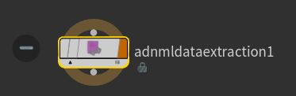

# AdnMLDataExtraction TOP HDA

The **AdnMLDataExtraction TOP HDA** is used to extract data for training AdonisML models.

Data extraction gathers the input and output data used by the AdonisML training workflow. This HDA is used after the [AdnMLDataProcessing HDA](../tools/ml_data_processing) has prepared the simulation skin and selected ML joints. The AdnMLDataExtraction TOP HDA reads the processed skin, the rest skin, and the selected joint data, then exports the data required for training AdonisML models.

The joint list used for extraction is expected to come from the processed ML joint output of the [AdnMLDataProcessing HDA](../tools/ml_data_processing), usually exposed through a **Null** node named **OUT_JOINTS**. This output contains a point group named *adnMLJoints*, which defines the joints to include in the extracted input data.

Optionally, the AdnMLDataExtraction TOP HDA can also extract muscle activation data. When enabled, this allows the extraction process to include dynamic material properties prediction for AdnSmartTissue support of the trained ML models.

> [!NOTE]
> Data extraction for ML training is only supported with the **AdonisML** bundle. Make sure the Adonis plugin is installed and licensed to support ML before running this workflow.

> [!NOTE]
> The AdnMLDataExtraction TOP HDA requires data prepared by the [AdnMLDataProcessing HDA](../tools/ml_data_processing). The processing HDA should be configured first before setting up the TOP extraction node.

## Requirements

To use the AdnMLDataExtraction TOP HDA, set the following parameters:

- *Rest Skin Op Path*: SOP path to the rest skin geometry.
- *Sim Skin Op Path*: SOP path to the processed simulated skin. This should usually point to a Null node named **OUT_SKIN**, connected to the **ADN_OUT_SKIN** output plug of the [AdnMLDataProcessing HDA](../tools/ml_data_processing).
- *Joints Op Path*: SOP path to the selected ML joints. This should usually point to a Null node named **OUT_JOINTS**, connected to the **ADN_OUT_ML_JOINTS** output plug of the [AdnMLDataProcessing HDA](../tools/ml_data_processing).
- *Joint Names List*: List of joints to extract. This list is populated from the *adnMLJoints* point group found in the joints SOP.
- *Export Folder Path*: Destination folder where the extracted data will be written.

The rest skin and simulated skin must have the same topology. This means both geometries must have matching point counts and matching point order so the extraction process can compute displacement data correctly.

The following optional parameter can also be provided:

- *Muscle Op Path*: SOP path to geometries affected by an **AdnMuscle** or **AdnRibbonMuscle** solver. This is required only when extracting muscle activation data for AdnSmartTissue support.

> [!NOTE]
> The *Joints Op Path* should point to the processed ML joints generated by the [AdnMLDataProcessing HDA](../tools/ml_data_processing), usually through a Null node named **OUT_JOINTS**. This output is expected to contain the selected ML joints in the *adnMLJoints* point group. Pressing *Set Joint List From Op* reads this group and populates the *Joint Names List* parameter.
>
> The underlying AdnMLDataProcessing HDA output plugs are named **ADN_OUT_SKIN** and **ADN_OUT_ML_JOINTS**, but the data extraction setup should reference the final SOP nodes in the network, such as the recommended **OUT_SKIN** and **OUT_JOINTS** Null nodes.

## How To Use

1. Create a TOP network in Houdini, or enter an existing TOP context where the data extraction process will be configured.

2. Create an **AdnMLDataExtraction** TOP HDA.

    <figure style="width:90%; margin-left:5%" markdown>
      
      <figcaption><b>Figure 1</b>: AdnMLDataExtraction TOP HDA node.</figcaption>
    </figure>

    <figure style="width:90%; margin-left:5%" markdown>
      
      <figcaption><b>Figure 2</b>: AdnMLDataExtraction TOP HDA parameter template.</figcaption>
    </figure>

3. Set the *Rest Skin Op Path* to the SOP path of the rest skin geometry.

4. Set the *Sim Skin Op Path* to the processed simulated skin generated by the [AdnMLDataProcessing HDA](../tools/ml_data_processing).

    This should usually point to a Null node named **OUT_SKIN**, connected to the **ADN_OUT_SKIN** output plug of the processing HDA.

5. Set the *Joints Op Path* to the selected ML joints generated by the [AdnMLDataProcessing HDA](../tools/ml_data_processing).

    This should usually point to a Null node named **OUT_JOINTS**, connected to the **ADN_OUT_ML_JOINTS** output plug of the processing HDA.

6. Press *Set Joint List From Op*.

    Pressing this button finds the *adnMLJoints* point group from the geometry provided in *Joints Op Path*, then populates and formats the entries in *Joint Names List*.

    The joints listed in *Joint Names List* are the joints that will be used as input data for the ML extraction process.

    <figure style="width:90%; margin-left:5%" markdown>
      
      <figcaption><b>Figure 3</b>: Joint list populated from the <i>adnMLJoints</i> point group.</figcaption>
    </figure>

7. Optionally enable *Extract Muscle Activation Data*.

    Enable *Extract Muscle Activation Data* if the exported data should support dynamic material properties prediction for AdnSmartTissue.

    When this option is enabled, set *Muscle Op Path* to the SOP path of the muscle geometry. The recommended setup is to point to a merge node that combines all **ADN_OUT_** Null nodes coming from the muscle nodes. This is supported and keeps the extraction input centralized. The path can also point to individual **AdnMuscle** SOPs, muscle geometry SOPs, or **ADN_OUT_** nodes.

    When muscle activation data is extracted, the generated data can support training ML models for AdnSmartTissue. If this input is not provided, the extracted data supports training models for AdnMLDeformer only.

8. Configure the frame settings.

    Use the *Frame Settings* parameters to define which frames should be recorded during data extraction.

    Enable *Record Frame Windows* to specify separate frame ranges for the extraction process. Frame windows must be defined as a list of frame ranges, for example: `[[1, 5], [220, 600], [1023, 1500]]`.

    Use *Skip Frame* to skip frames during recording. This helps reduce redundant pose data and extract more diverse samples. Lower values are recommended for fast animations, while higher values can be used for slower animations. Typical suggested values for normal animation speeds are between `2` and `5`. The skip frames will be computed from the start of each frame window, this ensures that the starting frame of each window is always recorded in the dataset.

    Use *Stabilization Frames* to define how many times each frame should be recooked before displacement data is computed and written. This helps stabilize the simulation dynamics before extraction. Typical suggested values for normal animation speeds are between `5` and `10`, but faster animations may require higher values.

9. Set *Export Folder Path* to the folder where the extracted data should be written.

10. Cook the TOP node.

    Once the paths, joint list, frame settings, and output folder have been configured, cook the TOP node to run the extraction process.

## Cooking and Monitoring the TOP Node

Once the AdnMLDataExtraction TOP HDA has been configured, the extraction process can be launched by cooking the TOP node.

One common way to start the process is to select the AdnMLDataExtraction TOP HDA and use **Tasks > Cook Output Node** from the TOPs menu. However, the node can also be cooked using any other standard TOP workflow available in Houdini, depending on how the user has configured their TOP network.

<figure style="width:90%; margin-left:5%" markdown>
  
  <figcaption><b>Figure 4</b>: Example of launching the AdnMLDataExtraction TOP HDA cook from the TOPs menu.</figcaption>
</figure>

While the node is cooking, we recommend inspecting the **Task Graph** to monitor the progress of the extraction process and to identify possible errors. If a task fails, the Task Graph can be used to inspect which work item produced the error and to help diagnose the issue.

> [!NOTE]
> The AdnMLDataExtraction TOP HDA is cooked in process. Be cautious when interrupting the cook, especially while data is being written to disk. Interrupting the process may leave partially exported data in the output folder.

## Parameters

### Skin Information

| Name | Type | Default | Description |
| :--- | :--- | :------ | :---------- |
| *Rest Skin Op Path* | SOP Path |  | SOP path to the rest skin geometry. |
| *Sim Skin Op Path* | SOP Path |  | SOP path to the processed simulated skin generated by the [AdnMLDataProcessing HDA](../tools/ml_data_processing). This should usually point to a Null node named **OUT_SKIN**, connected to the **ADN_OUT_SKIN** output plug of the processing HDA. |

> [!NOTE]
> The geometries specified in *Rest Skin Op Path* and *Sim Skin Op Path* must have the same topology. They must have matching point counts and matching point order so the extraction process can compute displacement data correctly.

### Joints

| Name | Type | Default | Description |
| :--- | :--- | :------ | :---------- |
| *Joints Op Path* | SOP Path |  | SOP path to the processed ML joints generated by the [AdnMLDataProcessing HDA](../tools/ml_data_processing). This should usually point to a Null node named **OUT_JOINTS**, connected to the **ADN_OUT_ML_JOINTS** output plug of the processing HDA. This output should contain the selected ML joints stored in the *adnMLJoints* point group. |
| *Set Joint List From Op* | Button |  | Finds the *adnMLJoints* group from the geometry specified in *Joints Op Path*, then populates and formats the entries in *Joint Names List*. |
| *Load Joint List From File* | Button |  | Loads the joint list from the configuration file of a previous data extraction. This can be used to reuse the same ML joint selection registered in the `joints.json` file from an existing extracted dataset. |
| *Joint Names List* | String List |  | List of joint names to extract as ML input data. This list is usually populated using *Set Joint List From Op*. |

### Muscles

| Name | Type | Default | Description |
| :--- | :--- | :------ | :---------- |
| *Extract Muscle Activation Data* | Boolean | False | Enables extraction of muscle activation data. When enabled, the extracted data can support training the ML model on material properties prediction for AdnSmartTissue. If disabled, the extracted data supports training models for AdnMLDeformer only. |
| *Muscle Op Path* | SOP Path |  | SOP path to geometries that have an **AdnMuscle** or **AdnRibbonMuscle** solver affecting them. The recommended setup is to point to a merge node containing all **ADN_OUT_** Null nodes coming from the muscle nodes. This can also point to individual muscle output nodes prefixed with **ADN_OUT_**, muscle geometry SOPs, or muscle solver SOPs. |

### Frame Settings

| Name | Type | Default | Description |
| :--- | :--- | :------ | :---------- |
| *Record Frame Windows* | Boolean | False | Enables the use of specific frame windows for the data extraction process. |
| *Frame Windows* | String List |  | List of frame windows to record. If empty, the entire playback range is recorded. Frame windows must be defined as separate frame ranges, for example: `[[1, 5], [220, 600], [1023, 1500]]`. |
| *Skip Frame* | Integer | 0 | Number of frames to skip during recording. This helps reduce redundant pose data and extract more diverse samples. Lower values are recommended for fast animations, while higher values can be used for slower animations. Typical suggested values for normal animation speeds are between `2` and `5`. The skip frames will be computed from the start of each frame window, this ensures that the starting frame of each window is always recorded in the dataset. |
| *Stabilization Frames* | Integer | 0 | Number of times to recook a frame before recording displacement data. This parameter damps the motion inertia in the recorded poses. Higher values make each of the recorded poses lose more dynamics and converge toward a static silhouette. Well stabilized data is required for good ML deformation training. Faster animations usually require more stabilization frames. Typical suggested values for normal animation speeds are between `5` and `10`. Increasing this value will increase the export time. |

### Output

| Name | Type | Default | Description |
| :--- | :--- | :------ | :---------- |
| *Export Folder Path* | Folder Path |  | Destination folder where the extracted data will be written. |
| *Force Overwrite* | Boolean | False | Allows existing extraction data in the output folder to be overwritten. |

## Result

After cooking the AdnMLDataExtraction TOP HDA, the extraction process writes the machine learning data to the folder specified in *Export Folder Path*.

The extracted data is generated from:

- The rest skin specified in *Rest Skin Op Path*.
- The processed simulated skin specified in *Sim Skin Op Path*.
- The selected ML joints specified in *Joints Op Path* and listed in *Joint Names List*.
- The optional muscle activation data specified through *Muscle Op Path*, if *Extract Muscle Activation Data* is enabled.

The rest skin and processed simulated skin must have the same topology so the extracted output data can be computed from matching points.

The following files are generated in the target export folder:

- `inputs.csv`: Contains the extracted input data, including the selected joint transforms.
- `outputs.csv`: Contains the extracted output data, including the simulated skin displacement data and optional data required for AdnSmartTissue material properties prediction.
- `joints.json`: Contains the exported joint hierarchy information used to associate the joint transform data with the extracted joints.
- `extraction_config.json`: Contains the configuration used for the extraction process, including the input paths, joint list, frame settings, and export settings.

> [!NOTE]
> If the extraction is interrupted or fails before completion, some of these files may already exist in the export folder but contain partial data.

## Limitations

- The AdnMLDataExtraction TOP HDA requires data prepared by the [AdnMLDataProcessing HDA](../tools/ml_data_processing).
- The rest skin and simulated skin must have the same topology.
- The *Joints Op Path* geometry must contain the *adnMLJoints* point group in order to populate the joint list using *Set Joint List From Op*.
- Muscle activation data extraction requires all muscles to be provided through *Muscle Op Path*.
- Frame window behavior depends on the configured frame settings.
- The AdnMLDataExtraction TOP HDA is cooked in process, so interruptions should be handled carefully.
