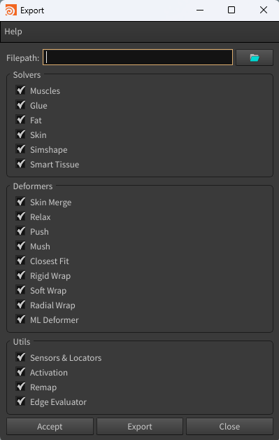
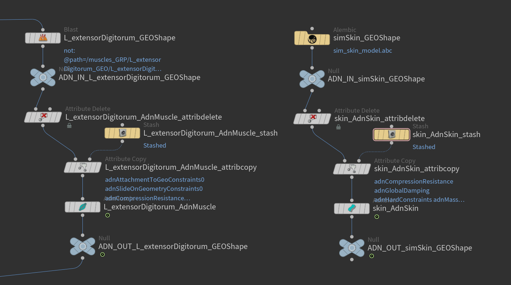
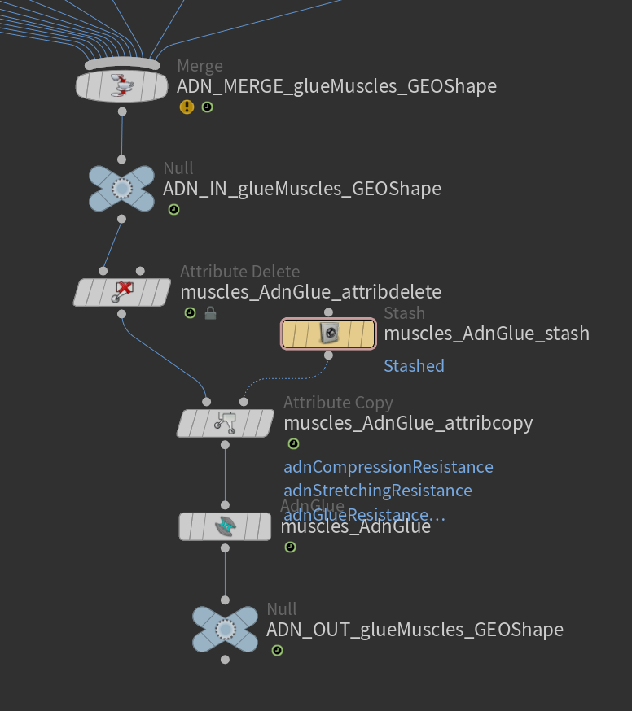
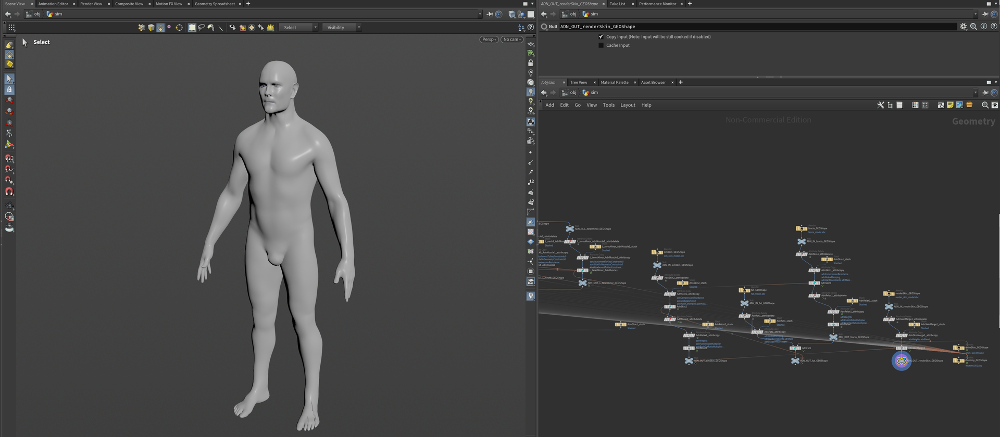
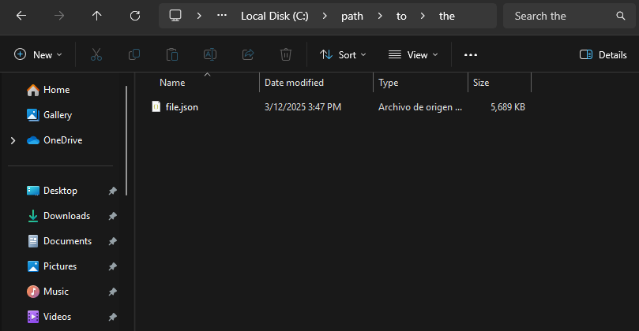

# Export

The AdonisFX Export is a tool designed to facilitate the export of a complete AdonisFX rig from a Houdini scene. This tool enables users to selectively export various components of an AdonisFX rig, ensuring a structured and efficient workflow for data transfer, backup, or reuse across different projects.

## UI

<figure style="width:50%;" markdown>
  
  <figcaption><b>Figure 1</b>: AdonisFX Export UI. </figcaption>
</figure>

The Export Tool offers an intuitive interface (see Figure 1), allowing users to configure export settings according to their specific requirements. Below is a breakdown of the available UI elements:​

- **Filepath**: Specifies the destination path of the JSON file where the exported data will be saved. Clicking the folder icon opens a file browser to select the desired directory.

- **Solvers**: Defines which solvers should be exported. Options include:
    - Muscles: include AdnMuscle and AdnRibbonMuscle nodes in the exported data.
    - Glue: include AdnGlue nodes in the exported data.
    - Fat: include AdnFat nodes in the exported data.
    - Skin: include AdnSkin nodes in the exported data.
    - Simshape: include AdnSimshape nodes in the exported data.

- **Deformers**: Specifies which deformers should be included in the export. Options include:
    - Skin Merge: include AdnSkinMerge nodes in the exported data.
    - Relax: include AdnRelax nodes in the exported data.
    - Push: include AdnPush nodes in the exported data.

- **Utils**: Allows exporting additional utility components from the setup. Options include:
    - Sensors & Locators: include AdonisFX sensors and locators in the exported data, ensuring proper connections between components.
    - Activation: include activation nodes and their existing connections to AdnMuscle nodes in the exported data.
    - Remap: include AdnRemap nodes in the exported data.
    - Edge Evaluator: include AdnEdgeEvaluator nodes in the exported data.

- **Buttons**:
    - Accept: executes the export process based on the selected options and closes the window.
    - Export: executes the export process based on the selected options without closing the window.
    - Close: closes the window without exporting.

## Requirements

An AdonisFX rig must meet some requirements to be exportable.

- All geometries deformed by an AdonisFX SOP must be encapsulated within a deformable chain limited by two null nodes prefixed with "ADN_IN_" and "ADN_OUT_".

<figure markdown>
  
  <figcaption><b>Figure 2</b>: Exportable AdonisFX chain for the L_extensorDigitorum muscle and the simulated skin of an AdonisFX rig. All AdonisFX nodes affecting a geometry must be encapsulated by an ADN_IN null node and an ADN_OUT null node.</figcaption>
</figure>

- The glue layer must receive all the input muscles merged together. The merged muscles must be the input to the ADN_IN null node of this layer.

<figure markdown>
  
  <figcaption><b>Figure 3</b>: Graph of the glue layer of an AdonisFX rig. All the input muscles are merged and connected to the ADN_IN null node.</figcaption>
</figure>

- The muscle geometry must contain the piece attribute used by the glue solver (if any) to split the input geometry into individual muscle pieces.

## How To Use

Open the scene of a fully configured AdonisFX rig (see Figure 2) and follow these steps:

<figure markdown>
  
  <figcaption><b>Figure 4</b>: Fully configured rig of a biped character. The rig includes sensors, locators, activation nodes, muscles, glue, fascia, fat, skin, skin merge, and relax.</figcaption>
</figure>

1. Go to *AdonisFX menu > Export (beta)* to open the *Export* window.

2. Specify the file path where the exported data will be saved (e.g., `path/to/the/file.json`).

3. Select the features to export from the *Solvers*, *Deformers* and *Utils* sections. To export the entire rig, enable all options.

4. Click *Accept* or *Export* to execute the export process.

Depending on the complexity of the rig, the export process might take a few seconds to complete. Once finished, a JSON file containing the exported data will be created in the specified path.

<figure markdown>
  
  <figcaption><b>Figure 5</b>: Example of the generated JSON file after exporting.</figcaption>
</figure>

> [!NOTE]
> - The Export Tool is labeled as *Beta* since it relies on the experimental [API](../api).
> - Exporting data is required to be executed on rest frame.

## Limitations

- The export tool does not support subnetworks inside of the Geometry context. This means that all AdonisFX SOP nodes (and any other SOP nodes containing geometry required by the AdonisFX rig) must exist at the same level within the Geometry context (e.g., */obj/geo1*).
- Only one active geometry node (with the visibility/display flag enabled) in the */obj* context is allowed for the export tool to work.
- Nodes used to drive attachment to transform or slide on segment constraints (e.g. null, joint or rivet nodes) must live in the */obj* context.
- KineFX joint transforms are not supported.
