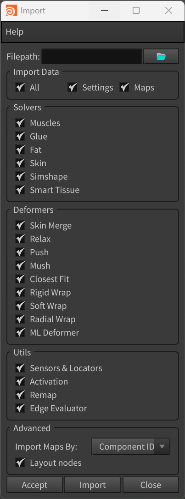
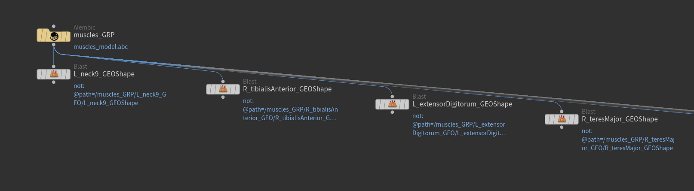
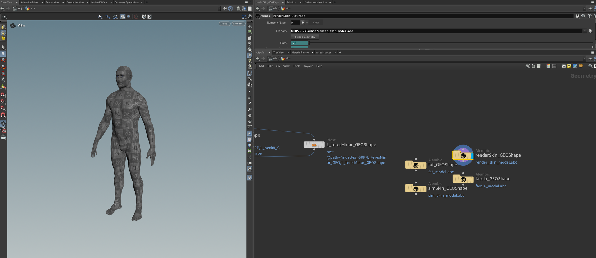
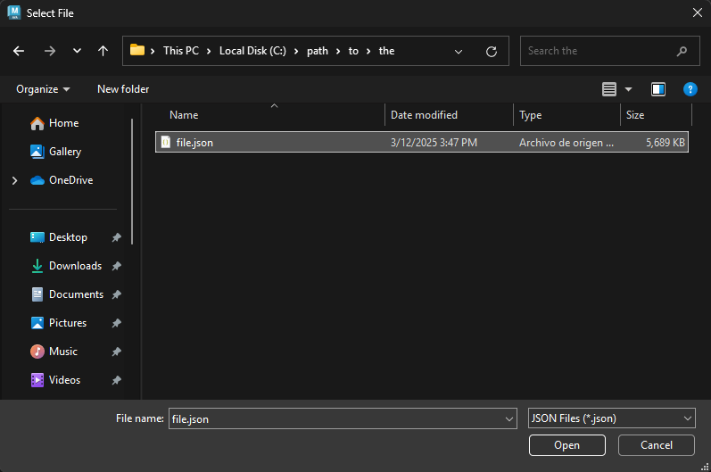
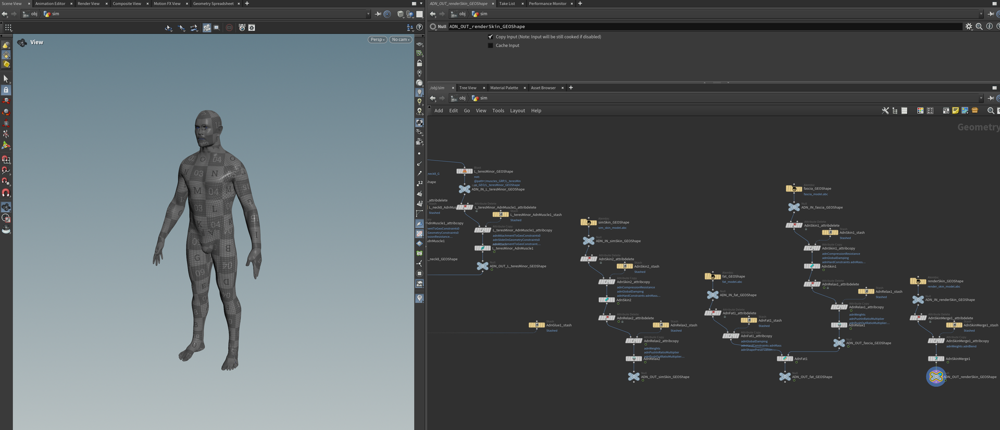

# Import

The Adonis Import is a tool designed to facilitate the import of a complete Adonis rig into a Houdini scene. This tool enables users to restore previously exported rigs by reading the data from a JSON file and rebuilding all selected components in the scene. The tool ensures a structured and efficient workflow for transferring, reusing, or backing up Adonis rigs.

## UI

<figure style="width:50%;" markdown>
  
  <figcaption><b>Figure 1</b>: Adonis Import UI.</figcaption>
</figure>

The Import Tool offers an intuitive interface (see Figure 1), allowing users to configure import settings according to their specific requirements. Below is a breakdown of the available UI elements:

- **Filepath**: Specifies the path to the JSON file containing the data to be imported. Clicking the folder icon opens a file browser to select the desired file.

- **Import Data**: Selects which types of data to import:
    - All: enables or disables both *Settings* and *Maps*.
    - Settings: imports node all non-paintable parameters together with input connections.
    - Maps: imports only paintable maps. If a map depends on a target that is not connected, the importer logs a warning and skips that map. This includes maps associated with transform nodes and geometry targets in AdnMuscle, AdnRibbonMuscle and AdnSkin.

  When either *Settings* or *Maps* is imported and the corresponding node is not present in the scene, the importer creates it.

- **Solvers**: Defines which solvers should be imported. Options include:
    - Muscles: include AdnMuscle and AdnRibbonMuscle nodes in the import operation.
    - Glue: include AdnGlue nodes in the import operation.
    - Fat: include AdnFat nodes in the import operation.
    - Skin: include AdnSkin nodes in the import operation.
    - Simshape: include AdnSimshape nodes in the import operation.
    - Smart Tissue: include AdnSmartTissue nodes in the import operation.

- **Deformers**: Specifies which deformers should be imported. Options include:
    - Skin Merge: include AdnSkinMerge nodes in the import operation.
    - Relax: include AdnRelax nodes in the import operation.
    - Push: include AdnPush nodes in the import operation.
    - Mush: include AdnMush nodes in the import operation.
    - Closest Fit: include AdnClosestFit nodes in the import operation.
    - Rigid Wrap: include AdnRigidWrap nodes in the import operation.
    - Soft Wrap: include AdnSoftWrap nodes in the import operation.
    - Radial Wrap: include AdnRadialWrap nodes in the import operation.
    - ML Deformer: include AdnMLDeformer nodes in the import operation.

- **Utils**: Allows importing utility components from the JSON file. Options include:
    - Sensors & Locators: imports Adonis sensors and locators, ensuring proper connections between components.
    - Activation: imports activation nodes and their connections to AdnMuscle nodes.
    - Remap: imports AdnRemap nodes, including their settings and connections to other nodes.
    - Edge Evaluator: imports EdgeEvaluator nodes, including their settings and connections to other nodes.

- **Advanced**:
    - Import Maps By: determines how exported paintable maps correspond to the destination mesh.
        - Component ID: imports values using the existing point/component IDs. This is the default mode.
        - Position: imports values from the closest exported point positions, then falls back to *Component ID* when the meshes are compatible.
        - UVs: imports values using UV correspondence first, then *Position*, and finally *Component ID* when the meshes are compatible.
    - Layout nodes: enables Houdini's automatic node layout after the import completes. Enable it when importing a rig from scratch. Disable it when importing into an organized network, including scenes that use `ADN_IN_`/`ADN_OUT_` nodes or Network Boxes.

- **Buttons**:
    - Accept: executes the import process based on the selected options and closes the window.
    - Import: executes the import process based on the selected options without closing the window.
    - Close: closes the window without importing.

> [!NOTE]
> Importing maps by *Position* or *UVs* requires geometry data in the JSON file. The file must have been exported with *Export Geometry Data* (see this [section](../tools/exporter#ui)) enabled in the Export Tool.

## Requirements

Before importing an Adonis rig, the target Houdini scene must meet the following requirements to ensure a successful reconstruction:

- Matching Geometry for *Solvers* and *Deformers*: Any geometry that had solvers or deformers applied in the original scene must also exist in the target scene with the same name. Importing maps by *Component ID* requires compatible topology, including the same point count and point IDs. The *Position* and *UVs* modes can instead establish map correspondence using geometry data stored during export.

- Separated Muscle Pieces: The muscle geometries must be separated to allow the importer to create and configure the individual solvers. Also, each separated muscle geometry must preserve the piece attribute used for the splitting. The Adonis menu provides with a shortcut to extract and separate all the geometries from the selected node by piece attribute (i.e. by "path", "muscle_id" or "name", in this order) in *Adonis* > *Utils* > *Separate Geometries*.

<figure markdown>
  
  <figcaption><b>Figure 2</b>: Muscle pieces separated and renamed to match the muscle geometry names used in the original scene.</figcaption>
</figure>

- Matching Dependency Nodes for *Locators* and *Sensors*: Since Adonis locators and sensors rely on transform inputs, the target scene must contain nodes (i.e., rig joints) in the */obj* context with the same names as those used in the exported rig. This ensures that dependencies between nodes are restored properly.

## How To Use

To import an Adonis rig, ensure that you have a valid exported JSON file and follow these steps:

1. Optionally, if the target scene contains any dirty or unwanted Adonis nodes, it may be advisable to remove all of them by using the *Clear* option provided in *Adonis menu > Utils > Clear*.

<figure markdown>
  
  <figcaption><b>Figure 3</b>: Scene of a biped character after executing the Clear and ready to import.</figcaption>
</figure>

2. Go to *Adonis menu > Import (beta)* to open the *Import* window.

3. Specify the file path of the JSON file that contains the exported rig data.

<figure markdown>
  
  <figcaption><b>Figure 4</b>: File exported from an Adonis rig.</figcaption>
</figure>

4. In the *Import Data* section, choose whether to import *Settings*, *Maps*, or *All* data.

5. Select the features to import from the *Solvers*, *Deformers* and *Utils* sections. To import the entire rig, enable all options.

6. If importing maps, choose the correspondence mode from *Import Maps By*. Enable *Layout nodes* when importing a rig from scratch, or disable it to preserve an organized network.

7. Click *Accept* or *Import* to execute the import process.

Depending on the complexity of the rig, the import process might take a few seconds to complete. Once finished, all the selected components will be reconstructed in the scene.

<figure markdown>
  
  <figcaption><b>Figure 5</b>: Scene after importing the rig from a JSON file. All Adonis nodes are created and configured. Some of them are visible in the node network: AdnMuscle for L_teresMinor_GEO, AdnSkin and AdnRelax for fascia_GEO and simSkin_GEO, AdnFat for fat_GEOShape and AdnSkinMerge for renderSkin_GEO.</figcaption>
</figure>

The previous steps corresponds to importing a rig that was exported from the same scene. However the same steps can be followed to transfer the exported rig to a different asset as long as the target scene fulfills the requirements listed in this [section](#requirements).

> [!NOTE]
> - The Import Tool is labeled as *Beta* since it relies on the experimental [API](../api).
> - Importing data is required to be executed on rest frame.

## Limitations

- The import tool does not support subnetworks inside of the Geometry context. This means that all Adonis SOP nodes (and any other SOP nodes containing geometry required by the Adonis rig) must exist at the same level within the Geometry context (e.g., */obj/geo1*).
- Only one active geometry node (with the visibility/display flag enabled) in the */obj* context is allowed for the import tool to work.
- Nodes used to drive attachment to transform or slide on segment constraints (e.g. null, joint or rivet nodes) must live in the */obj* context.
- KineFX joint transforms are not supported.
