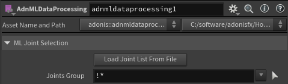
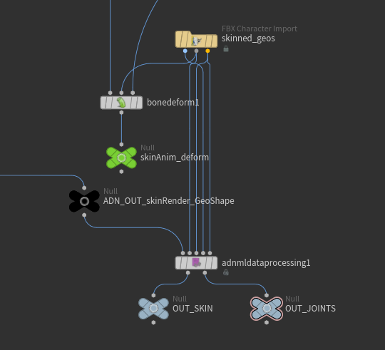
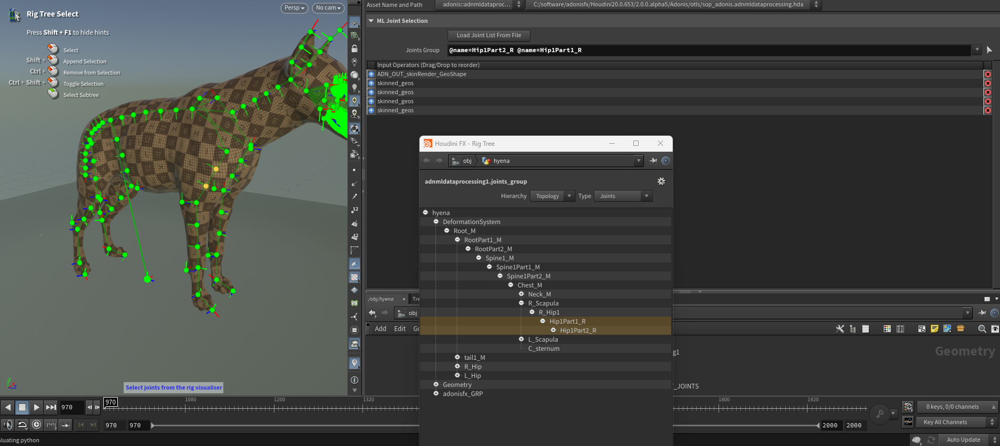
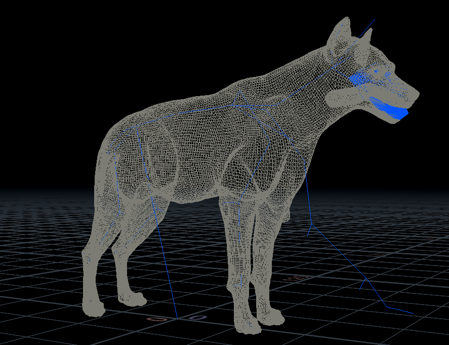

# AdnMLDataProcessing HDA

The **AdnMLDataProcessing HDA** is a utility designed to be used in a SOP context to prepare simulated skin data before running machine learning data extraction with the [AdnMLDataExtraction TOP HDA](../tools/data_extraction_tool).

This HDA is used as a preprocessing step in the ML data extraction workflow. It prepares the simulated skin geometry and the joint data required by the extraction process, and allows the user to select which joints from a KineFX rig should be used as ML input data.

The AdnMLDataProcessing HDA outputs the processed skin data to be extracted from the simulation, together with the selected ML joints. These outputs are then used by the AdnMLDataExtraction TOP HDA as the next step of the workflow.

> [!NOTE]
> The AdnMLDataProcessing HDA is intended to be used before running the [AdnMLDataExtraction TOP HDA](../tools/data_extraction_tool).
> This HDA should not be used in isolation for data extraction. The [AdnMLDataExtraction TOP HDA](../tools/data_extraction_tool) is also required to complete the extraction workflow.

## Requirements

To use the AdnMLDataProcessing HDA, the following inputs must be provided:

- *Input Skin*: Simulated skin geometry to process. This is usually the output of an **AdnSkinMerge** node containing the simulation data.
- *Rest Joints*: KineFX joints in rest pose used by the skinning setup.
- *Anim Joints*: Animated KineFX joints used to drive the animated skin.
- *Capture Weights*: Geometry containing the bone capture attributes required to describe the skinning weights.
- *ML Joints*: KineFX joints used as input joints for the machine learning data extraction process.

The *Anim Joints* and *ML Joints* inputs must contain the following point attributes:

- *name*: Name of each joint.
- *transform*: Transform point attribute of each joint.

The *Anim Joints* and *ML Joints* inputs are provided separately because the joints used as machine learning inputs do not necessarily need to be the same joints used to deform the geometry. In most cases, the ML joints will be the same as the animated joints, but a dedicated input is available to support workflows where a different joint set is required for data extraction.

> [!NOTE]
> The AdnMLDataProcessing pipeline is currently only supported when using the **Linear** skinning method in the **Bone Deform** node.

## How To Use

1. Create an **AdnMLDataProcessing** HDA in a SOP context.

<figure style="width:90%; margin-left:5%" markdown>
  
  <figcaption><b>Figure 1</b>: AdnMLDataProcessing HDA parameter template.</figcaption>
</figure>

2. Connect the simulated skin to process into the first input.

    This skin should contain the simulation data that will be extracted for machine learning. For example, this can be the result of an **AdnSkinMerge** node with the simulation data already present.

3. Connect the rest joints and animated joints.

    These are the same rest and animated joints used to drive the animated skin with a **Bone Deform** node.

4. Connect the capture weights geometry.

    This input must contain the bone capture attributes. It should be a skinned geometry already prepared using the desired skinning approach.

5. Connect the ML joints.

    The ML joints are the joints that will be used as input data during the machine learning data extraction process. In most cases, these are the same as the animated joints, but a dedicated input is provided in case a different joint set is required.

<figure style="width:90%; margin-left:5%" markdown>
  
  <figcaption><b>Figure 2</b>: Network view showing the required connections for the AdnMLDataProcessing HDA.</figcaption>
</figure>

6. Select the joints to use for data extraction.

    Use the *Joints Group* parameter to select the joints that should be used as ML inputs.

    To select joints interactively, click the picker icon next to the *Joints Group* parameter. Then select the joints either from the **Rig Tree** or directly in the viewport. To exit the viewer state, press **Esc** while the cursor is over the viewport.

    Alternatively, use *Load Joint List From File* to load the joint list from the configuration file of a previous data extraction.

<figure style="width:90%; margin-left:5%" markdown>
  
  <figcaption><b>Figure 3</b>: Viewer state used to select ML joints with the <i>Joints Group</i> picker.</figcaption>
</figure>

7. Cook the node.

    Once the node is cooked, the processed data will be available through its output plugs, as shown in Figure 4:

    - **ADN_OUT_SKIN**: Output 0. Contains the processed skin data to be extracted from the simulation.
    - **ADN_OUT_ML_JOINTS**: Output 1. Contains the selected ML joints.

    The second output, **ADN_OUT_ML_JOINTS**, contains a point group named *adnMLJoints*. This group identifies the selected joints and is used by the **AdnMLDataExtraction TOP HDA** to determine which joints should be included in the machine learning input data.

    We recommend appending **Null** nodes to both outputs and naming them **OUT_SKIN** and **OUT_JOINTS**. This makes it easier to identify and reference the processed skin and selected ML joints later when configuring the [AdnMLDataExtraction TOP HDA](../tools/data_extraction_tool).

<figure style="width:90%; margin-left:5%" markdown>
  
  <figcaption><b>Figure 4</b>: Processed outputs generated by the AdnMLDataProcessing HDA. The highlighted wireframe geometry shows the processed skin from the first output, <b>ADN_OUT_SKIN</b>, and the blue joints show the selected ML joints from the second output, <b>ADN_OUT_ML_JOINTS</b>.</figcaption>
</figure>

8. Use the outputs in the AdnMLDataExtraction TOP HDA.

    The processed skin and selected ML joints generated by the AdnMLDataProcessing HDA are used as the next step of the ML data extraction workflow. For more information, refer to the [AdnMLDataExtraction TOP HDA](../tools/data_extraction_tool) documentation.

## Parameters

### Joint Selection

| Name | Type | Default | Description |
| :--- | :--- | :------ | :---------- |
| *Load Joint List From File* | Button |  | Loads the joint list from the configuration file of a previous data extraction. This can be used to reuse the same ML joint selection from an existing extracted dataset. |
| *Joints Group* | Group |  | Group selector used to select the joints that will be used as ML input data during extraction. The selected joints are stored in the *adnMLJoints* point group on the **ADN_OUT_ML_JOINTS** output. |

## Result

After cooking the AdnMLDataProcessing HDA, the following outputs are generated:

- **ADN_OUT_SKIN**: The processed skin geometry containing the simulation data to be extracted.
- **ADN_OUT_ML_JOINTS**: The ML joint geometry containing the selected joints for data extraction.

The **ADN_OUT_ML_JOINTS** output includes a point group named *adnMLJoints*. This point group is used by the AdnMLDataExtraction TOP HDA to identify the joints that should be extracted as input data for machine learning.

For clarity, we recommend appending **Null** nodes to these outputs and naming them **OUT_SKIN** and **OUT_JOINTS**. These Null nodes can then be referenced when configuring the data extraction workflow.

The resulting data can then be passed to the [AdnMLDataExtraction TOP HDA](../tools/data_extraction_tool) to continue the ML data extraction workflow.

## Limitations

- The pipeline is currently only supported when using the **Linear** skinning method in the **Bone Deform** node.
- The animated joints and ML joints must contain both the *name* and *transform* point attributes.
- The ML joints can be different from the animated joints, but they must represent the joint set intended to be used as machine learning input data.
- The capture weights input must contain valid bone capture attributes.
