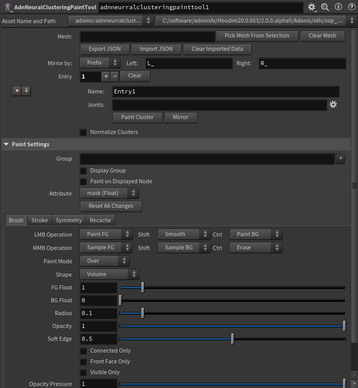
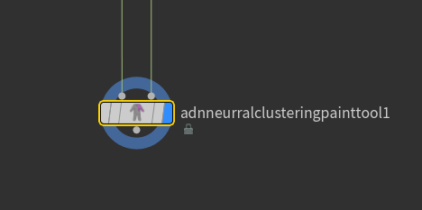
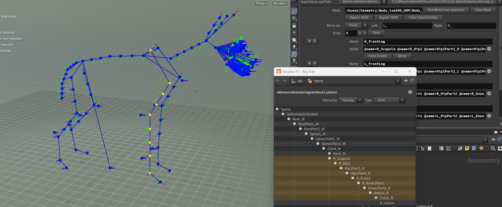
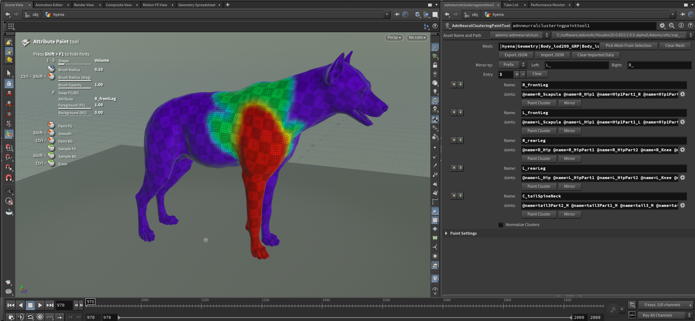

# Neural Clustering

> [!IMPORTANT]
> An Adonis ML license is required to use this feature.

The Neural Clustering Paint Tool is implemented in Houdini as a SOP HDA called **AdnNeuralClusteringPaintTool**. This node is used to paint neural clusters on a static mesh. These clusters provide additional locality information for the machine learning training process, helping the model better isolate local deformations and activations.

The tool exports the painted cluster data to a `.json` file. This file is later used during neural training and can be provided when launching the training process with the [Neural Training Tool](../tools/neural_training_tool).

Neural clusters define local regions on the training mesh. These regions help the training process understand which parts of the mesh should be treated as related deformation areas, which can improve the posability of the trained rig.

The number and size of the clusters should be adjusted depending on the amount of extracted training data available. Larger datasets can support more granular clusters, while smaller datasets should usually use broader cluster regions.

If multiple clusters overlap, the cluster values can be normalized. Normalizing overlapping clusters helps keep the cluster data consistent and can improve the resulting training quality.

> [!TIP]
> The **Neural Clustering Paint Tool** is intended to be used as an optional data preparation step for machine learning workflows. It provides neural clustering information that can complement the data extracted through the **Data Extraction**.

## UI

<figure style="width:90%; margin-left:5%" markdown>
  
  <figcaption><b>Figure 1</b>: Adonis Neural Clustering Tool UI.</figcaption>
</figure>

The Neural Clustering Paint Tool (see Figure 1) provides an interface to create, paint, mirror, save and import neural clusters. Following there is a breakdown of the available UI elements:

### Global Settings

- **Mesh**: Name of the mesh to paint. The mesh name will be stored in the exported `.json` file. This is only used as a naming field for export, import, and cross-DCC compatibility. It does not define the actual geometry being painted.
- **Pick Mesh from Selection**: Fills the *Mesh* parameter from the currently selected Houdini node name. This only updates the *Mesh* text field and does not change node connections or geometry.
- **Clear Mesh**: Clears the *Mesh* parameter. This does not remove clusters, weights, imported data, or painted attributes.
- **Add Entry**: Adds a new empty entry to the UI. It represents a new cluster to paint and capture weights from.
- **Export JSON**: Exports the current neural cluster entry data to a `.json` file. Requires a valid *Mesh*, valid cluster *Name* values, and valid *Joints* fields.
- **Import JSON**: Imports neural cluster entry data from a `.json` file. This replaces the current entries in the tool with the entries from the file and stashes the imported cluster attributes internally on the node.
- **Clear Imported Data**: Clears imported and mirrored weight values from the internal stash. Cluster entries and painted weights remain unchanged. It is also used to clear mirrored data because the same internal stash is used for import and mirror operations.
- **Mirror by**: Defines how the left and right text is matched in cluster names and joint names. Use *Prefix* when the text is at the start, *Suffix* when it is at the end, or *Token* when it can appear anywhere in the name.
- **Left**: Left-side naming convention used for mirrored cluster names and joints. For example, use `L_` for prefix, `_L` for suffix, or `_L_` for token.
- **Right**: Right-side naming convention used for mirrored cluster names and joints. For example, use `R_` for prefix, `_R` for suffix, or `_R_` for token.
- **Entry**: Number of cluster entries being edited. Use the plus and minus icons to add or remove entries, and use *Clear* to clear all of the current multiparameter entries.
- **Normalize Clusters**: Normalizes the weights between `0` and `1` across all clusters. This helps keep overlapping cluster weights consistent.

### Entry Settings

- **Name**: Neural cluster name. This becomes the Houdini point attribute used for painting, import, export, mirroring, and normalization. Use a valid attribute name with no spaces or special characters.
- **Joints**: Explicit joint selection for the current cluster entry, stored as Houdini group patterns using the `@name=...` convention. The joint geometry must contain a valid *name* point attribute. Do not use wildcards or broad patterns. On export, these selections are resolved to full joint paths using separators.
- **Paint Cluster**: Makes this cluster the active paint target and enters the paint workflow for its mask attribute.
- **Mirror**: Creates or updates a mirrored neural cluster entry by copying joints and weights across the X axis. The entry name and joints are mirrored using the selected *Mirror by* mode and the *Left* and *Right* naming tokens. If the selected convention does not match, the tool will try to fall back to a simple `L`/`R` token swap. A warning will be logged in case of failure.

### Paint Settings

The *Paint Settings* section exposes the same painting parameters available in Houdini's Attribute Paint node. These parameters control the brush behavior, stroke behavior, symmetry, and paint values used while painting cluster regions.

For more information about these parameters, refer to the [Houdini Attribute Paint documentation](https://www.sidefx.com/docs/houdini/nodes/sop/attribpaint).

## Requirements

To use the **AdnNeuralClusteringPaintTool**, the following inputs must be provided:

- *Geometry*: Static mesh where neural clusters will be painted.
- *Joints*: ML joints used to associate each cluster with the relevant joint data.

The static mesh connected to *Geometry* must match the topology of the mesh that will be used for training. This means both meshes must have matching point counts and matching point order so the exported cluster weights correspond to the expected training mesh data.

The ML joints connected to *Joints* should represent the joint set used as machine learning input data. In many cases, this can be the animated joints. The joint geometry must contain a valid *name* point attribute, because joint selections are resolved using the joint names.

The joint entries assigned to each cluster must use explicit `@name=...` selections, for example `@name=R_Scapula`. Do not use wildcards or broad patterns.

## How To Use

1. Create an **AdnNeuralClusteringPaintTool** node.

2. Connect the geometry and joints.

    Connect the static mesh to paint into the *Geometry* input.

    Connect the ML joints into the *Joints* input. These can be the animated joints, as long as they represent the joint set that will be used for the machine learning input data.

    The ML joint geometry must contain a valid *name* point attribute.

<figure style="width:90%; margin-left:5%" markdown>
  
  <figcaption><b>Figure 2</b>: Example node setup for the AdnNeuralClusteringPaintTool, with the static mesh connected to the <i>Geometry</i> input and the ML joints connected to the <i>Joints</i> input.</figcaption>
</figure>

3. Set the *Mesh* parameter.

    Use *Mesh* to define the source mesh name stored in the exported `.json` file.

    The *Mesh* parameter is only used as a naming field for export, import, and cross-DCC compatibility. It does not define the actual geometry being painted. The geometry being painted comes from the *Geometry* input.

    For cross-DCC compatibility, the *Mesh* value should match the equivalent mesh name used in other DCCs. Avoid relying on full Houdini paths when possible.

    The mesh name can be assigned manually by typing it, or by using *Pick Mesh From Selection* to fill the *Mesh* parameter from the currently selected Houdini node name. This only updates the *Mesh* text field and does not change node connections or geometry.

    Use *Clear Mesh* to clear the *Mesh* parameter. This does not remove clusters, weights, imported data, or painted attributes.

4. Configure the mirror naming convention.

    Use *Mirror by* to define how the left and right text is matched in cluster names and joint names.

    Use *Prefix* when the left and right text appears at the start of the name, for example `L_forearm` and `R_forearm`.

    Use *Suffix* when the left and right text appears at the end of the name, for example `forearm_L` and `forearm_R`.

    Use *Token* when the left and right text can appear anywhere in the name, for example `front_L_forearm` and `front_R_forearm`.

    Use *Left* and *Right* to define the side-specific naming convention. For example, use `L_` and `R_` for prefix names, `_L` and `_R` for suffix names, or `_L_` and `_R_` for token-based names.

    The mirror naming convention is used for both the cluster entry name and the joint names.

5. Create or select a cluster entry.

    Use *Entry* to select the cluster entry to edit. Each entry represents a neural cluster definition.

    Use the plus and minus icons next to *Entry* to add or remove cluster entries.

    Use *Clear* to clear all of the current multiparameter entries.

6. Name the cluster entry.

    Use *Name* to assign a valid neural cluster name to the selected cluster entry.

    The cluster name becomes the Houdini point attribute used for painting, import, export, mirroring, and normalization. Use a valid attribute name with no spaces or special characters.

7. Assign joints to the cluster entry.

    Use *Joints* to define the joint selection for the selected cluster entry.

    The joint selection should be created using the cogwheel picker next to the *Joints* parameter, as shown in Figure 3.

    The joint geometry must contain a valid *name* point attribute. The entries in *Joints* must follow the `@name=...` convention, for example `@name=R_Scapula`. Do not use wildcards or broad patterns, because the export process expects explicit joint name selections.

    When the clustering data is exported, these selections are resolved to full joint paths using separators.

    The selected joints help describe which rig controls are related to the painted cluster region.

<figure style="width:90%; margin-left:5%" markdown>
  
  <figcaption><b>Figure 3</b>: Joint picker used to populate the <i>Joints</i> parameter for a cluster entry. The selected joints are written as explicit <code>@name=...</code> entries.</figcaption>
</figure>

8. Paint the cluster.

    Press *Paint Cluster* to make the selected cluster the active paint target and enter the paint workflow for its mask attribute.

    The paint workflow exposes the same painting parameters as Houdini's Attribute Paint node. These parameters control the brush behavior, stroke behavior, symmetry, and painted values.

    The painted values represent the influence of the current neural cluster over the mesh. High values define the main area of influence for the cluster, while lower values can be used to create a smooth falloff into nearby regions, as shown in Figure 4.

    To exit the paint viewer state, press **Esc** while the cursor is over the viewport.

    For more information about Houdini's Attribute Paint node, refer to the [Houdini Attribute Paint documentation](https://www.sidefx.com/docs/houdini/nodes/sop/attribpaint).

<figure style="width:90%; margin-left:5%" markdown>
  
  <figcaption><b>Figure 4</b>: Example of a painted neural cluster on a training mesh. Painted values closer to <code>1</code> are displayed toward red and represent higher influence, while values closer to <code>0</code> are displayed toward blue and represent lower influence. Smooth transitions between these values define the cluster falloff.</figcaption>
</figure>

9. Mirror the cluster if needed.

    Press *Mirror* to create or update a mirrored neural cluster entry by copying joints and weights across the X axis.

    Mirroring is useful when one side of the character has already been configured and the opposite side should use corresponding joints and mirrored weight values.

    The entry name and joints are mirrored using the selected *Mirror by* mode and the *Left* and *Right* naming tokens. The same naming convention is used for both the cluster entry name and the joint names.

    The painted weights are mirrored across the X axis of the geometry. This means the tool transfers the painted region from one side of the mesh to the corresponding opposite-side region.

    If the selected convention does not match, the tool will try to fall back to a simple `L`/`R` token swap. A warning will be logged in case of failure.

    If the mirrored entry already exists, the tool asks for confirmation. Depending on which data is already present, it may update only the mirrored joints, the weights, or both.

10. Repeat the process for each cluster entry.

    Use the plus and minus icons next to *Entry* to add or remove cluster entries.

    For each cluster entry you can repeat the process of naming the entry, assigning joints, painting the cluster, and mirroring if needed.

11. Normalize overlapping clusters if needed.

    Enable *Normalize Clusters* when cluster regions overlap and the painted values should be normalized.

    Normalizing clusters adjusts the weights between `0` and `1` across all clusters. This helps keep overlapping cluster data consistent and can improve the quality of the model predictions at the interface between clusters.

12. Export the cluster map.

    Use *Export JSON* to export the current neural cluster entry data to a `.json` file.

    Export requires a valid *Mesh*, valid cluster *Name* values, and valid *Joints* fields.

    The exported `.json` file can then be used during neural training with the [AdnNeuralTrainingTool](../tools/neural_training_tool).

13. Import and edit existing cluster map if needed.

    Use *Import JSON* to import neural cluster entry data from a `.json` file. This clears the tool entries and maps and replaces them with the entries from the file.

    Importing restores the cluster entries, the cluster names, the joint associations, and the painted weights stored for each cluster. The imported weights are stored per cluster and the corresponding attributes are stashed internally on the node.

    To edit the imported cluster data, select the desired entry and use *Paint Cluster* to enter the paint workflow for that cluster. Then mirror the entry to reflect the changes on the opposite side of the mesh if needed.

    You can follow this workflow as many times as needed to edit the cluster data and update the weights. After editing, use *Export JSON* to save the updated cluster data to a `.json` file.

## Cluster JSON Overview

The exported JSON file stores the mesh name and the list of neural cluster entries.

At the top level, the file contains:

- `mesh`: Source mesh name used for painting, export, import, and cross-DCC compatibility.
- `entries`: List of neural cluster entries.

Each entry contains:

- `name`: Cluster entry name. This corresponds to the neural cluster attribute used by the tool.
- `joints`: List of full joint paths associated with the cluster.
- `vertex_indices`: Stored vertex index data for the entry.
- `color_set`: Name of the color set used to store the painted values. This is a Maya-specific parameter and will be auto-generated for cross-DCC compatibility.
- `weights`: Painted cluster weight values, stored by mesh component index.

For example, a cluster file may contain entries such as `R_frontLeg`, `L_frontLeg`, `R_rearLeg`, `L_rearLeg`, and `C_tailSpineNeck`. Each entry stores the joints associated with that region and the painted weight values for the mesh.

> [!NOTE]
> The exported cluster data is intended to be reusable across DCCs. For this reason, the mesh name, cluster names, and joint naming conventions should be kept consistent with the equivalent setup in other DCCs.

## Result

After configuring and painting clusters with the AdnNeuralClusteringPaintTool, the painted neural clustering data can be exported to a `.json` file.

This `.json` file is used during neural training and can be provided when launching the training process with the [AdnNeuralTrainingTool](../tools/neural_training_tool).

The generated clusters describe regions of locality on the mesh. These regions help the training process isolate local deformation and activation behavior, which can improve the posability of the trained rig.

## Recommendations

- Use broader cluster regions when the extracted training dataset contains fewer samples.
- Use more granular clusters only when enough training samples are available to support them.
- Paint clusters around regions where local deformation behavior should be isolated.
- Normalize clusters when painted regions overlap.
- Use clear cluster names that describe the body region or deformation area they represent.
- Associate each cluster with the joints that are expected to cause deformations in that region. For example, for a humanoid character, movements of the elbow, or forearm, joint are expected to cause bulging of the bicep and tricep muscles, therefore the cluster should cover that skin region.
- Keep mesh and cluster names aligned with other DCCs when the cluster data needs to be reused across applications.
- Use explicit `@name=...` joint selections and avoid wildcards.
- Remember that painted values closer to `1` represent higher influence and are displayed toward red, while values closer to `0` represent lower influence and are displayed toward blue.
