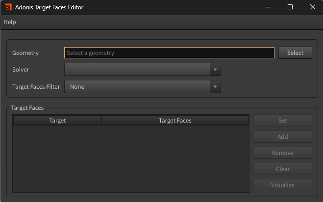
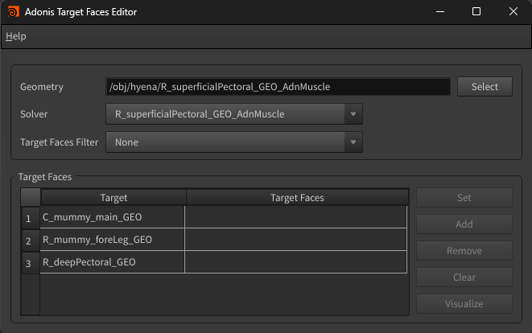
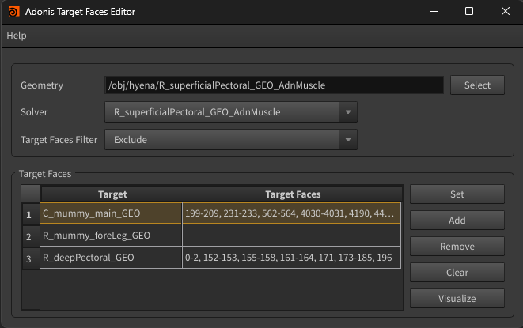

# Target Faces Editor

The Target Faces Editor is a tool designed to manage the face-filtering settings used by Adonis solvers. It allows users to define which faces of a target mesh should be included or excluded during closest point queries for geometry attachments and slide-on-geometry constraints in muscle solvers, as well as hard, soft, and sliding constraints in the skin solver. This makes it easier to control target behavior, refine solver results, and debug face-based filtering directly from the UI.

## UI

<figure markdown>
  
  <figcaption><b>Figure 1</b>: Adonis Target Faces Editor UI.</figcaption>
</figure>

The Target Faces Editor Tool offers an intuitive interface (see Figure 1), allowing users to select a given Adonis solver (muscle, ribbon muscle, or skin) and:

- modify the target faces filter mode
- set faces of a target from the current selection
- remove faces of a target from the current selection
- clear all faces of a target
- select the current list of faces of a target in the viewport for visualization and debugging purposes

The UI widgets are:

* **Geometry**: Selected geometry with an Adonis solver applied to it.

* **Solver**: A drop-down list of the valid solvers applied to the selected geometry. Valid solvers are muscle, ribbon muscle, and skin.

* **Target Faces Filter**: Defines how the *Target Faces* list is processed for geometry attachments and slide-on-geometry constraints.

  - None: uses all the faces in the target mesh for closest point queries.
  - Exclude: excludes the faces listed in the *Target Faces* attribute from closest point queries.
  - Include: includes only the faces listed in the *Target Faces* attribute for closest point queries.

* **Target Faces**: A table widget that displays the list of targets assigned to the selected solver and their corresponding face lists.

* **Buttons**:

  - Select: populates the UI using the current selection.
  - Set: overwrites the face list of the selected target in the table with the current selection.
  - Add: adds the selected faces to the face list of the selected target in the table.
  - Remove: removes the selected faces from the face list of the selected target in the table.
  - Clear: removes all faces from the face list of the selected target in the table.
  - Visualize: selects the faces of the selected target in the table in the viewport.

## Requirements

The tool requires the following conditions to properly gather the data needed to populate the UI and be ready for use:

1. A geometry with at least one of the valid Adonis solver types applied (i.e. muscle, ribbon muscle, or skin).

2. The user must provide a valid selection before launching the tool and/or clicking the Select button to start. This selection can be:

  - Any node within the deformable chain of the geometry, limited by two null nodes prefixed with "ADN_IN_" and "ADN_OUT_".
  - The prefixed "ADN_IN_" or "ADN_OUT_" null nodes.
  - The solver.

## How To Use

1. With an Adonis scene open, there are two ways to prepare the UI for editing.

   - Go to *Adonis menu > Target Faces Filter*, then select the geometry ("ADN_IN_" or "ADN_OUT_" null nodes) with the solver to edit, or the solver itself, and click the Select button.
   - First select the geometry ("ADN_IN_" or "ADN_OUT_" null nodes) with the solver to edit, or the solver itself, then go to *Adonis menu > Target Faces Filter*.

2. The tool will populate the UI by adding the valid solvers to the combo box and listing the targets in the table view, together with the current value of each target's *Target Faces* parameter. If no faces are set, the second column of the table will be empty like in Figure 2. The selected mode in *Target Faces Filter* corresponds to the current mode of the selected solver. 

<figure markdown>
  
  <figcaption><b>Figure 2</b>: Adonis Target Faces Editor ready to edit the faces list of the three targets added to the solver "R_superficialPectoral_GEO_AdnMuscle" of geometry "R_superficialPectoral_GEO" and no faces configured yet. </figcaption>
</figure>

3. Make sure to select the solver you want to edit from the Solver drop-down.

4. Select the target whose face list you want to edit.

5. In the viewport, select the faces of that target to modify.

6. Click *Set* to write the selected faces to the Target Faces column in the table.

7. Switch the Target Faces Filter mode to Exclude, Include, or None depending on the desired result.

8. Repeat the process for all targets and use the buttons to set, add, remove, or clear faces as needed.

<figure markdown>
  
  <figcaption><b>Figure 3</b>: Adonis Target Faces Editor with some faces added to two of the three targets. With the Target Faces Filter set to Exclude, those faces will be discarded when creating attachments to geometry and slide on geometry constraints. For the second target in the table with an empty list of faces, all the faces will be used for constraints creation.</figcaption>
</figure>

9. To visualize the current face list, select the target in the table and click *Visualize*.

> [!NOTE]
>
> * The action buttons are associated with the selected target row in the table.
> * If no target is selected, the button will display an error and nothing will happen.
> * The target faces filter mode can be modified at any time, as many times as desired.
> * The target faces filter mode is global to the solver, meaning that the value affects all targets in the same way.
