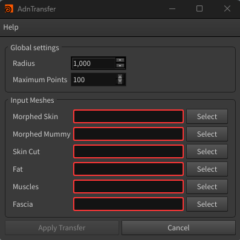
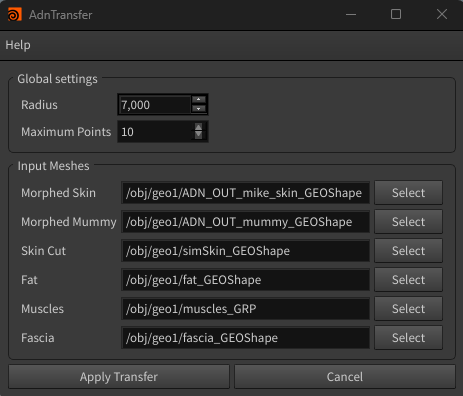
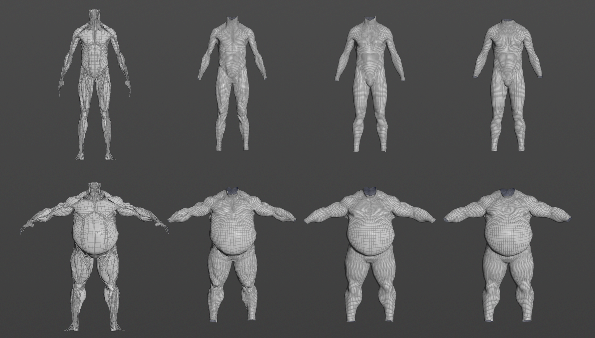

# AdnTransfer Tool

The **AdnTransfer Tool** is a utility designed to automate the transfer of anatomy layers after the primary anatomy transfer has been completed using [AdnRadialWrap](../deformers/radial_wrap).

In the anatomy transfer workflow, AdnRadialWrap is first used to reshape and repose the **skin** and **mummy** geometries. Once these geometries have been transferred, the AdnTransfer Tool propagates the resulting deformation to the remaining anatomy layers by automatically creating and configuring the required [AdnSoftWrap](../deformers/soft_wrap) and [AdnRigidWrap](../deformers/rigid_wrap) deformers.

This allows the complete anatomy hierarchy to be transferred from one character to another while preserving the spatial relationships between the different anatomical layers.

The anatomy transfer workflow is not limited to reshaping and reposing the anatomical geometries. Once the transfer process is complete, an existing Adonis simulation rig created for the source character can also be reused on the transferred anatomy. This allows simulation setups authored for a template character to be adapted to new characters after the anatomy transfer process.

## Requirements

To use the AdnTransfer Tool, the following inputs must be provided:

- **Morphed Skin**: Skin geometry already deformed using AdnRadialWrap.
- **Morphed Mummy**: Mummy geometry already deformed using AdnRadialWrap.
- **Skin Cut**: Skin cut geometry to be transferred.
- **Fat**: Fat geometry to be transferred.
- **Muscles**: One or more muscle geometries to be transferred.
- **Fascia**: Fascia geometry to be transferred.

The following parameters are also available:

- **Radius**: Search radius used by the generated AdnSoftWrap deformers.
- **Maximum Points**: Maximum number of neighboring points considered by the generated AdnSoftWrap deformers.

> [!NOTE]
> - The *Morphed Skin* and *Morphed Mummy* geometries are expected to already contain the desired anatomy transfer deformation, typically generated using AdnRadialWrap. Refer to the [AdnRadialWrap](../deformers/radial_wrap) page for more information.
> - Additionally, the AdnRigidWrap and AdnSoftWrap deformers created by AdnTransfer require their target geometries to be in their rest pose during initialization. To achieve this, we recommend setting two keyframes on the *envelope* attribute of both AdnRadialWrap deformers: a value of `0` on the initialization frame and a value of `1` on the following frame. This allows the generated AdnRigidWrap and AdnSoftWrap deformers to initialize using the non-deformed target geometries and subsequently transfer the deformation once the AdnRadialWrap deformers become active.

## How To Use

1. Open the **AdnTransfer Tool** from the Adonis menu under the Tools section.

<figure style="width:90%; margin-left:5%" markdown>
  
  <figcaption><b>Figure 1</b>: AdnTransfer Tool UI without providing inputs.</figcaption>
</figure>

2. Configure the *Radius* and *Maximum Points* values. These values will be assigned to all AdnSoftWrap deformers created by the tool.

3. Assign the geometries already transferred by AdnRadialWrap:
    - **Morphed Skin**
    - **Morphed Mummy**

4. Assign the anatomy layers to be transferred:
    - **Skin Cut**
    - **Fat**
    - **Muscles**
    - **Fascia**

<figure style="width:90%; margin-left:5%" markdown>
  
  <figcaption><b>Figure 2</b>: AdnTransfer Tool UI after providing the inputs.</figcaption>
</figure>

5. Press **Apply Transfer**.

6. If the scene contains AdnRigidWrap and/or AdnSoftWrap nodes, a confirmation dialog will appear informing about it. Press *Yes* to continue with the AdnTransfer process or *No* to cancel it.

<figure style="width:90%; margin-left:5%" markdown>
  
  <figcaption><b>Figure 3</b>: Result of the AdnTransfer process. From left to right: muscles, fascia, fat, and skin. Original geometries are shown on top and transferred geometries on the bottom. </figcaption>
</figure>

The tool automatically creates and configures the required AdnSoftWrap and AdnRigidWrap deformers to propagate the deformation through the anatomy hierarchy.

If the *Radius* value used by the generated AdnSoftWrap deformers is too small, some points may fail to find any valid neighbor points within the search area. In such cases, no deformation will be transferred to those points. Make sure the radius is large enough relative to the character dimensions to guarantee that all points can find suitable neighbors.

> [!NOTE]
> - Note that the whole AdnTransfer can be undone.
> - AdnTransfer can also be executed with the **AdnTransfer Script**. For more details, please refer to the [AdnTransfer Script page](../scripts/transfer.md).

## Result

After pressing *Apply Transfer*, the following deformers are created automatically:

- An AdnRigidWrap applied to the *Skin Cut* geometry using the *Morphed Skin* as target.
- An AdnSoftWrap applied to the *Fat* geometry using the transferred *Skin Cut* as target.
- An AdnSoftWrap applied to each muscle geometry using both the transferred *Fat* and the *Morphed Mummy* as targets.
- An AdnRigidWrap applied to the *Fascia* geometry using all transferred muscles as targets.

Once all deformers have been created, the deformation is propagated from the *Morphed Skin* and *Morphed Mummy* through all anatomy layers, completing the anatomy transfer workflow.

## Limitations
- All anatomy layers must be provided. The tool does not support transferring only a subset of the required geometries.
