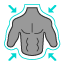
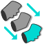
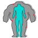
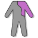
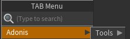

# UI Overview

## Adonis TAB Menu

The Adonis nodes catalog can be inspected in the TAB Menu inside any geometry context under the submenu *Adonis*. It allows for quick access and creation of Adonis SOPs and HDAs. All of them are distributed in 6 submenus by type: Deformers, Locators, Sensors, Solvers, Tools and Utils.

<figure style="width: 50%;" markdown>
  
  <figcaption><b>Figure 1</b>: Adonis TAB Menu inside a geometry context.</figcaption>
</figure>

| Icon | Description | TAB Submenu |
| :--- | :---------- | :---------- |
|  | Creates an AdnClosestFit SOP. A deformer used to snap each point of the input mesh to the closest point on the target surface. | Adonis > Deformers > *AdnClosestFit* |
|  | Creates an AdnMLDeformer SOP. A deformer used to infer mesh deformations from joint animations based on a trained machine learning model. | Adonis > Deformers > *AdnMLDeformer* |
|  | Creates an AdnMush SOP. A deformer used to smooth out the surface while preserving the details. | Adonis > Deformers > *AdnMush* |
|  | Creates an AdnPush SOP. A deformer that pushes the geometry surface along the normal direction. | Adonis > Deformers > *AdnPush* |
|  | Creates an AdnRadialWrap SOP. A deformer used to transfer the topological details from a goal mesh to an input mesh based on landmark pairs. | Adonis > Deformers > *AdnRadialWrap* |
|  | Creates an AdnRelax SOP. A deformer used to smooth creases and correct over-compression or over-stretching on geometry. | Adonis > Deformers > *AdnRelax* |
|  | Creates an AdnRigidWrap SOP. A deformer used to attach each point of the input mesh to its closest target point using rigid transformations. | Adonis > Deformers > *AdnRigidWrap* |
|  | Creates an AdnSoftWrap SOP. A deformer used to deform the input mesh using weighted influences from nearby target points within a defined radius. | Adonis > Deformers > *AdnSoftWrap* |
|||
|  | Creates an AdnLocatorPosition SOP. Used to visualize the output values of an AdnSensorPosition SOP. | Adonis > Locators > *AdnLocatorPosition* |
|  | Creates an AdnLocatorDistance SOP. Used to visualize the output values of an AdnSensorDistance SOP. | Adonis > Locators > *AdnLocatorDistance* |
|  | Creates an AdnLocatorRotation SOP. Used to visualize the output values of an AdnSensorRotation SOP. | Adonis > Locators > *AdnLocatorRotation* |
|||
|  | Creates an AdnSensorPosition SOP. Designed to interpret changes in a transformation matrix’s position and output velocity and acceleration over time. | Adonis > Sensors > *AdnSensorPosition* |
|  | Creates an AdnSensorDistance SOP. Designed to interpret positional changes between two transformation matrices and output the distance, velocity, and acceleration over time. | Adonis > Sensors > *AdnSensorDistance* |
|  | Creates an AdnSensorRotation SOP. Designed to interpret positional changes between three transformation matrices and output the resulting angle, angular velocity, and angular acceleration over time. | Adonis > Sensors > *AdnSensorRotation* |
|||
|  | Creates an AdnFat SOP. Solver for fat tissue simulation. | Adonis > Solvers > *AdnFat* |
|  | Creates an AdnGlue SOP. Solver used to glue multiple muscles together, making them behave more compactly and react to each other. | Adonis > Solvers > *AdnGlue* |
|  | Creates an AdnMuscle SOP. Solver for volumetric muscle simulation. | Adonis > Solvers > *AdnMuscle* |
|  | Creates an AdnRibbonMuscle SOP. Solver for planar muscle simulation. | Adonis > Solvers > *AdnRibbonMuscle* |
|  | Creates an AdnSimshape SOP. Solver for facial simulation. | Adonis > Solvers > *AdnSimshape* |
|  | Creates an AdnSkin SOP. Solver for fascia and skin simulation. | Adonis > Solvers > *AdnSkin* |
|  | Creates an AdnSkinMerge SOP. Node used to blend animation and simulation skin layers. | Adonis > Solvers > *AdnSkinMerge* |
|  | Creates an AdnSmartTissue SOP. Solver that applies skin dynamics without requiring the simulation of internal anatomy layers. It also enables stiffness to be modulated across the surface using an Adonis ML-trained model that emulates the activation of underlying muscles. | Adonis > Solvers > *AdnSmartTissue* |
|||
|  | Creates an AdnMLDataProcessing HDA. Node used to extract the deformation from the render skin and define the joints to be used in the data extraction process. An Adonis ML license is needed to use this HDA. | Adonis > Tools > *AdnMLDataProcessing* |
|  | Creates an AdnNeuralClusteringPaintTool HDA. Node used to paint the neural clusters needed for the training. An Adonis ML license is required to use this HDA. | Adonis > Tools > *AdnNeuralClusteringPaintTool* |
|||
|  | Creates an AdnActivation SOP. Allows operations on a set of input values to compute a final value, which can be used, for example, to drive muscle activations. | Adonis > Utils > *AdnActivation* |
|  | Creates an AdnEdgeEvaluator SOP. Used to compute a compression map on geometry based on edge deformation. | Adonis > Utils > *AdnEdgeEvaluator* |
|  | Creates an AdnFiberDiffusion SOP. Utility SOP used by the *AdnFiberGroom* HDA to compute fiber vectors of a muscle driven by a tendons map. | Adonis > Utils > *AdnFiberDiffusion* |
|  | Creates an AdnFiberGroom HDA. Allows combing of muscle fibers. | Adonis > Utils > *AdnFiberGroom* |
|  | Creates an AdnFiberProjection SOP. Utility SOP used by the *AdnFiberGroom* HDA to process vectors resulting from fiber diffusion or combing and fully project them onto the muscle surface. | Adonis > Utils > *AdnFiberProjection* |
|  | Creates an AdnLearnMusclePatches SOP. A machine learning–powered SOP used to generate an *Adonis Muscle Patches* file, which stores per-vertex fiber information that is required by *AdnSimshape* solver to compute muscle activations. | Adonis > Utils > *AdnLearnMusclePatches* |
|  | Creates an AdnRemap SOP. Utility SOP used to remap scalar values, typically to process sensor outputs for driving muscle activation or volume gain. | Adonis > Utils > *AdnRemap* |
|||

The Adonis TOP nodes can be inspected in the TAB Menu inside any task context under the submenu *Adonis*. 

<figure style="width: 50%;" markdown>
  
  <figcaption><b>Figure 2</b>: Adonis TAB Menu inside a TOP network.</figcaption>
</figure>

| Icon | Description | TAB Submenu |
| :--- | :---------- | :---------- |
|  | Creates an AdnMLDataExtraction TOP. Node used to extract the simulation data needed for the training. An Adonis ML license is required to use this TOP. | Adonis > Tools > *AdnMLDataExtraction* |
|  | Creates an AdnMLTraining TOP. Node used to train a model using the data extracted with the AdnMLDataExtraction. The resulting model can later be used by AdnMLDeformer and AdnSmartTissue. An Adonis ML license is required to use this TOP. | Adonis > Tools > *AdnMLTraining* |
|||

## Adonis Menu

The Adonis Menu provides access to some tools and utilities that are organized in four groups: Tools, I/O, License and Help.

<figure style="width: 30%;" markdown>
  
  <figcaption><b>Figure 3</b>: Adonis Menu.</figcaption>
</figure>

### Tools section

- **Utils > Clear**. Removes all Adonis nodes from the scene.

- **Utils > Separate Geometry**. Separates the geometry of the selected SOP node into individual pieces based on a primitive attribute. The primitive attribute name must be `path`, `muscle_id` or `name`.

- **Utils > Make Paintable**. Creates an `attribcreate` node to define the point attributes required by an Adonis SOP and assigns their default values followed by an `attribpaint` node to allow these attributes to be modified. This pair of nodes are created for each selected Adonis SOP. If no selection is provided, the nodes are created for all Adonis SOPs in the scene.

- **Utils > Make Groomable**. Creates an *AdnFiberGroom* node for each Adonis muscle SOP (i.e. *AdnMuscle* and *AdnRibbonMuscle*) selected.  If no selection is provided, an *AdnFiberGroom* node will be created for each Adonis muscle SOP in the scene.

- **Utils > Create Muscle PieceID**. Creates a `connectivity` node for each SOP in the selection in charge of computing the primitive attribute `path` that will identify each muscle piece.

- **Utils > Install ML Dependencies**. Installs the Python dependencies required to run Adonis ML training, and also to run the ML inference in *AdnMLDeformer* and *AdnSmartTissue* on the GPU.

- **Turbo**. Opens the Turbo UI, which allows users to build an Adonis rig on a clean asset from scratch. The UI is divided into sections for each simulation layer that the *AdnTurbo* can configure. Users can toggle layers on or off to include or skip them in the execution and select the scene objects required to create and configure the solvers.

- **Transfer**. Opens the *AdnTransfer* UI, which allows users to transfer the anatomy of muscles, fascia, fat, and skin cut geometries after morphing the mummy and skin geometries using *AdnRadialWrap*.

- **ML Deformer**. Launches the Create ML Deformer UI used to create the *AdnMLDeformer*.

- **Smart Tissue**. Launches the Create Smart Tissue UI used to create an *AdnSmartTissue* deformer.

### I/O section

- **Import (beta)**. Opens the Import UI which allows to import an Adonis rig from a file in disk into the scene.
- **Export (beta)**. Opens the Export UI which allows to export an Adonis rig from the scene into a file in disk.

### License section

- **Activate License**. Checks the license status and if it is not activated yet, then a dialog will be prompted to guide on the product key registration. This functionality is only available in the Interactive Node-Locked license.
- **Deactivate License**. Checks the license status and if it is activated, a dialog will be prompted asking confirmation before closing Maya. This functionality is only available if the license is Node-Locked.

### Help section

- **Documentation**. Opens the Adonis technical documentation on a web browser.
- **Tutorials**. Opens the Adonis tutorials on YouTube on a web browser.
- **About**. Launches the Adonis About dialog with version information and credits.

> [!NOTE]
> An Adonis ML license is required to use: *AdnNeuralClusteringPaintTool*, *AdnMLDataProcessing*, *AdnMLDataExtraction* and *AdnMLTraining*.
