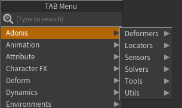
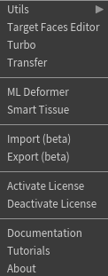

# UI Overview

## AdonisFX TAB Menu

The AdonisFX nodes catalog can be inspected in the TAB Menu inside any geometry context under the submenu *AdonisFX*. It allows for quick access and creation of AdonisFX SOPs and HDAs. All of them are distributed in 5 submenus by type: Deformers, Locators, Sensors, Solvers and Utils.

<figure style="width: 50%;" markdown>
  
  <figcaption><b>Figure 1</b>: AdonisFX TAB Menu.</figcaption>
</figure>

| Icon | Description | TAB Submenu |
| :--- | :---------- | :---------- |
|  | Creates an AdnRelax SOP. A deformer used to smooth creases and correct over-compression or over-stretching on geometry. | AdonisFX > Deformers > *AdnRelax* |
|  | Creates an AdnPush SOP. A deformer that pushes the geometry surface along the normal direction. | AdonisFX > Deformers > *AdnPush* |
|||
|  | Creates an AdnLocatorPosition SOP. Used to visualize the output values of an AdnSensorPosition SOP. | AdonisFX > Locators > *AdnLocatorPosition* |
|  | Creates an AdnLocatorDistance SOP. Used to visualize the output values of an AdnSensorDistance SOP. | AdonisFX > Locators > *AdnLocatorDistance* |
|  | Creates an AdnLocatorRotation SOP. Used to visualize the output values of an AdnSensorRotation SOP. | AdonisFX > Locators > *AdnLocatorRotation* |
|||
|  | Creates an AdnSensorPosition SOP. Designed to interpret changes in a transformation matrix’s position and output velocity and acceleration over time. | AdonisFX > Sensors > *AdnSensorPosition* |
|  | Creates an AdnSensorDistance SOP. Designed to interpret positional changes between two transformation matrices and output the distance, velocity, and acceleration over time. | AdonisFX > Sensors > *AdnSensorDistance* |
|  | Creates an AdnSensorRotation SOP. Designed to interpret positional changes between three transformation matrices and output the resulting angle, angular velocity, and angular acceleration over time. | AdonisFX > Sensors > *AdnSensorRotation* |
|||
|  | Creates an AdnFat SOP. Solver for fat tissue simulation. | AdonisFX > Solvers > *AdnFat* |
|  | Creates an AdnGlue SOP. Solver used to glue multiple muscles together, making them behave more compactly and react to each other. | AdonisFX > Solvers > *AdnGlue* |
|  | Creates an AdnMuscle SOP. Solver for volumetric muscle simulation. | AdonisFX > Solvers > *AdnMuscle* |
|  | Creates an AdnRibbonMuscle SOP. Solver for planar muscle simulation. | AdonisFX > Solvers > *AdnRibbonMuscle* |
|  | Creates an AdnSimshape SOP. Solver for facial simulation. | AdonisFX > Solvers > *AdnSimshape* |
|  | Creates an AdnSkin SOP. Solver for fascia and skin simulation. | AdonisFX > Solvers > *AdnSkin* |
|  | Creates an AdnSkinMerge SOP. Node used to blend animation and simulation skin layers. | AdonisFX > Solvers > *AdnSkinMerge* |
|||
|  | Creates an AdnActivation SOP. Allows operations on a set of input values to compute a final value, which can be used, for example, to drive muscle activations. | AdonisFX > Solvers > *AdnActivation* |
|  | Creates an AdnEdgeEvaluator SOP. Used to compute a compression map on geometry based on edge deformation. | AdonisFX > Solvers > *AdnEdgeEvaluator* |
|  | Creates an AdnFiberDiffusion SOP. Utility SOP used by the *AdnFiberGroom* HDA to compute fiber vectors of a muscle driven by a tendons map. | AdonisFX > Solvers > *AdnFiberDiffusion* |
|  | Creates an AdnFiberGroom HDA. Allows combing of muscle fibers. | AdonisFX > Solvers > *AdnFiberGroom* |
|  | Creates an AdnFiberProjection SOP. Utility SOP used by the *AdnFiberGroom* HDA to process vectors resulting from fiber diffusion or combing and fully project them onto the muscle surface. | AdonisFX > Solvers > *AdnFiberProjection* |
|  | Creates an AdnLearnMusclePatches SOP. A machine learning–powered SOP used to generate an *AdonisFX Muscle Patches* file, which stores per-vertex fiber information that is required by *AdnSimshape* solver to compute muscle activations. | AdonisFX > Solvers > *AdnLearnMusclePatches* |
|  | Creates an AdnRemap SOP. Utility SOP used to remap scalar values, typically to process sensor outputs for driving muscle activation or volume gain. | AdonisFX > Solvers > *AdnRemap* |
|||

## AdonisFX Menu

The AdonisFX Menu provides access to some tools and utilities that are organized in four groups: Tools, I/O, License and Help.

<figure style="width: 30%;" markdown>
  
  <figcaption><b>Figure 2</b>: AdonisFX Menu.</figcaption>
</figure>

### Tools section

- **Utils > Clear**. Removes all AdonisFX nodes from the scene.

- **Utils > Separate Geometry**. Separates the geometry of the selected SOP node into individual pieces based on a primitive attribute. The primitive attribute name must be `path`, `muscle_id` or `name`.

- **Utils > Make Paintable**. Creates an `attribcreate` node to define the point attributes required by an AdonisFX SOP and assigns their default values followed by an `attribpaint` node to allow these attributes to be modified. This pair of nodes are created for each selected AdonisFX SOP. If no selection is provided, the nodes are created for all AdonisFX SOPs in the scene.

- **Utils > Make Groomable**. Creates an AdnFiberGroom node for each AdonisFX muscle SOP (i.e. AdnMuscle and AdnRibbonMuscle) selected.  If no selection is provided, an AdnFiberGroom node will be created for each AdonisFX muscle SOP in the scene.

- **Utils > Create Muscle PieceID**. Creates a `connectivity` node for each SOP in the selection in charge of computing the primitive attribute `path` that will identify each muscle piece.

- **Turbo**. Opens the Turbo UI, which allows users to build an AdonisFX rig on a clean asset from scratch. The UI is divided into sections for each simulation layer that the AdnTurbo can configure. Users can toggle layers on or off to include or skip them in the execution and select the scene objects required to create and configure the solvers.

### I/O section

- **Import (beta)**. Opens the Import UI which allows to import an AdonisFX rig from a file in disk into the scene.
- **Export (beta)**. Opens the Export UI which allows to export an AdonisFX rig from the scene into a file in disk.

### License section

- **Activate License**. Checks the license status and if it is not activated yet, then a dialog will be prompted to guide on the product key registration. This functionality is only available in the Interactive Node-Locked license.

### Help section

- **Documentation**. Opens the AdonisFX technical documentation on a web browser.
- **Tutorials**. Opens the AdonisFX tutorials on YouTube on a web browser.
- **About**. Launches the AdonisFX About dialog with version information and credits.
