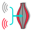
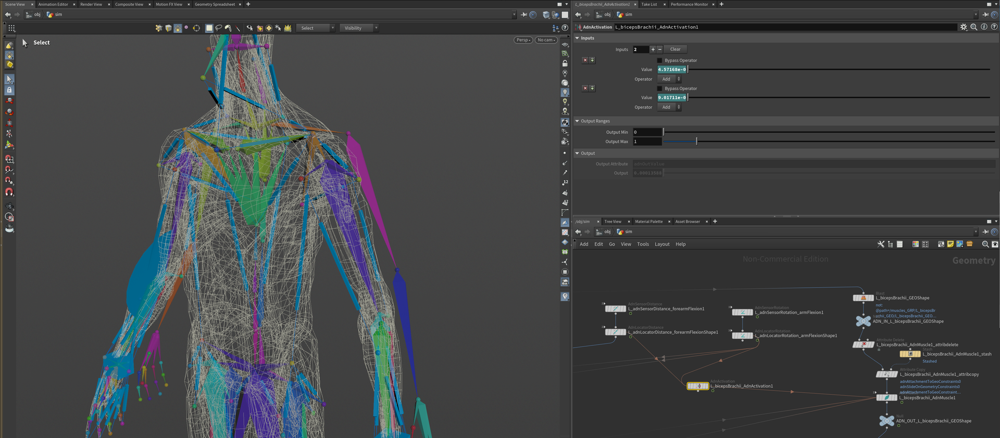
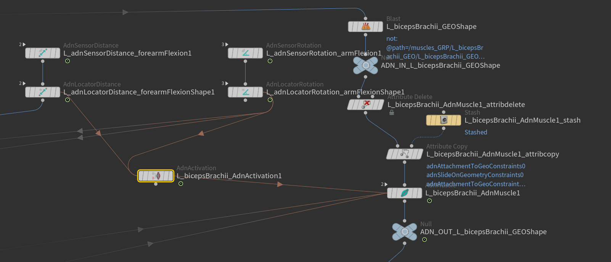
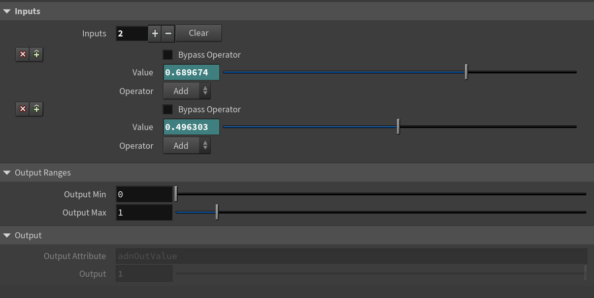

# AdnActivation

The AdnActivation node allows operations on a set of input values for the computation of a final value that can be used to drive, for example, muscle activations. An example of its use case could be the merging of the output value of various sensors together to activate a muscle given multiple poses.

## How To Use

To create this node, follow these steps:

1. Go to the geometry context of the rig containing the rig setup to which the AdnActivation should be applied.
2. Press TAB and navigate to the submenu AdonisFX > Utils to find the {style="width:4%"} button SOP type.
3. Go to the AdnActivation's *Inputs* and add a new input by clicking on the **+** button. A new multiparam entry will be created three parameters: *Bypass Operator*, *Value* and *Operator*.
4. Use a detail expression to drive the *Value*. For example, do this to use the output activation from a distance sensor: `detail("/obj/sim/my_dist_sensor", "adnActivationDistance", 0)`.
5. The AdnActivation node is ready to compute and write the result into the `adnOutValue` output attribute.

The activation node can now be used to override, add, subtract, multiply or divide the activations from different sources (sensors) into one final activation value. For example, multiple distance sensors of a character can be merged together to produce different kinds of activations throughout the simulation.

<figure markdown>
  
  <figcaption><b>Figure 1</b>: Use case in which AdnActivation is created for merging two activations to drive a muscle's activation.</figcaption>
</figure>

To add new inputs to the AdnActivation node:

1. Go to the AdnActivation's *Inputs* and add more inputs by clicking on the **+** button.
2. Set the desired *Operator*.
3. Set the detail expression to drive the *Value*.

> [!NOTE]
> - All operators will be evaluated from top to bottom (starting from the lowest index and ending on the last index used).
> - Using channel expression or animating the *Value* is also supported to modulate the input across the frame range.

## Operators

1. **Over (Override)**: Overrides the accumulated output activation value with Value. If the current accumulated activation value is 1.0 and Value is 2.0 then the new accumulated value will be 2.0.
2. **Add (Add)**: Adds the accumulated output activation value with Value. If the current accumulated activation value is 1.0 and Value is 2.0 then the new accumulated value will be 3.0.
3. **Sub (Subtract)**: Subtracts the accumulated output activation value with Value. If the current accumulated activation value is 1.0 and Value is 2.0 then the new accumulated value will be -1.0.
4. **Mult (Multiply)**: Multiplies the accumulated output activation value with Value. If the current accumulated activation value is 1.0 and Value is 2.0 then the new accumulated value will be 2.0.
5. **Div (Divide)**: Divides the accumulated output activation value with Value. If the current accumulated activation value is 1.0 and Value is 2.0 then the new accumulated value will be 0.5.

> [!NOTE]
> The final value can then be clamped using the output minimum and maximum sliders. For the example above this clamping has been disregarded.

## Example

<figure markdown>
  
  <figcaption><b>Figure 2</b>: Closeup use case in which AdnActivation is created for merging two activations to drive a muscle's activation.</figcaption>
</figure>

In the above setup we have the following characteristics:

1. One pair of AdnSensorDistance and AdnLocatorDistance.
2. One pair of AdnSensorRotation and AdnLocatorRotation.
3. One AdnActivation.
4. One AdnMuscle.
5. Two inputs added to AdnActivation.
6. Input 1 is connected to the AdnLocatorDistance (Operator Add, Bypass unchecked).
7. Input 2 is connected to the AdnLocatorRotation (Operator Add, Bypass unchecked).
8. Out Value will be: AdnSensorDistance's output distance remapped + AdnSensorRotation's output angle remapped.

## Attributes

### Inputs Attributes

The *Inputs* attribute is presented as an array of 3 attributes which can be found below.

| Name | Type | Default | Animatable | Description |
| :--- | :--- | :------ | :--------- | :---------- |
| **Inputs**          | Int         | 0     | ✓ | Number of inputs to process. Each item is a multiparam of three elements: *Bypass Operator*, *Value* and *Operator*. |
| **Bypass Operator** | Boolean     | True  | ✓ | If enabled, it bypasses the current operator in the input list, which will not contribute to the final activation value. |
| **Value**           | Float       | 0.0   | ✓ | Activation value that will contribute, given the operator type, to the final activation. |
| **Operator**        | Enumerator  | Add   | ✓ | Operator used to contribute to the final activation. This can be: Over, Add, Sub, Mult, Divide. |

### Output Ranges Attributes
| Name | Type | Default | Animatable | Description |
| :--- | :--- | :------ | :--------- | :---------- |
| **Output Min** | Float | 0.0 | ✓ | Minimum supported output activation value. Has a range of \[0.0, 10.0\]. Lower and upper limit are soft, lower or higher values can be used. |
| **Output Max** | Float | 1.0 | ✓ | Maximum supported output activation value. Has a range of \[0.0, 10.0\]. Lower and upper limit are soft, lower or higher values can be used. |

### Output Attributes
| Name | Type | Default | Animatable | Description |
| :--- | :--- | :------ | :--------- | :---------- |
| **Output Attribute**  | String  | `adnOutValue` | ✓ | Specifies the name of the point attribute to write the result into. |
| **Output**            | Float   | 1.0           | ✓ | Output activation value. |

## Parameter Template

<figure markdown>
  
  <figcaption><b>Figure 3</b>: AdnActivation Parameter Template.</figcaption>
</figure>
