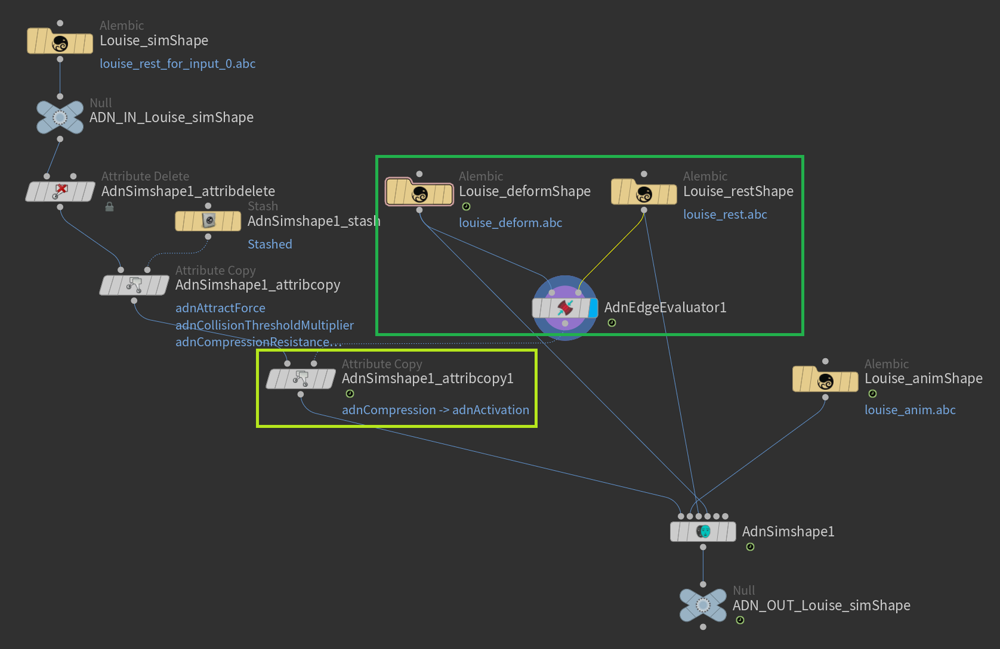
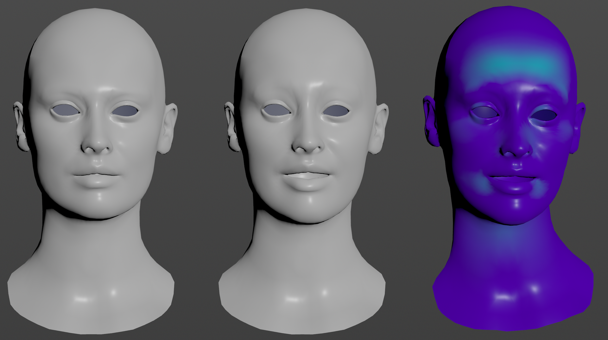
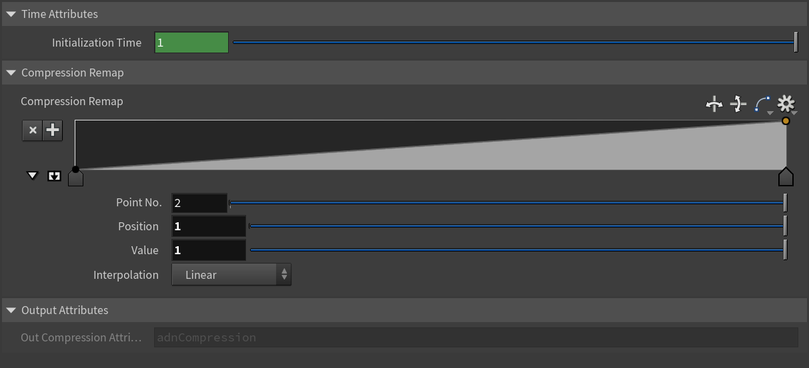

# AdnEdgeEvaluator

The AdnEdgeEvaluator SOP computes deformation changes in the edges of a geometry. Based on two compatible input meshes it will output a compression map of the edges.

## How To Use

This SOP requires the following inputs to be provided:

  - **Deform Mesh (D)**: Mesh with deformation.
  - **Rest Mesh (R)**: Mesh with no deformation or animation.

> [!NOTE]
> The two input geometries must have the same number of vertices and edges.

To create this node, follow these steps:

1. Go to the geometry context containing both the deform and the rest geometries.
2. Press TAB and navigate to the submenu AdonisFX > Utils to find the AdnEdgeEvaluator {style="width:4%"} SOP type and create it.
3. Connect the deform mesh to the first source and the rest mesh to the second source.
4. Cook the node and the `adnCompression` point attribute is written into the geostream with the compression at each vertex.

The evaluator node can be used to drive the activations of an AdnSimshape SOP. This can be done by transferring the output map of this node to the geostream of the first source of an AdnSimshape SOP with the name `adnActivation`. The *Plug Values* mode (see this [section](../solvers/simshape#muscle-activations)) must be enabled.

<figure markdown>
  
  <figcaption><b>Figure 1</b>: Example of the AdnEdgeEvaluator SOP usage in conjunction with AdnSimshape SOP to drive the activations. The geometries Louise_deformShape and Louise_restShape are the sources of the AdnEdgeEvaluator1, which computes "adnCompression" map. This point attribute is then renamed to "adnActivation" and copied to the AdnSimshape input geostream by the AdnSimshape1_attribcopy1 node.</figcaption>
</figure>

<figure markdown>
  
  <figcaption><b>Figure 2</b>: From left to right: rest mesh, deform mesh and simulated mesh with AdnSimshape SOP receiving the compression map from an AdnEdgeEvaluator node to drive activations (the "adnActivation" point attribute is displayed on the simulated mesh).</figcaption>
</figure>

> [!NOTE]
> The output point attribute of an AdnEdgeEvaluator (i.e., `adnCompression`) must be copied with the new name `adnActivation` to be readable from the *Activation Attribute* of an AdnSimshape SOP.

## Attributes

### Time Attributes
| Name | Type | Default | Animatable | Description |
| :--- | :--- | :------ | :--------- | :---------- |
| **Initialization Time** | Time | *Current frame* | ✗ | Sets the frame at which the data will be initialized. |

### Compression Remap
| Name | Type | Default | Animatable | Description |
| :--- | :--- | :------ | :--------- | :---------- |
| **Compression Remap** | Ramp Attribute |  | ✓ | Curve to remap the output compression map. |

#### Output Attributes
| Name | Type | Default | Animatable | Description |
| :--- | :--- | :------ | :--------- | :---------- |
| **Out Compression Attribute** | String | adnCompression | ✗ | Read only parameter that shows the point attribute name where the compression map is written into. |

## Attribute Editor Template

<figure style="width: 75%;" markdown>
  
  <figcaption><b>Figure 3</b>: Edge Evaluator Parameter Template.</figcaption>
</figure>
