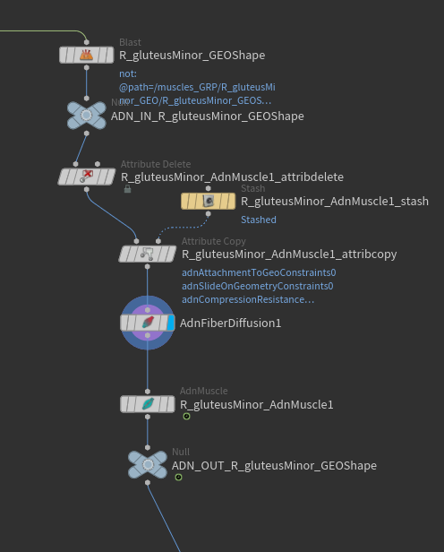
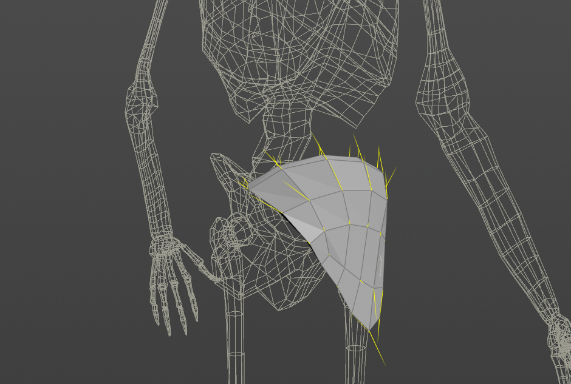

# AdnFiberDiffusion

The AdnFiberDiffusion SOP is in charge of, given a defined tendon mask, generate a fiber flow across the processed geometry per point. This is useful for generating fibers for AdnMuscle or AdnRibbonMuscle nodes to drive the activation. This node is also used in the initial fiber direction estimation in the AdnFiberGroom HDA.

## How To Use

To create this node, follow these steps:

1. Go to the geometry context containing a geometry containing the painted `adnTendons` point attribute painted generally on the tendon areas of a muscle. This can also be a combined geometry with a defined per-primitive piece attribute.
2. Press TAB and navigate to the submenu AdonisFX > Utils to find the AdnFiberDiffusion {style="width:4%"} SOP type.
3. Connect the geometry to the first source.
4. Cook the node and the `adnFibers` point attribute is written into the geostream with unprojected fiber directions used to drive the activation of an AdnMuscle or AdnRibbonMuscle node.

<figure markdown>
  
  <figcaption><b>Figure 1</b>: Example of the AdnFiberDiffusion SOP usage in conjunction with an AdnMuscle node. In this network the input to the AdnFiberDiffusion node contains an already painted per-point mask called `adnTendons` that will drive the fiber diffusion logic. The resulting `adnFibers` vector point attribute is then ingested into the AdnMuscle node to drive the activation flow.</figcaption>
</figure>

<figure markdown>
  
  <figcaption><b>Figure 2</b>: The resulting `adnFibers` directions generated by the AdnFiberDiffusion node.</figcaption>
</figure>

> [!NOTE]
> - AdnFiberDiffusion can be used on a combined geometry containing a valid piece attribute. However, for its use in AdnMuscle or AdnRibbonMuscle, each geometry has to be split separately.
> - The "Triangulate Mesh" option ideally should match the option exposed in the AdnMuscle and AdnRibbonMuscle UI to get the same behavior.
> - The AdnFiberDiffusion node is not mandatory and is only and internal component to the AdnFiberGroom HDA for grooming fibers. Ingesting `adnTendons` directly into an AdnMuscle or AdnRibbonMuscle node will generate a consistent fiber from that will the used by the solver.

## Attributes

### General Attributes
| Name | Type | Default | Animatable | Description |
| :--- | :--- | :------ | :--------- | :---------- |
| **Piece Attribute** | String | *muscle_id* | ✗ | Set the per-primitive piece attribute used for splitting the geometry. If not found, it will use all primitives in the input as driver for the fiber diffusion. |
| **Triangulate Mesh** | Boolean | True | ✗ | Triangulates the mesh internally for the fiber diffusion process. This value should match the value set in the AdnMuscle and AdnRibbonMuscle nodes connected downstream. |

## Parameter Template

<figure style="width: 75%;" markdown>
  
  <figcaption><b>Figure 3</b>: Fiber Diffusion Parameter Template.</figcaption>
</figure>
