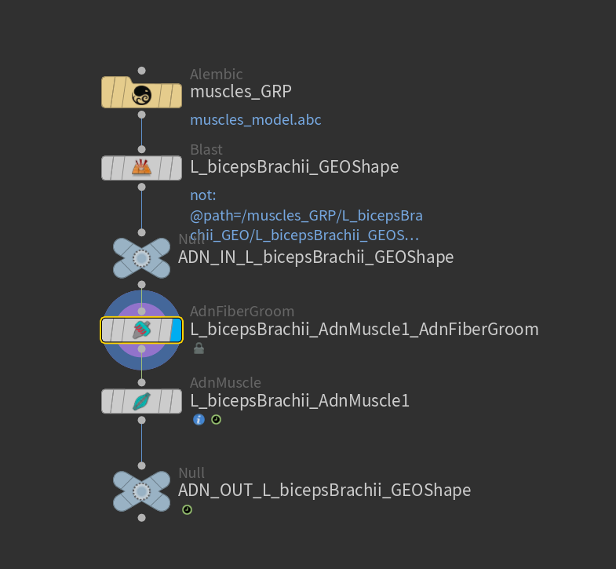
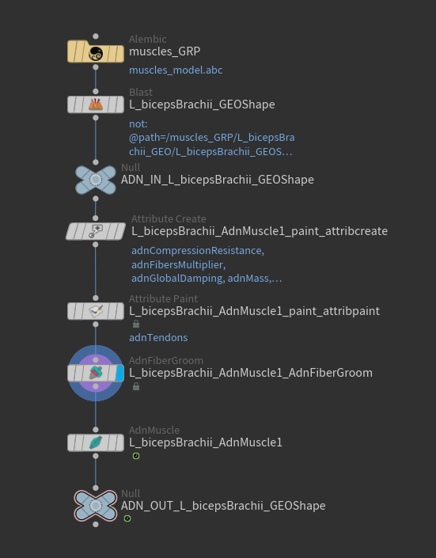
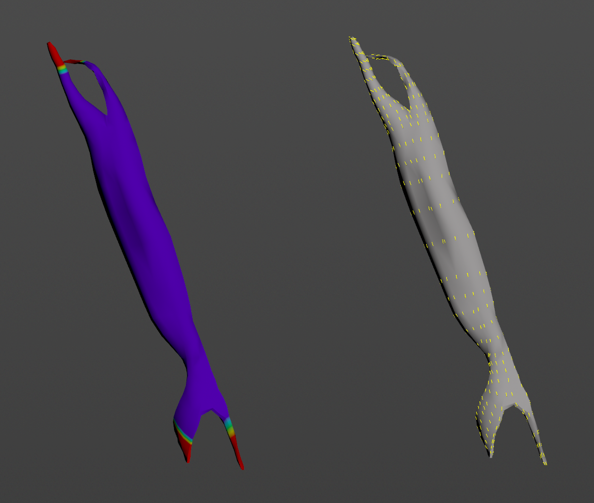
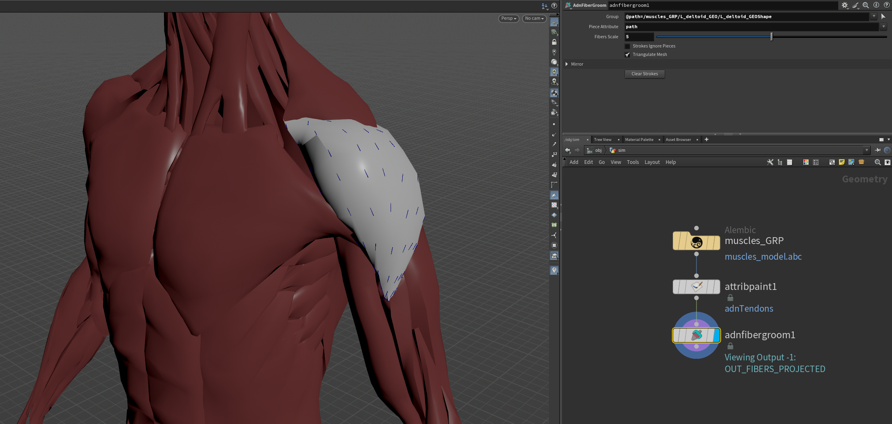
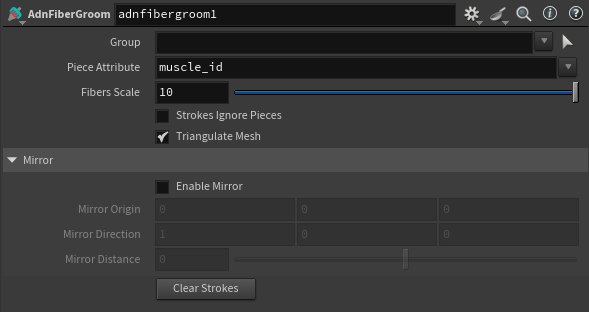

# Fiber Groom

The AdnFiberGroom node is a Houdini Digital Asset responsible for creating and editing muscle fibers. If a tendon mask is provided in the geostream, this node can also estimate an initial fiber flow. The AdnFiberGroom HDA uses the AdnFiberDiffusion and AdnFiberProjection SOP nodes as internal components.

# How To Use

To create this node, follow these steps:

1. Go to the geometry context that contains the muscle geometry for which fibers will be generated.
2. Press TAB and navigate to the submenu AdonisFX > Utils to find the AdnFiberGroom {style="width:4%"} HDA type.
3. Connect the muscle geometry to the AdnFiberGroom input.
4. Cook the node and select it. Then click the Gizmos icon (or press Enter in the viewport) to enter the view state and start grooming the fibers. The fibers will be written to the geostream as a point attribute called `adnFibers`, and can be used to drive the activation of an AdnMuscle or AdnRibbonMuscle.
5. Connect the AdnFiberGroom HDA to the input of an AdnMuscle or AdnRibbonMuscle SOP node.

<figure markdown>
  
  <figcaption><b>Figure 1</b>: Minimum required setup to groom the fibers and create the adnFibers point attribute. Using null nodes with ADN_IN_ and ADN_OUT_ prefixes to encapsulate the AdonisFX deformable section is recommended to keep the network compatible with the API. </figcaption>
</figure>

> [!NOTE]
> - If the geostream contains an `adnTendons` point attribute as tendon mask, the AdnFiberGroom HDA will be able to estimate the initial fiber directions. Otherwise, the initial fiber directions will be empty.
> - It is recommended to place the AdnFiberGroom node after an `attribpaint` node, which is used to paint the `adnTendons` map.

To simplify the creation and initial setup, AdonisFX provides two utilities: *Make Paintable* and *Make Groomable*. These utilities automate the creation of the `attribpaint` node and the AdnFiberGroom HDA.

With the muscle geometry connected to the corresponding AdonisFX muscle SOP (i.e., AdnMuscle or AdnRibbonMuscle), select the muscle SOP node and click AdonisFX > Utils > Make Paintable. This utility will create:

- an `attribcreate` node to define the required point attributes and assign default values, followed by

- an `attribpaint` node to allow those attributes to be edited.

Both nodes are automatically named and correctly connected to the muscle SOP node.

Next, paint the `adnTendons` map using the `attribpaint` node.

Then, select the muscle SOP node again and click AdonisFX > Utils > Make Groomable. This utility will create the AdnFiberGroom node that computes the initial fiber directions based on the previously painted `adnTendons` map. It also allows to further groom and refine the fibers if additional adjustments are needed. The AdnFiberGroom node will be automatically named and properly connected to the muscle SOP node.

<figure markdown>
  
  <figcaption><b>Figure 2</b>: Complete setup after using the Make Paintable and Make Groomable utilities. Using null nodes with ADN_IN_ and ADN_OUT_ prefixes to encapsulate the AdonisFX deformable section is recommended to keep the network compatible with the API.</figcaption>
</figure>

<figure markdown>
  
  <figcaption><b>Figure 3</b>: Fiber directions estimated (right) from the provided `adnTendons` map (left).</figcaption>
</figure>

> [!NOTE]
> - If the geostream is a combination of multiple muscles (with a piece ID primitive attribute) instead of single muscle pieces, it is also possible to use an `attribpaint` to paint the `adnTendons` followed by an AdnFiberGroom node to groom the fibers of all muscles at once (see figure 4).
> - To be able to groom the fibers of a single muscle, press the *Group* selector on the AdnFiberGroom node, press the *9* key in the viewport and select a muscle to isolate it. This will automatically populate the *Group* entry allowing to groom the fibers of a single muscle.

<figure markdown>
  
  <figcaption><b>Figure 4</b>: Using attribpaint and AdnFiberGroom to groom fibers on combined muscles.</figcaption>
</figure>

## Attributes

### General Attributes
| Name | Type | Default | Animatable | Description |
| :--- | :--- | :------ | :--------- | :---------- |
| **Group**                 | String  |                 | ✗ | Isolate a specific group for the fiber grooming process. |
| **Piece Attribute**       | String  | `muscle_id`     | ✗ | Piece attribute from which isolated muscles will be deduced. If not present, the pieces will be isolated from the connectivity information. |
| **Fibers Scale**          | Integer | 10              | ✗ | Visualization scale of the projected fibers. |
| **Strokes Ignore Pieces** | Boolean | False           | ✗ | Ignore the pieceid for the stroke data processing. This allows for a stroke to affect multiple pieces at once. |
| **Triangulate Mesh**      | Boolean | True            | ✗ | Triangulate the mesh internally for the AdnFiberDiffusion and AdnFiberProjection. For the diffusion step it alters the output fiber layout. This parameter should match the triangulate option of your AdnMuscle or AdnRibbonMuscle nodes connected downstream for consistent results. |
| **Enable Mirror**         | Boolean | False           | ✗ | Enable mirroring the strokes for grooming. |
| **Mirror Origin**         | Float3  | {0.0, 0.0, 0.0} | ✗ | Mirror origin from which to consider the mirroring process. |
| **Mirror Direction**      | Float3  | {1.0, 0.0, 0.0} | ✗ | Direction in which to mirror. |
| **Mirror Distance**       | Float   | 0.0             | ✗ | Distance to mirror the plane. |
| **Clear Strokes**         | Button  |                 | ✗ | Returns the fiber directions to their initial state |

## Parameter Template

<figure style="width: 75%;" markdown>
  
  <figcaption><b>Figure 4</b>: Fiber Groom Parameter Template.</figcaption>
</figure>
