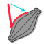
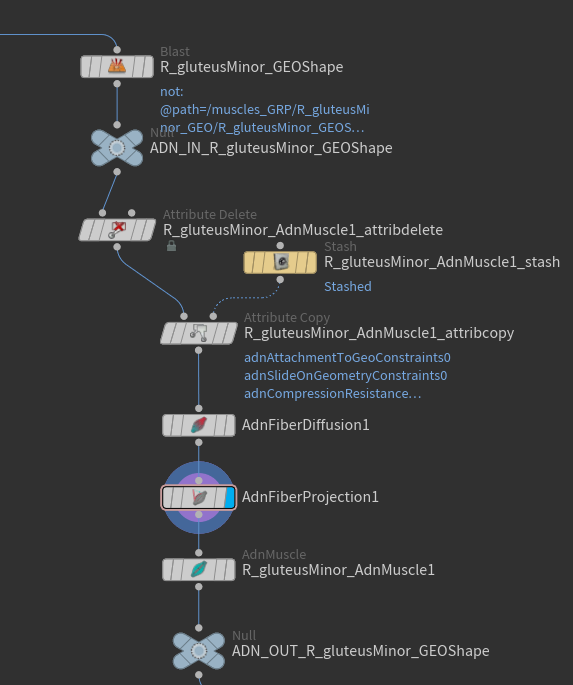
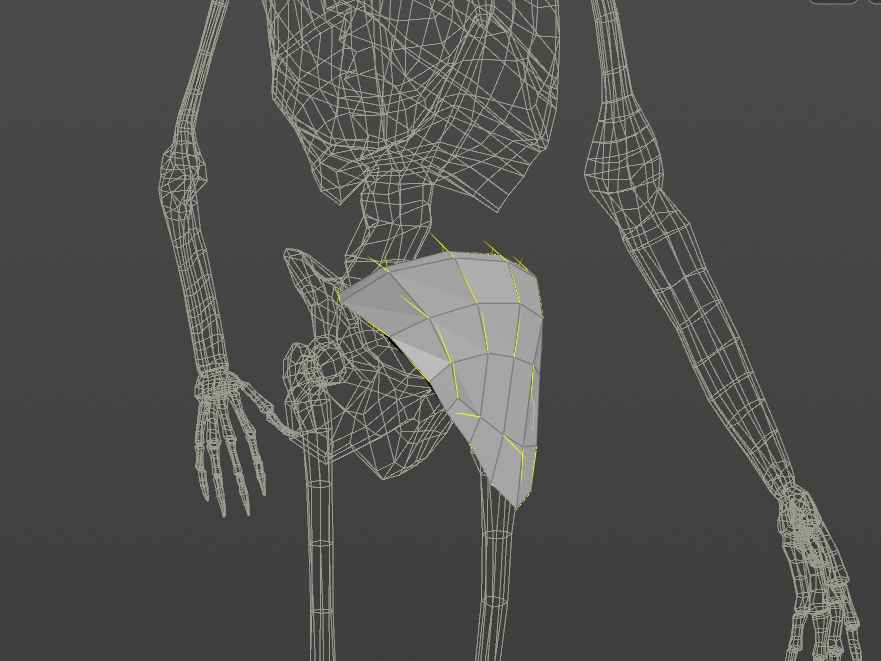
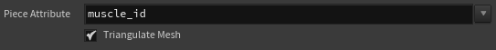

# AdnFiberProjection

The AdnFiberProjection SOP is in charge of projecting non-projected fiber directions onto the geometry surface.
This is useful for visualizing the resulting fiber direction on the surface of the mesh which will then inform the fiber directions to drive the activations in the AdnMuscle and AdnRibbonMuscle nodes. This node is also used for visualizing the groomed fiber directions in the AdnFiberGroom HDA.

## How To Use

To create this node, follow these steps:

1. Go to the geometry context with a geometry containing non-projected `adnFibers` point attribute representing the fiber flow of the muscle. This can also be a combined geometry with a defined per-primitive piece attribute.
2. Press TAB and navigate to the submenu AdonisFX > Utils to find the AdnFiberProjection {style="width:4%"} SOP type.
3. Connect the geometry to the first source.
4. Cook the node and the projected `adnFibers` point attribute is written into the geostream with projected fiber directions used to drive the activation of an AdnMuscle or AdnRibbonMuscle node. However, these fiber directions should only serve as visualization guides as the input of the AdnMuscle and AdnRibbonMuscle nodes are the non-projected fiber directions.

<figure markdown>
  
  <figcaption><b>Figure 1</b>: Example of the AdnFiberProjection SOP usage in conjunction with an AdnFiberDiffusion node. In this network the input to the AdnFiberProjection node contains an already generated per-point attribute called adnFibers that will drive the fiber projection logic. The resulting adnFibers are a visual representation of the projected fiber directions.</figcaption>
</figure>

<figure markdown>
  
  <figcaption><b>Figure 2</b>: The resulting projected adnFibers directions generated by the AdnFiberProjection node.</figcaption>
</figure>

> [!NOTE]
> - AdnFiberProjection can be used on a combined geometry containing a valid piece attribute. However, for its use in AdnMuscle or AdnRibbonMuscle, each geometry has to be split separately.
> - The "Triangulate Mesh" option ideally should match the option exposed in the AdnMuscle and AdnRibbonMuscle UI to get the same behavior.
> - The AdnFiberProjection node is not mandatory and is only an internal component to the AdnFiberGroom HDA for grooming fibers. Ingesting `adnFibers` directly into an AdnMuscle or AdnRibbonMuscle will have priority over the painted `adnTendons` map and will be used for driving the activation of the muscle.

## Attributes

### General Attributes
| Name | Type | Default | Animatable | Description |
| :--- | :--- | :------ | :--------- | :---------- |
| **Piece Attribute** | String | *muscle_id* | ✗ | Set the per-primitive piece attribute used for splitting the geometry. If not found, it will use all primitives in the input as driver for the fiber projection. |
| **Triangulate Mesh** | Boolean | True | ✗ | Triangulates the mesh internally for the fiber projection process. This value should match the value set in the AdnMuscle and AdnRibbonMuscle nodes connected downstream. |

## Parameter Template

<figure style="width: 75%;" markdown>
  
  <figcaption><b>Figure 3</b>: Fiber Projection Parameter Template.</figcaption>
</figure>
