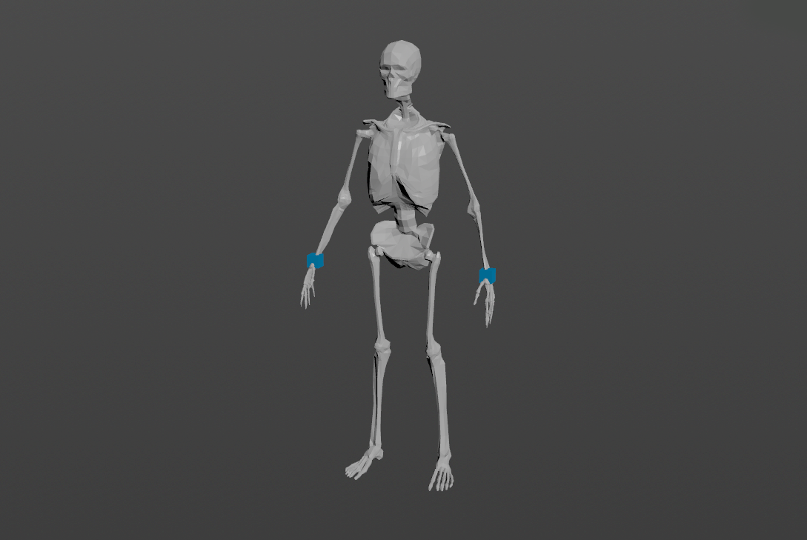
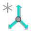
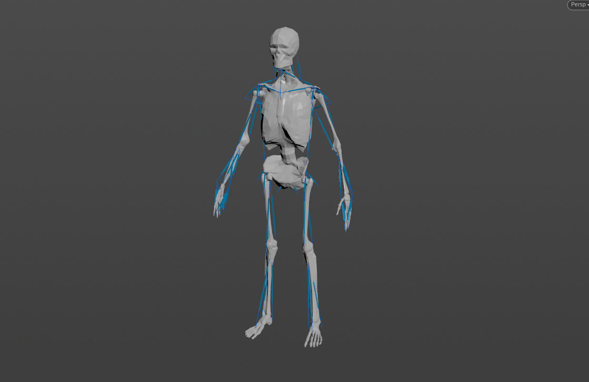
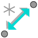
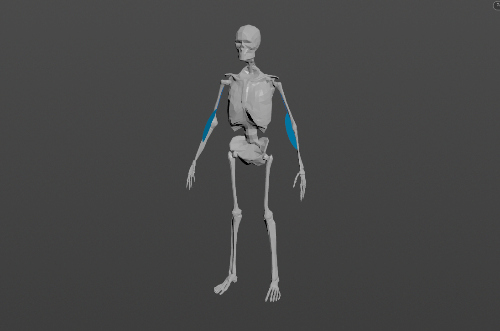

# Locators

AdonisFX Locators are visualizers that are meant for visualizing and measuring transform nodes which provide valuable input information for setting up the deformers. They can visualize information representing position, distance, or angle as well as velocities or accelerations represented via coloring when used in combination with Sensors.

## AdnLocatorPosition

AdnLocatorPosition is the locator for visualizing the position of a single transform node. When connected to its corresponding AdnSensorPosition, velocity or acceleration can be visualized with a color code blue-to-red.

### How To Use

An AdnLocatorPosition will only visualize the information of the transform node to which it is applied. To be able to read, process and visualize information like the velocity or acceleration an [AdnSensorPosition](sensors#adnsensorposition) has to be applied.

<figure markdown>
  
  <figcaption><b>Figure 1</b>: AdnLocatorPosition used in a human model.</figcaption>
</figure>

Only one transform will be required to create the AdnLocatorPosition. The creation process is the following:

 1. Go to the geometry context of the rig containing the rig setup to which the locators should be applied.
 2. Press TAB and navigate to the submenu AdonisFX > Locators to find the AdnLocatorPosition {style="width:4%"} SOP type.
 3. Create it and connect the AdnSensorPosition sensor to its input for visualization purposes.
 4. Go to the AdnLocatorPosition's *Input* tab and select the transform nodes from which to extract the transformation from (e.g. joints, null nodes, rivets, etc). Use the "Operator Chooser" in the locator's UI to select the correct target node containing transform information. Generally these input nodes will be located on the */obj* level as a null, joint or rivet.
 5. Adjust the Draw Output and Scale to visualize activations and scale the visualizer for the locator.
 6. The AdnLocatorPosition is created and ready to be used.

### Attributes

#### Input
| Name | Type | Default | Animatable | Description |
| :--- | :--- | :------ | :--------- | :---------- |
| **Position Matrix** | Matrix | Identity        | ✓ | Matrix containing the position in world space of the transform node. This entry is a operator path pointing to nodes that contain transform information to drive the locator. These nodes are generally exposed on the */obj* level. |

#### Activation Values
| Name | Type | Default | Animatable | Description |
| :--- | :--- | :------ | :--------- | :---------- |
| **Velocity**     | Float | 0.0 | ✓ | Magnitude of the velocity of the transform node. The expected detail attribute on the input of the locator node is `adnActivationVelocity` and can be visualized with the "velocity" draw output. |
| **Acceleration** | Float | 0.0 | ✓ | Magnitude of the acceleration of the transform node. The expected detail attribute on the input of the locator node is `adnActivationAcceleration` and can be visualized with the "acceleration" draw output. |

#### Draw
| Name | Type | Default | Animatable | Description |
| :--- | :--- | :------ | :--------- | :---------- |
| **Scale**       | Float      | 1.0      | ✓ | Sets the scaling factor applied to the position locator visualizer. Has a range of \[0.0, 10.0\]. The upper limit is soft, higher values can be used. |
| **Draw Output** | Enumerator | Velocity | ✓ | Selects the property of the locator to be visualized on the locator visualizer.<ul><li>**Velocity:** Color the visualizer of the locator according to the input velocity activation.</li><li>**Acceleration:** Color the visualizer of the locator according to the input acceleration activation.</li></ul> |

## AdnLocatorDistance

AdnLocatorDistance is the locator for visualizing the distance between two transform nodes. When connected to its corresponding AdnSensorDistance, distance, velocity or acceleration can be visualized with a color code blue-to-red.

### How To Use

An AdnLocatorDistance will only visualize the information of the distance between two transform nodes to which it is applied. To be able to read, process and visualize information like the distance magnitude, velocity or acceleration an [AdnSensorDistance](sensors#adnsensordistance) has to be applied.

<figure markdown>
  
  <figcaption><b>Figure 2</b>: AdnLocatorDistance used in a human model.</figcaption>
</figure>

Two transform nodes will be required to create an AdnLocatorDistance representing each extremity. The creation process is the following:

 1. Go to the geometry context of the rig containing the rig setup to which the locators should be applied.
 2. Press TAB and navigate to the submenu AdonisFX > Locators to find the AdnLocatorDistance {style="width:4%"} SOP type.
 3. Create it and connect the AdnSensorDistance sensor to its input for visualization purposes.
 4. Go to the AdnLocatorDistance's *Input* tab and select the transform nodes from which to extract the transformation from (e.g. joints, null nodes, rivets, etc). Use the "Operator Chooser" in the locator's UI to select the correct target node containing transform information. Generally these input nodes will be located on the */obj* level as a null, joint or rivet.
 5. Adjust the Draw Output and Scale to visualize activations and scale the visualizer for the locator.
 6. The AdnLocatorDistance is created and ready to be used.

### Attributes

#### Input
| Name | Type | Default | Animatable | Description |
| :--- | :--- | :------ | :--------- | :---------- |
| **Start Matrix**   | Matrix | Identity        | ✓ | Matrix containing the position in world space of the first transform node. This entry is a operator path pointing to nodes that contain transform information to drive the locator. These nodes are generally exposed on the */obj* level. |
| **End Matrix**     | Matrix | Identity        | ✓ | Matrix containing the position in world space of the second transform node. This entry is a operator path pointing to nodes that contain transform information to drive the locator. These nodes are generally exposed on the */obj* level. |

#### Activation Values
| Name | Type | Default | Animatable | Description |
| :--- | :--- | :------ | :--------- | :---------- |
| **Distance**     | Float | 0.0 | ✓ | Magnitude of the distance between the transform nodes. The expected detail attribute on the input of the locator node is `adnActivationDistance` and can be visualized with the "distance" draw output. |
| **Velocity**     | Float | 0.0 | ✓ | Magnitude of the velocity between the transform nodes. The expected detail attribute on the input of the locator node is `adnActivationVelocity` and can be visualized with the "velocity" draw output. |
| **Acceleration** | Float | 0.0 | ✓ | Magnitude of the acceleration between the transform nodes. The expected detail attribute on the input of the locator node is `adnActivationAcceleration` and can be visualized with the "acceleration" draw output. |

#### Draw
| Name | Type | Default | Animatable | Description |
| :--- | :--- | :------ | :--------- | :---------- |
| **Scale**       | Float      | 1.0      | ✓ | Sets the scaling factor applied to the distance locator visualizer. Has a range of \[0.0, 10.0\]. The upper limit is soft, higher values can be used. |
| **Draw Output** | Enumerator | Distance | ✓ | Selects the property of the locator to be visualized on the locator visualizer. <ul><li>**Distance:** Color the visualizer of the locator according to the input distance activation.</li><li>**Velocity:** Color the visualizer of the locator according to the input velocity activation.</li><li>**Acceleration:** Color the visualizer of the locator according to the input acceleration activation.</li></ul> |

## AdnLocatorRotation

AdnLocatorRotation is the locator for visualizing the angle between three transform nodes. When connected to its corresponding AdnSensorRotation, angle, angular velocity or angular acceleration can be visualized with a color code blue-to-red.

### How To Use

An AdnLocatorRotation will only visualize the information of the connections and angle between the three transform nodes. To be able to read, process and visualize information like the angle, angular velocity or angular acceleration an [AdnSensorRotation](sensors#adnsensorrotation) has to be applied.

<figure markdown>
  
  <figcaption><b>Figure 3</b>: AdnLocatorRotation locator used in a human model.</figcaption>
</figure>

Three transform nodes will be required to create the AdnLocatorRotation. The creation process is the following:

 1. Go to the geometry context of the rig containing the rig setup to which the locators should be applied.
 2. Press TAB and navigate to the submenu AdonisFX > Locators to find the AdnLocatorRotation {style="width:4%"} SOP type.
 3. Create it and connect the AdnSensorRotation sensor to its input for visualization purposes.
 4. Go to the AdnLocatorRotation's *Input* tab and select the transform nodes from which to extract the transformation from (e.g. joints, null nodes, rivets, etc). Use the "Operator Chooser" in the locator's UI to select the correct target node containing transform information. Generally these input nodes will be located on the */obj* level as a null, joint or rivet.
 5. Adjust the Draw Output and Scale to visualize activations and scale the visualizer for the locator.
 6. The AdnLocatorRotation is created and ready to be used.

### Attributes

#### Input
| Name | Type | Default | Animatable | Description |
| :--- | :--- | :------ | :--------- | :---------- |
| **Start Matrix**   | Matrix | Identity        | ✓ | Matrix containing the position in world space of the first transform node. This entry is a operator path pointing to nodes that contain transform information to drive the locator. These nodes are generally exposed on the */obj* level. |
| **Mid Matrix**     | Matrix | Identity        | ✓ | Matrix containing the position in world space of the second transform node. This entry is a operator path pointing to nodes that contain transform information to drive the locator. These nodes are generally exposed on the */obj* level. |
| **End Matrix**     | Matrix | Identity        | ✓ | Matrix containing the position in world space of the third transform node. This entry is a operator path pointing to nodes that contain transform information to drive the locator. These nodes are generally exposed on the */obj* level. |

#### Activation Values
| Name | Type | Default | Animatable | Description |
| :--- | :--- | :------ | :--------- | :---------- |
| **Angle**        | Float | 0.0 | ✓ | Magnitude of the angle between the three transform nodes. The expected detail attribute on the input of the locator node is `adnActivationAngle` and can be visualized with the "angle" draw output. |
| **Velocity**     | Float | 0.0 | ✓ | Magnitude of the angular velocity between the three transform nodes. The expected detail attribute on the input of the locator node is `adnActivationVelocity` and can be visualized with the "velocity" draw output. |
| **Acceleration** | Float | 0.0 | ✓ | Magnitude of the angular acceleration between the three transform nodes. The expected detail attribute on the input of the locator node is `adnActivationAcceleration` and can be visualized with the "acceleration" draw output. |

#### Draw
| Name | Type | Default | Animatable | Description |
| :--- | :--- | :------ | :--------- | :---------- |
| **Scale**       | Float      | 1.0   | ✓ | Sets the scaling factor applied to the rotation locator visualizer. Has a range of \[0.0, 10.0\]. The upper limit is soft, higher values can be used. |
| **Draw Output** | Enumerator | Angle | ✓ | Selects the property of the locator to be visualized on the locator visualizer.<ul><li>**Angle:** Color the visualizer of the locator according to the input angle activation.</li><li>**Velocity:** Color the visualizer of the locator according to the input velocity activation.</li><li>**Acceleration:** Color the visualizer of the locator according to the input acceleration activation.</li></ul> |
