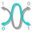
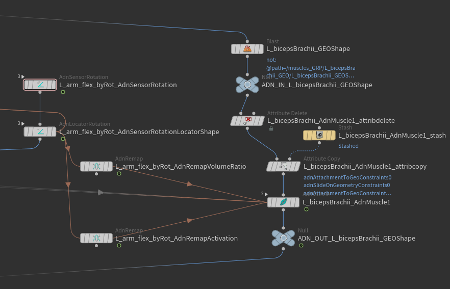
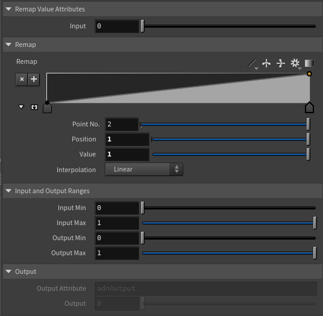

# AdnRemap

The AdnRemap node is an AdonisFX node that aims to provide remap functionalities similarly to the remap values exposed in our sensors. This node type is typically used in an AdonisFX rig, for example, to remap the output of a sensor into a value to drive muscle activation or volume ratio gain. The objective of using AdnRemap nodes is to enhance the portability of the whole AdonisFX rig without relying on DCC specific nodes, including not only the input and output connections but also the configuration of the remap ramp attribute.

## How To Use

An instance of this node can be created from the TAB menu:

1. Go to the geometry context of the rig containing the rig setup to which the locators should be applied.
2. Press TAB and navigate to the submenu AdonisFX > Utils to find the AdnRemap {style="width:4%"} SOP type.
3. Use detail expressions to drive the input value and to ingest the data into the desired target node. 

Typically, this node will be used to remap the raw output values of AdonisFX sensors (i.e. distance, angle, velocity and acceleration) so that they are ingested into the AdonisFX locators within the desired normalized ranges. The remapped output can also be ingested directly in an AdnMuscle deformer to modulate, for example, the activation or the volume ratio.

> [!NOTE]
> - When remapping values from an AdonisFX sensor it is advisable to remap the value output from the locator rather than the sensor to preserve consistent connection information with other DCC's.

## Example

<figure markdown>
  
  <figcaption><b>Figure 1</b>: Use case in which different AdnRemap nodes are used to configure an AdnMuscle to drive the muscle's activation and volume gain.</figcaption>
</figure>

In the above setup we have the following characteristics:

1. One AdnSensorRotation.
2. One AdnLocatorRotation to visualize the remapped activation values in the viewport.
3. One AdnRemap node to drive the muscle's activation (this can also be directly achieved by tweaking the remap values in the sensor node).
4. Another AdnRemap node to remap the output activation from the range (0 - 1) into (1 - 1.2) to modulate the muscle's volume gain.
5. One AdnMuscle solver.

> [!NOTE]
> - When an AdnRemap is used in-between a sensor and a locator node, use an "Attribute Rename" node to map the remap value to the expected detail attribute name (e.g. adnOutput > adnActivationDistance).

## Attributes

### Input
| Name | Type | Default | Animatable | Description |
| :--- | :--- | :------ | :--------- | :---------- |
| **Input**        | Float | 0.0 | ✓ | Input scalar value to remap. This value should be driven via detail expression to mimic the input connection value. For example to connect the angle activation for remapping the expression `detail("/obj/s/AdnSensorRotation", "adnActivationAngle", 0)` can be used. |

#### Remap

| Name | Type | Default | Animatable | Description |
| :--- | :--- | :------ | :--------- | :---------- |
| **Selected Position**   | Float      | 0.0    | ✓ | X-axis value of the ramp attribute. |
| **Selected Value**      | Float      | 0.0    | ✓ | Y-axis value of the ramp attribute. |
| **Interpolation**       | Enumerator | Linear | ✓ | Interpolation method to be used between every two consecutive points in the ramp. There are seven options: Constant, Linear, Catmull-Rom, Monotone Cubic, Bezier, B-Spline and Hermite. |

#### Input and Output Ranges

| Name | Type | Default | Animatable | Description |
| :--- | :--- | :------ | :--------- | :---------- |
| **Input Min**  | Float      | 0.0    | ✓ | Lower limit of the range used to normalize the input value before evaluating it on the ramp attribute. |
| **Input Max**  | Float      | 1.0    | ✓ | Upper limit of the range used to normalize the input value before evaluating it on the ramp attribute. |
| **Output Min** | Float      | 0.0    | ✓ | Lower limit of the range used to map the value returned by the ramp attribute and calculate the output. |
| **Output Max** | Float      | 1.0    | ✓ | Upper limit of the range used to map the value returned by the ramp attribute and calculate the output. |

### Output

| Name | Type | Default | Animatable | Description |
| :--- | :--- | :------ | :--------- | :---------- |
| **Output Attribute** | float | 0.0 | ✗ | Specifies the name of the detail attribute that is used for exporting the remapped value. The expected attribute name is `adnOutput`. |
| **Output** | Float | 0.0 | ✗ | Output remapped value. |

## Parameter Template

<figure style="width:75%;" markdown>
  
  <figcaption><b>Figure 2</b>: AdnRemap Attribute Editor.</figcaption>
</figure>
