# Sensors

AdonisFX Sensors are nodes in charge of interpreting data extracted from transform nodes and compute information that can be fed into the deformers to alter their behavior. Sensors work in combination with [Locators](locators) to display the computed information in an intuitive way using coloring. The sensors produce the results in two separated outputs: the raw value result of the evaluation of the input transform nodes (e.g. *Out Angle*); and the remapped value result of the evaluation of the raw value into the existing remap ramp attributes (e.g. *Out Angle Remap*). Thanks to this, the remapped values are already adjusted within a custom range of activation that will drive the coloring of the locators and the activation of an AdnMuscle for example.

## AdnSensorPosition

AdnSensorPosition is the sensor for computing meaningful output raw values representing the velocity or acceleration of a transform node. Additionally, the sensor remaps the values of velocity and acceleration to produce desirable activation values within a certain range to drive the simulation of an AdonisFX deformer. This sensor has to work in combination with an AdnLocatorPosition both for setup and visualization. An example use case for this sensor would be applying it to the wrist connection of an arm outputting velocities while swinging.

### How To Use

An AdnSensorPosition will be in charge of computing, remapping and feeding activation (or other) values into the AdnLocatorPosition for visualization purposes, which in turn feeds the AdonisFX deformers to drive the simulation. The value of the sensor can be used, for example, to drive the activation of a muscle simulating contraction to increase its stiffness.

<figure markdown>
  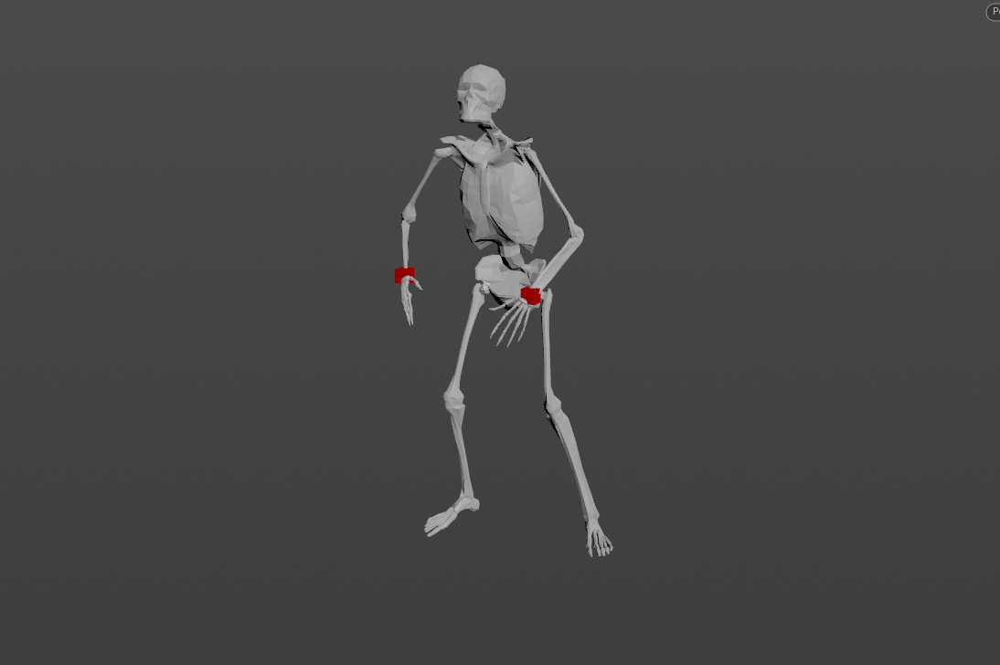
  <figcaption><b>Figure 1</b>: AdnSensorPosition used in a human model.</figcaption>
</figure>

Only one transform will be required to create the AdnSensorPosition. To create an AdnSensorPosition and connect it to an existing [AdnLocatorPosition](locators#adnlocatorposition):

  1. Go to the geometry context of the rig containing the rig setup to which the sensors should be applied.
  2. Press TAB and navigate to the submenu AdonisFX > Sensors to find the AdnSensorPosition 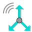{style="width:4%"} SOP type.
  3. Create it and connect the output of the AdnSensorPosition sensor to its corresponding AdnLocatorPosition input.
  4. Go to the AdnSensorPosition's *Input* tab and select the transform nodes from which to extract the transformation from (e.g. joints, null nodes, rivets, etc). Use the "Operator Chooser" in the locator's UI to select the correct target node containing transform information. Generally these input nodes will be located on the */obj* level as a null, joint or rivet.
  5. The AdnSensorPosition is created and ready to be used with its corresponding AdnLocatorPosition.

<figure markdown>
  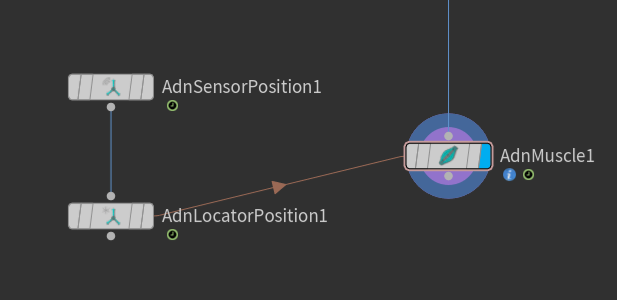
  <figcaption><b>Figure 2</b>: AdnSensorPosition and AdnLocatorPosition in the node graph. The connection is created via detail expression to the AdnMuscle node.</figcaption>
</figure>

> [!NOTE]
> - Activation values are output from the sensor nodes via detail attributes (`adnActivationVelocity` and `adnActivationAcceleration`). It is to note that these attribute names are expected by the locator nodes and their name should not be altered.
> - When connecting the sensors to a muscle or an activation node for example it is advisable to first connect the sensor to its corresponding locator and use the locator node as reference for creating the detail expression connection.
> - To create a connection to the muscle use a detail expression on the muscle's parameter (for example the activation parameter) in the form of: `detail("/obj/geo1/AdnLocatorPosition1", "adnActivationVelocity", 0)` pointing directly to the locator that is connected to the sensor. This will allow for the muscle nodes to pick up the detail activation attribute from the sensor connection.

### Attributes

#### Input
| Name | Type | Default | Animatable | Description |
| :--- | :--- | :------ | :--------- | :---------- |
| **Position Matrix** | Matrix | Identity        | ✓ | Matrix containing the position in world space of the transform node. This entry is an operator path pointing to nodes that contain transform information to drive the locator. These nodes are generally exposed on the */obj* level. |

#### Time Attributes
| Name | Type | Default | Animatable | Description |
| :--- | :--- | :------ | :--------- | :---------- |
| **Start Time**   | Time | *Current frame* | ✗ | Determines the frame at which the playback/simulation starts. |

#### Scale Attributes
| Name | Type | Default | Animatable | Description |
| :--- | :--- | :------ | :--------- | :---------- |
| **Time Scale**  | Float | 1.0 | ✓ | Sets the scaling factor applied to the compute the velocity or acceleration. Has a range of \[0.001, 10.0\]. The upper limit is soft, higher values can be used. |
| **Space Scale** | Float | 1.0 | ✓ | Sets the scaling factor applied to velocity or acceleration. Has a range of \[0.001, 100.0\]. The upper limit is soft, higher values can be used. |

#### Velocity Remap Settings

| Name | Type | Default | Animatable | Description |
| :--- | :--- | :------ | :--------- | :---------- |
| **Velocity Activation Attribute**   | float     | 0.0   | ✗ | Specifies the name of the detail attribute that is used for exporting the remapped activation value. The expected attribute name is `adnActivationVelocity`. |
| **Input Min Velocity**  | Float      | 0.0    | ✓ | Lower limit of the range used to map the *Out Velocity* value before evaluating it on the ramp attribute. |
| **Input Max Velocity**  | Float      | 10.0   | ✓ | Upper limit of the range used to map the *Out Velocity* value before evaluating it on the ramp attribute. |
| **Output Min Velocity** | Float      | 0.0    | ✓ | Lower limit of the range used to map the value returned by the ramp attribute and calculate the final remapped velocity. |
| **Output Max Velocity** | Float      | 1.0    | ✓ | Upper limit of the range used to map the value returned by the ramp attribute and calculate the final remapped velocity. |
| **Selected Position**   | Float      | 0.0    | ✓ | X-axis value of the ramp attribute. |
| **Selected Value**      | Float      | 0.0    | ✓ | Y-axis value of the ramp attribute. |
| **Interpolation**       | Enumerator | Linear | ✓ | Interpolation method to be used between every two consecutive points in the ramp. There are seven options: Constant, Linear, Catmull-Rom, Monotone Cubic, Bezier, B-Spline, Hermite |

#### Acceleration Remap Settings

| Name | Type | Default | Animatable | Description |
| :--- | :--- | :------ | :--------- | :---------- |
| **Acceleration Activation Attribute**   | float     | 0.0   | ✗ | Specifies the name of the detail attribute that is used for exporting the remapped activation value. The expected attribute name is `adnActivationAcceleration`. |
| **Selected Position**       | Float      | 0.0    | ✓ | X-axis value of the ramp attribute. |
| **Selected Value**          | Float      | 0.0    | ✓ | Y-axis value of the ramp attribute. |
| **Interpolation**           | Enumerator | Linear | ✓ | Interpolation method to be used between every two consecutive points in the ramp. There are seven options: Constant, Linear, Catmull-Rom, Monotone Cubic, Bezier, B-Spline, Hermite |
| **Input Min Acceleration**  | Float      | -10.0  | ✓ | Lower limit of the range used to map the *Out Acceleration* value before evaluating it on the ramp attribute. |
| **Input Max Acceleration**  | Float      | 10.0   | ✓ | Upper limit of the range used to map the *Out Acceleration* value before evaluating it on the ramp attribute. |
| **Output Min Acceleration** | Float      | 0.0    | ✓ | Lower limit of the range used to map the value returned by the ramp attribute and calculate the final remapped acceleration. |
| **Output Max Acceleration** | Float      | 1.0    | ✓ | Upper limit of the range used to map the value returned by the ramp attribute and calculate the final remapped acceleration. |

#### Output
| Name | Type | Default | Animatable | Description |
| :--- | :--- | :------ | :--------- | :---------- |
| **Out Velocity**     | Float | 0.0 | ✗ | Magnitude of the velocity of the transform node. It is the raw value calculated before the remapping. |
| **Out Acceleration** | Float | 0.0 | ✗ | Magnitude of the acceleration of the transform node. It is the raw value calculated before the remapping. |

#### Remapped Output
| Name | Type | Default | Animatable | Description |
| :--- | :--- | :------ | :--------- | :---------- |
| **Out Velocity Remap**     | Float | 0.0 | ✗ | Output remapped velocity. It is the result of remapping the *Out Velocity*. The detail attribute containing this activation information is `adnActivationVelocity`. |
| **Out Acceleration Remap** | Float | 0.0 | ✗ | Output remapped acceleration. It is the result of remapping the *Out Acceleration*. The detail attribute containing this activation information is `adnActivationAcceleration`. |

### Parameter Template

<figure style="width: 75%;" markdown>
  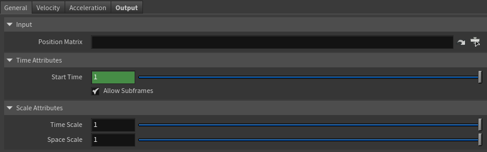 
  <figcaption><b>Figure 3</b>: AdnSensorPosition Parameter Template: General.</figcaption>
</figure>

<figure style="width: 75%;" markdown>
  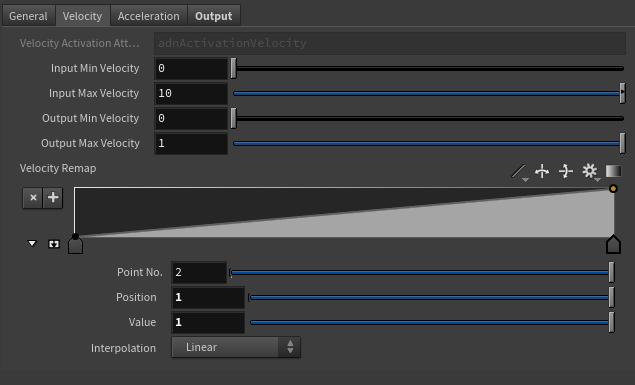 
  <figcaption><b>Figure 4</b>: AdnSensorPosition Parameter Template: Velocity.</figcaption>
</figure>

<figure style="width: 75%;" markdown>
  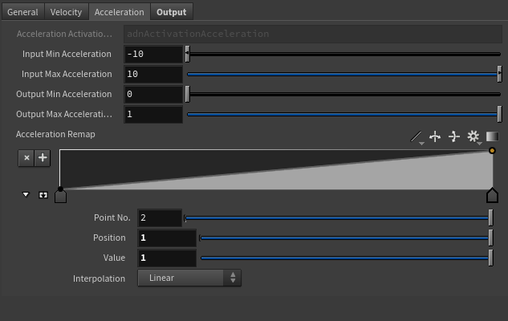 
  <figcaption><b>Figure 5</b>: AdnSensorPosition Parameter Template: Acceleration.</figcaption>
</figure>

<figure style="width: 75%;" markdown>
  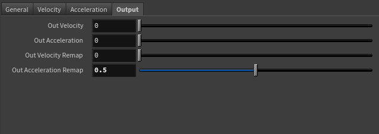 
  <figcaption><b>Figure 6</b>: AdnSensorPosition Parameter Template: Output.</figcaption>
</figure>

## AdnSensorDistance

AdnSensorDistance is the sensor for computing meaningful output raw values representing the distance, velocity or acceleration between two transform nodes. Additionally, the sensor remaps the values of distance, velocity and acceleration to produce desirable activation values within a certain range to drive the simulation of an AdonisFX deformer. This sensor has to work in combination with an AdnLocatorDistance both for setup and visualization. An example use case for this sensor would be applying it to the connection made between bones which would compute the distance between two bones moving together.

### How To Use

An AdnSensorDistance will be in charge of computing, remapping and feeding activation (or other) values into the AdnLocatorDistance for visualization purposes, which in turn feeds the AdonisFX deformers to drive the simulation. The value of the sensor can be used, for example, to drive the activation of a muscle simulating contraction to increase its stiffness.

<figure markdown>
  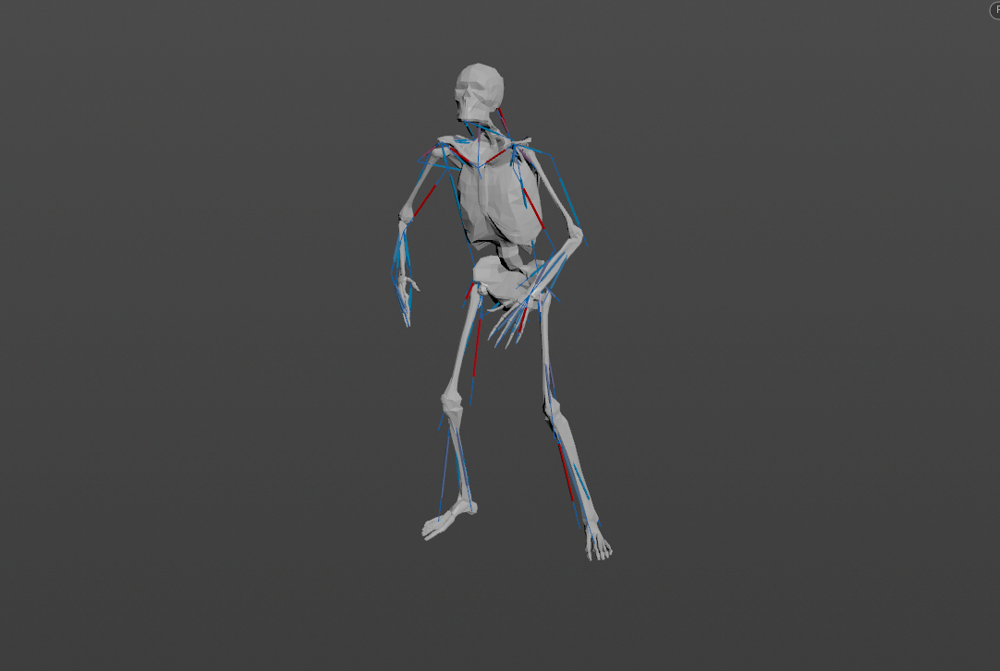
  <figcaption><b>Figure 7</b>: AdnSensorDistance used in a human model.</figcaption>
</figure>

Two transforms will be required to create the AdnSensorDistance. To create an AdnSensorDistance and connect it to an existing [AdnLocatorDistance](locators#adnlocatordistance):

  1. Go to the geometry context of the rig containing the rig setup to which the sensors should be applied.
  2. Press TAB and navigate to the submenu AdonisFX > Sensors to find the AdnSensorDistance 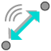{style="width:4%"} SOP type.
  3. Create it and connect the output of the AdnSensorDistance sensor to its corresponding AdnLocatorDistance input.
  4. Go to the AdnSensorDistance's *Input* tab and select the transform nodes from which to extract the transformation from (e.g. joints, null nodes, rivets, etc). Use the "Operator Chooser" in the locator's UI to select the correct target node containing transform information. Generally these input nodes will be located on the */obj* level as a null, joint or rivet.
  5. The AdnSensorDistance is created and ready to be used with its corresponding AdnLocatorDistance.

<figure markdown>
  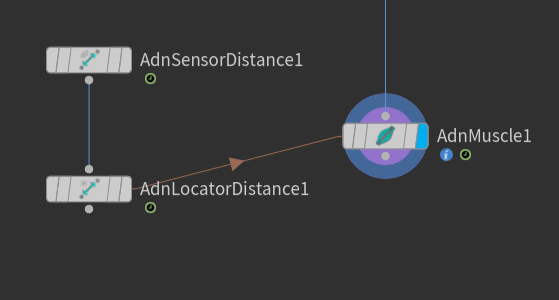
  <figcaption><b>Figure 8</b>: AdnSensorDistance and AdnLocatorDistance in the node graph. The connection is created via detail expression to the AdnMuscle node.</figcaption>
</figure>

> [!NOTE]
> - Activation values are output from the sensor nodes via detail attributes (`adnActivationDistance`, `adnActivationVelocity` and `adnActivationAcceleration`). It is to note that these attribute names are expected by the locator nodes and their name should not be altered.
> - When connecting the sensors to a muscle or an activation node for example it is advisable to first connect the sensor to its corresponding locator and use the locator node as reference for creating the detail expression connection.
> - To create a connection to the muscle use a detail expression on the muscle's parameter (for example the activation parameter) in the form of: `detail("/obj/geo1/AdnLocatorDistance1", "adnActivationDistance", 0)` pointing directly to the locator that is connected to the sensor. This will allow for the muscle nodes to pick up the detail activation attribute from the sensor connection.

### Attributes

#### Input
| Name | Type | Default | Animatable | Description |
| :--- | :--- | :------ | :--------- | :---------- |
| **Start Matrix**   | Matrix | Identity        | ✓ | Matrix containing the position in world space of the first transform node. This entry is an operator path pointing to nodes that contain transform information to drive the locator. These nodes are generally exposed on the */obj* level. |
| **End Matrix**     | Matrix | Identity        | ✓ | Matrix containing the position in world space of the second transform node. This entry is an operator path pointing to nodes that contain transform information to drive the locator. These nodes are generally exposed on the */obj* level. |

#### Time Attributes
| Name | Type | Default | Animatable | Description |
| :--- | :--- | :------ | :--------- | :---------- |
| **Start Time**   | Time | *Current frame* | ✗ | Determines the frame at which the playback/simulation starts. |

#### Scale Attributes
| Name | Type | Default | Animatable | Description |
| :--- | :--- | :------ | :--------- | :---------- |
| **Time Scale**  | Float | 1.0 | ✓ | Sets the scaling factor applied to the compute the velocity or acceleration. Has a range of \[0.001, 10.0\]. The upper limit is soft, higher values can be used. |
| **Space Scale** | Float | 1.0 | ✓ | Sets the scaling factor applied to velocity or acceleration. Has a range of \[0.001, 100.0\]. The upper limit is soft, higher values can be used. |

#### Distance Remap Settings

| Name | Type | Default | Animatable | Description |
| :--- | :--- | :------ | :--------- | :---------- |
| **Distance Activation Attribute**   | float     | 0.0   | ✗ | Specifies the name of the detail attribute that is used for exporting the remapped activation value. The expected attribute name is `adnActivationDistance`. |
| **Input Min Distance**  | Float      | 0.0    | ✓ | Lower limit of the range used to map the Distance value before evaluating it on the ramp attribute. |
| **Input Max Distance**  | Float      | 0.0    | ✓ | Upper limit of the range used to map the Distance value before evaluating it on the ramp attribute. |
| **Output Min Distance** | Float      | 0.0    | ✓ | Lower limit of the range used to map the value returned by the ramp attribute and calculate the final remapped Distance. |
| **Output Max Distance** | Float      | 1.0    | ✓ | Upper limit of the range used to map the value returned by the ramp attribute and calculate the final remapped Distance. |
| **Selected Position**   | Float      | 0.0    | ✓ | X-axis value of the ramp attribute. |
| **Selected Value**      | Float      | 0.0    | ✓ | Y-axis value of the ramp attribute. |
| **Interpolation**       | Enumerator | Linear | ✓ | Interpolation method to be used between every two consecutive points in the ramp. There are seven options: Constant, Linear, Catmull-Rom, Monotone Cubic, Bezier, B-Spline, Hermite |

#### Velocity Remap Settings

| Name | Type | Default | Animatable | Description |
| :--- | :--- | :------ | :--------- | :---------- |
| **Velocity Activation Attribute**   | float     | 0.0   | ✗ | Specifies the name of the detail attribute that is used for exporting the remapped activation value. The expected attribute name is `adnActivationVelocity`. |
| **Selected Position**   | Float      | 0.0    | ✓ | X-axis value of the ramp attribute. |
| **Selected Value**      | Float      | 0.0    | ✓ | Y-axis value of the ramp attribute. |
| **Interpolation**       | Enumerator | Linear | ✓ | Interpolation method to be used between every two consecutive points in the ramp. There are seven options: Constant, Linear, Catmull-Rom, Monotone Cubic, Bezier, B-Spline, Hermite |
| **Input Min Velocity**  | Float      | -10.0  | ✓ | Lower limit of the range used to map the *Out Velocity* value before evaluating it on the ramp attribute. |
| **Input Max Velocity**  | Float      | 10.0   | ✓ | Upper limit of the range used to map the *Out Velocity* value before evaluating it on the ramp attribute. |
| **Output Min Velocity** | Float      | 0.0    | ✓ | Lower limit of the range used to map the value returned by the ramp attribute and calculate the final remapped velocity. |
| **Output Max Velocity** | Float      | 1.0    | ✓ | Upper limit of the range used to map the value returned by the ramp attribute and calculate the final remapped velocity. |

#### Acceleration Remap Settings

| Name | Type | Default | Animatable | Description |
| :--- | :--- | :------ | :--------- | :---------- |
| **Acceleration Activation Attribute**   | float     | 0.0   | ✗ | Specifies the name of the detail attribute that is used for exporting the remapped activation value. The expected attribute name is `adnActivationAcceleration`. |
| **Input Min Acceleration**  | Float      | -10.0  | ✓ | Lower limit of the range used to map the *Out Acceleration* value before evaluating it on the ramp attribute. |
| **Input Max Acceleration**  | Float      | 10.0   | ✓ | Upper limit of the range used to map the *Out Acceleration* value before evaluating it on the ramp attribute. |
| **Output Min Acceleration** | Float      | 0.0    | ✓ | Lower limit of the range used to map the value returned by the ramp attribute and calculate the final remapped acceleration. |
| **Output Max Acceleration** | Float      | 1.0    | ✓ | Upper limit of the range used to map the value returned by the ramp attribute and calculate the final remapped acceleration. |
| **Selected Position**       | Float      | 0.0    | ✓ | X-axis value of the ramp attribute. |
| **Selected Value**          | Float      | 0.0    | ✓ | Y-axis value of the ramp attribute. |
| **Interpolation**           | Enumerator | Linear | ✓ | Interpolation method to be used between every two consecutive points in the ramp. There are seven options: Constant, Linear, Catmull-Rom, Monotone Cubic, Bezier, B-Spline, Hermite |

#### Output
| Name | Type | Default | Animatable | Description |
| :--- | :--- | :------ | :--------- | :---------- |
| **Out Distance**     | Float | 0.0 | ✗ | Magnitude of the distance between the transform nodes. |
| **Out Velocity**     | Float | 0.0 | ✗ | Magnitude of the velocity between the transform nodes. |
| **Out Acceleration** | Float | 0.0 | ✗ | Magnitude of the acceleration between the transform nodes. |

#### Remapped Output
| Name | Type | Default | Animatable | Description |
| :--- | :--- | :------ | :--------- | :---------- |
| **Out Distance Remap**     | Float | 0.0 | ✗ | Output remapped distance. It is the result of remapping the *Out Distance*. It is the raw value calculated before the remapping. The detail attribute containing this activation information is `adnActivationDistance`. |
| **Out Velocity Remap**     | Float | 0.0 | ✗ | Output remapped velocity. It is the result of remapping the *Out Velocity*. It is the raw value calculated before the remapping. The detail attribute containing this activation information is `adnActivationVelocity`. |
| **Out Acceleration Remap** | Float | 0.0 | ✗ | Output remapped acceleration. It is the result of remapping the *Out Acceleration*. It is the raw value calculated before the remapping. The detail attribute containing this activation information is `adnActivationAcceleration`. |

### Parameter Template

<figure style="width: 75%;" markdown>
  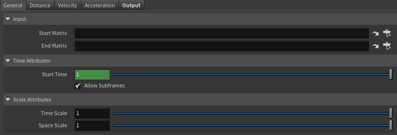 
  <figcaption><b>Figure 9</b>: AdnSensorDistance Parameter Template: General.</figcaption>
</figure>

<figure style="width: 75%;" markdown>
  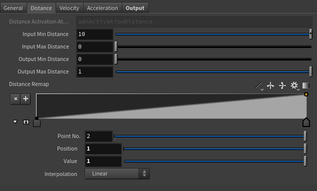 
  <figcaption><b>Figure 10</b>: AdnSensorDistance Parameter Template: Distance.</figcaption>
</figure>

<figure style="width: 75%;" markdown>
  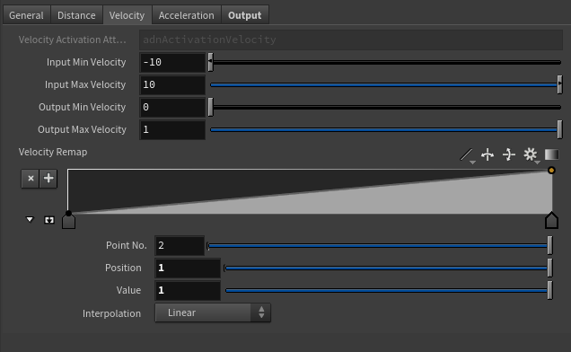 
  <figcaption><b>Figure 11</b>: AdnSensorDistance Parameter Template: Velocity.</figcaption>
</figure>

<figure style="width: 75%;" markdown>
  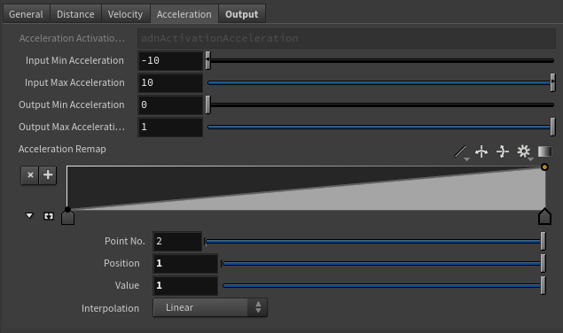 
  <figcaption><b>Figure 12</b>: AdnSensorDistance Parameter Template: Acceleration.</figcaption>
</figure>

<figure style="width: 75%;" markdown>
  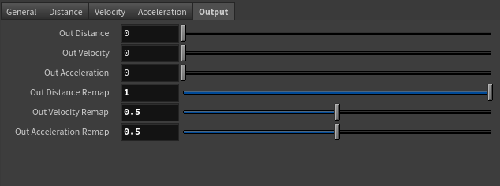 
  <figcaption><b>Figure 13</b>: AdnSensorDistance Parameter Template: Output.</figcaption>
</figure>

## AdnSensorRotation

AdnSensorRotation is the sensor for computing meaningful output raw values representing the angle, angular velocity or angular acceleration between three transform nodes. Additionally, the sensor remaps the values of angle, velocity and acceleration to produce desirable activation values within a certain range to drive the simulation of an AdonisFX deformer. This sensor has to work in combination with an AdnLocatorRotation both for setup and visualization. An example use case for this sensor would be applying it to the arc connection made between bones which would compute the angle between two bones rotating.

### How To Use

An AdnSensorRotation will be in charge of computing, remapping and feeding activation (or other) values into the AdnLocatorRotation for visualization purposes, which in turn feeds the AdonisFX deformers to drive the simulation. The value of the sensor can be used, for example, to drive the activation of a muscle simulating contraction to increase its stiffness.

<figure markdown>
  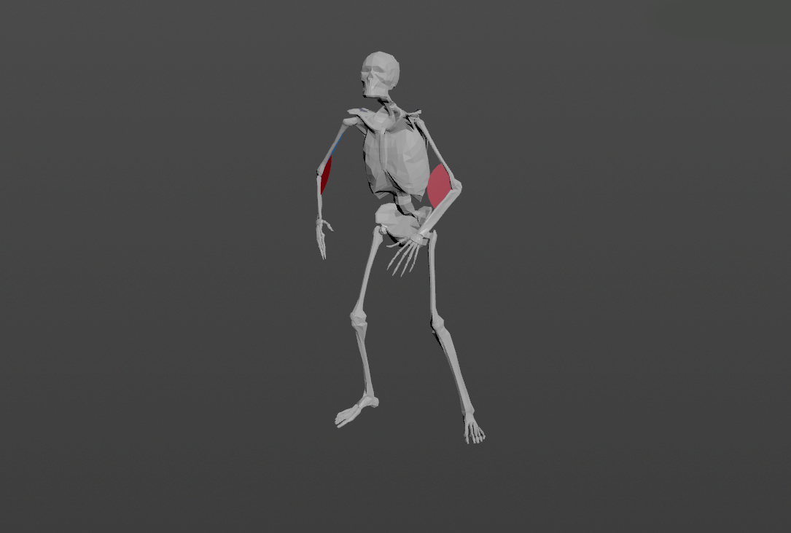
  <figcaption><b>Figure 14</b>: AdnSensorRotation used in a human model.</figcaption>
</figure>

Three transforms will be required to create the AdnSensorRotation. To create an AdnSensorRotation and connect it to an existing [AdnLocatorRotation](locators#adnlocatorrotation):

  1. Go to the geometry context of the rig containing the rig setup to which the sensors should be applied.
  2. Press TAB and navigate to the submenu AdonisFX > Sensors to find the AdnSensorRotation {style="width:4%"} SOP type.
  3. Create it and connect the output of the AdnSensorRotation sensor to its corresponding AdnLocatorRotation input.
  4. Go to the AdnSensorRotation's *Input* tab and select the transform nodes from which to extract the transformation from (e.g. joints, null nodes, rivets, etc). Use the "Operator Chooser" in the locator's UI to select the correct target node containing transform information. Generally these input nodes will be located on the */obj* level as a null, joint or rivet.
  5. The AdnSensorRotation is created and ready to be used with its corresponding AdnLocatorRotation.

<figure markdown>
  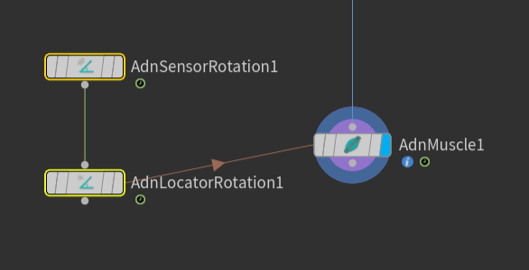
  <figcaption><b>Figure 15</b>: AdnSensorRotation and AdnLocatorRotation in the node graph. The connection is created via detail expression to the AdnMuscle node.</figcaption>
</figure>

> [!NOTE]
> - Activation values are output from the sensor nodes via detail attributes (`adnActivationRotation`, `adnActivationVelocity` and `adnActivationAcceleration`). It is to note that these attribute names are expected by the locator nodes and their name should not be altered.
> - When connecting the sensors to a muscle or an activation node for example it is advisable to first connect the sensor to its corresponding locator and use the locator node as reference for creating the detail expression connection.
> - To create a connection to the muscle use a detail expression on the muscle's parameter (for example the activation parameter) in the form of: `detail("/obj/geo1/AdnLocatorRotation1", "adnActivationRotation", 0)` pointing directly to the locator that is connected to the sensor. This will allow for the muscle nodes to pick up the detail activation attribute from the sensor connection.

### Attributes

#### Input
| Name | Type | Default | Animatable | Description |
| :--- | :--- | :------ | :--------- | :---------- |
| **Start Matrix**   | Matrix | Identity        | ✓ | Matrix containing the position in world space of the first transform node. This entry is an operator path pointing to nodes that contain transform information to drive the locator. These nodes are generally exposed on the */obj* level. |
| **Mid Matrix**     | Matrix | Identity        | ✓ | Matrix containing the position in world space of the second transform node. This entry is an operator path pointing to nodes that contain transform information to drive the locator. These nodes are generally exposed on the */obj* level. |
| **End Matrix**     | Matrix | Identity        | ✓ | Matrix containing the position in world space of the third transform node. This entry is an operator path pointing to nodes that contain transform information to drive the locator. These nodes are generally exposed on the */obj* level. |

#### Time Attributes
| Name | Type | Default | Animatable | Description |
| :--- | :--- | :------ | :--------- | :---------- |
| **Start Time**   | Time | *Current frame* | ✗ | Determines the frame at which the playback/simulation starts. |

#### Scale Attributes
| Name | Type | Default | Animatable | Description |
| :--- | :--- | :------ | :--------- | :---------- |
| **Time Scale** | Float | 1.0 | ✓ | Sets the scaling factor applied to the compute the velocity or acceleration. Has a range of \[0.001, 10.0\]. The upper limit is soft, higher values can be used. |

#### Angle Remap Settings

| Name | Type | Default | Animatable | Description |
| :--- | :--- | :------ | :--------- | :---------- |
| **Angle Activation Attribute**   | float     | 0.0   | ✗ | Specifies the name of the detail attribute that is used for exporting the remapped activation value. The expected attribute name is `adnActivationAngle`. |
| **Selected Position** | Float      | 0.0    | ✓ | X-axis value of the ramp attribute. |
| **Selected Value**    | Float      | 0.0    | ✓ | Y-axis value of the ramp attribute. |
| **Interpolation**     | Enumerator | Linear | ✓ | Interpolation method to be used between every two consecutive points in the ramp. There are seven options: Constant, Linear, Catmull-Rom, Monotone Cubic, Bezier, B-Spline, Hermite |
| **Input Min Angle**   | Float      | 3.14   | ✓ | Lower limit of the range used to map the *Out Angle* value before evaluating it on the ramp attribute. |
| **Input Max Angle**   | Float      | 0.0    | ✓ | Upper limit of the range used to map the *Out Angle* value before evaluating it on the ramp attribute. |
| **Output Min Angle**  | Float      | 0.0    | ✓ | Lower limit of the range used to map the value returned by the ramp attribute and calculate the final remapped angle. |
| **Output Max Angle**  | Float      | 1.0    | ✓ | Upper limit of the range used to map the value returned by the ramp attribute and calculate the final remapped angle. |

#### Velocity Remap Settings

| Name | Type | Default | Animatable | Description |
| :--- | :--- | :------ | :--------- | :---------- |
| **Velocity Activation Attribute**   | float     | 0.0   | ✗ | Specifies the name of the detail attribute that is used for exporting the remapped activation value. The expected attribute name is `adnActivationVelocity`. |
| **Selected Position**   | Float      | 0.0    | ✓ | X-axis value of the ramp attribute. |
| **Selected Value**      | Float      | 0.0    | ✓ | Y-axis value of the ramp attribute. |
| **Interpolation**       | Enumerator | Linear | ✓ | Interpolation method to be used between every two consecutive points in the ramp. There are seven options: Constant, Linear, Catmull-Rom, Monotone Cubic, Bezier, B-Spline, Hermite |
| **Input Min Velocity**  | Float      | 10.0   | ✓ | Lower limit of the range used to map the *Out Velocity* value before evaluating it on the ramp attribute. |
| **Input Max Velocity**  | Float      | -10.0  | ✓ | Upper limit of the range used to map the *Out Velocity* value before evaluating it on the ramp attribute. |
| **Output Min Velocity** | Float      | 0.0    | ✓ | Lower limit of the range used to map the value returned by the ramp attribute and calculate the final remapped velocity. |
| **Output Max Velocity** | Float      | 1.0    | ✓ | Upper limit of the range used to map the value returned by the ramp attribute and calculate the final remapped velocity. |

#### Acceleration Remap Settings

| Name | Type | Default | Animatable | Description |
| :--- | :--- | :------ | :--------- | :---------- |
| **Acceleration Activation Attribute**   | float     | 0.0   | ✗ | Specifies the name of the detail attribute that is used for exporting the remapped activation value. The expected attribute name is `adnActivationAcceleration`. |
| **Selected Position**       | Float      | 0.0    | ✓ | X-axis value of the ramp attribute. |
| **Selected Value**          | Float      | 0.0    | ✓ | Y-axis value of the ramp attribute. |
| **Interpolation**           | Enumerator | Linear | ✓ | Interpolation method to be used between every two consecutive points in the ramp. There are seven options: Constant, Linear, Catmull-Rom, Monotone Cubic, Bezier, B-Spline, Hermite |
| **Input Min Acceleration**  | Float      | 10.0   | ✓ | Lower limit of the range used to map the *Out Acceleration* value before evaluating it on the ramp attribute. |
| **Input Max Acceleration**  | Float      | -10.0  | ✓ | Upper limit of the range used to map the *Out Acceleration* value before evaluating it on the ramp attribute. |
| **Output Min Acceleration** | Float      | 0.0    | ✓ | Lower limit of the range used to map the value returned by the ramp attribute and calculate the final remapped acceleration. |
| **Output Max Acceleration** | Float      | 1.0    | ✓ | Upper limit of the range used to map the value returned by the ramp attribute and calculate the final remapped acceleration. |

#### Output
| Name | Type | Default | Animatable | Description |
| :--- | :--- | :------ | :--------- | :---------- |
| **Out Angle**        | Float | 0.0 | ✗ | Magnitude of the angle between the three transform nodes. It is the raw value calculated before the remapping. |
| **Out Velocity**     | Float | 0.0 | ✗ | Magnitude of the angular velocity between the three transform nodes. It is the raw value calculated before the remapping. |
| **Out Acceleration** | Float | 0.0 | ✗ | Magnitude of the angular acceleration between the three transform nodes. It is the raw value calculated before the remapping. |

#### Remapped Output
| Name | Type | Default | Animatable | Description |
| :--- | :--- | :------ | :--------- | :---------- |
| **Out Angle Remap**        | Float | 0.0 | ✗ | Output remapped angle. It is the result of remapping the *Out Angle*. The detail attribute containing this activation information is `adnActivationAngle`. |
| **Out Velocity Remap**     | Float | 0.0 | ✗ | Output remapped velocity. It is the result of remapping the *Out Velocity*. The detail attribute containing this activation information is `adnActivationVelocity`. |
| **Out Acceleration Remap** | Float | 0.0 | ✗ | Output remapped acceleration. It is the result of remapping the *Out Acceleration*. The detail attribute containing this activation information is `adnActivationAcceleration`. |

### Parameter Template

<figure style="width: 75%;" markdown>
  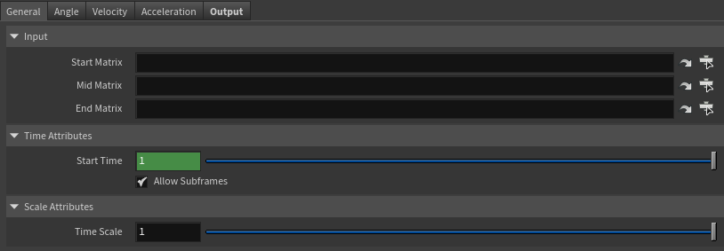 
  <figcaption><b>Figure 16</b>: AdnSensorRotation Parameter Template: General.</figcaption>
</figure>

<figure style="width: 75%;" markdown>
  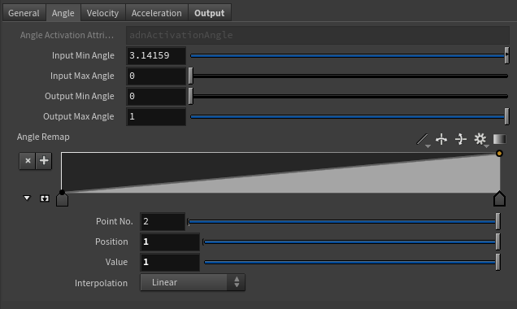 
  <figcaption><b>Figure 17</b>: AdnSensorRotation Parameter Template: Angle.</figcaption>
</figure>

<figure style="width: 75%;" markdown>
  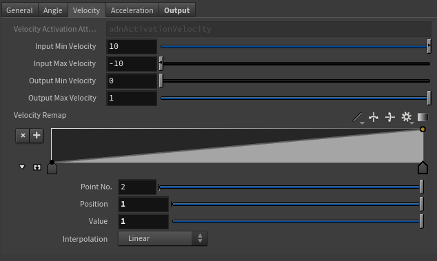 
  <figcaption><b>Figure 18</b>: AdnSensorRotation Parameter Template: Velocity.</figcaption>
</figure>

<figure style="width: 75%;" markdown>
  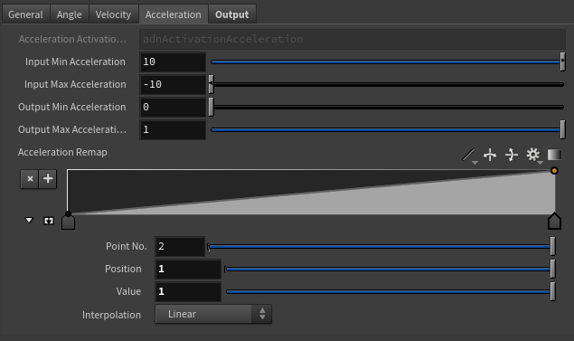 
  <figcaption><b>Figure 19</b>: AdnSensorRotation Parameter Template: Acceleration.</figcaption>
</figure>

<figure style="width: 75%;" markdown>
  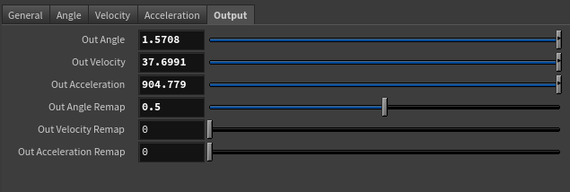 
  <figcaption><b>Figure 20</b>: AdnSensorRotation Parameter Template: Output.</figcaption>
</figure>
