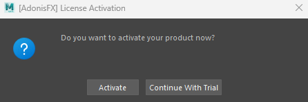
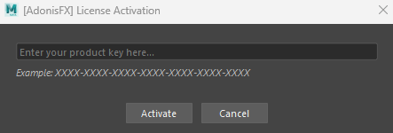
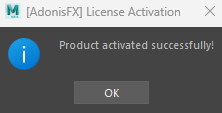
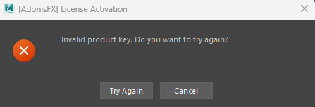
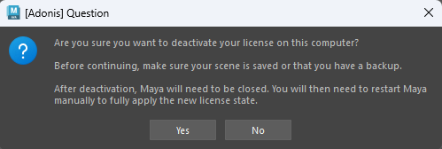
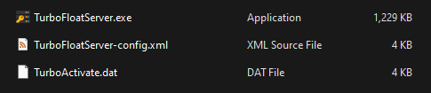

# Licensing

Adonis requires a successful license activation for commercial use. For non-commercial and testing purposes a trial period of 30 days can be requested.
In this page the different licensing components of Adonis will be explained in combination with the requirements and steps for activating the product.

Adonis supports two *Licensing Modes*:

- **Node-Locked Licensing:** License mode that locks Adonis to one particular computer with a particular hardware footprint. After the activation on a computer, using the license key on a different computer would disable the ability to activate the software.
- **Floating Licensing:** License mode that allows different users to request licenses from a common license pool (served by a server) avoiding the use restriction of the software to a single machine.

Adonis also distinguishes between two *Licensing Types*:

- **Interactive:** License type that allows the user to use Adonis from the graphical interface of the software where Adonis was loaded. This licensing type is intended for users that want to build scenes, manipulate and interact with Adonis using visual and interactive feedback.
- **Batch:** License type that allows the user to use Adonis from a batch script or terminal without the ability to use the graphical interface for manipulating the software. This licensing type is intended for users that want to run Adonis from a terminal to for example render a scene on the farm after setting the scene up using an Interactive License.

To be able to activate Adonis it is required to purchase a `PRODUCT KEY`. Product keys can be purchased through Inbibo's official [website](https://inbibo.co.uk/pricing?tab=adonisfx). Adonis product keys have the following characteristics:

- A `PRODUCT KEY` is associated with one single license type: Interactive or Batch. If the user wants to use Adonis both in Interactive and Batch mode, two separate product keys have to be purchased.
- A product key consists of **28** alphanumeric characters separated by "-" which is provided to the user when purchasing Adonis through the website: `XXXX-XXXX-XXXX-XXXX-XXXX-XXXX-XXXX`.

## Node-Locked Licensing

Node-Locked Licensing in Adonis requires the activation of a `PRODUCT KEY` on one single machine. As commented before, this activation process requires the user to activate the product for batch and interactive modes separately.

> [!NOTE]
> Node-Locked Licensing is the default license mode in Adonis. To explicitly switch to Node-Locked licensing in Adonis, set the environment variable `ADN_LICENSE_MODE` to `0`.

### Interactive

#### Activate License

Whenever activating Adonis for the first time for a specific DCC in interactive mode, a series of dialogs requesting information are prompted. These dialogs allow users to enter a valid `PRODUCT KEY` or to launch Adonis in trial mode for non-commercial purposes.

To activate Adonis in Node-Locked Interactive mode:
  1. Launch your DCC.
  2. Load the plug-in.
  3. Go to Adonis Menu > *Activate License*. A dialog will show up with two options: *Activate* to enter a valid `PRODUCT KEY` in order to enable the full license; *Continue With Trial* to continue with the 30 day trial period.

<figure style="width:80%; margin-left:10%" markdown>
      
      <figcaption><b>Figure 1</b>: Activation Dialog.</figcaption>
</figure>

  4. Click on Activate. A dialog will show up to introduce a product key.

<figure style="width:80%; margin-left:10%" markdown>
      
      <figcaption><b>Figure 2</b>: Activation Add Product Key.</figcaption>
</figure>
    
  5. Enter the product key associated with the Interactive Node-Locked License. A confirmation dialog will appear (Figure 3). If the product key is invalid or connecting with the licensing servers failed, a dialog will appear suggesting to retry the activation (Figure 4).

<figure style="width:80%; margin-left:10%" markdown>
      
      <figcaption><b>Figure 3</b>: Product Activated Dialog.</figcaption>
</figure>

<figure style="width:80%; margin-left:10%" markdown>
      
      <figcaption><b>Figure 4</b>: Activation Retry Adding Product Key.</figcaption>
</figure>

  6. Adonis is activated. Restart your DCC to start using all features from Adonis.

> [!NOTE]
> - This activation mode requires access to the internet for activating licenses.

#### Deactivate License

Deactivating a Node-Locked Interactive license is required when the same `PRODUCT KEY` needs to be activated on a different machine.

Deactivation is also required when installing a new `PRODUCT KEY` on the same machine. For example, if a machine already has an FX license activated and an ML license has been purchased, the existing license must be deactivated before activating the new product key. This is because only one Node-Locked Interactive license can be installed on a machine at the same time.

To deactivate Adonis in Node-Locked Interactive mode:

1. Launch your DCC.
2. Go to Adonis Menu > *Deactivate License*. A confirmation dialog will appear. This dialog informs the user that the DCC will close for the deactivation process to complete.

<figure style="width:80%; margin-left:10%" markdown>
      
      <figcaption><b>Figure 5</b>: Deactivation Dialog.</figcaption>
</figure>

3. Click *Yes* to proceed.
4. The license will be deactivated and the DCC will close automatically.

> [!NOTE]
> - This deactivation process requires internet access and an active Node-Locked license.

### Batch

Whenever activating Adonis for the first time for a specific DCC in batch mode, a product key has to be registered previously. Activating batch mode requires the use of an executable that eases the activation process of the product.

To activate Adonis in Node-Locked Batch mode:

  1. Go to `Adonis/bin` in the Adonis installation folder.
  2. Run `ActivateBatch`.
  3. Enter the `PRODUCT KEY`.
  4. Adonis is activated and ready to be used.

> [!NOTE]
> - This activation mode requires access to the internet for activating licenses.
> - For deactivating Batch licenses to switch to a different machine, please contact support.

### Trial

Adonis allows the user to use the product for **30 days** in Node-Locked Interactive mode. This means that the trial can be used using the graphical interface for one single machine at a time. The trial period requires activation which can be handled in an online or offline way.

Trial licenses are intended for testing and non-commercial purposes. To use Adonis for commercial purposes a `PRODUCT KEY` must be purchased through Inbibo's official [website](https://inbibo.co.uk/pricing?tab=adonisfx) and activated. See the Adonis [End User License Agreement](https://inbibo.co.uk/legal/adonisfx-eula) for details.

> [!NOTE]
> After setting the paths for the Houdini installation, the trial will automatically start when opening Houdini.

**Online Trial Activation**

It will allow the user to use Adonis for 30 days without providing a `PRODUCT KEY`. Once that trial period is over, the user will be asked to introduce a valid product key. If not provided, then Adonis will not load and cannot be used.

In this case, the activation does not require any input from the user. The trial period is registered automatically the first time that Adonis is loaded from a workstation with internet access.

> [!NOTE]
> This activation mode requires access to the internet.

**Offline Trial Activation**

It will allow the user to use Adonis for 30 days without providing a `PRODUCT KEY`. Once that trial period is over, the user will be asked to introduce a valid product key. If not provided, then Adonis will not load and cannot be used.

To activate Adonis in Offline Node-Locked Interactive Trial mode:

  1. Go to `Adonis/bin` in the Adonis installation folder.
  2. Run `TrialOfflineRequest` with admin privileges. An XML file `TrialOfflineRequest.xml` will be generated in the same folder.
  4. Send the request file to **adonis.support@inbibo.co.uk** providing enough information to backtrack the source of the activation request.
  5. In a maximum of 24h a `TrialOfflineResponse.xml` will be returned to the source e-mail address.
  6. Download and save the response in the same folder `Adonis/bin`.
  7. Execute `TrialOfflineResponse` (also in `Adonis/bin`) with admin privileges.
  8. The response will be registered and Adonis will be ready to be used.

> [!NOTE]
> This activation mode does not require access to the internet.

## Floating Licensing

This section will explain how to configure, run and set-up the licensing server for leasing floating licenses when the goal is to not restrict the use of Adonis to one single machine. Adonis floating licensing system requires the use of a license server in charge of providing, dropping and handling licenses from an active lease "pool". When the amount of requested licenses surpasses the amount of licenses purchased for that floating license server no further activations of Adonis can be made until a lease is dropped and returned to the lease "pool" (i.e. the plug-in is unloaded or the DCC process ends).

To be able to request leases from the license server it is necessary to activate the product with a `PRODUCT KEY` on the server side. Once activated it is required to have direct connection between the requestor instance and the licensing server to be able to balance the leases accordingly.

The following sections explain the steps to install and run the server, as well as how to configure the environment to allow processes request leases.

### Install Server

The licensing server is provided and shipped within the installation of Adonis for x64 architectures and can be run on Windows or Linux. For more architectures, please visit this [page](https://wyday.com/download/).

The first step to be able to serve leases from the lease pool is to activate, configure and run the licensing server on a dedicated machine:

1. Locate the server in `Adonis/licensing/turbo_float_server`.
2. Copy the folder to a preferred location.
3. Copy and paste the `TurboActivate.dat` file (interactive or batch, depending on the server to install) in the same location:
    - `Adonis/licensing/interactive/TurboActivate.dat` for interactive mode licenses.
    - `Adonis/licensing/batch/TurboActivate.dat` for batch mode licenses.
4. The content after copying the files should follow the structure in Figure 6.
5. Before running the license server and activating the license, several elements of the `TurboFloatServer-config.xml` can be tweaked. Like for example:
    - *Connection port, thread count, lease length, logs, grace periods, and proxies*. For more information visit this [page](https://wyday.com/limelm/help/turbofloat-server/#config). Write down the configured port number for when setting up the environment variables in this [section](#run-server).
    - Find the full list of customizable parameters in the `.xml` file comments.

<figure style="width:80%; margin-left:10%" markdown>
  
  <figcaption><b>Figure 6</b>: Folder containing the TurboFloatServer (Windows) and the configuration files.</figcaption>
</figure>

### Activate Server

Activating floating licenses only requires the activation of the licensing server which will be the one in charge of handling and balancing the leases. To activate the server:

1. Open a terminal in the folder where the server is located with admin privileges.
2. Run the following command for activation:

> [!NOTE = Activate Server]
> === Windows
> 
> `TurboFloatServer.exe -a="PRODUCT-KEY"`
>
>  === Linux
>
> `./turbofloatserver -a="PRODUCT-KEY"`

3. The server is now ready and can be run with the commands explained in this [section](#run-server).

The activation command assumes that the server executable, the `.xml` file and the `.dat` file are located in the same folder. To provide a custom path to the configuration files, run the following command instead:

> [!NOTE = Activate Server With Custom Location]
> === Windows
> 
> `TurboFloatServer.exe -a="PRODUCT-KEY" -pdets="YourTurboActivate.dat" -config="Config.xml"`
>
>  === Linux
>
> `./turbofloatserver -a="PRODUCT-KEY" -pdets="YourTurboActivate.dat" -config="Config.xml"`

Remember that floating licenses require internet access only for the machine running the server, while the workstations intended to query leases to the server can remain disconnected and protected.

If the server needs to be installed in a different machine, it will be required to deactivate the license before being able to activate it again in the new machine. To deactivate a license, execute:

> [!NOTE = Activate Server]
> === Windows
> 
> `TurboFloatServer.exe -deact`
>
>  === Linux
>
> `./turbofloatserver -deact`

### Run Server

To run the floating server execute the command below. To configure the server properly from the configuration file, it is required to do any modifications to the file prior to launching the server.

> [!NOTE = Run Server]
> === Windows
> 
> `TurboFloatServer.exe -x`
>
>  === Linux
>
> `./turbofloatserver -x`

The command above assumes that the server executable, the `.xml` file and the `.dat` file are located in the same folder. To provide a custom path to the configuration files, run the following command instead:

> [!NOTE = Run Server]
> === Windows
> 
> `TurboFloatServer.exe -x -pdets="YourTurboActivate.dat" -config="Config.xml"`
>
>  === Linux
>
> `./turbofloatserver -x -pdets="YourTurboActivate.dat" -config="Config.xml"`

On Windows, it is also possible to install a service in charge of running the server in the background. Please, refer to this [link](https://wyday.com/limelm/help/turbofloat-server/#install) for more information.

### Client Configuration

To be able to run Adonis using a floating license, make sure the floating server is running and the client machine intended to use Adonis has direct access to the floating server. Then, configure the licensing mode and the IP address in the environment of the client machine:

  1. Set `ADN_LICENSE_MODE` to `1`. Make sure to apply this change before launching Adonis.
  2. Set `ADN_LICENSE_SERVER` for interactive licenses and `ADN_LICENSE_SERVER_BATCH` for batch licenses to `<IP-ADDRESS>:<PORT-NUMBER>` (e.g. `127.0.0.1:13`). If no port number was provided the system will default to port `13`.

When launching Adonis in the target DCC, if the connection to the active license server could be established, it will try to obtain a valid lease and if granted it will load the plug-in.

> [!NOTE]
> - Make sure to configure the required environment variables before loading Adonis.
> - Node-Locked Licensing is defaulted in Adonis meaning that if `ADN_LICENSE_MODE` is not set to `1` or not provided, then Adonis will attempt to load Node-Locked licenses.

### Save Server Tool (Optional)

The first time that the client attempts to load Adonis with a floating license, the IP address and the port specified in the environment variables are saved in the machine. Optionally, you can execute the **SaveServer** utility to save the server information before launching the DCC process that will attempt to load Adonis. In some specific environments where the client machines do not have permission to store this information, using this tool with admin privileges would become a requirement.

This utility works in **Windows** and **Linux** and can be used to save the server information of Interactive licenses or Batch licenses. It can be executed by providing the settings either via prompts in the terminal or via command-line arguments. Internally, the program does the following:

1. Parses command-line flags and required arguments.
2. Prompts the user if required information is missing.
3. Locates the correct `TurboActivate.dat` file in the Adonis package to retrieve the necessary information to process the request.
4. Saves the server address and port.
5. Verifies the configuration by requesting a license lease.
6. Drops the lease (non-critical if it fails).

#### Arguments

| Argument | Required | Description |
|---------|---------|-------------|
| `<server_address>`    | yes | License server hostname or IP address. |
| `<server_port>`       | yes | License server port (1–65535). |
| `-b`, `--batch`       | no  | Use **batch** license (default). |
| `-i`, `--interactive` | no  | Use **interactive** license. |
| `-d`, `--directory`   | no  | Base directory of the Adonis package containing the `Adonis` subfolder. |

#### Input validation

About the server address:

- Must be non-empty
- Must contain only letters (`A–Z`, `a–z`), digits (`0–9`), dots (`.`) and dashes (`-`)
- Valid examples: `123.123.123.123`, `license-server`, `license-server.mycompany.com`

About the server port:

- Must be a valid integer
- Must be in the range **1–65535**

#### How To Use

1. Go to Adonis/bin in the Adonis installation folder.
2. Run the SaveServer program using one of the following examples depending on the needs.

> [!NOTE = Batch license (default)]
> === Windows
> 
> `SaveServer.exe 127.0.0.1 14`
>
>  === Linux
>
> `./SaveServer 127.0.0.1 14`

> [!NOTE = Interactive license]
> === Windows
> 
> `SaveServer.exe -i 127.0.0.1 13`
>
>  === Linux
>
> `./SaveServer -i 127.0.0.1 13`

If the program has to be executed from a different working directory, then the directory argument must be specified.

> [!NOTE = Using a custom base directory]
> === Windows
> 
> `<ADN_INSTALL_PATH>/SaveServer.exe -i -d <ADN_INSTALL_PATH> 127.0.0.1 13`
>
>  === Linux
>
> `<ADN_INSTALL_PATH>/SaveServer -i -d <ADN_INSTALL_PATH> 127.0.0.1 13`

If the program is executed **without required arguments**, it prompts the user for the necessary inputs in this order: license product, server address and server port. This is an example session:

<pre><code style="white-space: pre; margin: 20px 0; padding: 10px; box-sizing: border-box;">[AdonisFX] Save Floating License Server
Select license product ([b]atch / [i]nteractive): i
Enter server address (e.g., 123.123.123.123 or hostname): 127.0.0.1
Enter server port (1-65535): 13
[AdonisFX] License server settings saved successfully.
</code></pre>

#### Common errors and troubleshooting

**1. Failed to find the data file**

`[AdonisFX] Failed to retrieve the license data file at: ...`

Cause:
- `TurboActivate.dat` could not be found.

Fix:
- Run the program from `Adonis/bin`, or
- Use `--directory` to point to the folder containing `Adonis`.

**2. Failed to obtain the server handle**

`[AdonisFX] Failed to get the handle to contact the server.`

Cause:
- Missing or incorrect license data file
- Invalid folder layout

Fix:
- Verify the `licensing/<batch|interactive>/TurboActivate.dat` path.
- Use the correct base directory.

**3. Failed to save the server information**

`[AdonisFX] TF_SaveServer failed: Error Code <X>`

Cause:
- TurboFloat rejected the server configuration.

Fix:
- Verify the server address and port.
- Ensure the TurboFloat licensing runtime is properly installed and configured.

> [!NOTE]
> If any issues occur while saving the license server file, please contact support (**adonis.support@inbibo.co.uk**).

## Adonis Bundles

Adonis licenses can include different bundles depending on the product purchased. These bundles define which Adonis features are available under the activated license.

The bundle is defined automatically at the moment of purchase and is applied to the purchased license. Users do not need to manually activate, configure or update anything to select a bundle. After activating a valid `PRODUCT KEY`, Adonis will automatically detect the bundle associated with that license.

### FX Bundle

The **FX Bundle** enables users to author and use Adonis rigs with all solvers and deformers, including `AdnMLDeformer` and `AdnSmartTissue`.

With the **FX Bundle**, users can run Adonis rigs and use existing AdonisML models at runtime. This means that:

* `AdnMLDeformer` can be used with the **FX Bundle** once an AdonisML model is available. However, the model itself must have been generated using an Adonis license with the **ML Bundle**.
* `AdnSmartTissue` can be used with the **FX Bundle**, both with and without ML inference. Any AdonisML model used by `AdnSmartTissue` must have been generated using an Adonis license with the **ML Bundle**.

The **FX Bundle** does not include the tools and workflows required to extract training data, paint neural clusters or train new AdonisML models.

### ML Bundle

The **ML Bundle** includes everything available in the **FX Bundle**, plus access to the machine learning tools and workflows used to prepare, train and configure AdonisML models.

The **ML Bundle** is required to run the following Adonis tools and workflows:

* **ML Data Extraction Tool:** Used to extract data for training AdonisML models.
* **Neural Clustering Paint Tool:** Used to paint neural clusters on a static mesh. These clusters provide additional locality information for the machine learning training process, helping the model better isolate local deformations and activations.
* **Neural Training Tool:** Used to run Adonis neural training.
* **Training Python Script:** Used to run Adonis neural training via Python script, either within the DCC or as a standalone process.

Generated AdonisML models can then be used at runtime with licenses that include the **FX Bundle**.

> [!IMPORTANT]
> - Existing purchased licenses default to the **FX Bundle**. No update or additional action is required for users with existing licenses to continue using Adonis with the FX functionality currently available to them.
> - Trial licenses always run with the **FX Bundle**.
> - To evaluate Adonis with **ML functionality** during a trial period, please contact **adonis.support@inbibo.co.uk**.
