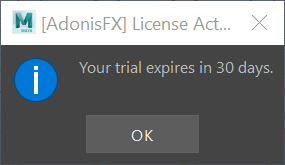

# Licensing

AdonisFX requires a successful license activation for commercial use. For non-commercial and testing purposes a trial period of 30 days can be requested.
In this page the different licensing components of AdonisFX will be explained in combination with the requirements and steps for activating the product.

AdonisFX supports two *Licensing Modes*:

- **Node-Locked Licensing:** License mode that locks AdonisFX to one particular computer with a particular hardware footprint. After the activation on a computer, using the license key on a different computer would disable the ability to activate the software.
- **Floating Licensing:** License mode that allows different users to request licenses from a common license pool (served by a server) avoiding so the use restriction of the software to a single machine.

AdonisFX also distinguishes between two *Licensing Types*:

- **Interactive:** License type that allows the user to use AdonisFX from the graphical interface of the software where AdonisFX was loaded. This licensing type is intended for users that want to build scenes, manipulate and interact with AdonisFX using visual and interactive feedback.
- **Batch:** License type that allows the user to use AdonisFX from a batch script or terminal without the ability to use the graphical interface for manipulating the software. This licensing type is intended for users that want to run AdonisFX from a terminal to for example render a scene on the farm after setting the scene up using an Interactive License.

To be able to activate AdonisFX it is required to purchase a `PRODUCT KEY`. Product keys can be purchased through Inbibo's official [website](https://adonisfx.inbibo.co.uk/#prices). AdonisFX product keys have the following characteristics:

- A `PRODUCT KEY` is associated to one single license type: Interactive or Batch. If the user wants to use AdonisFX both in Interactive and Batch mode, two separate product keys have to be purchased.
- A product key consists of **28** alphanumeric characters separated by "-" which is provided to the user when purchasing AdonisFX through the website: `XXXX-XXXX-XXXX-XXXX-XXXX-XXXX-XXXX`.

## Node-Locked Licensing

Node-Locked Licensing in AdonisFX requires the activation of a `PRODUCT KEY` on one single machine. As commented before, this activation process requires the user to activate the product for batch and interactive modes separately.

> [!NOTE]
> Node-Locked Licensing is the default license mode in AdonisFX. To explicitly switch to Node-Locked licensing in AdonisFX set the environment variable `ADN_LICENSE_MODE` to `0`.

### Interactive

Whenever activating AdonisFX for the first time for a specific DCC in interactive mode, a series of dialogs requesting information are prompted. These dialogs allow to enter a valid `PRODUCT KEY` or to launch AdonisFX in trial mode for non-commercial purposes.

To activate AdonisFX in Node-Locked Interactive mode:
  1. Launch Maya.
  2. Load the plug-in.
  3. A dialog will show up with two options: **Activate** to enter a valid `PRODUCT KEY` in order to enable the full license; **Continue With Trial** to start or continue a 30 day trial period.

<figure style="width:80%; margin-left:10%" markdown>
      
      <figcaption><b>Figure 1</b>: Activation Dialog.</figcaption>
</figure>

    
  4. Enter a valid product key in the text edit after selecting Activate.

<figure style="width:80%; margin-left:10%" markdown>
      
      <figcaption><b>Figure 2</b>: Activation Add Product Key.</figcaption>
</figure>

  5. After entering a valid product key and pressing Activate a confirmation dialog will appear (Figure 3). If the product key is invalid or connecting with the licensing servers failed, a dialog will appear suggesting to retry the activation (Figure 4).

<figure style="width:80%; margin-left:10%" markdown>
      
      <figcaption><b>Figure 3</b>: Product Activated Dialog.</figcaption>
</figure>

<figure style="width:80%; margin-left:10%" markdown>
      
      <figcaption><b>Figure 4</b>: Activation Retry Adding Product Key.</figcaption>
</figure>

  6. AdonisFX is activated and ready to be used.

> [!NOTE]
> - This activation mode requires access to the internet for activating licenses.
> - For deactivating licenses to switch to a different machine, please contact support.

### Batch

Whenever activating AdonisFX for the first time for a specific DCC in batch mode, a product key has to be registered previously. Activating batch mode requires the use of an executable that eases the activation process of the product.

To activate AdonisFX in Node-Locked Batch mode:

  1. Go to `AdonisFX/bin` in the AdonisFX installation folder.
  2. Run `ActivateBatch`.
  3. Enter the `PRODUCT KEY`.
  4. AdonisFX is activated and ready to be used.

### Trial

AdonisFX allows the user to use the product for **30 days** in Node-Locked Interactive mode. This means that the trial can be used using the graphical interface for one single machine at a time. The trial period requires activation which can be handled in an online or offline way.

Trial licenses are intended for testing and non-commercial purposes. To use AdonisFX for commercial purposes a `PRODUCT KEY` must be purchased through Inbibo's official [website](https://adonisfx.inbibo.co.uk/#prices) and activated. See the AdonisFX [End User License Agreement](https://inbibo.co.uk/adonisfx-maya-eula) for details.

**Online Trial Activation**

It will allow the user to use AdonisFX for 30 days without providing a `PRODUCT KEY`. Once that trial period is over, the user will be asked to introduce a valid product key. If not provided, then AdonisFX will not load and could not be used.

To activate AdonisFX in Online Node-Locked Interactive Trial mode:

  1. Launch Maya.
  2. Load the plug-in.
  3. Select **Continue With Trial** from the activation dialog.

<figure style="width:80%; margin-left:10%" markdown>
        
        <figcaption><b>Figure 9</b>: Activation Dialog.</figcaption>
</figure>
      
  4. AdonisFX trial is activated and a dialog will inform about the amount of days left for the trial license.

<figure style="width:30%; margin-left:10%" markdown>
        
        <figcaption><b>Figure 10</b>: Trial Dialog.</figcaption>
</figure>

> [!NOTE]
> This activation mode requires access to the internet.

**Offline Trial Activation**

It will allow the user to use AdonisFX for 30 days without providing a `PRODUCT KEY`. Once that trial period is over, the user will be asked to introduce a valid product key. If not provided, then AdonisFX will not load and could not be used.

To activate AdonisFX in Offline Node-Locked Interactive Trial mode:

  1. Go to `AdonisFX/bin` in the AdonisFX installation folder.
  2. Run `TrialOfflineRequest` with admin privileges. An XML file `TrialOfflineRequest.xml` will be generated in the same folder.
  4. Send the request file to **adnsupport@inbibo.co.uk** providing enough information to backtrack the source of the activation request.
  5. In a maximum of 24h a `TrialOfflineResponse.xml` will be returned to the source e-mail address.
  6. Download and save the response in the same folder `AdonisFX/bin`.
  7. Execute `TrialOfflineResponse` (also in `AdonisFX/bin`) with admin privileges.
  8. The response will be registered and AdonisFX will be ready to be used.

> [!NOTE]
> This activation mode does not require access to the internet.

## Floating Licensing

This section will explain how to configure, run and set-up the licensing server for leasing floating licenses when the goal is to not restrict the use of AdonisFX to one single machine. AdonisFX floating licensing system requires the use of a license server in charge of providing, dropping and handling licenses from an active lease "pool". When the amount of requested licenses surpasses the amount of licenses purchased for that floating license server no further activations of AdonisFX can be made until a lease is dropped and returned to the lease "pool" (i.e. the plug-in is unloaded or the DCC process ends).

To be able to request leases from the license server it is necessary to activate the product with a `PRODUCT KEY` on the server side. Once activated it is required to have direct connection between the requestor instance and the licensing server to be able to balance the leases accordingly.

The following sections explain the steps to install and run the server, as well as how to configure the environment to allow processes request leases.

### Install Server

The licensing server is provided and shipped within the installation of AdonisFX for x64 architectures and can be run on Windows or Linux. For more architectures, please visit [this page](https://wyday.com/download/).

The first step to be able to serve leases from the lease pool is to activate, configure and run the licensing server on a dedicated machine:

> [!NOTE = Install Server]
> === Windows
> 
> 1. Locate the `TurboFloatServer.exe` in `AdonisFX/licensing/turbo_float_server`.
> 2. Copy the folder to a preferred location.
> 3. Copy and paste the `TurboActivate.dat` file (interactive or batch, depending on the server to install) in the same location:
>      - `AdonisFX/licensing/interactive/TurboActivate.dat` for interactive mode licenses.
>      - `AdonisFX/licensing/batch/TurboActivate.dat` for batch mode licenses.
> 4. The content after copying the files should follow the structure in Figure 11.
> 5. Before running the license server and activating the license, several elements of the `TurboFloatServer-config.xml` can be tweaked. Like for example:
>      - *Connection port, thread count, lease length, logs, grace periods, and proxies*. For more information visit [this page](https://wyday.com/limelm/help/turbofloat-server/#config). Write down the configured port number for when setting up the environment variables in [this section](#run-server).
>      - Find the full list of customizable parameters in the `.xml` file comments.
>
>  === Linux
>
> 1. Locate the `turbofloatserver` in `AdonisFX/licensing/turbo_float_server`.
> 2. Copy the folder to a preferred location.
> 3. Copy and paste the `TurboActivate.dat` file (interactive or batch, depending on the server to install) in the same location:
>      - `AdonisFX/licensing/interactive/TurboActivate.dat` for interactive mode licenses.
>      - `AdonisFX/licensing/batch/TurboActivate.dat` for batch mode licenses.
> 4. The content after copying the files should follow the structure in Figure 11.
> 5. Before running the license server and activating the license, several elements of the `TurboFloatServer-config.xml` can be tweaked. Like for example:
>      - *Connection port, thread count, lease length, logs, grace periods, and proxies*. For more information visit [this page](https://wyday.com/limelm/help/turbofloat-server/#config). Write down the configured port number for when setting up the environment variables in [this section](#run-server).
>      - Find the full list of customizable parameters in the `.xml` file comments.

<figure style="width:80%; margin-left:10%" markdown>
  
  <figcaption><b>Figure 11</b>: Turbo Float Folder.</figcaption>
</figure>

### Activate Server

Activating floating licenses only requires the activation of the licensing server which will be the one in charge of handling and balancing the leases. To activate the server:

> [!NOTE = Activate Server]
> === Windows
> 
> 1. Open a terminal in the folder where the `TurboFloatServer.exe` is located.
> 2. Run the following command for activation: `TurboFloatServer.exe -a="PRODUCT-KEY"`
>     - Make sure to open the terminal with admin privileges.
>     - This step assumes that the server `.xml` file and `.dat` file are located in the same folder as the server executable. To provide a custom path run the following command for the activation:
>     `TurboFloatServer.exe -a="PRODUCT-KEY" -pdets="YourTurboActivate.dat" -config="Config.xml"`
> 3. The server is now ready and can be run with the commands explained in [this section](#run-server).
>
> **Note**
> - Floating licenses require internet only for the license server. Workstations can remain disconnected and protected.
> - To deactivate an activated license on the server, execute `TurboFloatServer.exe -deact`.
>
>  === Linux
>
> 1. Open a terminal in the folder where the `turbofloatserver` is located.
> 2. Run the following command for activation: `./turbofloatserver -a="PRODUCT-KEY"`
>     - Make sure to launch this command with `sudo` privileges.
>     - This step assumes that the server `.xml` file and `.dat` file are located in the same folder as the server executable. To provide a custom path run the following command for the activation:
>     `./turbofloatserver -a="PRODUCT-KEY" -pdets="YourTurboActivate.dat" -config="Config.xml"`
> 3. The server is now ready and can be run with the commands explained in [this section](#run-server).
>
> **Note**
> - Floating licenses require internet only for the license server. Workstations can remain disconnected and protected.
> - To deactivate an activated license on the server, execute `./turbofloatserver -deact`

### Run Server

To run the floating server on Windows execute one of the commands below. The second one is to specify custom destinations of the `.xml` and `.dat` files if they are not in the same folder. To configure the server properly from the configuration file it is required to do the modifications prior to launching the server. Note that if the configuration files need to be located in a different folder, then the use of `-pdets` and `-config` flags is required to especify their locations.

> [!NOTE = Run Server]
> === Windows
> 
>  - `TurboFloatServer.exe -x`>
>  - `TurboFloatServer.exe -x -pdets="YourTurboActivate.dat" -config="Config.xml"`
>
>  === Linux
>
> - `./turbofloatserver -x`
> - `./turbofloatserver -x -pdets="YourTurboActivate.dat" -config="Config.xml"`

### Client Configuration

To be able to run AdonisFX using floating license, make sure the floating server is running and the clien machine intended to use AdonisFX has direct access to the floating server. Then, configure the licensing mode and the IP address in the environment of the client machine:

  1. Set `ADN_LICENSE_MODE` to `1`. Make sure to apply this change before launching AdonisFX.
  2. Set `ADN_LICENSE_SERVER` to `<IP-ADDRESS>:<PORT-NUMBER>`. e.g. `127.0.0.1:13`. If no port number was provided whe system will default to port `13`. Make sure to apply this change before launching AdonisFX.

When launching AdonisFX in the target DCC, if the connection to the active license server could be established, it will try to obtain a valid lease and if granted it will activate the plug-in.

> [!NOTE]
> Node-Locked Licensing is defaulted in AdonisFX. If `ADN_LICENSE_MODE` is not set to `1` or not provided, then sAdonisFX will attempt to load Node-Locked licenses.
